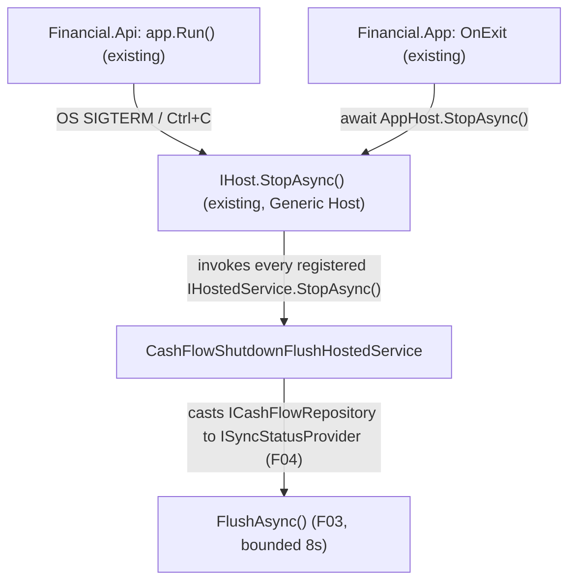

# Spec: F06. CashFlow Graceful Shutdown Flush

## 1. Technical Overview

**What:** A new `IHostedService` (`CashFlowShutdownFlushHostedService`) in `Financial.CashFlow.Infrastructure`, registered by `AddFinancialCashFlowInfrastructure`, whose `StopAsync` casts the resolved `ICashFlowRepository` to `ISyncStatusProvider` (F04) and awaits `FlushAsync()`. No changes to `Financial.Api`'s `Program.cs` or `Financial.App`'s `App.xaml.cs` are needed at all.

**Why:** Both entry points already route shutdown through the .NET Generic Host: `Financial.Api` is a `WebApplication` (built on the Generic Host, `app.Run()` already waits for and drives graceful shutdown including every registered `IHostedService.StopAsync()`), and `Financial.App` already builds its own `IHost` (`Host.CreateDefaultBuilder()...Build()`) and its `OnExit` handler already calls `await AppHost.StopAsync()`. Both lifecycle hooks the PRD asks for ("hooks `ApplicationStopping`" / "hooks the application exit event") are therefore already fully wired at the host level — a single hosted service registered once, in the shared `AddFinancialCashFlowInfrastructure` extension both `Program.cs` and `App.xaml.cs` already call, is picked up by both without touching either composition root.

**Scope:**
- Included: `CashFlowShutdownFlushHostedService`; its registration via `AddFinancialCashFlowInfrastructure`; the `Microsoft.Extensions.Hosting.Abstractions` package reference this requires.
- Excluded: any change to `Financial.Api/Program.cs`, `Financial.App/App.xaml.cs`, or `HostOptions.ShutdownTimeout` configuration — the existing host shutdown sequence already invokes registered hosted services; nothing about it needs to change. Investment's equivalent (F07) — mirrors this pattern in a separate feature. Any new flush logic beyond calling the already-implemented `ISyncStatusProvider.FlushAsync()` (F03/F04) — this feature only wires that existing capability into a lifecycle hook.

## 2. Architecture Impact

**Affected components:**
- `Financial.CashFlow.Infrastructure/Hosting/CashFlowShutdownFlushHostedService.cs` (new)
- `Financial.CashFlow.Infrastructure/DependencyInjection/CashFlowInfrastructureServiceCollectionExtensions.cs` (modified — registers the hosted service)
- `Financial.CashFlow.Infrastructure/Financial.CashFlow.Infrastructure.csproj` (modified — adds `Microsoft.Extensions.Hosting.Abstractions`)

## 3. Technical Decisions

| Decision | Chosen Approach | Alternative Considered | Trade-off |
|----------|----------------|----------------------|-----------|
| Hook mechanism | `IHostedService.StopAsync`, registered via `services.AddHostedService<T>()` | `IHostApplicationLifetime.ApplicationStopping.Register(callback)` (a synchronous callback, requiring a blocking `.GetAwaiter().GetResult()` to run async flush logic) | `IHostedService.StopAsync` is the canonical, fully-async mechanism the Generic Host already awaits as part of its own shutdown sequence — no blocking-wait workaround needed, and it's automatically invoked by both `Financial.Api` (`WebApplication`, built on the Generic Host) and `Financial.App` (explicit `Host.CreateDefaultBuilder()`) without either composition root needing custom code |
| Where to register it | Inside `AddFinancialCashFlowInfrastructure`, the single DI extension both `Financial.Api/Program.cs` and `Financial.App/App.xaml.cs` already call | Register separately in each of `Program.cs` and `App.xaml.cs` | One registration point serves both front ends automatically, matching the PRD's explicit framing of this as "only wires the existing F04 capability... introduces no new flush logic of its own" — duplicating the registration in two composition roots would be pure repetition with no benefit |
| Accessibility | `public sealed class CashFlowShutdownFlushHostedService`, resolved by the DI container via its `IHostedService` registration | `internal` | Matches this project's established convention for `Financial.CashFlow.Infrastructure` classes (`CashFlowJsonRepository`, `CashFlowRepositoryFactory` are both `public`) — no `InternalsVisibleTo` entry exists for this assembly, unlike `Financial.Shared.Infrastructure` |
| New package dependency | `Microsoft.Extensions.Hosting.Abstractions`, version `10.0.9` (matching every other `Microsoft.Extensions.*` package already referenced in this project) | Depend on the full `Microsoft.Extensions.Hosting` package | `.Abstractions` contains `IHostedService` and nothing else needed here; `Financial.Api` gets `IHostedService` for free via the ASP.NET Core shared framework, and `Financial.App` already references the full `Microsoft.Extensions.Hosting` package for its own `Host.CreateDefaultBuilder()` — only `Financial.CashFlow.Infrastructure` itself is a plain class library needing the interface type explicitly, and the lightweight `.Abstractions` package is all it needs to define (not build) a hosted service |

## 4. Component Overview

**Backend (Financial.CashFlow.Infrastructure):**

| File Path | New/Modified | Purpose | Key Responsibilities |
|-----------|--------------|---------|---------------------|
| `Financial.CashFlow.Infrastructure/Hosting/CashFlowShutdownFlushHostedService.cs` | New | Flushes CashFlow's debounced instance on graceful host shutdown | `StartAsync` no-ops; `StopAsync` casts the injected `ICashFlowRepository` to `ISyncStatusProvider` and awaits `FlushAsync()` if it is one, otherwise no-ops (`LocalJson` case) |
| `Financial.CashFlow.Infrastructure/DependencyInjection/CashFlowInfrastructureServiceCollectionExtensions.cs` | Modified | DI composition for the CashFlow context | Adds `services.AddHostedService<CashFlowShutdownFlushHostedService>()` |
| `Financial.CashFlow.Infrastructure/Financial.CashFlow.Infrastructure.csproj` | Modified | Adds `Microsoft.Extensions.Hosting.Abstractions` `PackageReference` | Enables referencing `IHostedService` |

No API, database, or frontend changes in this feature.

## 5. API Contracts

Not applicable — F06 has no API surface; it's a lifecycle hook.

## 6. Data Model

Not applicable.

## 7. Testing Strategy

Per the testing guide's "Background/Hosted Services" guidance: unit-test the hosted service's branching logic with a stub collaborator, and use the DI-module resolution pattern to prove it's actually registered — never test `IHostedService`'s own lifecycle invocation, since that's framework behavior already covered by the framework's own tests.

**Test File Structure:**

| Test File | Test Type | Target | Coverage Goal |
|-----------|-----------|--------|---------------|
| `Tests/Financial.CashFlow.Infrastructure.Tests/Hosting/CashFlowShutdownFlushHostedServiceTests.cs` | Unit | `CashFlowShutdownFlushHostedService.StopAsync` branching | Both branches (repository is / isn't an `ISyncStatusProvider`) |
| `Tests/Financial.CashFlow.Infrastructure.Tests/DependencyInjection/CashFlowInfrastructureServiceCollectionExtensionsTests.cs` | Unit (real DI container, per the DI-modules pattern) | `AddFinancialCashFlowInfrastructure` registration | Extended, not replaced — proves the hosted service is actually registered |

**Test Functions (new):**

| Test Function | Description | Assertions |
|---------------|-------------|------------|
| `StopAsync_WhenRepositoryIsASyncStatusProvider_CallsFlushAsync` | Construct the hosted service with a stub `ICashFlowRepository` that also implements `ISyncStatusProvider`; call `StopAsync` | The stub's `FlushAsync()` is observed to have been called |
| `StopAsync_WhenRepositoryIsNotASyncStatusProvider_CompletesWithoutError` | Construct the hosted service with a stub `ICashFlowRepository` that does not implement `ISyncStatusProvider`; call `StopAsync` | Completes without throwing |
| `AddFinancialCashFlowInfrastructure_RegistersCashFlowShutdownFlushHostedService` | Build a real `ServiceCollection`/`IConfiguration` (`LocalJson` provider, matching this test class's existing setup pattern) via `AddFinancialCashFlowInfrastructure`, resolve `IEnumerable<IHostedService>` | Contains an instance of `CashFlowShutdownFlushHostedService` |

**Acceptance criteria covered (PRD Section 9, F06):**
- On API process shutdown (`ApplicationStopping`), a dirty CashFlow debounced instance is flushed before shutdown completes → `AddFinancialCashFlowInfrastructure_RegistersCashFlowShutdownFlushHostedService` (proves the registration `Financial.Api`'s existing `app.Run()` shutdown sequence will invoke) + `StopAsync_WhenRepositoryIsASyncStatusProvider_CallsFlushAsync` (proves what that invocation does)
- On WPF app close, a dirty CashFlow debounced instance is flushed before the process exits → same two tests — `Financial.App`'s existing `OnExit`/`AppHost.StopAsync()` reaches the identical hosted-service registration via the same `AddFinancialCashFlowInfrastructure` call, so no WPF-specific test is needed to cover this half of the AC
