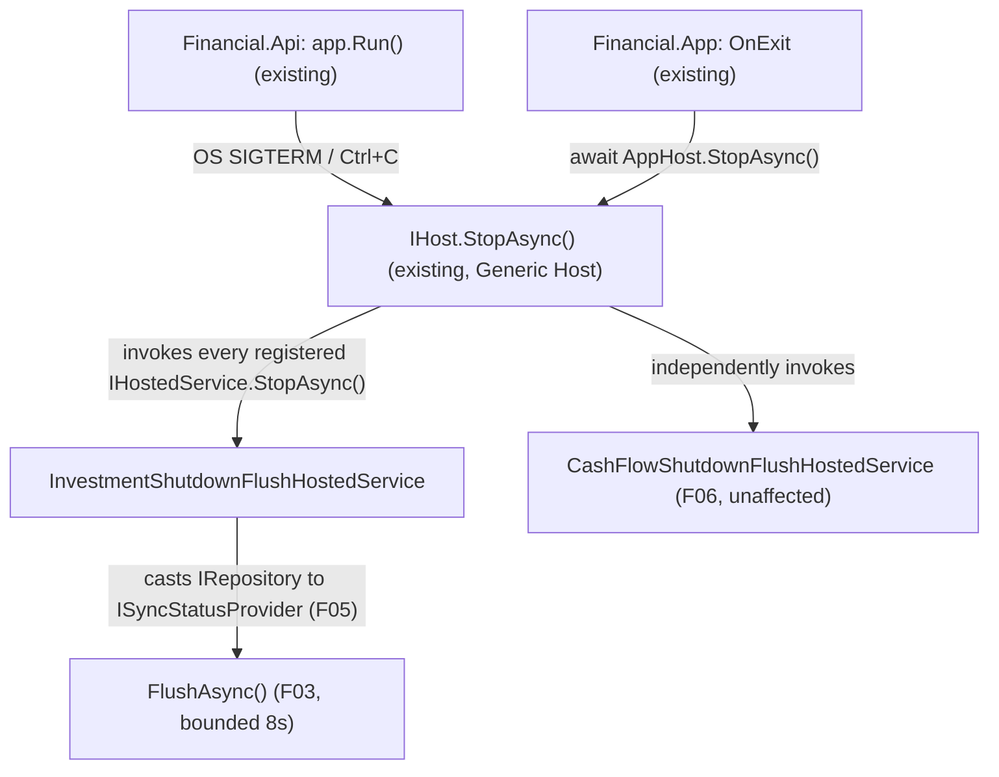

# Spec: F07. Investment Graceful Shutdown Flush

## 1. Technical Overview

**What:** A new `IHostedService` (`InvestmentShutdownFlushHostedService`) in `Financial.Investment.Infrastructure`, registered by `AddFinancialInfrastructure`, whose `StopAsync` casts the resolved `IRepository` to `ISyncStatusProvider` (F05) and awaits `FlushAsync()`. Mirrors F06's exact pattern for Investment. No changes to `Financial.Api`'s `Program.cs` or `Financial.App`'s `App.xaml.cs`.

**Why:** Both entry points already call `AddFinancialInfrastructure` (the Investment-context DI extension, distinct from CashFlow's `AddFinancialCashFlowInfrastructure` that F06 modified) and already route shutdown through the .NET Generic Host exactly as F06 documented — `Financial.Api`'s `app.Run()` and `Financial.App`'s `OnExit`/`AppHost.StopAsync()`. Registering a second, independent hosted service in that same shared extension gives Investment the identical graceful-flush guarantee F06 gave CashFlow, entirely independently (separate hosted service instance, separate repository, separate `DebouncedJsonStorage` — nothing shared between the two, matching F04/F05's own independence).

**Scope:**
- Included: `InvestmentShutdownFlushHostedService`; its registration via `AddFinancialInfrastructure`.
- Excluded: any change to `Financial.Api/Program.cs`, `Financial.App/App.xaml.cs`, or `HostOptions.ShutdownTimeout` configuration. CashFlow's shutdown flush (F06) — already implemented, unchanged by this feature, and this feature's hosted service acts independently of it (registered separately, resolves a different repository). Any new flush logic beyond calling the already-implemented `ISyncStatusProvider.FlushAsync()` (F03/F05).

## 2. Architecture Impact

**Affected components:**
- `Financial.Investment.Infrastructure/Hosting/InvestmentShutdownFlushHostedService.cs` (new)
- `Financial.Investment.Infrastructure/DependencyInjection/InfrastructureServiceCollectionExtensions.cs` (modified — registers the hosted service)

`Financial.Investment.Infrastructure` already references `Microsoft.Extensions.Hosting.Abstractions` transitively? No — it needs the same direct package reference F06 added to `Financial.CashFlow.Infrastructure`; see Technical Decisions.

## 3. Technical Decisions

| Decision | Chosen Approach | Alternative Considered | Trade-off |
|----------|----------------|----------------------|-----------|
| Mirror F06's design exactly | Same `IHostedService` + `AddHostedService<T>()`-inside-the-shared-extension approach, applied to `InfrastructureServiceCollectionExtensions`/`IRepository` instead of `CashFlowInfrastructureServiceCollectionExtensions`/`ICashFlowRepository` | Any divergent approach for Investment | F06 already resolved every open design question (hook mechanism, registration point, accessibility, package choice) — repeating the identical, already-reviewed pattern for the second context is strictly simpler than inventing a second approach |
| New package dependency | `Microsoft.Extensions.Hosting.Abstractions`, version `10.0.9`, added to `Financial.Investment.Infrastructure.csproj` directly | Rely on a transitive reference | `Financial.Investment.Infrastructure` is a plain class library (like `Financial.CashFlow.Infrastructure` was before F06) with no existing reference to any `Microsoft.Extensions.Hosting*` package — needs the same explicit addition F06 made for CashFlow |
| Independence from F06's hosted service | Two entirely separate `IHostedService` registrations (`CashFlowShutdownFlushHostedService` from F06, `InvestmentShutdownFlushHostedService` here), each resolving its own context's repository; the Generic Host invokes every registered `IHostedService.StopAsync()` independently, so neither can block or fail the other | A single combined "flush everything" hosted service | Matches the PRD's explicit per-context independence requirement (already established by F04/F05 for the write path) — a shared hosted service would reintroduce exactly the cross-context coupling those features were built to avoid on the shutdown path too |

## 4. Component Overview

**Backend (Financial.Investment.Infrastructure):**

| File Path | New/Modified | Purpose | Key Responsibilities |
|-----------|--------------|---------|---------------------|
| `Financial.Investment.Infrastructure/Hosting/InvestmentShutdownFlushHostedService.cs` | New | Flushes Investment's debounced instance on graceful host shutdown | `StartAsync` no-ops; `StopAsync` casts the injected `IRepository` to `ISyncStatusProvider` and awaits `FlushAsync()` if it is one, otherwise no-ops (`LocalJson` case) |
| `Financial.Investment.Infrastructure/DependencyInjection/InfrastructureServiceCollectionExtensions.cs` | Modified | DI composition for the Investment context | Adds `services.AddHostedService<InvestmentShutdownFlushHostedService>()` |
| `Financial.Investment.Infrastructure/Financial.Investment.Infrastructure.csproj` | Modified | Adds `Microsoft.Extensions.Hosting.Abstractions` `PackageReference` | Enables referencing `IHostedService` |

No API, database, or frontend changes in this feature.

## 5. API Contracts

Not applicable — F07 has no API surface; it's a lifecycle hook.

## 6. Data Model

Not applicable.

## 7. Testing Strategy

Same approach as F06: unit-test the hosted service's branching logic with a stub collaborator; use the DI-module resolution pattern to prove registration; never test `IHostedService`'s own lifecycle invocation (framework behavior, per the testing guide's "Background/Hosted Services" section).

**Test File Structure:**

| Test File | Test Type | Target | Coverage Goal |
|-----------|-----------|--------|---------------|
| `Tests/Financial.Investment.Infrastructure.Tests/Hosting/InvestmentShutdownFlushHostedServiceTests.cs` | Unit | `InvestmentShutdownFlushHostedService.StopAsync` branching | Both branches (repository is / isn't an `ISyncStatusProvider`) |
| `Tests/Financial.Investment.Infrastructure.Tests/DependencyInjection/InfrastructureServiceCollectionExtensionsTests.cs` | Unit (real DI container) | `AddFinancialInfrastructure` registration | Extended, not replaced — proves the hosted service is actually registered |

**Test Functions (new):**

| Test Function | Description | Assertions |
|---------------|-------------|------------|
| `StopAsync_WhenRepositoryIsASyncStatusProvider_CallsFlushAsync` | Construct the hosted service with a stub `IRepository` that also implements `ISyncStatusProvider`; call `StopAsync` | The stub's `FlushAsync()` is observed to have been called |
| `StopAsync_WhenRepositoryIsNotASyncStatusProvider_CompletesWithoutError` | Construct the hosted service with a stub `IRepository` that does not implement `ISyncStatusProvider`; call `StopAsync` | Completes without throwing |
| `AddFinancialInfrastructure_RegistersInvestmentShutdownFlushHostedService` | Build a real `ServiceCollection`/`IConfiguration` (`LocalJson` provider, matching this test class's existing setup pattern) via `AddFinancialInfrastructure`, resolve `IEnumerable<IHostedService>` | Contains an instance of `InvestmentShutdownFlushHostedService` |

**Acceptance criteria covered (PRD Section 9, F07):**
- On API process shutdown, a dirty Investment debounced instance is flushed before shutdown completes → `AddFinancialInfrastructure_RegistersInvestmentShutdownFlushHostedService` (proves the registration `Financial.Api`'s existing `app.Run()` shutdown sequence will invoke) + `StopAsync_WhenRepositoryIsASyncStatusProvider_CallsFlushAsync` (proves what that invocation does)
- On WPF app close, a dirty Investment debounced instance is flushed before the process exits → same two tests — `Financial.App`'s existing `OnExit`/`AppHost.StopAsync()` reaches the identical hosted-service registration via the same `AddFinancialInfrastructure` call
- This flush occurs independently of the CashFlow flush in F06 — failure or delay in one does not block the other → satisfied by construction (two separate `IHostedService` registrations, each resolving its own context's repository, invoked independently by the Generic Host) — no dedicated test beyond what F06's own hosted service already proves for its side and this feature proves for Investment's; a literal side-by-side test would only re-verify Generic Host behavior (invoking multiple `IHostedService`s independently), which is framework behavior out of scope per the testing guide
