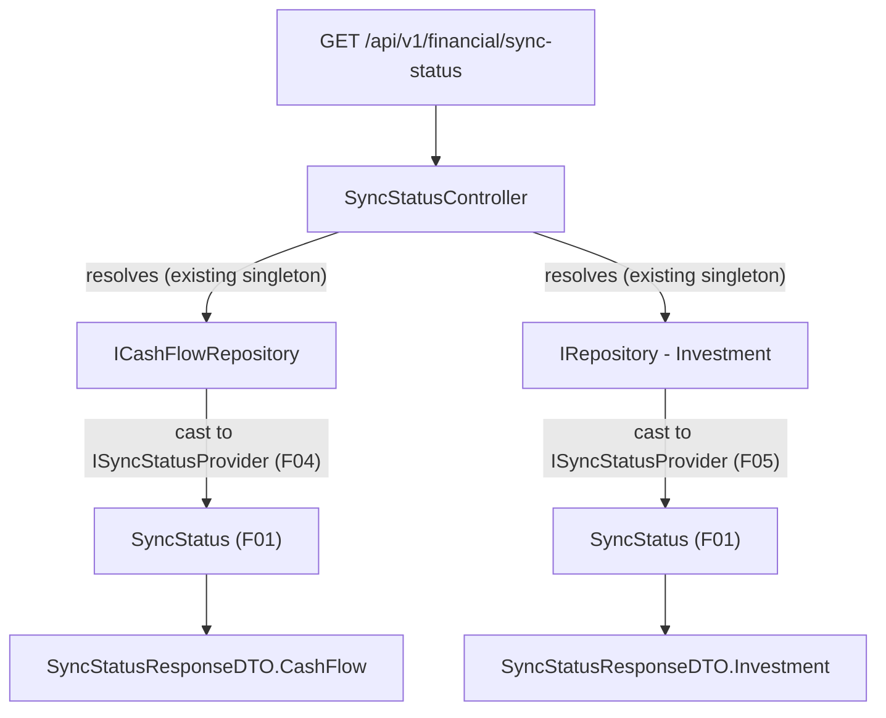

# Spec: F08. Sync Status API Endpoint

## 1. Technical Overview

**What:** A new `SyncStatusController` in `Financial.Api` exposing `GET /api/v1/financial/sync-status`, returning both CashFlow's and Investment's current `SyncStatus` (F01) in one JSON response, keyed `cashFlow`/`investment`. Each side is obtained by resolving the already-registered `ICashFlowRepository`/`IRepository` (both singletons) and casting to `ISyncStatusProvider` — the same pattern `CashFlowJsonRepository`/`JSONRepository` themselves already use internally (F04/F05), applied one layer up.

**Why:** F04/F05 made each context's write-behind status resolvable via DI ("without those features needing to know about the wrapping decision itself") specifically so a consumer like this endpoint could read it without any awareness of `DebouncedJsonStorage`, providers, or wrapping. This is the first feature in the PRD with an actual HTTP surface — it turns that in-process capability into something the web frontend (F09/F10) can poll.

**Scope:**
- Included: the endpoint; `SyncStatusResponseDTO`/`SyncStatusDTO`; per-context `Idle` fallback for unwrapped (`LocalJson`) repositories, matching `CashFlowJsonRepository.GetStatus()`/`JSONRepository.GetStatus()`'s own existing fallback exactly (see Assumptions below for one deliberate divergence from the PRD's Capabilities prose).
- Excluded: the web polling hook and banner (F09, F10). The WPF in-process equivalent (F11, F12) — that reads F04/F05's status directly, without going through this HTTP endpoint at all, per the PRD's own framing of F11.

**Assumptions:**
- The PRD's Capabilities text for this feature says the `LocalJson` case should report `lastSuccessfulSaveUtc` "reflecting the most recent synchronous write." No component in this PRD tracks that timestamp today — `CashFlowJsonRepository.GetStatus()`/`JSONRepository.GetStatus()`'s established fallback (F04/F05, already implemented and reviewed) returns `null` for it, and F08's own testable acceptance criterion only requires `state: "Idle"` for this case (the timestamp detail doesn't appear in the AC list, only in the prose). Adding write-timestamp tracking to the already-shipped `LocalJson` path would be new scope beyond what F04/F05 delivered, for a config that (per the PRD's own problem statement) isn't the household's primary Drive-backed deployment. This spec keeps the existing `null` fallback unchanged and surfaces it as-is; the endpoint is a thin read of whatever `GetStatus()` already returns.

## 2. Architecture Impact

**Affected components:**
- `Financial.Api/Controllers/SyncStatusController.cs` (new)
- `Financial.Api/DTOs/SyncStatusResponseDTO.cs` (new)
- `Financial.Api/DTOs/SyncStatusDTO.cs` (new)



## 3. Technical Decisions

| Decision | Chosen Approach | Alternative Considered | Trade-off |
|----------|----------------|----------------------|-----------|
| How the controller reaches each context's status | Constructor-inject `ICashFlowRepository` and `IRepository` (Investment) — both already registered singletons — and cast each to `ISyncStatusProvider`, falling back to `new SyncStatus(SyncState.Idle, null, null)` when the cast fails | Inject `ISyncStatusProvider` twice (keyed DI) | F04/F05 deliberately avoided registering `ISyncStatusProvider` as its own DI service (to sidestep the two-contexts-one-interface collision) in favor of consumers casting the already-distinct repository interfaces — this endpoint is exactly that "future consumer" the two features' specs anticipated, so it follows the same approach rather than introducing keyed DI as a new pattern |
| `SyncState` → JSON representation | `SyncStatusDTO.State` is a plain `string` (`syncStatus.State.ToString()`, e.g. `"Idle"`), not the `SyncState` enum type directly | Expose the enum type and rely on a global `JsonStringEnumConverter` | No `JsonStringEnumConverter` is configured anywhere in `Financial.Api`, and default `System.Text.Json` enum serialization is numeric — exposing the enum type as-is would silently serialize `0/1/2/3` instead of the PRD's stated `"Idle"`/`"Pending"`/etc. Converting to `string` in the DTO avoids adding new global JSON configuration and matches `RepositoryConfigDTO.Provider`'s existing precedent of representing an enum-like value as a plain string in a DTO |
| Response shape | One object with two named properties, `cashFlow` and `investment`, each holding `{ state, lastError, lastSuccessfulSaveUtc }` | A dictionary/array keyed by context name | The PRD explicitly asks for "both contexts... keyed per context" for "a single-user app with only two contexts" (Experience) — two fixed, named properties are simpler and give the frontend compile-time-checkable field names instead of a dictionary lookup |
| Controller location/route | New `SyncStatusController`, `[Route("sync-status")]`, under the existing `/api/v1/financial` `MapGroup` | Add the endpoint to `DiagnosticsController` | `DiagnosticsController` groups environment/liveness concerns (`health`, `config/repository`); sync status is its own PRD feature with its own DTOs and is polled repeatedly by the frontend (F09) — matches the project's one-controller-per-concern convention (`BanksController`, `CategoriesController`, etc.) rather than `DiagnosticsController`'s narrower "ops-only" grouping |

## 4. Component Overview

**Backend (Financial.Api):**

| File Path | New/Modified | Purpose | Key Responsibilities |
|-----------|--------------|---------|---------------------|
| `Financial.Api/Controllers/SyncStatusController.cs` | New | Exposes combined sync status over HTTP | `[HttpGet]` returns `SyncStatusResponseDTO`; resolves both contexts' status via the cast-and-fallback pattern described above |
| `Financial.Api/DTOs/SyncStatusResponseDTO.cs` | New | Combined response contract | `CashFlow`/`Investment` properties, each a `SyncStatusDTO` |
| `Financial.Api/DTOs/SyncStatusDTO.cs` | New | Per-context status contract | `State` (string), `LastError` (nullable string), `LastSuccessfulSaveUtc` (nullable `DateTime`) |

No database or frontend changes in this feature.

## 5. API Contracts

**Endpoint: Get Combined Sync Status**
- **Method:** GET
- **Path:** `/api/v1/financial/sync-status`
- **Authentication:** None (matches every other endpoint in this single-user, self-hosted app)

**Request:** No parameters.

**Response (Success - 200):**

| Field | Type | Description |
|-------|------|-------------|
| `cashFlow.state` | `string` | One of `"Idle"`, `"Pending"`, `"Saving"`, `"Failed"` |
| `cashFlow.lastError` | `string \| null` | The triggering error's message when `state` is `"Failed"`; otherwise typically `null` |
| `cashFlow.lastSuccessfulSaveUtc` | `string (ISO 8601) \| null` | UTC timestamp of the last successful save, or `null` if none has occurred yet |
| `investment.state` | `string` | Same shape as `cashFlow.state` |
| `investment.lastError` | `string \| null` | Same shape as `cashFlow.lastError` |
| `investment.lastSuccessfulSaveUtc` | `string (ISO 8601) \| null` | Same shape as `cashFlow.lastSuccessfulSaveUtc` |

**Response Example:**
```json
{
  "cashFlow": {
    "state": "Failed",
    "lastError": "Drive request failed with a transient status (503 ServiceUnavailable).",
    "lastSuccessfulSaveUtc": "2026-08-13T09:12:04.123Z"
  },
  "investment": {
    "state": "Idle",
    "lastError": null,
    "lastSuccessfulSaveUtc": null
  }
}
```

**Error Codes:** None — the endpoint always returns 200 with a best-effort status per context (the `Idle`-fallback covers the "no wrapping" case; there is no invalid input to reject, per the PRD's "no parameters" framing).

## 6. Data Model

Not applicable — no persistence.

## 7. Testing Strategy

Per the testing guide's `api-endpoints-e2e.md`: E2E only, using the real `ApiTestFactory` (real routing, real JSON serialization, real DI). `ApiTestFactory`'s default configuration already uses `LocalJson` for both contexts, which directly covers the "LocalJson → Idle" acceptance criterion with zero extra setup. The "Failed" criterion is reached by swapping in a stub `ICashFlowRepository` (also implementing `ISyncStatusProvider`) via `RemoveAll`/`AddSingleton` — the same DI-swap technique the guide's own example uses — rather than driving a real `GoogleDriveJson`-provider write through the real 10-second debounce window, which F04/F05's own tests already established is impractical for a fast test suite.

**Test File Structure:**

| Test File | Test Type | Target | Coverage Goal |
|-----------|-----------|--------|---------------|
| `Tests/Financial.Api.Tests/SyncStatusEndpointsTests.cs` | E2E (`ApiTestFactory`) | `GET /api/v1/financial/sync-status` | Full status-code + JSON-contract + per-context-accuracy matrix |

**Test Functions:**

| Test Function | Description | Assertions |
|---------------|-------------|------------|
| `GetSyncStatus_ReturnsOk_WithBothContextsIdle` | Default factory (both contexts `LocalJson`) | 200 OK; `cashFlow.state` and `investment.state` both deserialize to `"Idle"`; both `lastError`/`lastSuccessfulSaveUtc` are `null` |
| `GetSyncStatus_JsonUsesCamelCasePropertyNames` | Default factory, read raw response body as text | Contains `"cashFlow"`, `"investment"`, `"state"`, `"lastError"`, `"lastSuccessfulSaveUtc"` (camelCase, matching the frontend's expectations) |
| `GetSyncStatus_WhenCashFlowRepositoryIsFailed_ReflectsFailedStateForCashFlowOnly` | Override `ICashFlowRepository` with a stub also implementing `ISyncStatusProvider`, configured to report `Failed` with a specific error message and timestamp; Investment left at the default `LocalJson` | 200 OK; `cashFlow.state` is `"Failed"`, `cashFlow.lastError` matches the stub's message, `cashFlow.lastSuccessfulSaveUtc` matches the stub's timestamp; `investment.state` remains `"Idle"`, proving per-context accuracy in the same response |

**Acceptance criteria covered (PRD Section 9, F08):**
- `GET /api/v1/financial/sync-status` returns both CashFlow and Investment status in a single response → `GetSyncStatus_ReturnsOk_WithBothContextsIdle`
- Each context's response includes `state`, `lastError` (nullable), and `lastSuccessfulSaveUtc` (nullable) → `GetSyncStatus_ReturnsOk_WithBothContextsIdle`, `GetSyncStatus_JsonUsesCamelCasePropertyNames`
- When a context's provider is `LocalJson`, that context always reports `state: "Idle"` → `GetSyncStatus_ReturnsOk_WithBothContextsIdle` (both contexts are `LocalJson` in the default factory)
- The endpoint reflects a `Failed` state for a context immediately after that context's retries are exhausted → `GetSyncStatus_WhenCashFlowRepositoryIsFailed_ReflectsFailedStateForCashFlowOnly` (the "retries exhausted → `Failed`" transition itself is F03's concern, already covered by `DebouncedJsonStorageTests`; this test proves the endpoint faithfully surfaces whatever `GetStatus()` currently reports, immediately, with no caching/staleness in between)
