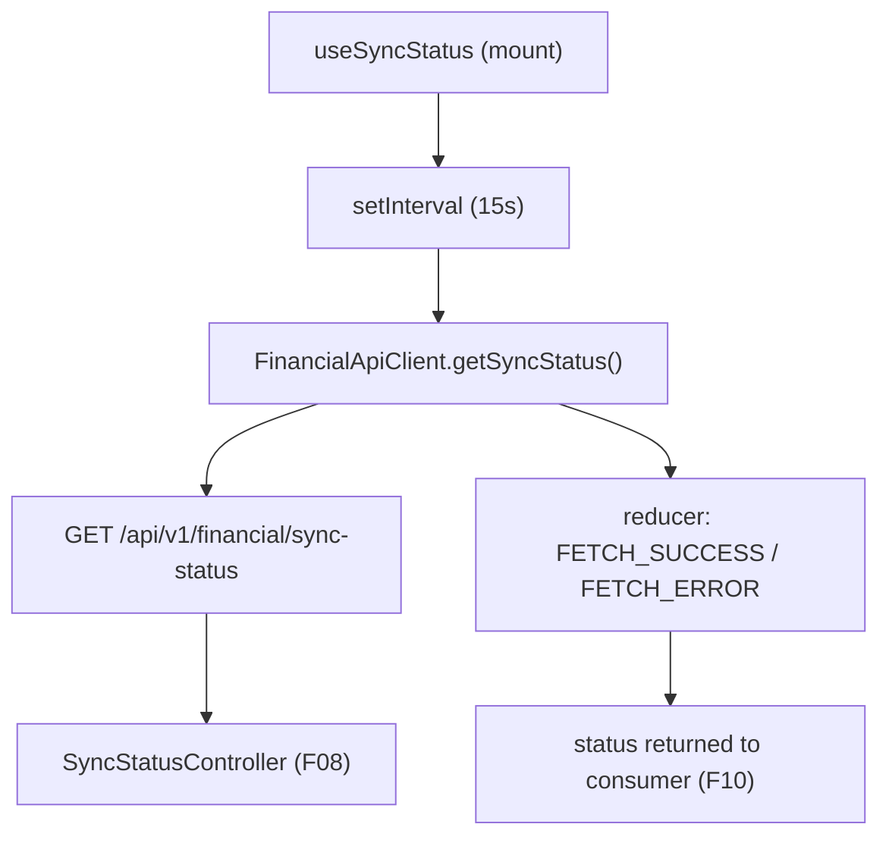

## 1. Technical Overview

**What:** A `useSyncStatus` React hook that polls the F08 `GET /api/v1/financial/sync-status` endpoint every 15 seconds and exposes the latest successfully-fetched combined CashFlow/Investment status to consuming components.

**Why:** F10 (Web Sync Status Banner) needs a reactive, always-fresh view of both bounded contexts' persistence health without the app polling ad hoc from multiple places or pulling in a query/polling library the codebase doesn't otherwise use.

**Scope:**
- Included: `useSyncStatus` hook (mount-triggered polling, no dependency on route/selection state), a `getSyncStatus` method on `FinancialApiClient`, and the `SyncStatusResponseDto`/`SyncStatusDto` TypeScript types mirroring the API's DTOs.
- Excluded: any visible UI (banner rendering is F10's responsibility), WPF polling (F11), manual retry controls (out of scope per PRD Section 7).

## 2. Architecture Impact

**Affected components:**
- `Financial.Web/src/api/types.ts` — new `SyncStatusDto` and `SyncStatusResponseDto` interfaces.
- `Financial.Web/src/api/financialApiClient.ts` — new `getSyncStatus` method on the `FinancialApiClient` interface and its implementation.
- `Financial.Web/src/hooks/useSyncStatus.ts` — new hook (this feature's core deliverable).
- `Financial.Web/src/hooks/useSyncStatus.test.ts` — new test file.



## 3. Technical Decisions

| Decision | Chosen Approach | Alternative Considered | Trade-off |
|----------|----------------|----------------------|-----------|
| Hook return shape | Expose only `{ status: SyncStatusResponseDto \| null }` | Also expose `isLoading`/`error` like `useAggregatedSummary` | Matches the PRD's minimal capability description ("latest combined status, or the previous value while a poll is in flight") and keeps F10's consumption trivial; a failed poll simply leaves `status` unchanged rather than surfacing a separate error the UI doesn't need |
| Polling trigger | Unconditional `setInterval` started on mount, cleared on unmount — no dependency on route, selection, or other context | Gate polling behind page visibility or a shared node-selection context (as `useAggregatedSummary` does) | F10 renders the consuming banner globally in `App.tsx`, so the hook must poll regardless of what page is active or selected; page-visibility gating isn't in the PRD's scope and would add complexity for a single-user app |

## 4. Component Overview

**Frontend:**

| File Path | New/Modified | Purpose | Key Responsibilities |
|-----------|--------------|---------|---------------------|
| `Financial.Web/src/hooks/useSyncStatus.ts` | New | Polls combined sync status | Starts a 15s interval on mount, calls the API client, updates state on success, clears interval on unmount |
| `Financial.Web/src/hooks/useSyncStatus.test.ts` | New | Hook test coverage | Verifies initial poll, interval cadence, failure resilience, and state exposure |
| `Financial.Web/src/api/types.ts` | Modified | Adds response DTO types | `SyncStatusDto`, `SyncStatusResponseDto` matching the API's camelCase JSON shape |
| `Financial.Web/src/api/financialApiClient.ts` | Modified | Adds API call | `getSyncStatus(): Promise<SyncStatusResponseDto>` calling `GET /sync-status` |
| `Financial.Web/src/api/financialApiClient.test.ts` | Modified | Client test coverage | Verifies `getSyncStatus` hits the right path and returns the parsed response |

## 5. API Contracts

**Endpoint: Get Combined Sync Status** (already implemented in F08; consumed here)
- **Method:** GET
- **Path:** `/api/v1/financial/sync-status`
- **Authentication:** None (matches existing endpoints — single-user, self-hosted app)

**Response (Success - 200):**

| Field | Type | Description |
|-------|------|-------------|
| `cashFlow.state` | `string` | One of `"Idle"`, `"Pending"`, `"Saving"`, `"Failed"` |
| `cashFlow.lastError` | `string \| null` | Triggering error message when `state` is `"Failed"` |
| `cashFlow.lastSuccessfulSaveUtc` | `string \| null` | ISO 8601 UTC timestamp of the last successful save |
| `investment.state` | `string` | Same shape as `cashFlow.state`, for the Investment context |
| `investment.lastError` | `string \| null` | Same shape as `cashFlow.lastError` |
| `investment.lastSuccessfulSaveUtc` | `string \| null` | Same shape as `cashFlow.lastSuccessfulSaveUtc` |

**Response Example:**
```json
{
  "cashFlow": { "state": "Idle", "lastError": null, "lastSuccessfulSaveUtc": null },
  "investment": { "state": "Failed", "lastError": "Drive request failed with a transient status (503 ServiceUnavailable).", "lastSuccessfulSaveUtc": "2026-08-13T09:12:04Z" }
}
```

**Error Codes:**

| Code | HTTP Status | Description |
|------|-------------|-------------|
| N/A | 5xx / network failure | The hook's poll simply fails silently for that cycle; the previous `status` value is retained and the next 15s tick tries again |

## 6. Data Model

Not applicable — this feature is client-side only and introduces no persistence.

## 7. Testing Strategy

**Test File Structure:**

| Test File | Test Type | Target | Coverage Goal |
|-----------|-----------|--------|---------------|
| `Financial.Web/src/hooks/useSyncStatus.test.ts` | Unit | `useSyncStatus` | All acceptance criteria below |
| `Financial.Web/src/api/financialApiClient.test.ts` | Unit | `getSyncStatus` | Request path and response passthrough |

**For `useSyncStatus.test.ts`:**

| Test Function | Description | Assertions |
|---------------|-------------|------------|
| `calls_getSyncStatus_on_mount` | Hook fetches immediately when rendered | `getSyncStatus` called once synchronously after mount, before any timer advances |
| `calls_getSyncStatus_every_15_seconds` | Interval cadence matches the PRD | Using fake timers, advancing 15s causes a second call, another 15s a third |
| `failed_poll_does_not_throw_and_next_tick_still_polls` | A rejected poll doesn't crash the hook or stop the interval | `getSyncStatus` rejects once; hook doesn't throw; advancing another 15s still triggers a subsequent call |
| `exposes_latest_successfully_polled_status` | Hook surfaces the last successful response | After a resolved call, `result.current.status` equals the mocked `SyncStatusResponseDto` |
| `retains_previous_status_after_a_failed_poll` | A failure doesn't clear prior data | Hook resolves once (status set), then a later poll rejects; `result.current.status` still holds the earlier value |
| `clears_interval_on_unmount` | No further calls after unmount | Unmount the hook, advance timers by 15s+, assert `getSyncStatus` call count unchanged |

**For `financialApiClient.test.ts` addition:**

| Test Function | Description | Assertions |
|---------------|-------------|------------|
| `getSyncStatus_calls_correct_endpoint` | Verifies request path | Fetch mock called with `/sync-status`; parsed JSON returned as-is |

**Acceptance criteria traceability (PRD Section 9, F09):**
- "The hook calls the F08 endpoint on mount and every 15 seconds thereafter" → `calls_getSyncStatus_on_mount`, `calls_getSyncStatus_every_15_seconds`
- "A failed poll does not crash the hook or stop subsequent polling attempts" → `failed_poll_does_not_throw_and_next_tick_still_polls`
- "The hook exposes the latest successfully-polled combined status to consumers" → `exposes_latest_successfully_polled_status`, `retains_previous_status_after_a_failed_poll`

**Cross-Feature Integration criteria (PRD Section 9):**
- "The web polling hook (F09) correctly surfaces F08's response, and the web banner (F10) correctly reflects F09's data" — the F09 half is covered by `exposes_latest_successfully_polled_status`; the F10 half is out of scope for this feature and will be covered when F10 is implemented.
