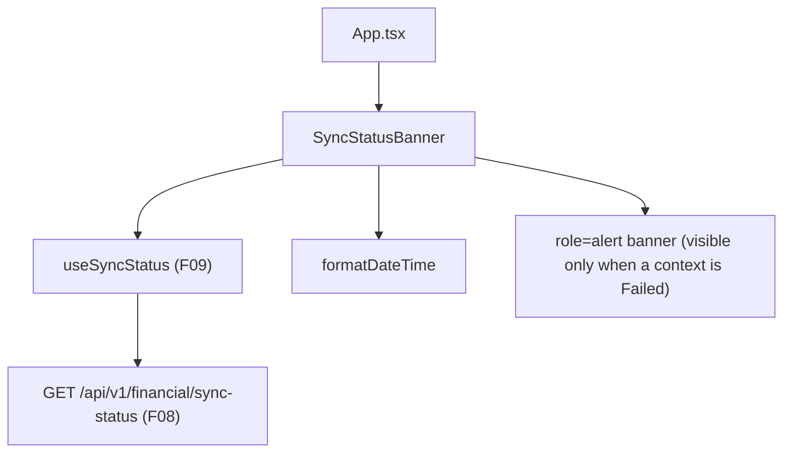

## 1. Technical Overview

**What:** A `SyncStatusBanner` component, rendered once globally in `App.tsx` above the routed `<Outlet />`, that reads F09's polled sync status and shows a warning banner naming which bounded context(s) failed to save, the last error, and the last successful save time — hidden whenever both contexts are healthy.

**Why:** Closes the "did my last change actually save?" gap called out in the PRD's problem statement: background save failures are otherwise invisible until the user notices missing data.

**Scope:**
- Included: the `SyncStatusBanner` component, its styling, wiring into `App.tsx`, and a small `formatDateTime` addition to `utils/formatters.ts` for rendering `lastSuccessfulSaveUtc`.
- Excluded: any polling logic (F09's job), manual dismiss/retry controls (out of scope per PRD Section 7), WPF's equivalent indicator (F12).

## 2. Architecture Impact

**Affected components:**
- `Financial.Web/src/components/SyncStatusBanner.tsx` — new.
- `Financial.Web/src/components/SyncStatusBanner.css` — new.
- `Financial.Web/src/components/__tests__/SyncStatusBanner.test.tsx` — new.
- `Financial.Web/src/App.tsx` — modified, renders `<SyncStatusBanner />` above `<Outlet />`.
- `Financial.Web/src/utils/formatters.ts` — modified, adds `formatDateTime`.
- `Financial.Web/src/utils/formatters.test.ts` — modified, covers `formatDateTime`.

## 3. Technical Decisions

| Decision | Chosen Approach | Alternative Considered | Trade-off |
|----------|----------------|----------------------|-----------|
| Last-successful-save time display | Absolute local date/time via a new `formatDateTime` utility, styled like the existing `formatShortDate`/`formatShortDateUtc` pair (`DD/MM/YYYY HH:mm`) | Relative "X minutes ago" text, matching the PRD's illustrative example wording | The PRD's example text is illustrative, not a literal requirement (capability text only says "shows the last successful save time"); an absolute format reuses the codebase's existing date-formatting convention with no new relative-time logic, ticking-label re-render concerns, or extra tests |
| Component data source | `SyncStatusBanner` calls `useSyncStatus()` directly (no props) | Accept status as a prop passed down from `App.tsx` | Matches the established pattern (`AggregatedSummaryTab` calls `useAggregatedSummary()` directly) — `App.tsx` stays a thin layout shell with no data-fetching concerns |

## 4. Component Overview

**Frontend:**

| File Path | New/Modified | Purpose | Key Responsibilities |
|-----------|--------------|---------|---------------------|
| `Financial.Web/src/components/SyncStatusBanner.tsx` | New | Global failure banner | Calls `useSyncStatus()`; renders nothing when both contexts are healthy; renders one message per `Failed` context naming it, its last error, and its last successful save time |
| `Financial.Web/src/components/SyncStatusBanner.css` | New | Banner styling | Warning/error-toned banner matching the existing `.reserva-page__warning` visual pattern (colored background, border, padding) |
| `Financial.Web/src/components/__tests__/SyncStatusBanner.test.tsx` | New | Component test coverage | Verifies visibility rules, per-context naming, dual-failure case, and content (error message, save time) |
| `Financial.Web/src/App.tsx` | Modified | Global layout | Renders `<SyncStatusBanner />` once, above `<Outlet />`, so it's visible on every route |
| `Financial.Web/src/utils/formatters.ts` | Modified | Date/time formatting | Adds `formatDateTime(isoString)` returning a local `DD/MM/YYYY HH:mm` string (empty string for null/undefined, same guard pattern as `formatShortDate`) |

## 5. API Contracts

Not applicable — this feature only consumes data already fetched by F09's `useSyncStatus` hook; it makes no new API calls.

## 6. Data Model

Not applicable — client-side only, no persistence.

## 7. Testing Strategy

**Test File Structure:**

| Test File | Test Type | Target | Coverage Goal |
|-----------|-----------|--------|---------------|
| `Financial.Web/src/components/__tests__/SyncStatusBanner.test.tsx` | Component | `SyncStatusBanner` | All acceptance criteria below |
| `Financial.Web/src/utils/formatters.test.ts` | Unit | `formatDateTime` | Valid ISO input, null/undefined, invalid string passthrough |

**For `SyncStatusBanner.test.tsx`** (mocks `useSyncStatus` at the module boundary, per the existing `AggregatedSummaryTab.test.tsx` pattern):

| Test Function | Description | Assertions |
|---------------|-------------|------------|
| `no_banner_when_both_contexts_idle` | Both contexts healthy | `screen.queryByRole('alert')` is null |
| `no_banner_when_status_is_null` | Hook hasn't resolved its first poll yet | `screen.queryByRole('alert')` is null |
| `banner_visible_when_cashflow_failed` | CashFlow alone fails | `screen.getByRole('alert')` present; text names "CashFlow" |
| `banner_visible_when_investment_failed` | Investment alone fails | `screen.getByRole('alert')` present; text names "Investment" |
| `banner_names_both_contexts_when_both_failed` | Both fail simultaneously | Banner text includes both "CashFlow" and "Investment" |
| `banner_shows_last_error_message` | Failed context has a `lastError` | Banner text includes the exact error string |
| `banner_shows_formatted_last_successful_save_time` | Failed context has a non-null `lastSuccessfulSaveUtc` | Banner text includes the `formatDateTime`-formatted value |
| `banner_shows_never_when_no_prior_successful_save` | Failed context's `lastSuccessfulSaveUtc` is null | Banner text indicates no prior successful save (e.g. "Never") |

**Acceptance criteria traceability (PRD Section 9, F10):**
- "No banner is visible when both contexts report a non-`Failed` state" → `no_banner_when_both_contexts_idle`
- "A banner appears within one polling cycle (≤15s) after either context's status becomes `Failed`" → covered by `banner_visible_when_cashflow_failed`/`banner_visible_when_investment_failed` proving the banner renders as soon as `useSyncStatus` reports a `Failed` state; the ≤15s timing bound itself is F09's already-tested polling cadence, not re-tested here
- "The banner correctly names which context(s) failed when both fail simultaneously" → `banner_names_both_contexts_when_both_failed`
- "The banner disappears automatically within one polling cycle after the affected context's status moves off `Failed`" → the component is a pure function of `useSyncStatus()`'s return value with no local dismissed-state; when the mocked hook value changes from `Failed` to `Idle` between renders, the banner unmounts — covered by re-rendering `no_banner_when_both_contexts_idle`'s assertion after a rerender with an updated mock value
- "The banner is visible from every route in the web app" → covered structurally by rendering `<SyncStatusBanner />` in `App.tsx` above `<Outlet />` (outside any route's own tree), not per-route testing

**Cross-Feature Integration criteria (PRD Section 9):**
- "The web polling hook (F09) correctly surfaces F08's response, and the web banner (F10) correctly reflects F09's data" — the F10 half is covered by this feature's component tests (mocking `useSyncStatus`'s return value and asserting the banner reflects it exactly); combined with F09's own hook tests, this closes the full chain.
