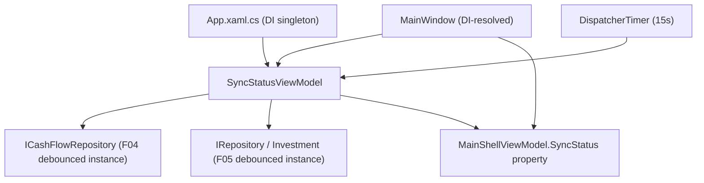

## 1. Technical Overview

**What:** A `SyncStatusViewModel` in `Financial.App` that reads `ICashFlowRepository`/`IRepository` (Investment) directly, checking each for `ISyncStatusProvider` the same way `SyncStatusController` (F08) does, and re-checks every 15 seconds via a `DispatcherTimer` — no HTTP call, since `Financial.App` hosts both bounded contexts' Infrastructure in-process.

**Why:** WPF doesn't call the API over HTTP, so F09's `useSyncStatus` hook pattern doesn't apply here; F11 gives WPF the same "current combined status, refreshed every 15s" capability by reading the in-process debounced instances directly, at the same polling cadence as the web app for a consistent cross-front-end experience.

**Scope:**
- Included: `SyncStatusViewModel`, its DI registration, and threading it through `MainShellViewModel`/`MainWindow` so it's reachable for F12's binding without further plumbing.
- Excluded: any visible UI (F12's job — the indicator itself, its visibility rule, and its XAML).

## 2. Architecture Impact

**Affected components:**
- `Financial.App/ViewModels/SyncStatusViewModel.cs` — new.
- `Financial.App/ViewModels/MainShellViewModel.cs` — modified, accepts and exposes the new ViewModel.
- `Financial.App/MainWindow.xaml.cs` — modified, accepts the DI-injected ViewModel and passes it to `MainShellViewModel`.
- `Financial.App/App.xaml.cs` — modified, registers `SyncStatusViewModel` as a DI singleton.
- `Tests/Financial.Presentation.Tests/ViewModels/SyncStatusViewModelTests.cs` — new.

## 3. Technical Decisions

| Decision | Chosen Approach | Alternative Considered | Trade-off |
|----------|----------------|----------------------|-----------|
| Reachability for F12 | Thread `SyncStatusViewModel` through `MainWindow`'s constructor into `MainShellViewModel` as a new constructor parameter, exposed as a public property | Register only as a standalone DI singleton, leave wiring to F12 | `MainWindow.xaml`'s bindings resolve against `MainShellViewModel` (the `DataContext`), matching the existing `BreadcrumbText`/`IsCollapsed` pattern — so F12 can add a binding immediately with zero additional plumbing, at the cost of one new constructor parameter here |
| Status representation | Expose `Financial.Shared.Infrastructure.Sync.SyncStatus` value objects directly (`CashFlowStatus`, `InvestmentStatus` properties) | Define a WPF-specific DTO mirroring `SyncStatusDTO` | No HTTP boundary exists here (unlike F08/F09), so there's nothing to serialize across — reusing the existing value type avoids a redundant mapping layer |
| Timer tick testability | Expose the poll logic as a public `RefreshStatus()` method, called once in the constructor (satisfies "checks on start") and by the `DispatcherTimer.Tick` handler; the interval itself is a public constant | Attempt to assert the `DispatcherTimer` actually fires on a schedule inside a unit test | This codebase's existing `DispatcherTimer` usage (`Sidebar`'s flyout-close timer) is not unit tested either — a plain xUnit host has no running WPF `Dispatcher` message loop to pump `Tick` events. Testing the poll logic directly (called once, called again) covers the actual behavior; the periodic re-scheduling is accepted framework glue, consistent with the existing precedent |

## 4. Component Overview

**Frontend (WPF):**

| File Path | New/Modified | Purpose | Key Responsibilities |
|-----------|--------------|---------|---------------------|
| `Financial.App/ViewModels/SyncStatusViewModel.cs` | New | In-process combined sync status | Resolves `CashFlowStatus`/`InvestmentStatus` from the injected repositories (casting to `ISyncStatusProvider`, defaulting to `Idle` otherwise, matching `SyncStatusController`'s `ResolveStatus`); refreshes on construction and every 15s via `DispatcherTimer` |
| `Financial.App/ViewModels/MainShellViewModel.cs` | Modified | Shell composition root | Accepts `SyncStatusViewModel` as a new constructor parameter; exposes it as a public `SyncStatus` property for F12's future binding |
| `Financial.App/MainWindow.xaml.cs` | Modified | DI composition | Accepts the DI-resolved `SyncStatusViewModel` as a new constructor parameter; passes it into `MainShellViewModel`'s constructor |
| `Financial.App/App.xaml.cs` | Modified | DI registration | Registers `SyncStatusViewModel` as `AddSingleton` (one instance, one timer, for the app's lifetime) |
| `Tests/Financial.Presentation.Tests/ViewModels/SyncStatusViewModelTests.cs` | New | ViewModel test coverage | Covers initial-poll-on-construction, `RefreshStatus()`'s per-context resolution (including the "not an `ISyncStatusProvider`" default), and independence between the two contexts |

## 5. API Contracts

Not applicable — no HTTP call is made; this feature reads in-process repository instances directly.

## 6. Data Model

Not applicable — no persistence introduced.

## 7. Testing Strategy

**Test File Structure:**

| Test File | Test Type | Target | Coverage Goal |
|-----------|-----------|--------|---------------|
| `Tests/Financial.Presentation.Tests/ViewModels/SyncStatusViewModelTests.cs` | Unit | `SyncStatusViewModel` | All acceptance criteria below |

**Setup:** hand-written stub repositories, matching this codebase's no-mocking-framework convention — `SyncStatusCashFlowRepositoryStub`/`SyncStatusRepositoryStub` (from `Financial.TestUtilities`, `ICashFlowRepository`/`IRepository` + `ISyncStatusProvider`, settable `StatusToReturn`) for the positive case, and `StubCashFlowRepository`/`StubRepository` (same project, do NOT implement `ISyncStatusProvider`) for the "not a sync status provider" default case.

| Test Function | Description | Assertions |
|---------------|-------------|------------|
| `Constructor_PopulatesStatusImmediately_FromBothRepositories` | Construction alone triggers the first poll | `CashFlowStatus`/`InvestmentStatus` reflect each stub's `StatusToReturn` right after construction, with no explicit `RefreshStatus()` call |
| `Constructor_WithNullCashFlowRepository_Throws` | Guard clause | `ArgumentNullException` with parameter name `cashFlowRepository` |
| `Constructor_WithNullInvestmentRepository_Throws` | Guard clause | `ArgumentNullException` with parameter name `investmentRepository` |
| `RefreshStatus_WhenRepositoryIsNotASyncStatusProvider_ReportsIdle` | LocalJson-provider case (repository doesn't implement `ISyncStatusProvider`) | `CashFlowStatus`/`InvestmentStatus` equal `new SyncStatus(SyncState.Idle, null, null)` |
| `RefreshStatus_ReflectsUpdatedStatusOnEachCall` | A later poll picks up a changed status | Change the stub's `StatusToReturn` to `Failed` between two `RefreshStatus()` calls; the property reflects the new value after the second call |
| `RefreshStatus_CashFlowAndInvestmentAreIndependent` | One context failing doesn't affect the other | Set the CashFlow stub to `Failed` and the Investment stub to `Idle`; after `RefreshStatus()`, `CashFlowStatus.State` is `Failed` and `InvestmentStatus.State` is `Idle` |

**Acceptance criteria traceability (PRD Section 9, F11):**
- "The timer checks both contexts' in-process status on start and every 15 seconds thereafter" → the "on start" half is covered by `Constructor_PopulatesStatusImmediately_FromBothRepositories`; the "every 15 seconds thereafter" half is covered structurally (the `DispatcherTimer`'s `Tick` handler calls the same `RefreshStatus()` method exercised by `RefreshStatus_ReflectsUpdatedStatusOnEachCall`) — the timer's actual periodic firing is WPF `Dispatcher` glue, not mechanically testable in this project's xUnit host (see Technical Decisions), consistent with the pre-existing untested `Sidebar` close-timer
- "No HTTP call is made — status is read directly from the in-process F04/F05 instances" → structural: the constructor's only dependencies are `ICashFlowRepository`/`IRepository`, with no `HttpClient` or API client involved at all; further confirmed behaviorally since the stub repositories used in every test never touch the network

**Cross-Feature Integration criteria (PRD Section 9):**
- "The WPF polling (F11) correctly reflects F04's and F05's in-process status without going through F08, and the WPF indicator (F12) correctly reflects F11's data" — the F11 half is covered by `RefreshStatus_CashFlowAndInvestmentAreIndependent` (proving both contexts resolve independently, directly from their own repository instance, with no shared HTTP round trip); the F12 half is out of scope for this feature.
