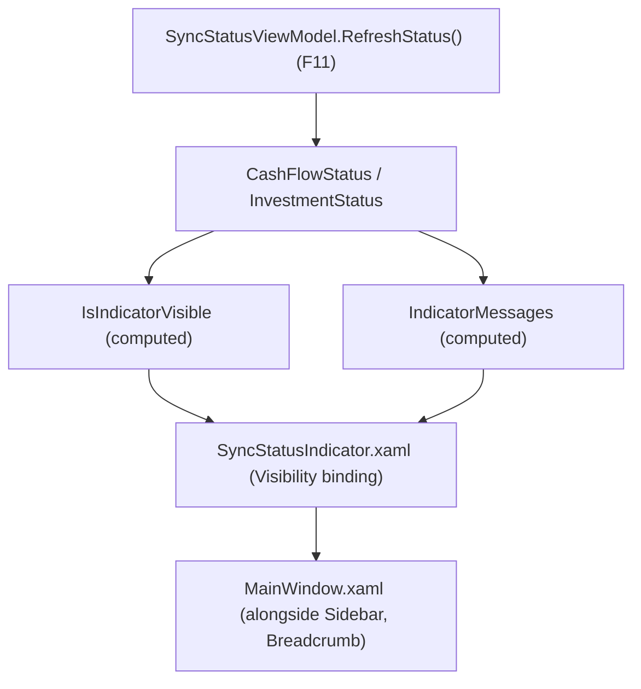

## 1. Technical Overview

**What:** A `SyncStatusIndicator` UserControl, added to `MainWindow.xaml` alongside the existing sidebar and breadcrumb, that reads new computed properties on F11's `SyncStatusViewModel` and shows a warning naming which bounded context(s) currently report `Failed`, their last error, and their last successful save time — hidden whenever both contexts are healthy. Mirrors F10's web banner content and wording exactly.

**Why:** Closes the same "did my last change actually save?" gap for WPF users that F10 closes for web users, keeping the two front ends at feature parity per the project's WPF-is-UX-source-of-truth convention.

**Scope:**
- Included: computed `IsIndicatorVisible`/`IndicatorMessages` properties on `SyncStatusViewModel`, the `SyncStatusIndicator` UserControl, and wiring it into `MainWindow.xaml`.
- Excluded: any change to the polling mechanism itself (F11's job, already shipped); manual dismiss/retry controls (out of scope per PRD Section 7).

## 2. Architecture Impact

**Affected components:**
- `Financial.App/ViewModels/SyncStatusViewModel.cs` — modified, adds `IsIndicatorVisible` and `IndicatorMessages`.
- `Financial.App/Components/SyncStatusIndicator.xaml` — new.
- `Financial.App/Components/SyncStatusIndicator.xaml.cs` — new (code-behind, `InitializeComponent()` only).
- `Financial.App/MainWindow.xaml` — modified, adds the indicator alongside the sidebar/breadcrumb.
- `Tests/Financial.Presentation.Tests/ViewModels/SyncStatusViewModelTests.cs` — modified, adds coverage for the two new computed properties.

## 3. Technical Decisions

| Decision | Chosen Approach | Alternative Considered | Trade-off |
|----------|----------------|----------------------|-----------|
| Where the visibility/message logic lives | Extend `SyncStatusViewModel` (F11) directly with computed `IsIndicatorVisible`/`IndicatorMessages` properties, raised whenever `RefreshStatus()` updates the underlying status | A separate `SyncStatusIndicatorViewModel` wrapping F11's ViewModel | Mirrors the existing `BreadcrumbText` pattern on `MainShellViewModel` (a computed string derived from other observable properties) — least new code, one ViewModel to bind the indicator against |
| Message wording | Reuse F10's exact sentence structure in C#: `"{Context} changes could not be saved to Google Drive (last error: {error}). Last successful save: {time|Never}."` | A WPF-specific wording | PRD explicitly requires F12 to mirror F10's content and behavior |
| Last-successful-save time format | `dd/MM/yyyy HH:mm` formatted with `CultureInfo.InvariantCulture` | `CultureInfo.CurrentCulture` (matching the existing `DateFormatConverter`'s locale-aware approach) | Guarantees the exact same rendered format as F10's `formatDateTime` regardless of the machine's regional settings, keeping the two front ends' wording identical, not just structurally similar |
| Indicator placement | New `Auto`-height row inserted above the existing breadcrumb row (within the content column, not spanning over the sidebar) | Span the indicator across both the sidebar and content columns | Matches the web app's equivalent placement (`SyncStatusBanner` renders inside `<main>`, above `Breadcrumb`, without covering the persistent `Sidebar`) — an `Auto` height row collapses to zero size when the indicator's `Visibility` is `Collapsed`, so no extra layout logic is needed |

## 4. Component Overview

**Frontend (WPF):**

| File Path | New/Modified | Purpose | Key Responsibilities |
|-----------|--------------|---------|---------------------|
| `Financial.App/ViewModels/SyncStatusViewModel.cs` | Modified | Indicator visibility/content | `IsIndicatorVisible` (true when either context's `State` is `Failed`); `IndicatorMessages` (one formatted string per failed context, in `CashFlow`-then-`Investment` order); both raise `PropertyChanged` from within `RefreshStatus()` |
| `Financial.App/Components/SyncStatusIndicator.xaml` | New | Global failure indicator | `Border` whose `Visibility` binds to `IsIndicatorVisible` (via the existing app-wide `BoolToVisibilityConverter`), containing an `ItemsControl` bound to `IndicatorMessages` |
| `Financial.App/Components/SyncStatusIndicator.xaml.cs` | New | Code-behind | `InitializeComponent()` only — no logic (matches `Sidebar.xaml.cs`'s structure for other behavior-light UserControls) |
| `Financial.App/MainWindow.xaml` | Modified | Global layout | Adds `<components:SyncStatusIndicator DataContext="{Binding SyncStatus}"/>` in a new `Auto`-height row above the breadcrumb row |
| `Tests/Financial.Presentation.Tests/ViewModels/SyncStatusViewModelTests.cs` | Modified | ViewModel test coverage | Covers `IsIndicatorVisible`/`IndicatorMessages` for: both healthy, CashFlow-only failed, Investment-only failed, both failed, and the "no prior successful save" fallback |

## 5. API Contracts

Not applicable — no HTTP call; this feature only adds computed properties over F11's already-in-process status.

## 6. Data Model

Not applicable — no persistence introduced.

## 7. Testing Strategy

**Test File Structure:**

| Test File | Test Type | Target | Coverage Goal |
|-----------|-----------|--------|---------------|
| `Tests/Financial.Presentation.Tests/ViewModels/SyncStatusViewModelTests.cs` | Unit | `SyncStatusViewModel.IsIndicatorVisible` / `.IndicatorMessages` | All acceptance criteria below |

**Setup:** same hand-written stub repositories already used by F11's tests (`SyncStatusCashFlowRepositoryStub`/`SyncStatusRepositoryStub` from `Financial.TestUtilities`).

| Test Function | Description | Assertions |
|---------------|-------------|------------|
| `IsIndicatorVisible_BothContextsHealthy_IsFalse` | Neither context is `Failed` | `IsIndicatorVisible` is `false`; `IndicatorMessages` is empty |
| `IsIndicatorVisible_CashFlowFailed_IsTrue` | Only CashFlow is `Failed` | `IsIndicatorVisible` is `true`; `IndicatorMessages` contains exactly one entry naming "CashFlow" |
| `IsIndicatorVisible_InvestmentFailed_IsTrue` | Only Investment is `Failed` | `IsIndicatorVisible` is `true`; `IndicatorMessages` contains exactly one entry naming "Investment" |
| `IndicatorMessages_BothContextsFailed_NamesBoth` | Both fail simultaneously | `IndicatorMessages` has two entries, one naming each context |
| `IndicatorMessages_IncludesLastErrorAndFormattedSaveTime` | A failed context has a `LastError` and a non-null `LastSuccessfulSaveUtc` | The message contains the exact error text and the `dd/MM/yyyy HH:mm`-formatted time |
| `IndicatorMessages_NoPriorSuccessfulSave_ShowsNever` | A failed context's `LastSuccessfulSaveUtc` is null | The message contains "Never" in place of a formatted time |
| `IsIndicatorVisible_AndIndicatorMessages_UpdateAfterRefreshStatus` | Status changes between two polls (recovery case) | After a second `RefreshStatus()` call moves the failed context back to `Idle`, `IsIndicatorVisible` becomes `false` and `IndicatorMessages` becomes empty |

**Acceptance criteria traceability (PRD Section 9, F12):**
- "No indicator is visible when both contexts report a non-`Failed` state" → `IsIndicatorVisible_BothContextsHealthy_IsFalse`
- "An indicator appears within one check cycle (≤15s) after either context's status becomes `Failed`" → `IsIndicatorVisible_CashFlowFailed_IsTrue`/`IsIndicatorVisible_InvestmentFailed_IsTrue` prove the indicator reacts to a status change; the ≤15s bound itself is F11's already-tested/accepted `DispatcherTimer` cadence, not re-tested here
- "The indicator correctly names which context(s) failed when both fail simultaneously" → `IndicatorMessages_BothContextsFailed_NamesBoth`
- "The indicator disappears automatically within one check cycle after the affected context's status moves off `Failed`" → `IsIndicatorVisible_AndIndicatorMessages_UpdateAfterRefreshStatus`
- "The indicator is visible regardless of which page/view is currently active" → structural: `SyncStatusIndicator` is added once in `MainWindow.xaml`, outside the `ContentControl` that swaps per-page content, alongside the persistent `Sidebar` and breadcrumb — not itself unit-testable (WPF XAML composition isn't exercised by this project's xUnit host, matching the accepted `DispatcherTimer`/`Sidebar`-rendering gap noted in F11)

**Cross-Feature Integration criteria (PRD Section 9):**
- "The WPF polling (F11) correctly reflects F04's and F05's in-process status without going through F08, and the WPF indicator (F12) correctly reflects F11's data" — the F12 half is covered by every test above, each of which drives `SyncStatusViewModel`'s underlying `CashFlowStatus`/`InvestmentStatus` (F11's own state) and asserts the indicator's computed properties respond correctly; combined with F11's own tests, this closes the full chain.
