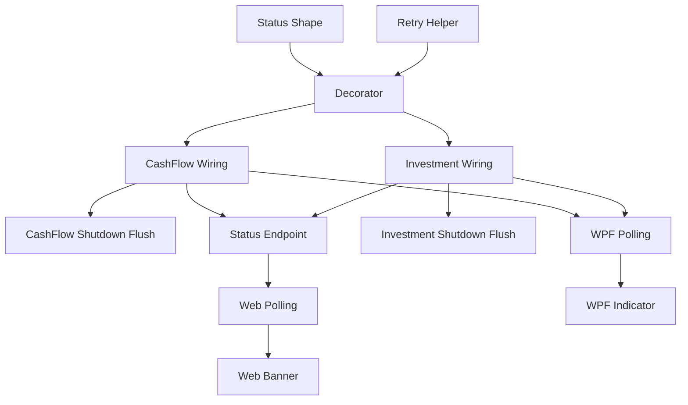

# Asynchronous Write-Behind Persistence

## 1. Executive Summary

Asynchronous Write-Behind Persistence removes Google Drive upload latency from the request path of every mutation in the Financial app. Today, adding an expense, recording a transfer, or updating an asset all block on a full serialize-and-upload of the entire JSON data file to Google Drive before the API responds — for CashFlow's ~5.45MB document this makes every write feel sluggish. This feature changes that: a mutation applies to the in-memory model and returns immediately, while a background worker marks the model dirty, waits briefly for further changes to batch together, then pushes the latest state to Drive with retries for transient failures.

The product is used by a single household administrator across two independent front ends (the React web app and the WPF desktop app) and two independent bounded contexts (CashFlow, edited near-daily, and Investment, edited fewer than 10 times a month). The core value is responsiveness: every user-facing action feels instant, while durability to Google Drive continues in the background. Each bounded context gets its own fully independent write-behind mechanism — its own dirty tracking, debounce timer, retry state, and failure status — so a persistence problem in one context (e.g. Investment) can never delay or block saves in the other (e.g. CashFlow), and vice versa. When a background save ultimately fails after retries are exhausted, both front ends surface a status banner so the failure is never silent.

The mechanism is deliberately built as a sequence of small, narrowly-scoped building blocks — a status data shape, a retry helper, a storage decorator, then separate per-context wiring, separate per-context shutdown handling, and separate per-front-end status UI — so each is reviewable in isolation as a small pull request touching a handful of files, rather than one large cross-cutting change.

## 2. Problem and Opportunity

**The Problem**

- **Blocking saves punish every mutation.** Every `SaveChangesAsync()` call re-serializes the full CashFlow (~5.45MB, ~16k entities across 11 collections) or Investment document and uploads it to Google Drive synchronously, inside the HTTP request. The user waits on a full network round-trip for every single expense, transfer, or asset edit.
- **The pain is concentrated where usage is heaviest.** CashFlow is edited near-daily; Investment fewer than 10 times a month. The current design imposes the same per-mutation Drive round-trip cost on both, even though only CashFlow's frequency makes the latency actually painful in daily use.
- **Failures are invisible until the request itself fails.** If a save to Drive fails, the only signal today is the mutation's HTTP call failing — there is no persistent way to know that a previously-successful-looking edit didn't actually make it to Drive.
- **Shared infrastructure risks coupling contexts that should be independent.** CashFlow and Investment are separate bounded contexts with very different edit frequencies and separate data files; a naive shared save mechanism risks one context's slow or failing Drive calls delaying or blocking the other's.

**The Opportunity**

- Decoupling the in-memory mutation from the Drive upload (write-behind) directly solves the blocking-save problem: the API responds as soon as the in-memory model is updated, not after the network round-trip.
- Debouncing background saves per context batches rapid successive edits (e.g. entering several expenses in a row) into a single upload, reducing both Drive API call volume and rate-limit risk.
- Giving each bounded context its own independent write-behind instance (dirty flag, timer, retry state, status) — rather than one shared mechanism — means CashFlow's daily-driver responsiveness is never at the mercy of Investment's occasional Drive hiccups, and each context's debounce window can be tuned independently to its own usage pattern.
- A polled sync-status signal in both front ends turns invisible background failures into an explicit, unmissable banner, closing the "did my last change actually save?" gap.

## 3. Target Audience

### Primary Users

**Household Financial Administrator**
- The single user of this self-hosted, personal app; edits CashFlow data (expenses, transfers, bills) near-daily and Investment data (assets, snapshots) fewer than 10 times a month.
- Switches between the React web app and the WPF desktop app depending on device, but only ever uses one device actively at a time — never edits concurrently from two clients.
- Expects every click/save to feel instant, and expects to be told — not left to guess — if something didn't actually persist to Google Drive.

## 4. Objectives

**Product Objectives**

- **Eliminate** Drive-upload latency from the perceived response time of every CashFlow and Investment mutation.
- **Isolate** each bounded context's persistence mechanism so a failure or slowdown in one never affects the other.
- **Surface** background persistence failures to the user reliably, in both front ends, without requiring them to check server logs.
- **Preserve** all pending in-memory changes across a graceful shutdown (container stop, app close) so a routine restart never silently drops an edit.

**Success Metrics**

- CashFlow mutation API response time (p95) drops to under 100ms, measured excluding the background Drive push, versus the current several-hundred-ms-to-multi-second round-trip that includes the full Drive upload.
- 100% of background save failures (retries exhausted) are reflected in the sync-status signal within one polling cycle (≤15 seconds) of the failure occurring.
- 0% cross-context interference: in testing, forcing Investment's Drive push to fail repeatedly has no measurable effect on CashFlow's save success rate or latency, and vice versa.
- 0 pending changes lost across a graceful shutdown in testing: every dirty-but-unsaved context is flushed successfully before the process exits under a normal stop signal.

## 5. User Stories

### F01. Sync Status Data Shape
- As the system, I want a shared, well-defined representation of persistence state (idle, pending, saving, failed) with a last-error message and last-successful-save timestamp so that every layer that produces or consumes save status agrees on its shape

### F02. Transient-Failure Retry Helper
- As the system, I want a retry helper that backs off and retries on network errors, timeouts, and Drive server errors — not just rate limits — so that a background save survives the kinds of transient failures most likely to occur outside a request's short lifetime

### F03. Write-Behind Storage Decorator
- As the system, I want a storage wrapper that marks itself dirty on write, waits briefly for further writes, then pushes the latest state using the retry helper, so that a caller's write returns immediately while persistence happens safely in the background
- As the system, I want to report my current status (idle, pending, saving, failed) and be flushed on demand so that a caller can check whether data is safely persisted or force an immediate save

### F04. CashFlow Write-Behind Wiring
- As the system, I want CashFlow's Google Drive storage wrapped in its own write-behind instance, independent of Investment's, so that CashFlow mutations return instantly and CashFlow's persistence state never depends on Investment's

### F05. Investment Write-Behind Wiring
- As the system, I want Investment's Google Drive storage wrapped in its own write-behind instance, independent of CashFlow's, so that Investment mutations return instantly and Investment's persistence state never depends on CashFlow's

### F06. CashFlow Graceful Shutdown Flush
- As the system, I want any pending CashFlow change flushed to Google Drive before the API process or WPF app exits so that a routine restart never silently drops the last unsaved CashFlow edit

### F07. Investment Graceful Shutdown Flush
- As the system, I want any pending Investment change flushed to Google Drive before the API process or WPF app exits so that a routine restart never silently drops the last unsaved Investment edit

### F08. Sync Status API Endpoint
- As a user, I want to query the current save status of both CashFlow and Investment in one call so that a client can show me whether my data is safely persisted

### F09. Web Sync Status Polling
- As a user, I want the web app to regularly check whether my last changes were saved so that it can warn me if something went wrong, without me having to refresh or ask

### F10. Web Sync Status Banner
- As a user, I want to see a banner if a background save has ultimately failed, naming which context failed and when it last saved successfully, so that I know my latest changes may not be safe
- As a user, I want the banner to disappear automatically once a subsequent save succeeds so that I don't have to dismiss it manually

### F11. WPF Sync Status Polling
- As a user, I want the WPF app to regularly check the in-process save status of both contexts so that it can warn me the same way the web app does, even though WPF doesn't call the API over HTTP

### F12. WPF Sync Status Indicator
- As a user, I want to see an indicator in the WPF app if a background save has ultimately failed, naming which context failed and when it last saved successfully, matching the web app's banner
- As a user, I want the indicator to disappear automatically once a subsequent save succeeds

## 6. Functionalities

### F01. Sync Status Data Shape

**Provides:**
- Sync status data shape — state (Idle/Pending/Saving/Failed), last error message, last successful save timestamp (used by F03)

**Capabilities:**
- A `SyncState` enum (`Idle`, `Pending`, `Saving`, `Failed`) and an immutable `SyncStatus` value (state, nullable last error message, nullable last successful save UTC timestamp), placed in `Financial.Shared.Infrastructure` so both bounded contexts and any future consumer share the same shape.
- No behavior — pure data contract. No dependency on any other feature in this PRD.

**Experience:**
- Not user-facing; a supporting type consumed by later features.

### F02. Transient-Failure Retry Helper

**Provides:**
- Transient-failure retry executor (used by F03)

**Capabilities:**
- A new retry helper in `Financial.Shared.Infrastructure`, separate from the existing `GoogleRetryPolicy` (which stays as-is for its current callers), covering: HTTP 429 (rate limit), network/timeout exceptions, and Drive HTTP 5xx responses.
- Exponential backoff starting at 2 seconds, doubling per attempt, capped at 5 attempts (2s, 4s, 8s, 16s, 32s) — same shape as the existing policy, generalized to more exception types.
- Async-only (the write-behind decorator always calls it from a background task, so no synchronous variant is needed).
- Modifying or reusing `GoogleRetryPolicy`'s existing call sites (`GoogleDriveClient`) is out of scope for this feature — it introduces a new, separate helper rather than widening the existing one's responsibility.

**Experience:**
- Not user-facing; a supporting utility consumed by F03.

### F03. Write-Behind Storage Decorator

**Consumes:**
- F01: sync status data shape (state, last error, last successful save timestamp)
- F02: transient-failure retry executor

**Provides:**
- Write-behind storage component — implements `IJsonStorage`, wraps another `IJsonStorage`; dirty-marking, configurable debounce, background save using the retry executor, exposed status in the F01 shape, and a synchronous flush primitive (used by F04, F05)

**Capabilities:**
- Implements `IJsonStorage` as a decorator around another `IJsonStorage` instance — a drop-in replacement wherever a storage instance is registered; no change to `ICashFlowRepository`/`IRepository` or their callers.
- Each instance owns its own dirty flag, debounce timer, in-flight-save flag, and status — no shared or static state between instances, so two instances (one per bounded context) never interact.
- Debounce window is a constructor parameter (no default baked in — each context wiring feature supplies its own value).
- If a new write arrives while a save is already in-flight, the instance re-marks itself dirty; once the in-flight save completes, if still dirty, a new debounce-and-save cycle starts automatically. Writes are never blocked or queued behind a save.
- On exhausting the retry executor's attempts, status transitions to `Failed` with the triggering error; the instance does not retry again until the next dirty-triggering write starts a fresh cycle.
- `FlushAsync()` bypasses the debounce window and immediately attempts a save if dirty, bounded by an 8-second timeout (leaving headroom under Docker's default 10-second SIGTERM-to-SIGKILL grace period); if the attempt can't complete within that window, it abandons the wait and returns, consistent with the accepted in-memory-only durability model.
- `ReadAsync()` passes through unchanged to the wrapped storage.

**Experience:**
- From the caller's perspective, `WriteAsync(json)` returns as soon as the write is queued and the dirty flag is set — it does not wait for the Drive upload.

**Error Handling:**
- Retry executor exhausted mid-cycle: status becomes `Failed`, the last error is recorded, and the previous `lastSuccessfulSaveUtc` is preserved (not cleared) so callers always know the last point the data was confirmably safe.
- `FlushAsync()` times out before the attempt completes: the pending change remains dirty and unflushed; the caller (a shutdown hook) proceeds with exit regardless, per the accepted risk of losing an in-flight change on forced shutdown.
- A write arrives during an in-flight save: never dropped — captured by the re-dirty check described above.

### F04. CashFlow Write-Behind Wiring

**Consumes:**
- F03: write-behind storage component

**Provides:**
- CashFlow write-behind instance — sync status (state, last error, last successful save time) and synchronous flush capability (used by F06, F08, F11)

**Capabilities:**
- In `AddFinancialCashFlowInfrastructure`, when the CashFlow repository resolves a `GoogleDriveJsonStorage` (i.e. `CashFlow:Repository:Provider` is `GoogleDrive`), it is wrapped in a dedicated F03 instance with a 10-second debounce window, registered as a singleton scoped to the CashFlow context only.
- When the provider is `LocalJson`, no wrapping occurs — CashFlow saves remain fully synchronous, exactly as today.
- The wrapped instance (or its status/flush surface) is resolvable via DI by later features (F06 shutdown flush, F08 status endpoint, F11 WPF polling) without those features needing to know about the wrapping decision itself.

**Experience:**
- Adding, updating, or deleting any CashFlow entity returns to the caller as soon as the in-memory model is updated; the Drive push happens in the background, invisible to the immediate flow.

### F05. Investment Write-Behind Wiring

**Consumes:**
- F03: write-behind storage component

**Provides:**
- Investment write-behind instance — sync status (state, last error, last successful save time) and synchronous flush capability (used by F07, F08, F11)

**Capabilities:**
- In Investment's infrastructure DI registration, when the Investment repository resolves a `GoogleDriveJsonStorage`, it is wrapped in a dedicated F03 instance with a 10-second debounce window, registered as a singleton scoped to the Investment context only — entirely separate from the CashFlow instance from F04.
- When the provider is `LocalJson`, no wrapping occurs — Investment saves remain fully synchronous, exactly as today.

**Experience:**
- Adding an asset, portfolio, or snapshot returns to the caller as soon as the in-memory model is updated; the Drive push happens in the background, with debounce/retry/status entirely separate from CashFlow's.

### F06. CashFlow Graceful Shutdown Flush

**Consumes:**
- F04: CashFlow write-behind instance flush capability

**Capabilities:**
- In `Financial.Api`, hooks `IHostApplicationLifetime.ApplicationStopping` to call the CashFlow write-behind instance's `FlushAsync()` and await it (bounded by its own 8-second timeout) before shutdown completes.
- In `Financial.App`, hooks the application exit event to call the same `FlushAsync()` and await it, since `Financial.App` hosts the CashFlow infrastructure in-process.
- Only wires the existing F04 capability into two lifecycle events — introduces no new flush logic of its own.

**Experience:**
- Not directly visible; a routine container restart or app close no longer silently drops the last 10 seconds of CashFlow edits (subject to the flush completing within its bound).

### F07. Investment Graceful Shutdown Flush

**Consumes:**
- F05: Investment write-behind instance flush capability

**Capabilities:**
- Same wiring as F06, applied to the Investment write-behind instance from F05, in both `Financial.Api` (`ApplicationStopping`) and `Financial.App` (exit event) — independent of the CashFlow shutdown hook in F06.

**Experience:**
- Not directly visible; a routine container restart or app close no longer silently drops the last unsaved Investment edit.

### F08. Sync Status API Endpoint

**Consumes:**
- F04: CashFlow write-behind instance sync status (state, last error, last successful save time)
- F05: Investment write-behind instance sync status (state, last error, last successful save time)

**Provides:**
- Combined sync-status API response — both contexts' status in one payload (used by F09)

**Capabilities:**
- `GET /api/v1/financial/sync-status` returns both contexts' status in one response: `state`, `lastError` (nullable), `lastSuccessfulSaveUtc` (nullable), keyed per context.
- When a context's provider is `LocalJson` (no write-behind instance wrapping it), that context reports `state: "Idle"` with `lastSuccessfulSaveUtc` reflecting the most recent synchronous write.
- Follows existing controller conventions (`[ApiController]`, registered under the shared `/api/v1/financial` route group, constructor DI of the two status sources).

**Experience:**
- No parameters; always returns both contexts, keeping the contract simple for a single-user app with only two contexts.

### F09. Web Sync Status Polling

**Consumes:**
- F08: combined sync-status API response

**Provides:**
- Polled sync status (web client-side) (used by F10)

**Capabilities:**
- A `useSyncStatus` hook that calls the F08 endpoint every 15 seconds via `setInterval`, following the existing reducer + effect pattern used by `useAggregatedSummary` (the codebase has no polling/query library).
- Exposes the latest combined status (or the previous value while a poll is in flight) to consuming components; no retry/backoff of its own — a failed poll simply tries again on the next 15-second tick.

**Experience:**
- Not directly visible; a data hook consumed by F10.

### F10. Web Sync Status Banner

**Consumes:**
- F09: polled sync status (web client-side)

**Capabilities:**
- Rendered once, globally, in `App.tsx` above the routed `<Outlet />`, so it is visible on every page regardless of navigation — the first global (not per-view) notification surface in the web app.
- Hidden whenever both contexts report a state other than `Failed`; appears the moment either context's polled state is `Failed`.
- When visible, names which context(s) failed, shows the last error message, and shows the last successful save time for the affected context(s).
- No manual dismiss or retry action — clears automatically the next time the affected context's polled state moves off `Failed`.

**Experience:**
- Normal use: no banner is ever visible, since saves succeed silently in the background.
- Failure case: a warning banner appears within 15 seconds of a save exhausting its retries, e.g. "CashFlow changes could not be saved to Google Drive (last error: <message>). Last successful save: 2 minutes ago." It stays visible, re-checked every 15 seconds, until a save for that context succeeds.

### F11. WPF Sync Status Polling

**Consumes:**
- F04: CashFlow write-behind instance sync status
- F05: Investment write-behind instance sync status

**Provides:**
- Polled sync status (WPF in-process) (used by F12)

**Capabilities:**
- `Financial.App` calls the CashFlow/Investment Application/Infrastructure layers in-process (it does not call the API over HTTP), so this reads each write-behind instance's status directly rather than polling an HTTP endpoint — no network call involved.
- A `DispatcherTimer` checks both contexts' in-process status every 15 seconds, matching the web app's polling cadence for a consistent cross-front-end experience.

**Experience:**
- Not directly visible; a status source consumed by F12.

### F12. WPF Sync Status Indicator

**Consumes:**
- F11: polled sync status (WPF in-process)

**Capabilities:**
- Added to `MainWindow.xaml` as a persistent element visible regardless of which page is active, alongside the existing sidebar and breadcrumb — the first global status/notification surface in `Financial.App` (today's error handling is local per-view, e.g. blocking `MessageBox.Show` calls or a single view's inline `ErrorMessage` property).
- Hidden whenever both contexts report a state other than `Failed`; appears the moment either does — same visibility rule as F10.
- No manual dismiss or retry action — clears automatically once the affected context's status moves off `Failed`.

**Experience:**
- Mirrors F10's content and behavior (which context(s) failed, last error, last successful save time), keeping the two front ends at feature parity per the project's WPF-is-UX-source-of-truth convention.

## 7. Out of Scope

**Durability guarantees**
- Writing pending changes to local disk as a backstop during the debounce window (a crash or kill mid-window loses that pending change; only a graceful shutdown is protected, via F06/F07).
- Any form of write-ahead log or journal for surviving a hard crash.

**Concurrency and conflict resolution**
- Locking, versioning, or conflict resolution between concurrent writers — the app remains single-active-writer, consistent with prior confirmed usage (only one device active at a time).
- Queueing or serializing writes across the two bounded contexts — they are independent by design and never coordinate.

**Existing retry policy**
- Modifying `GoogleRetryPolicy` or its existing callers (`GoogleDriveClient`) — F02 introduces a separate, new retry helper rather than widening the existing one's scope.

**User controls**
- A manual "retry save now" button or action in either front end.
- Runtime/UI configuration of the debounce window — it is a fixed value per context, set in code/DI registration, not user-adjustable.

**Notification mechanisms**
- Real-time push notifications (WebSocket, SignalR, Server-Sent Events) for sync status — both front ends use polling only.
- Any persisted history/audit log of past save failures beyond the single "last error" and "last successful save" fields.

**Provider scope**
- Any change to `LocalJsonStorage` behavior — local saves remain synchronous exactly as they are today.

**Platform scope**
- No mobile client exists in this project; not addressed.

## 8. Dependency Graph

| # | Feature | Priority | Dependencies |
|---|---------|----------|--------------|
| F01 | Sync Status Data Shape | 1 | None |
| F02 | Transient-Failure Retry Helper | 1 | None |
| F03 | Write-Behind Storage Decorator | 1 | F01, F02 |
| F04 | CashFlow Write-Behind Wiring | 1 | F03 |
| F05 | Investment Write-Behind Wiring | 2 | F03 |
| F06 | CashFlow Graceful Shutdown Flush | 1 | F04 |
| F07 | Investment Graceful Shutdown Flush | 2 | F05 |
| F08 | Sync Status API Endpoint | 1 | F04, F05 |
| F11 | WPF Sync Status Polling | 2 | F04, F05 |
| F09 | Web Sync Status Polling | 1 | F08 |
| F12 | WPF Sync Status Indicator | 2 | F11 |
| F10 | Web Sync Status Banner | 1 | F09 |

### Execution Waves
Features within the same wave can be built in parallel. A wave starts only after every feature in earlier waves is complete.

- **Wave 1**: F01, F02
- **Wave 2**: F03
- **Wave 3**: F04, F05
- **Wave 4**: F06, F08, F07, F11
- **Wave 5**: F09, F12
- **Wave 6**: F10

### Priority levels
- **1** = Essential — product does not work without it
- **2** = Important — significant value addition
- **3** = Desirable — incremental improvement

## 9. Acceptance Criteria

### F01. Sync Status Data Shape
- [x] `SyncState` includes exactly `Idle`, `Pending`, `Saving`, `Failed`
- [x] `SyncStatus` exposes state, a nullable last error message, and a nullable last successful save UTC timestamp
- [x] The type compiles and is referenced from `Financial.Shared.Infrastructure` with no dependency on either bounded context

### F02. Transient-Failure Retry Helper
- [x] A simulated HTTP 429 is retried with the existing 5-attempt, 2/4/8/16/32s backoff shape
- [x] A simulated network/timeout exception is retried the same way
- [x] A simulated Drive HTTP 5xx response is retried the same way
- [x] After 5 failed attempts, the helper surfaces the final failure to the caller instead of retrying further
- [x] `GoogleRetryPolicy` and its existing callers are unchanged

### F03. Write-Behind Storage Decorator
- [x] `WriteAsync(json)` returns before any Drive upload has occurred, and the instance's status becomes `Pending`
- [x] After the configured debounce window elapses with no further writes, the latest queued JSON is uploaded via the wrapped storage
- [x] A write arriving during the debounce window resets the wait; only the latest JSON is eventually uploaded
- [x] A write arriving while a save is in-flight causes another debounce-and-save cycle after the in-flight save finishes, without blocking the write call
- [x] After retries are exhausted (via F02), status becomes `Failed` with the triggering error, and `lastSuccessfulSaveUtc` retains its previous value
- [x] After a successful save, status becomes `Idle` (or `Pending`/`Saving` if already dirty again) and `lastSuccessfulSaveUtc` updates
- [x] `FlushAsync()` on a dirty instance immediately attempts a save without waiting for the debounce window, bounded by 8 seconds
- [x] `ReadAsync()` passes through unchanged to the wrapped storage
- [x] Two separate instances never share dirty/debounce/retry/status state

### F04. CashFlow Write-Behind Wiring
- [ ] When `CashFlow:Repository:Provider` is `GoogleDrive`, `CashFlowJsonRepository.SaveChangesAsync()` returns without waiting on a Drive round-trip
- [ ] When the provider is `LocalJson`, CashFlow saves remain fully synchronous with no behavior change
- [ ] The wired instance is resolvable by other components needing its status/flush capability

### F05. Investment Write-Behind Wiring
- [ ] When Investment's provider is `GoogleDrive`, `JSONRepository.SaveChangesAsync()` returns without waiting on a Drive round-trip
- [ ] When the provider is `LocalJson`, Investment saves remain fully synchronous with no behavior change
- [ ] The wired instance is independent of the CashFlow instance from F04 — forcing one to fail has no effect on the other

### F06. CashFlow Graceful Shutdown Flush
- [ ] On API process shutdown (`ApplicationStopping`), a dirty CashFlow write-behind instance is flushed before shutdown completes
- [ ] On WPF app close, a dirty CashFlow write-behind instance is flushed before the process exits

### F07. Investment Graceful Shutdown Flush
- [ ] On API process shutdown, a dirty Investment write-behind instance is flushed before shutdown completes
- [ ] On WPF app close, a dirty Investment write-behind instance is flushed before the process exits
- [ ] This flush occurs independently of the CashFlow flush in F06 — failure or delay in one does not block the other

### F08. Sync Status API Endpoint
- [ ] `GET /api/v1/financial/sync-status` returns both CashFlow and Investment status in a single response
- [ ] Each context's response includes `state`, `lastError` (nullable), and `lastSuccessfulSaveUtc` (nullable)
- [ ] When a context's provider is `LocalJson`, that context always reports `state: "Idle"`
- [ ] The endpoint reflects a `Failed` state for a context immediately after that context's retries are exhausted

### F09. Web Sync Status Polling
- [ ] The hook calls the F08 endpoint on mount and every 15 seconds thereafter
- [ ] A failed poll does not crash the hook or stop subsequent polling attempts
- [ ] The hook exposes the latest successfully-polled combined status to consumers

### F10. Web Sync Status Banner
- [ ] No banner is visible when both contexts report a non-`Failed` state
- [ ] A banner appears within one polling cycle (≤15s) after either context's status becomes `Failed`
- [ ] The banner correctly names which context(s) failed when both fail simultaneously
- [ ] The banner disappears automatically within one polling cycle after the affected context's status moves off `Failed`
- [ ] The banner is visible from every route in the web app

### F11. WPF Sync Status Polling
- [ ] The timer checks both contexts' in-process status on start and every 15 seconds thereafter
- [ ] No HTTP call is made — status is read directly from the in-process F04/F05 instances

### F12. WPF Sync Status Indicator
- [ ] No indicator is visible when both contexts report a non-`Failed` state
- [ ] An indicator appears within one check cycle (≤15s) after either context's status becomes `Failed`
- [ ] The indicator correctly names which context(s) failed when both fail simultaneously
- [ ] The indicator disappears automatically within one check cycle after the affected context's status moves off `Failed`
- [ ] The indicator is visible regardless of which page/view is currently active

### Cross-Feature Integration
- [x] The write-behind decorator (F03) correctly uses the sync status shape from F01 and the retry executor from F02
- [ ] A CashFlow mutation (F04) results in F03 queuing and eventually uploading the change without the API call waiting on it
- [ ] An Investment mutation (F05) results in F03 queuing and eventually uploading the change, independently of any CashFlow activity
- [ ] The CashFlow shutdown flush (F06) and Investment shutdown flush (F07) each act only on their own context's instance (F04/F05) without blocking each other
- [ ] The sync-status endpoint (F08) correctly reflects both F04's and F05's status, including the case where only one has failed
- [ ] The web polling hook (F09) correctly surfaces F08's response, and the web banner (F10) correctly reflects F09's data
- [ ] The WPF polling (F11) correctly reflects F04's and F05's in-process status without going through F08, and the WPF indicator (F12) correctly reflects F11's data
