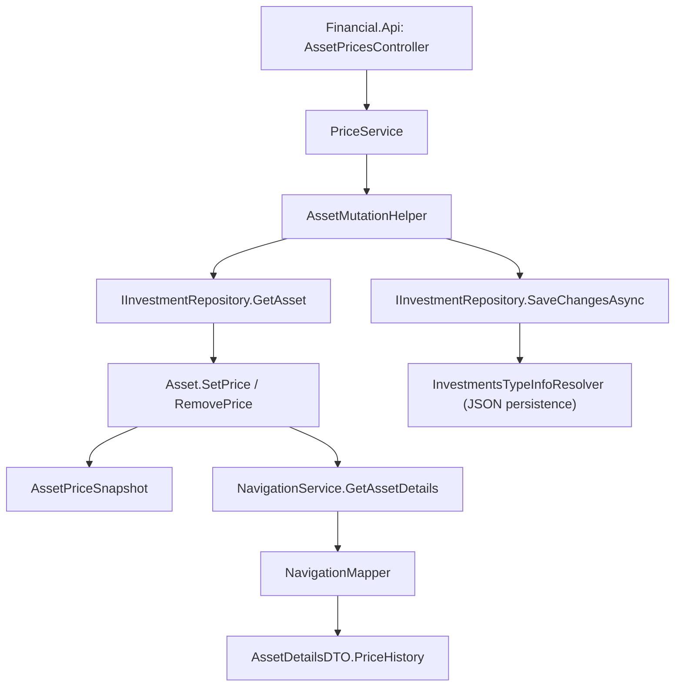

## 1. Technical Overview

**What:** Add a per-asset, per-calendar-day price history to the Investment bounded context: a new `AssetPriceSnapshot` value held on `Asset`, upserted by date (manual or automatic source), plus the Application-layer service and API endpoint to record, delete, and read it. This is the backend capability F02 (Price History Tab & Chart) and F03 (Current-Value/XIRR Fallback) build on in Wave 2.

**Why:** `XirrCalculationService`/`ProfitCalculator` already accept an arbitrary terminal value from the caller — nothing in the domain math requires a live-fetched price. The only gap is that there's no persisted place to put a price when the automated fetch fails (e.g. Brazilian OTC funds with no `Exchange`), and no record of what price was actually used on a given day. This feature closes both gaps with one data model.

**Scope:**
- Included: `AssetPriceSnapshot` domain type; `Asset.PriceHistory` collection with upsert-by-date `SetPrice`, `GetPriceForDate`, `RemovePrice`; JSON persistence wiring; an Application service (`IPriceService`) to set/delete a price by asset key + date; exposing `PriceHistory` on `AssetDetailsDTO`; API endpoints to set/delete a price.
- Excluded (belongs to F02/F03): the WPF/Web Price History tab UI, the chart, the "Add Price" dialog, and wiring the fallback into `AssetDetailsViewModel.FetchRowPricesAsync`/`TodayInfoTracker`. Those consume this feature's API/data once it exists.

## 2. Architecture Impact

**Affected components:**
- `Financial.Investment.Domain/Entities/AssetPriceSnapshot.cs` (new)
- `Financial.Investment.Domain/Entities/Asset.cs` (modified — new collection + methods)
- `Financial.Investment.Infrastructure/Persistence/InvestmentsTypeInfoResolver.cs` (modified — register the new type for JSON reflection)
- `Financial.Investment.Application/DTOs/AssetPriceDTOs.cs` (new — request/response DTOs)
- `Financial.Investment.Application/Interfaces/IPriceService.cs` (new)
- `Financial.Investment.Application/Services/PriceService.cs` (new)
- `Financial.Investment.Application/DTOs/AssetDetailsDTO.cs` (modified — expose `PriceHistory`)
- `Financial.Investment.Application/Services/NavigationMapper.cs` (modified — map `Asset.PriceHistory` onto `AssetDetailsDTO`)
- `Financial.Api/Controllers/AssetPricesController.cs` (modified — add `PUT`/`DELETE`, alongside the existing `GET /prices/current`)



## 3. Technical Decisions

| Decision | Chosen Approach | Alternative Considered | Trade-off |
|----------|-----------------|-------------------------|-----------|
| Where the upsert/lookup capability lives | New `IPriceService`/`PriceService`, mirroring `ICreditService`/`CreditService` exactly (same `AssetMutationHelper.ExecuteAssetMutationAsync` plumbing) | Add the methods onto an existing service (e.g. `CreditService`) | A dedicated service keeps single responsibility and matches the existing one-service-per-child-collection convention (Credit, Transaction each have their own) |
| DTO file layout | One file, `AssetPriceDTOs.cs`, holding `SetAssetPriceDTO`, `DeleteAssetPriceDTO`, `AssetPriceDTO` as small records | One file per DTO, matching `CreditCreateDTO.cs`/`CreditUpdateDTO.cs`/`CreditDeleteDTO.cs`/`CreditDTO.cs` (4 files) | Consolidating keeps this PR's file count low per the approved plan's ≤6-files-per-PR constraint; each record is 2-4 lines, so one file stays readable. Documented here as a deliberate deviation from the one-file-per-DTO convention. |
| API endpoint placement | Extend the existing `AssetPricesController` (route `prices`) with `PUT`/`DELETE`, alongside its existing `GET /prices/current` | New controller (e.g. `AssetPriceHistoryController`) | Avoids a near-duplicate controller name/concept; the existing controller already owns "asset price" as ​a concept, just previously read-only from an external source |
| Identity of `AssetPriceSnapshot` | No `Guid Id` — keyed purely by `Date` within an asset's `PriceHistory`, upsert replaces by date | Give it a `Guid Id` like `Credit`/`Transaction` | `Credit`/`Transaction` need an Id because multiple can share a date; `AssetPriceSnapshot` is capped at one per date by design, so `Date` is already a sufficient natural key — an Id would be redundant |
| `Update`/full replace on same date | `SetPrice(date, price, isManual)` always replaces (no separate "must not already exist" create path) | Separate `AddPrice`/`UpdatePrice` methods like `Credit` | Matches the PRD's explicit upsert rule ("setting a value for a date that already has an entry replaces it") — a single method is simpler and there's no scenario where create-vs-update needs to be distinguished by the caller |

## 4. Component Overview

**Domain:**

| File Path | New/Modified | Purpose | Key Responsibilities |
|-----------|--------------|---------|------------------------|
| `Financial.Investment.Domain/Entities/AssetPriceSnapshot.cs` | New | Represents one day's price for an asset | Holds `Date`, `Price`, `IsManual`; `Create` factory validates `Price > 0` and `Date` not in the future |
| `Financial.Investment.Domain/Entities/Asset.cs` | Modified | Owns the per-asset price history | Adds `PriceHistory` (`IReadOnlyCollection<AssetPriceSnapshot>`, private-set backed by `_priceHistory` list, mirroring `Credits`'s `SetCredits`/`AddCredit` shape); `SetPrice(DateOnly, decimal, bool)` upserts by date; `GetPriceForDate(DateOnly)` exact-match lookup; `RemovePrice(DateOnly)` deletes a manual entry only (throws/no-ops per spec Section 7 if the entry is automatic) |

**Infrastructure:**

| File Path | New/Modified | Purpose | Key Responsibilities |
|-----------|--------------|---------|------------------------|
| `Financial.Investment.Infrastructure/Persistence/InvestmentsTypeInfoResolver.cs` | Modified | JSON (de)serialization contract | Add `typeof(AssetPriceSnapshot)` to `ManagedTypes` so its private constructor and setters are reflection-wired, matching `Credit`/`Transaction`. No new converter class needed — `Asset.PriceHistory`, once `Asset` re-serializes, is picked up automatically by the existing per-property loop. |

**Application:**

| File Path | New/Modified | Purpose | Key Responsibilities |
|-----------|--------------|---------|------------------------|
| `Financial.Investment.Application/DTOs/AssetPriceDTOs.cs` | New | Request/response shapes | `SetAssetPriceDTO` (BrokerName, PortfolioName, AssetName, Date, Price), `DeleteAssetPriceDTO` (BrokerName, PortfolioName, AssetName, Date), `AssetPriceDTO` (Date, Price, IsManual) |
| `Financial.Investment.Application/Interfaces/IPriceService.cs` | New | Service contract | `Task<AssetDetailsDTO?> SetPriceAsync(SetAssetPriceDTO)`, `Task<AssetDetailsDTO?> DeletePriceAsync(DeleteAssetPriceDTO)` — same return shape as `ICreditService` |
| `Financial.Investment.Application/Services/PriceService.cs` | New | Orchestrates the mutation | Delegates to `AssetMutationHelper.ExecuteAssetMutationAsync`, calling `asset.SetPrice(...)`/`asset.RemovePrice(...)` inside the mutation lambda, exactly like `CreditService.AddCreditAsync`/`DeleteCreditAsync` |
| `Financial.Investment.Application/DTOs/AssetDetailsDTO.cs` | Modified | Read model | Add `List<AssetPriceDTO> PriceHistory { get; set; } = new();`, alongside the existing `Credits`/`Transactions` lists |
| `Financial.Investment.Application/Services/NavigationMapper.cs` | Modified | Maps domain → DTO | Add a `MapPriceEntry(AssetPriceSnapshot)` mapping function and populate `AssetDetailsDTO.PriceHistory` from `asset.PriceHistory`, ordered newest-first, mirroring how `Credits`/`Transactions` are already mapped |

**API:**

| File Path | New/Modified | Purpose | Key Responsibilities |
|-----------|--------------|---------|------------------------|
| `Financial.Api/Controllers/AssetPricesController.cs` | Modified | HTTP surface | Add `PUT /prices/{brokerName}/{portfolioName}/{assetName}/{date}` and `DELETE /prices/{brokerName}/{portfolioName}/{assetName}/{date}`, following the same route-parameter + `ActionResult<AssetDetailsDTO>` shape as `InvestmentSnapshotsController.UpdateSnapshotValue` |

## 5. API Contracts

**Endpoint: Set Asset Price**
- **Method:** PUT
- **Path:** `/prices/{brokerName}/{portfolioName}/{assetName}/{date}`
- **Authentication:** None (matches this app's existing single-user, unauthenticated API surface)

**Request:**

| Field | Type | Required | Validation | Description |
|-------|------|----------|------------|--------------|
| `brokerName` (route) | `string` | Yes | non-empty | Identifies the asset's broker |
| `portfolioName` (route) | `string` | Yes | non-empty | Identifies the asset's portfolio |
| `assetName` (route) | `string` | Yes | non-empty | Identifies the asset |
| `date` (route) | `date` (`yyyy-MM-dd`) | Yes | not in the future | The calendar day this price applies to |
| `price` (body) | `decimal` | Yes | `> 0` | The price to record for that day |

**Request Example:**
```json
{
  "price": 1234.56
}
```

**Response (Success - 200):** `AssetDetailsDTO`, same shape already returned by `GET /assets/{brokerName}/{portfolioName}/{assetName}`, now including the updated `priceHistory` array.

**Response Example (excerpt):**
```json
{
  "assetName": "Guepardo Institucional FIC FIA",
  "priceHistory": [
    { "date": "2026-08-15", "price": 1234.56, "isManual": true },
    { "date": "2026-08-14", "price": 1230.00, "isManual": false }
  ]
}
```

**Error Codes:**

| Code | HTTP Status | Description |
|------|-------------|--------------|
| — | 400 | `price <= 0`, or `date` is in the future |
| — | 404 | No asset matches `brokerName`/`portfolioName`/`assetName` |

**Endpoint: Delete Asset Price**
- **Method:** DELETE
- **Path:** `/prices/{brokerName}/{portfolioName}/{assetName}/{date}`
- **Authentication:** None

**Request:** route parameters only (same four as above, no body).

**Response (Success - 200):** `AssetDetailsDTO`, reflecting the entry's removal.

**Error Codes:**

| Code | HTTP Status | Description |
|------|-------------|--------------|
| — | 400 | The entry for that date is automatic (not user-deletable) |
| — | 404 | No asset matches the route, or no entry exists for that date (idempotent no-op still returns 200 per PRD F01's Error Handling — deleting a non-existent entry is a no-op, not an error) |

## 6. Data Model

This app persists each bounded context as a single JSON document (no relational database) — `Asset` is a node inside `data-investment.json`, loaded once at process startup. `AssetPriceSnapshot` is a plain nested object, not a separate table.

**Entity: `AssetPriceSnapshot`** (nested under `Asset.PriceHistory`)

| Field | Type | Nullable | Default | Description |
|-------|------|----------|---------|--------------|
| `Date` | `DateOnly` | No | — | Calendar day this price applies to; unique within one asset's `PriceHistory` |
| `Price` | `decimal` | No | — | Must be `> 0` |
| `IsManual` | `bool` | No | — | `true` if user-entered, `false` if recorded from a successful automatic fetch |

**Constraints (enforced in `Asset.SetPrice`, not by the JSON layer):**
- At most one `AssetPriceSnapshot` per `Date` per `Asset` — `SetPrice` replaces any existing entry for that date rather than appending.
- `RemovePrice(date)` only removes an entry where `IsManual == true`; calling it on a `Date` with no entry, or with an automatic entry, is a no-op (Domain method returns `false`/no-ops rather than throwing, so the Application layer can translate "no entry" into a 200 no-op and "automatic entry" into a 400, per Section 5).

**Persistence notes:**
- No migration needed — `InvestmentsTypeInfoResolver` reflection-wires the new type generically (see Section 4); existing `data-investment.json` files simply gain an empty `priceHistory: []` array on `Asset` the next time they're written, and read as empty when absent on load (standard `System.Text.Json` missing-array-defaults-to-null-then-treated-as-empty behavior — verify in Phase 2's test that a pre-existing asset with no `priceHistory` property in the JSON loads without error).

## 7. Testing Strategy

| Test File | Test Type | Target | Coverage Goal |
|-----------|-----------|--------|----------------|
| `Tests/Financial.Investment.Domain.Tests/Domain/AssetPriceSnapshotTests.cs` | Unit | `AssetPriceSnapshot.Create` | Validation rules |
| `Tests/Financial.Investment.Domain.Tests/Domain/AssetTests.cs` | Unit | `Asset.SetPrice`/`GetPriceForDate`/`RemovePrice` | Upsert semantics, exact-date lookup, manual-only deletion |
| `Tests/Financial.Investment.Infrastructure.Tests/Persistence/InvestmentsTypeInfoResolverTests.cs` | Unit/Integration | JSON round-trip of `Asset.PriceHistory` | Serialize then deserialize an asset with price history entries; also a legacy-JSON case (no `priceHistory` property at all) loads as an empty collection |
| `Tests/Financial.Investment.Infrastructure.Tests/Services/PriceServiceTests.cs` | Integration | `PriceService.SetPriceAsync`/`DeletePriceAsync` | Mirrors `CreditServiceTests.cs`'s structure: successful set, successful delete, asset-not-found, invalid price, future date, deleting an automatic entry, deleting a non-existent entry |
| `Tests/Financial.Api.Tests/AssetPriceEndpointsTests.cs` | Integration (existing file, extended) | `PUT`/`DELETE /prices/{...}` | 200 success (both), 400 on invalid price/future date, 400 on deleting an automatic entry, 404 on unknown asset |

**For `AssetPriceSnapshotTests.cs`:**

| Test Function | Description | Assertions |
|----------------|--------------|-------------|
| `Create_WithPositivePrice_Succeeds` | Valid creation | Entry's `Price`/`Date`/`IsManual` match input |
| `Create_WithZeroOrNegativePrice_Throws` | Price ≤ 0 | Throws with message "Price must be greater than zero." |
| `Create_WithFutureDate_Throws` | Date after today | Throws with message "Price date cannot be in the future." |

**For `AssetTests.cs` (new cases added to the existing file):**

| Test Function | Description | Assertions |
|----------------|--------------|-------------|
| `SetPrice_NewDate_AddsEntry` | First entry for a date | `PriceHistory` contains it; `GetPriceForDate` returns it |
| `SetPrice_ExistingDate_ReplacesEntry` | Same date set twice | `PriceHistory` still has exactly one entry for that date, with the latest price |
| `SetPrice_AutomaticThenManualSameDate_ManualWins` | Auto entry, then manual entry, same date | Final entry's `IsManual == true` and reflects the manual price |
| `GetPriceForDate_NoEntry_ReturnsNull` | No entry recorded for the date | Returns `null`, does not fall back to another date |
| `RemovePrice_ManualEntry_Removes` | Delete a manual entry | `GetPriceForDate` returns `null` afterward |
| `RemovePrice_AutomaticEntry_NoOp` | Attempt to delete an automatic entry | Entry still present afterward (method signals it didn't remove it) |
