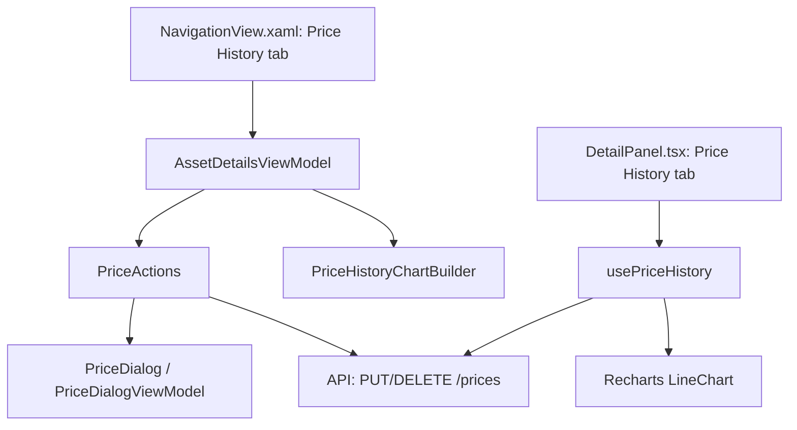

## 1. Technical Overview

**What:** Add a "Price History" tab to the asset details view in both WPF and Web, alongside the existing Credits and Transactions tabs — a list of recorded price entries (date, price, Manual/Auto badge, newest first), a line chart with a period filter, and an add/edit entry point that calls F01's now-merged `PUT`/`DELETE /prices` endpoints.

**Why:** F01 (merged) built the recording/persistence/API capability but has no UI — the user can't actually view or manually set a price yet. This is the human entry point the PRD's Problem section calls out as the fix for the "no manual override path" pain.

**Scope:**
- Included: WPF Price History tab (list, chart, add/edit/delete dialog); Web Price History tab (list, chart, inline add/edit form); wiring both to F01's existing `AssetDetailsDTO.PriceHistory` (read) and `PUT`/`DELETE /prices` (write).
- Excluded: any change to F01's backend, and F03's current-value/XIRR fallback wiring (separate feature, separate PR).

## 2. Architecture Impact

**Affected components — WPF:**
- `Financial.App/ViewModels/Investment/PriceActions.cs` (new) — Add/Update/Delete orchestration, mirrors `CreditActions.cs`
- `Financial.App/ViewModels/Investment/PriceHistoryChartBuilder.cs` (new) — builds a single-series line `PlotModel` from `PriceHistory`, mirrors `CreditsChartBuilder.cs` but simplified (no type/stacking dimension)
- `Financial.App/ViewModels/Investment/PriceHistoryViewState.cs` (new) — per-asset-context cached period filter selection, mirrors `CreditsViewState.cs` but simplified (no chart-type/mode fields, since there's only one series)
- `Financial.App/ViewModels/Investment/AssetDetailsViewModel.cs` (modified) — new `PriceHistory`-related properties/commands, `_priceHistoryViewStateByKey` dictionary, wiring to `PriceActions`
- `Financial.App/PriceDialog.xaml` + `.xaml.cs` (new) — modal dialog for add/edit/delete confirmation, mirrors `CreditDialog.xaml`
- `Financial.App/ViewModels/Investment/PriceDialogViewModel.cs` (new) — dialog state/validation, mirrors `CreditDialogViewModel.cs`
- `Financial.App/Components/NavigationView.xaml` (modified) — new `<TabItem Header="Price History">` after the existing Credits tab (line ~1422)

**Affected components — Web:**
- `Financial.Web/src/components/PriceHistoryTab.tsx` (new) — mirrors `CreditsTab.tsx`, simplified (no type/stacking dimension, single `Line` series)
- `Financial.Web/src/components/PriceHistoryTab.css` (new)
- `Financial.Web/src/hooks/usePriceHistory.ts` (new) — mirrors `useCredits.ts`
- `Financial.Web/src/components/DetailPanel.tsx` (modified) — add `'priceHistory'` to `TabId`, a `TABS` entry, and a render branch
- `Financial.Web/src/api/types.ts` (modified) — add `PriceSnapshotDto` type
- `Financial.Web/src/api/financialApiClient.ts` (modified) — add `setAssetPrice`/`deleteAssetPrice` calls to `PUT`/`DELETE /prices`

## 3. Technical Decisions

| Decision | Chosen Approach | Alternative Considered | Trade-off |
|----------|-----------------|-------------------------|-----------|
| Chart shape | Single-series line chart (price over time), no type/stacking dimension | Mirror Credits' full Bar/Line + Stacked/Grouped combinatorial chart-mode selector | Price History has no categorical dimension analogous to Credit's Dividend/Rent split — there's exactly one price per date. A chart-mode selector would be UI complexity with nothing to select between; simplification is deliberate, not a missing feature. |
| WPF add/edit entry point | Modal `PriceDialog`, mirroring `CreditDialog` | Inline form like Web's `CreditsTab` | WPF's existing convention for this exact interaction (asset child-collection add/edit) is a modal dialog (`TransactionDialog`, `CreditDialog`); Web's convention is an inline form (`CreditsTab`'s `InlineForm`). Each platform follows its own established pattern rather than cross-pollinating. |
| Manual vs. automatic distinction in the list | A text/icon badge column, no separate visual treatment (e.g., no row-dimming) | Distinct row background color for automatic entries | Keeps the list visually consistent with Credits/Transactions row styling; a badge alone is sufficient to convey the distinction per PRD F01/F02 capabilities, and automatic entries are the common case (an app that fetches most assets automatically), so they shouldn't look "different" in a way that reads as an error state. |
| Delete confirmation | Reuse `PriceDialog` in a delete-confirmation mode, mirroring `CreditDialogViewModel.CreateForDelete` | A separate lightweight confirm popup | Matches the existing `Add`/`Update`/`Delete` dialog-mode pattern already used for Credits/Transactions — one dialog class, three creation modes, rather than a new UI primitive. |

## 4. Component Overview

**WPF:**

| File Path | New/Modified | Purpose | Key Responsibilities |
|-----------|--------------|---------|------------------------|
| `Financial.App/ViewModels/Investment/PriceActions.cs` | New | Orchestrates add/update/delete | `Add`/`Update`/`Delete` methods calling `IPriceService`-backed API client, opening `PriceDialog` for input, mirrors `CreditActions.Add/Update/Delete` |
| `Financial.App/ViewModels/Investment/PriceHistoryChartBuilder.cs` | New | Builds the chart model | `Build(entries, periodFilter)` → OxyPlot `PlotModel` with one `LineSeries`, points colored/marked by `IsManual` |
| `Financial.App/ViewModels/Investment/PriceHistoryViewState.cs` | New | Per-context cached UI state | Holds the selected `PeriodFilter` per asset context key, mirrors `CreditsViewState` (record with just the one field) |
| `Financial.App/ViewModels/Investment/AssetDetailsViewModel.cs` | Modified | Hosts Price History tab state | `PriceHistory` (from `AssetDetails.PriceHistory`), `SelectedPriceHistoryFilter`, `PriceHistoryPlotModel`, `SelectedPriceEntry`, `AddPriceCommand`/`EditPriceCommand`/`DeletePriceCommand`, `_priceHistoryViewStateByKey` dictionary — same context-save/restore pattern already used for Credits |
| `Financial.App/PriceDialog.xaml` / `.xaml.cs` | New | Modal add/edit/delete dialog | Date picker (any date, not just today) + price input; delete mode shows a confirmation message instead of inputs, mirrors `CreditDialog` |
| `Financial.App/ViewModels/Investment/PriceDialogViewModel.cs` | New | Dialog state/validation | `CreateForAdd`/`CreateForUpdate`/`CreateForDelete` factories, validates price > 0 and date not in the future client-side (mirroring F01's domain rules, so the user gets instant feedback before the API round-trip) |
| `Financial.App/Components/NavigationView.xaml` | Modified | Hosts the new tab | `<TabItem Header="Price History">` after the Credits tab, containing a list (`DataGrid` or similar, matching Credits' list styling) + embedded chart control |

**Web:**

| File Path | New/Modified | Purpose | Key Responsibilities |
|-----------|--------------|---------|------------------------|
| `Financial.Web/src/hooks/usePriceHistory.ts` | New | State + data derivation | Loads `PriceHistory` from asset details, period-filters it, builds chart data, manages inline-form state (mirrors `useCredits.ts`'s shape: `entries`, `chartData`, `isLoading`, `error`, `selectedFilter`, form fields, `saveForm`/`deleteEntry`) |
| `Financial.Web/src/components/PriceHistoryTab.tsx` | New | Tab UI | List (date, price, Manual/Auto badge, Edit/Delete only on manual rows) + `SplitPanel` layout + single-series `LineChart` + period filter buttons, mirrors `CreditsTab.tsx` minus the type/stacking controls |
| `Financial.Web/src/components/PriceHistoryTab.css` | New | Styling | Mirrors `CreditsTab.css` class shapes (`price-history-tab__*`) |
| `Financial.Web/src/components/DetailPanel.tsx` | Modified | Tab container | Adds `'priceHistory'` to `TabId`, a `{ id: 'priceHistory', label: 'Price History' }` entry to `TABS`, and a render branch `{activeTab === 'priceHistory' && <PriceHistoryTab />}` |
| `Financial.Web/src/api/types.ts` | Modified | Type contract | `PriceSnapshotDto { date: string; price: number; isManual: boolean }`, matching F01's `AssetPriceSnapshotDTO` JSON shape |
| `Financial.Web/src/api/financialApiClient.ts` | Modified | API calls | `setAssetPrice(request)` → `PUT /prices`, `deleteAssetPrice(request)` → `DELETE /prices`, both with broker/portfolio/asset/date (+ price for set) in the body, matching F01's actual merged contract |

## 5. API Contracts

No new endpoints — this feature consumes F01's already-merged `PUT`/`DELETE /prices` (see `docs/prd/P32-prd-investment-price-history/features/P32-F01-price-history-recording/spec.md` Section 5 for the exact contract: broker/portfolio/asset/date + price in the request body, `AssetDetailsDTO` response, 400 on invalid input/unknown asset/automatic-entry-delete).

Read access uses the existing `GET /assets/{brokerName}/{portfolioName}/{assetName}` endpoint (`AssetsController.GetAssetDetails`), whose response now includes `priceHistory` (added in F01's last PR).

## 6. Data Model

No new persisted data — this feature is UI-only, consuming F01's existing `AssetPriceSnapshot`/`Asset.PriceHistory`.

## 7. Testing Strategy

| Test File | Test Type | Target | Coverage Goal |
|-----------|-----------|--------|----------------|
| `Tests/Financial.Presentation.Tests/ViewModels/PriceActionsTests.cs` | Unit (hand-written stub API client) | `PriceActions.Add/Update/Delete` | Mirrors `CreditActionsTests.cs` |
| `Tests/Financial.Presentation.Tests/ViewModels/PriceHistoryChartBuilderTests.cs` | Unit | `PriceHistoryChartBuilder.Build` | Empty history, single entry, period-filter boundary (entry just inside/outside the window); mirrors `CreditsChartBuilderTests.cs` |
| `Tests/Financial.Presentation.Tests/ViewModels/PriceDialogValidationTests.cs` | Unit | Validation | Price ≤ 0 and future-date rejected client-side before any API call, mirroring F01's domain rules; mirrors `CreditDialogValidationTests.cs` |
| `Tests/Financial.Presentation.Tests/ViewModels/PriceDialogViewModelTests.cs` | Unit | Dialog state | `CreateForAdd`/`CreateForUpdate`/`CreateForDelete` factory behavior, mirrors `CreditDialogViewModelTests.cs` |
| `Tests/Financial.Presentation.Tests/ViewModels/AssetDetailsViewModelPriceHistoryChartTests.cs` | Unit | ViewModel wiring | Filter selection persists per asset context, chart model updates on filter change, mirrors `AssetDetailsViewModelCreditsChartTests.cs` |
| `Financial.Web/src/hooks/usePriceHistory.test.ts` | Hook (`renderHook`) | `usePriceHistory` | Loading/error states, period-filter branching, save/delete against a mocked API client |
| `Financial.Web/src/components/__tests__/PriceHistoryTab.test.tsx` | Component (RTL) | `PriceHistoryTab` | Renders list newest-first, Edit/Delete only shown for manual rows, chart renders given mock data |

**Acceptance criteria mapped (PRD Section 9, F02):**
- Tab presence/position, list contents/ordering, chart default/filter behavior, add dialog defaulting to today but allowing any date, Edit/Delete restricted to manual entries, inline validation message on invalid submission — all covered by the WPF/Web test files above plus a manual run through both front ends (this feature has no meaningful E2E/API-layer coverage of its own, since it consumes an already-tested API).
