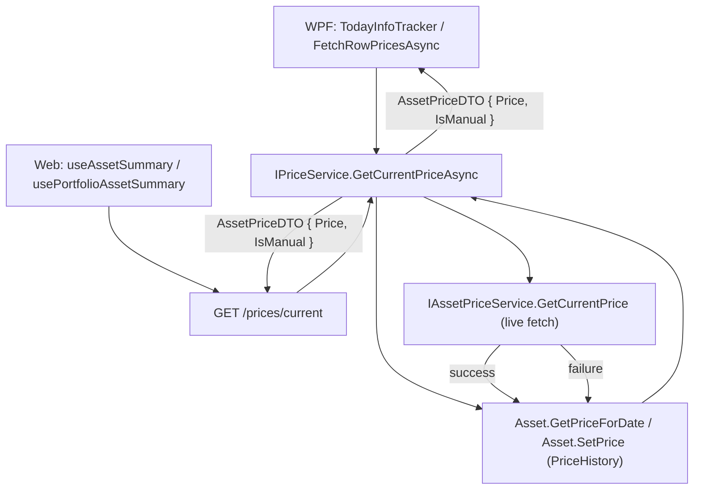

## 1. Technical Overview

**What:** Wires the already-built Price History system (`Asset.PriceHistory` / `Asset.SetPrice` / `Asset.GetPriceForDate`, `AssetPriceSnapshotDTO`, the Price History tab from F02) into the existing current-value/profit/XIRR pipeline, so that an asset with no live price for today falls back to today's recorded PriceHistory entry instead of showing "—", and a successful live fetch is itself recorded into PriceHistory as an automatic entry.

**Why:** Today, `IAssetPriceService.GetCurrentPrice` either returns a live price or throws; every consumer (WPF's `TodayInfoTracker`, WPF's portfolio-row fetch in `AssetDetailsViewModel.FetchRowPricesAsync`, Web's `useAssetSummary`, Web's `usePortfolioAssetSummary`) treats a thrown exception as "no price available" and displays "—". None of the four consumers has any path to a manually-entered price. Rather than duplicate a "try live fetch, else look up PriceHistory, else give up" decision in four separate call sites (two WPF, two Web/TS), this feature centralizes the fallback-and-record logic in one new Application-layer orchestration method that all four already-existing call sites route through. This keeps the decision in one place, automatically extends the existing "row fetch failed → excluded from portfolio total" footer logic to include manually-priced assets (once the endpoint stops throwing for them, the existing footer math already sums every non-failed row), and reuses `AssetPriceSnapshotDTO.IsManual`'s existing badge convention (WPF `DataTrigger`, Web `.price-history-tab__source--manual` / `#e65100`) rather than inventing a new one.

**Scope:**
- **Included:** a new `IPriceService.GetCurrentPriceAsync` orchestration (fetch → record-on-success / fallback-to-history-on-failure); `AssetPriceDTO`/`AssetPriceRequestDTO` gain the fields needed to carry a manual flag and (optionally) resolve the asset's PriceHistory; the `GET /prices/current` endpoint routes through the new method; all four existing "give me the current price for this asset" call sites (WPF single-asset, WPF portfolio-row, Web single-asset, Web portfolio-row) pass the asset's Portfolio/Asset identity and display a "Manual" badge when the returned price came from a manual PriceHistory entry.
- **Excluded (unchanged, zero files touched):** `Financial.App/ViewModels/Investment/AssetPriceFetchViewModel.cs` (WPF's batch "fetch all configured portfolios" diagnostic tool) and `Financial.Web/src/pages/CurrentValuesPage.tsx` (its Web equivalent). Both call `GetCurrentPrice`/`getCurrentPrice` without ever displaying a computed current-value/XIRR figure tied to one asset's detail/summary view — they're diagnostic listings of raw fetched prices, out of scope per the PRD's Experience section ("On the portfolio and asset-details views..."). Because the new Portfolio/Asset identity parameters are optional (see Section 3), these two callers keep compiling and behaving exactly as today without any change.
- **Excluded (per PRD Out of Scope):** aggregate/portfolio-wide charting, retroactive backfill import, editing/deleting automatic entries directly, currency conversion, stale-price alerts, bulk/CSV import — all unaffected by F03.

## 2. Architecture Impact

**Affected components:**
- `Financial.Investment.Application/DTOs/AssetPriceDTO.cs` — add `IsManual`.
- `Financial.Investment.Application/DTOs/AssetPriceRequestDTO.cs` — add optional `PortfolioName`/`AssetName`.
- `Financial.Investment.Application/Interfaces/IPriceService.cs` — add `GetCurrentPriceAsync`.
- `Financial.Investment.Application/Services/PriceService.cs` — implement the fetch/fallback/record orchestration; gains a new `IAssetPriceService` dependency.
- `Financial.Api/Controllers/AssetPricesController.cs` — `GetCurrentPrice` becomes async and routes through `IPriceService` instead of `IAssetPriceService` directly; gains `portfolioName`/`assetName` query parameters.
- `Financial.App/ViewModels/Investment/TodayInfoTracker.cs` — `RefreshAsync` calls `IPriceService.GetCurrentPriceAsync` instead of `IAssetPriceService.GetCurrentPrice`; `TodayInfoSnapshot` gains `IsManual`.
- `Financial.App/ViewModels/Investment/AssetDetailsViewModel.cs` — passes Portfolio/Asset identity into `TodayInfoTracker.RefreshAsync` and `FetchRowPricesAsync`; exposes `TodayCurrentValueIsManual`; `ApplyTodayInfo` reads the new flag.
- `Financial.App/ViewModels/Investment/PortfolioAssetSummaryRowViewModel.cs` — `ApplyPrice` gains an `isManual` parameter; exposes `IsManual`/`CurrentValueIsManual`.
- `Financial.App/Components/NavigationView.xaml` — a "Manual" badge next to the single-asset Current Value display and next to the portfolio-row current value/price cell, reusing the existing `IsManual`-driven `DataTrigger` pattern from the Price History tab.
- `Financial.Web/src/api/types.ts` — `AssetPriceDto` gains `isManual`.
- `Financial.Web/src/api/financialApiClient.ts` — `getCurrentPrice` gains optional `portfolioName`/`assetName` parameters.
- `Financial.Web/src/hooks/useAssetSummary.ts` — threads Portfolio/Asset identity into `fetchPrice`/`refresh`; surfaces `priceIsManual`.
- `Financial.Web/src/components/AssetSummaryTab.tsx` — "Manual" badge next to the current-value section.
- `Financial.Web/src/hooks/usePortfolioAssetSummary.ts` — `RowPriceState` gains `isManual`; passes item's Portfolio/Asset identity into the per-row fetch.
- `Financial.Web/src/components/PortfolioSummaryTab.tsx` — "Manual" badge next to `AssetRow`'s current value/price cell.



## 3. Technical Decisions

| Decision | Chosen Approach | Alternative Considered | Trade-off |
|----------|------------------|-------------------------|-----------|
| Where the fallback/record logic lives | One new Application-layer method, `IPriceService.GetCurrentPriceAsync`, wrapping `IAssetPriceService.GetCurrentPrice` | Duplicate the "try live, else check PriceHistory" decision in each of the 4 call sites (2 WPF, 2 Web) | Slightly changes `AssetPricesController`'s dependency (now goes through `IPriceService`), but eliminates 3x logic duplication and makes portfolio-total inclusion (PRD AC) happen for free, since the endpoint simply stops throwing for manually-priced assets |
| Identity parameters are optional, not required | `AssetPriceRequestDTO.PortfolioName`/`AssetName` are nullable; when either is missing, `GetCurrentPriceAsync` skips history lookup entirely and delegates straight to `IAssetPriceService.GetCurrentPrice`, preserving today's exact behavior | Make them required and update every caller, including the two diagnostic/batch tools | Keeps `AssetPriceFetchViewModel.cs` and `CurrentValuesPage.tsx` untouched (0 files) at the cost of one extra null-check branch in `PriceService.GetCurrentPriceAsync` |
| Auto-record write frequency | Only call `Asset.SetPrice`/`SaveChangesAsync` when today's entry is missing, is currently manual (an automatic fetch success overwrites it, per F01's "last write always wins" rule), or its price differs from the freshly-fetched price. Skip the write when today's entry is already automatic with the same price. | Always write on every successful fetch | Avoids a full JSON-file repository save on every portfolio load for assets whose price hasn't changed since the last check — relevant given this project's storage providers (esp. Google Drive) already re-upload the whole file on every save |
| Manual-flag DTO shape | `AssetPriceDTO.IsManual: bool`, mirroring `AssetPriceSnapshotDTO.IsManual` already used by the F02 Price History tab | `Source: "Live" \| "Automatic" \| "Manual"` string enum | Simpler, consistent with the existing DTO; the PRD only ever needs a binary "was this a manual entry" badge, never a 3-way distinction |
| `AsOf` for a history-sourced price | `null` (the `AssetPriceSnapshot` only stores a `DateOnly`, not a precise timestamp) | Synthesize a timestamp (e.g. midnight of that date) | `null` is honest about what's actually known; existing WPF/Web code already null-guards `AsOf` (`price.AsOf?.ToLocalTime()...`), so no new null-handling is needed |
| `Exchange`/`Ticker`/`Name` on a history-sourced `AssetPriceDTO` | Echo back the request's `Exchange`/`Ticker`/`Name` unchanged | Look them up fresh from the `Asset` entity | These fields are purely informational passthrough already sourced from the request on the live-fetch path too; no behavior depends on them differing |

## 4. Component Overview

**Backend (Application/API):**

| File Path | New/Modified | Purpose | Key Responsibilities |
|-----------|--------------|---------|----------------------|
| `Financial.Investment.Application/DTOs/AssetPriceDTO.cs` | Modified | Carry the manual-flag to callers | Add `IsManual: bool` |
| `Financial.Investment.Application/DTOs/AssetPriceRequestDTO.cs` | Modified | Carry optional domain identity for PriceHistory lookup | Add `PortfolioName: string?`, `AssetName: string?` |
| `Financial.Investment.Application/Interfaces/IPriceService.cs` | Modified | Expose the new orchestration | Add `Task<AssetPriceDTO> GetCurrentPriceAsync(AssetPriceRequestDTO request)` |
| `Financial.Investment.Application/Services/PriceService.cs` | Modified | Implement fetch/fallback/record | Inject `IAssetPriceService`; try live fetch, record on success (skipping redundant writes), fall back to `Asset.GetPriceForDate(today)` on failure, rethrow when neither is available |
| `Tests/Financial.Investment.Application.Tests/Services/PriceServiceTests.cs` | Modified | Cover the new method | Success-records, success-skips-redundant-write, success-overwrites-stale-manual, failure-falls-back-to-manual, failure-falls-back-to-automatic, failure-with-no-history-rethrows, missing-identity-skips-history |
| `Financial.Api/Controllers/AssetPricesController.cs` | Modified | Route the endpoint through the new orchestration | `GetCurrentPrice` becomes `async Task<ActionResult<AssetPriceDTO>>`, adds `portfolioName`/`assetName` query params, calls `_priceService.GetCurrentPriceAsync`; drops the now-unused direct `IAssetPriceService` dependency |
| `Tests/Financial.Api.Tests/Controllers/AssetPricesControllerTests.cs` (or equivalent E2E file) | Modified | Cover the endpoint's new fallback behavior end-to-end | Fallback-to-manual returns 200 with `isManual:true`, no-history-and-fetch-fails still returns whatever error status it does today |

**WPF (single-asset):**

| File Path | New/Modified | Purpose | Key Responsibilities |
|-----------|--------------|---------|----------------------|
| `Financial.App/ViewModels/Investment/TodayInfoTracker.cs` | Modified | Use the new orchestration for the single-asset "Current Value" panel | `RefreshAsync` takes `IPriceService` (replacing/alongside `IAssetPriceService`) plus `portfolioName`/`assetName`; `TodayInfoSnapshot` gains `IsManual` |
| `Financial.App/ViewModels/Investment/AssetDetailsViewModel.cs` | Modified | Thread identity through and expose the badge flag | Passes `PortfolioName`/`AssetName` into `TodayInfoTracker.RefreshAsync`; `ApplyTodayInfo` sets `TodayCurrentValueIsManual`; `FetchRowPricesAsync` passes `portfolioName` (see next table) |
| `Financial.App/Components/NavigationView.xaml` | Modified | Show the badge | "Manual" badge/text next to the single-asset Current Value row, visible when `TodayCurrentValueIsManual` is true |
| `Tests/Financial.Presentation.Tests/ViewModels/AssetDetailsViewModelTests.cs` (or equivalent) | Modified | Cover the badge wiring | `ApplyTodayInfo` sets `TodayCurrentValueIsManual` correctly from a manual vs. non-manual snapshot |

**WPF (portfolio-row):**

| File Path | New/Modified | Purpose | Key Responsibilities |
|-----------|--------------|---------|----------------------|
| `Financial.App/ViewModels/Investment/PortfolioAssetSummaryRowViewModel.cs` | Modified | Track and expose the manual flag per row | `ApplyPrice(decimal price, bool isManual)`; new `CurrentValueIsManual` property |
| `Financial.App/ViewModels/Investment/AssetDetailsViewModel.cs` | Modified | Call the new orchestration per row | `FetchRowPricesAsync` calls `_priceService.GetCurrentPriceAsync` (with `portfolioName`) instead of `_assetPriceService.GetCurrentPrice`; passes `IsManual` into `ApplyPrice` |
| `Financial.App/Components/NavigationView.xaml` | Modified | Show the badge in the portfolio grid | "Manual" badge/text next to the portfolio-row current value/price cell, visible when `CurrentValueIsManual` is true |
| `Tests/Financial.Presentation.Tests/ViewModels/PortfolioAssetSummaryRowViewModelTests.cs` | Modified | Cover the row-level flag | `ApplyPrice(price, isManual:true)` sets `CurrentValueIsManual`; `MarkPriceFailed` leaves it false |

**Web (single-asset):**

| File Path | New/Modified | Purpose | Key Responsibilities |
|-----------|--------------|---------|----------------------|
| `Financial.Web/src/api/types.ts` | Modified | Carry the manual flag | `AssetPriceDto` gains `isManual: boolean` |
| `Financial.Web/src/api/financialApiClient.ts` | Modified | Send the new identity params | `getCurrentPrice` gains optional `portfolioName?: string`, `assetName?: string` params, appended as query params when present |
| `Financial.Web/src/hooks/useAssetSummary.ts` | Modified | Thread identity through and surface the flag | `fetchPrice`/`refresh` pass `selectedNode.portfolioName`/`assetName`; returned data gains `priceIsManual: boolean` |
| `Financial.Web/src/components/AssetSummaryTab.tsx` | Modified | Show the badge | "Manual" badge next to the current-value section, reusing the `#e65100` convention |
| `Financial.Web/src/hooks/useAssetSummary.test.ts` | Modified | Cover the new param passthrough and flag | Asserts `getCurrentPrice` is called with portfolio/asset identity; asserts `priceIsManual` reflects the mocked response |
| `Financial.Web/src/api/financialApiClient.test.ts` | Modified | Cover the new query params | Asserts the request URL includes `portfolioName`/`assetName` when provided, omits them when absent |

**Web (portfolio-row):**

| File Path | New/Modified | Purpose | Key Responsibilities |
|-----------|--------------|---------|----------------------|
| `Financial.Web/src/hooks/usePortfolioAssetSummary.ts` | Modified | Track the manual flag per row and pass identity | `RowPriceState` gains `isManual: boolean`; the per-item `getCurrentPrice` call passes `portfolioName`/`item.assetName` |
| `Financial.Web/src/components/PortfolioSummaryTab.tsx` | Modified | Show the badge | "Manual" badge next to `AssetRow`'s current value/price cell, visible when `rowPrice.isManual` is true |
| `Financial.Web/src/hooks/usePortfolioAssetSummary.test.ts` | Modified | Cover the new param passthrough and flag | Asserts per-row fetch passes identity; asserts `isManual` flows into `RowPriceState` |

## 5. API Contracts

**Endpoint: Get Current Price (modified)**
- **Method:** GET
- **Path:** `/prices/current`
- **Authentication:** None (matches existing endpoints in this single-user app)

**Request (query string):**

| Field | Type | Required | Validation | Description |
|-------|------|----------|------------|--------------|
| `exchange` | `string` | No | — | Exchange code, unchanged |
| `ticker` | `string` | Yes | non-blank | Ticker symbol, unchanged |
| `assetClass` | `string` | No | valid `GlobalAssetClass` name or omitted | Unchanged |
| `brokerName` | `string` | No | — | Unchanged |
| `name` | `string` | No | — | Unchanged (fetcher lookup fallback, e.g. for Bonds) |
| `portfolioName` | `string` | No (**new**) | — | Portfolio the asset belongs to; when provided together with `assetName`, enables the PriceHistory fallback/record path |
| `assetName` | `string` | No (**new**) | — | The asset's domain name (composite key with `brokerName`/`portfolioName`); when provided together with `portfolioName`, enables the PriceHistory fallback/record path |

**Request Example:**
```
GET /prices/current?exchange=BVMF&ticker=GUEP11&assetClass=RealEstateFund&brokerName=XPI&portfolioName=Retirement&assetName=Guepardo%20Institucional%20FIC%20FIA
```

**Response (Success - 200):**

| Field | Type | Description |
|-------|------|--------------|
| `exchange` | `string` | Echoed from request (live path) or request passthrough (fallback path) |
| `ticker` | `string` | Echoed from request |
| `name` | `string` | Echoed from request |
| `price` | `decimal` | The live-fetched price, or today's PriceHistory entry's price when falling back |
| `asOf` | `datetime?` | Live-fetch timestamp, or `null` when the price came from PriceHistory |
| `isManual` | `boolean` (**new**) | `false` when sourced from a live fetch; mirrors the PriceHistory entry's `IsManual` when sourced from history |

**Response Example (fallback to a manual entry):**
```json
{
  "exchange": "BVMF",
  "ticker": "GUEP11",
  "name": "Guepardo Institucional FIC FIA",
  "price": 187.42,
  "asOf": null,
  "isManual": true
}
```

**Error Codes:**

| Code | HTTP Status | Description |
|------|-------------|--------------|
| — | 400 | `ticker` missing/blank (unchanged) |
| — | 500 (or whatever the underlying fetcher throws today, unchanged) | No live source, no `portfolioName`/`assetName` supplied, and/or no PriceHistory entry for today — behavior identical to pre-F03 |

No new endpoints are introduced; `PUT /prices` and `DELETE /prices` (F01) are unchanged.

## 6. Data Model

No schema changes. `Asset.PriceHistory`, `AssetPriceSnapshot`, and their JSON persistence already exist from F01. F03 only adds fields to in-memory DTOs (Section 4/5) — no new persisted shape.

## 7. Testing Strategy

**Test File Structure:**

| Test File | Test Type | Target | Coverage Goal |
|-----------|-----------|--------|-----------------|
| `Tests/Financial.Investment.Application.Tests/Services/PriceServiceTests.cs` | Unit | `PriceService.GetCurrentPriceAsync` | All branches below |
| `Tests/Financial.Api.Tests/Controllers/AssetPricesControllerTests.cs` (or equivalent E2E file) | E2E (`ApiTestFactory`) | `GET /prices/current` | Fallback success + rethrow-on-no-history |
| `Tests/Financial.Presentation.Tests/ViewModels/AssetDetailsViewModelTests.cs` | Unit | `ApplyTodayInfo`, `FetchRowPricesAsync` wiring | Manual-flag propagation |
| `Tests/Financial.Presentation.Tests/ViewModels/PortfolioAssetSummaryRowViewModelTests.cs` | Unit | `ApplyPrice` | Manual-flag propagation |
| `Financial.Web/src/hooks/useAssetSummary.test.ts` | Unit (Vitest) | `useAssetSummary` | Identity passthrough + `priceIsManual` |
| `Financial.Web/src/hooks/usePortfolioAssetSummary.test.ts` | Unit (Vitest) | `usePortfolioAssetSummary` | Identity passthrough + `RowPriceState.isManual` |
| `Financial.Web/src/api/financialApiClient.test.ts` | Unit (Vitest) | `getCurrentPrice` | Query-param construction with/without identity |
| `Financial.Web/src/components/__tests__/AssetSummaryTab.test.tsx` | Component (RTL) | `AssetSummaryTab` | Badge renders when `priceIsManual` true, absent otherwise |
| `Financial.Web/src/components/__tests__/PortfolioSummaryTab.test.tsx` | Component (RTL) | `PortfolioSummaryTab` / `AssetRow` | Badge renders per-row when `isManual` true |

**Key test cases for `PriceServiceTests.GetCurrentPriceAsync`:**

| Test Function | Description | Assertions |
|----------------|--------------|--------------|
| `GetCurrentPriceAsync_LiveFetchSucceeds_RecordsAutomaticEntryAndReturnsIsManualFalse` | No entry exists for today; live fetch succeeds | `Asset.SetPrice` called with `isManual:false`; repository saved; returned DTO has `IsManual == false` |
| `GetCurrentPriceAsync_LiveFetchSucceeds_SameAutomaticPriceAlreadyRecorded_SkipsSave` | Today's entry is automatic with the same price as the fresh fetch | Repository `SaveChangesAsync` NOT called; returned DTO still correct |
| `GetCurrentPriceAsync_LiveFetchSucceeds_OverwritesStaleManualEntry` | Today's entry is manual; live fetch now succeeds with a different price | `Asset.SetPrice` called with `isManual:false`, overwriting the manual entry per F01's last-write-wins rule; returned DTO has `IsManual == false` |
| `GetCurrentPriceAsync_LiveFetchFails_ManualEntryExistsForToday_ReturnsFallbackIsManualTrue` | Live fetch throws; today's PriceHistory entry is manual | No exception propagates; returned DTO's `Price`/`IsManual` mirror the manual entry |
| `GetCurrentPriceAsync_LiveFetchFails_AutomaticEntryExistsForToday_ReturnsFallbackIsManualFalse` | Live fetch throws; today's entry is automatic (from an earlier successful fetch this session) | Returned DTO's `IsManual == false`, `Price` mirrors the entry |
| `GetCurrentPriceAsync_LiveFetchFails_NoEntryForToday_RethrowsOriginalException` | Live fetch throws; no PriceHistory entry for today | The original exception propagates unchanged (existing "—" behavior preserved) |
| `GetCurrentPriceAsync_MissingPortfolioOrAssetName_SkipsHistoryEntirely` | `request.PortfolioName` or `request.AssetName` is null/blank | `IAssetPriceService.GetCurrentPrice`'s result (or exception) passes through unchanged; no repository access at all |

**Cross-Feature Integration test:** `AssetPricesControllerTests` (or a dedicated integration test) verifying F03's fallback correctly retrieves F01's today-dated entry when present and correctly propagates the not-found error when absent, for both a manually-entered and an automatically-fetched source — covering the PRD's Cross-Feature Integration acceptance criterion for F03.
