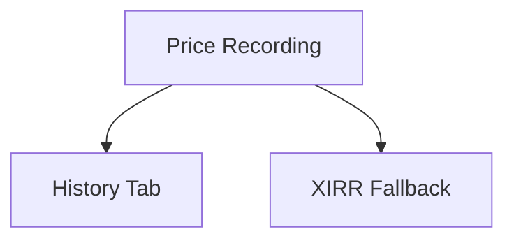

# Asset Price History

## 1. Executive Summary

Asset Price History is a new capability in the Investment bounded context that lets the app record a price for any investment asset on any date — either automatically, when the existing price-fetch pipeline succeeds, or manually, when it can't (as happens today for Brazilian OTC funds and similar assets with no automated price source).

It exists for the single account owner who self-hosts this tool to track personal Brazilian and UK investments instead of a spreadsheet. Today, an asset the app can't price automatically shows "—" for current value, profit, and XIRR indefinitely, understating the true portfolio and forcing the user back to a spreadsheet just for those holdings. Asset Price History closes that gap: once a price is recorded for today (auto or manual), those calculations populate exactly as if the price had been fetched live.

At a high level, each asset gains a day-by-day price history — one entry per calendar day, the latest write for a day always winning. A new "Price History" tab on the asset details view, alongside the existing Credits and Transactions tabs, lets the user view that history as a list and a trend chart, and add or edit a manually-entered price for any date. Current-value/XIRR calculations require an entry dated today specifically; without one, they still show "—", so the app never silently uses a stale number.

## 2. Problem and Opportunity

**The Problem**

- **Incomplete portfolio valuation**: assets with no automated price source (e.g. Brazilian OTC mutual funds like "Guepardo Institucional FIC FIA") show "—" for current value, profit, and XIRR indefinitely, understating true portfolio totals and hiding real performance for those holdings.
- **No manual override path**: today, a failed automatic price fetch is a dead end. There is no way to tell the app "here is the actual current value," so the user has no in-app recourse for these specific assets.
- **No historical record**: even for assets that price automatically, the app never retains a day-by-day price history, so there is no data to later chart trends or spot patterns in how an asset is progressing.
- **Persistent spreadsheet dependency**: because of the above, the user still maintains a parallel spreadsheet just for unpriced assets, undermining the goal of consolidating everything into one tool.

**The Opportunity**

- Recording every successful automatic fetch *and* every manual entry into one price history (F01) directly solves incomplete valuation and the missing historical record at the same time — the data model does double duty as a fallback source and as a growing dataset for future analysis.
- A dedicated Price History tab with add/edit (F02) gives the user the manual override path that's missing today, in the same place and interaction style as the existing Credits/Transactions tabs, so it feels native rather than bolted on.
- Wiring current-value/XIRR to consult that history when a live fetch fails or doesn't exist (F03) is what actually retires the spreadsheet for these assets — portfolio totals become accurate without the user tracking anything outside the app.

## 3. Target Audience

### Primary Users

**The Account Owner**
- Manages personal Brazilian and UK investment portfolios, alongside household cash flow, using this self-hosted app as the single source of truth instead of a spreadsheet.
- Holds at least one asset (e.g. a Brazilian OTC mutual fund) with no automated price source, currently tracked manually outside the app.
- Wants portfolio-level totals (current value, XIRR) to be accurate and complete, never silently understated by unpriced assets.

## 4. Objectives

**Product Objectives**

- **Eliminate** blind spots in portfolio valuation caused by assets with no automated price source.
- **Preserve** calculation accuracy by never substituting a stale price without the user knowing.
- **Build** a day-by-day price history per asset as a foundation for future trend analysis.
- **Match** this app's existing manual-entry conventions (Credits, Transactions, Investment Snapshots) so the feature feels like a natural extension, not a new pattern.

**Success Metrics**

- **Eliminate blind spots**: 0 assets show "—" for current value/XIRR on any day the user has recorded a price (manual or auto) for that date, verified across the full portfolio.
- **Preserve accuracy**: 100% of assets relying on a manual entry revert to "—" the following day if no new entry (manual or auto) exists for that day — verified by test and manual walkthrough.
- **Build history**: every successful automatic fetch and every manual entry is retained indefinitely and retrievable per asset — verified by the Price History tab showing entries older than the current day.
- **Match conventions**: the Price History tab ships using the same list/chart/dialog interaction pattern as the existing Credits tab — verified in code review against `AssetDetailsViewModel`'s existing Credits view-state shape.

## 5. User Stories

### F01. Price History Recording
- As the system, I want to automatically record a successful price fetch's result as today's entry for that asset, so that price history builds up without extra effort from the user.
- As a user, I want to manually record a price for an asset on a specific date, so that assets with no automated price source can still have accurate current and historical data.
- As a user, I want a new price entry for a date to overwrite any existing entry for that same date, so that correcting today's price doesn't create duplicate or conflicting records.
- As a user, I want to delete a manual price entry I made in error, so that my price history stays accurate.

### F02. Price History Tab & Chart
- As a user, I want a dedicated Price History tab on an asset's details page, so I can review and manage its price data alongside its Credits and Transactions.
- As a user, I want to see a chart of an asset's price over time, so that I can spot trends visually.
- As a user, I want to filter the price history chart/list by period (e.g. last 3 months, last 12 months, all time), so I can focus on the range that matters to me.
- As a user, I want to visually distinguish manually-entered prices from automatically-fetched ones, so I know which values I'm responsible for keeping current.
- As a user, I want to add or edit a price for any date through a simple dialog, so I don't need a spreadsheet for assets the app can't price automatically.

### F03. Current-Value/XIRR Fallback via Price History
- As a user, I want my portfolio's current value and XIRR to include assets I've priced for today (automatically or manually), so my totals aren't silently understated.
- As a user, I want a manually-sourced current value to be visually flagged as such, so I don't mistake it for a live market price.
- As a user, I want current value/XIRR to revert to "—" the next day if no new price was recorded, so I'm never shown an outdated number without realizing it.

## 6. Functionalities

### F01. Price History Recording

**Provides:**
- Dated price entries (date, price, source: manual or automatic) per asset, keyed by the asset's broker/portfolio/asset name (used by F02, F03)

**Capabilities:**
- One entry per calendar day per asset. Setting a value for a date that already has an entry replaces it — last write for that day always wins, regardless of whether the previous entry was manual or automatic.
- Manual entries: price must be strictly greater than zero; date cannot be in the future; date may be today or any past date (supports backfilling).
- Automatic entries: recorded whenever the existing automated price-fetch pipeline succeeds for an asset on a given day; flagged distinctly from manual entries.
- Automatic entries are not directly editable or deletable by the user — correcting one is done by adding a manual entry for that same date, which overwrites it per the upsert rule above.
- Manual entries can be deleted. Deleting a date's entry leaves that date empty going forward (no automatic re-fill unless a later automatic fetch succeeds for that date).
- No retention limit — history accumulates indefinitely per asset.

**Experience:**
Backend capability with no direct UI of its own (its UI surface is F02). During the app's normal price-refresh flow, a successful fetch silently records/updates today's entry for that asset with no user-visible change beyond what F02 and F03 expose.

**Error Handling:**
- Manual entry with a price ≤ 0 is rejected: "Price must be greater than zero."
- Manual entry with a future date is rejected: "Price date cannot be in the future."
- Attempting to edit or delete an automatic entry is rejected: "Automatic price entries can't be edited directly — add a manual entry for this date instead."
- Deleting a date that has no entry is a no-op (idempotent, no error surfaced).

### F02. Price History Tab & Chart

**Consumes:**
- F01: dated price entries (date, price, source) per asset

**Capabilities:**
- New "Price History" tab on the asset details view, positioned alongside the existing Credits and Transactions tabs.
- List view: date, price, and a source badge ("Manual" / "Auto"), sorted newest first.
- Line chart of price over time, defaulting to the last 12 months, with a period filter (Last 3 Months / Last 12 Months / All Time) mirroring the Credits tab's existing period-filter pattern; manual and automatic points are visually distinguished (e.g. marker color/shape).
- "Add Price" opens a dialog to pick any date (not limited to today) and enter a price; submitting upserts per F01's rules.
- Only manual entries expose Edit/Delete actions in the list; automatic entries show no such action, consistent with F01.

**Experience:**
The user opens an asset's details, selects the Price History tab, and sees the chart (defaulting to Last 12 Months) with the list below or beside it. Clicking "Add Price" opens a dialog defaulting to today's date; on save, the list and chart refresh immediately. Clicking a manual entry's Edit action opens the same dialog pre-filled with its date and price. Delete asks for confirmation before removing an entry, matching this app's existing confirm-before-destructive-action convention.

**Error Handling:**
- Submitting the dialog with an invalid price or date shows the corresponding F01 validation message inline, without closing the dialog.
- A save failure (e.g. network/API error) keeps the dialog open with a retry-capable error message, matching the existing Transaction/Credit dialog error-handling convention in this app.

### F03. Current-Value/XIRR Fallback via Price History

**Consumes:**
- F01: today's dated price entry (if present) per asset

**Capabilities:**
- When the automatic price fetch for an asset fails, or the asset's class has no automated source at all, the app looks up F01's entry for today's date for that asset; if present, that price feeds current-value, profit, and XIRR calculations exactly as a successfully-fetched price would.
- When the automatic fetch succeeds, its result is recorded into F01 (as an automatic entry) and used directly for the same calculations — no separate lookup needed.
- If no entry exists for today (neither automatic nor manual), current-value/profit/XIRR still show "—", identical to current behavior. The app never falls back to a non-today (stale) entry.
- A current value sourced from a manual entry is visually badged in the portfolio/asset views as distinct from a live-fetched price.

**Experience:**
On the portfolio and asset-details views, an asset that previously showed "—" for current value/XIRR now shows real numbers once today's price is recorded, whether via automatic fetch or F02's manual entry. A small badge/tooltip on the value indicates "Manual" when the price came from a manual entry rather than a live fetch.

## 7. Out of Scope

- **Aggregate/portfolio-wide charting**: this version charts price history per individual asset only, not a combined multi-asset view.
- **Retroactive backfill import**: no bulk/automated import of historical prices for dates before this feature ships — history starts accumulating from the point of adoption plus whatever the user backfills manually, one entry at a time.
- **Editing or deleting automatic entries directly**: the only way to correct an automatic entry is to add a manual entry for that same date (F01's upsert rule).
- **Currency conversion / FX-adjusted history**: prices are recorded in the asset's native trading currency, consistent with how the rest of the Investment domain already works — no new currency-conversion logic.
- **Stale-price alerts or notifications**: no reminders when an asset hasn't had a price recorded in N days — a future enhancement, not this version.
- **Bulk/CSV import of historical prices**: manual entries are added one date at a time through the dialog in this version.

## 8. Dependency Graph

| # | Feature | Priority | Dependencies |
|---|---------|----------|--------------|
| F01 | Price History Recording | 1 | None |
| F02 | Price History Tab & Chart | 1 | F01 |
| F03 | Current-Value/XIRR Fallback via Price History | 1 | F01 |

### Execution Waves
Features within the same wave can be built in parallel. A wave starts only after every feature in earlier waves is complete.

- **Wave 1**: F01
- **Wave 2**: F02, F03

### Priority levels
- **1** = Essential — product does not work without it
- **2** = Important — significant value addition
- **3** = Desirable — incremental improvement

## 9. Acceptance Criteria

### F01. Price History Recording
- [ ] A successful automatic price fetch for an asset records/updates that asset's entry for today's date, flagged as automatic.
- [ ] Adding a manual price for a date that already has an entry (manual or automatic) replaces it; only the latest value for that date is retained.
- [ ] A manual entry with price ≤ 0 is rejected with a clear validation message and not recorded.
- [ ] A manual entry with a future date is rejected with a clear validation message and not recorded.
- [ ] Attempting to edit or delete an automatic entry is rejected.
- [ ] Deleting an existing manual entry removes it; the date has no entry afterward.
- [ ] Deleting a date with no entry is a no-op and does not error.
- [ ] Price history for an asset persists across app restarts (survives the JSON reload-on-startup cycle).

### F02. Price History Tab & Chart
- [ ] The asset details view shows a Price History tab alongside Credits and Transactions.
- [ ] The tab lists all recorded entries for the asset, newest first, each showing date, price, and a Manual/Auto badge.
- [ ] The chart plots price over time and defaults to the Last 12 Months filter; switching filters (Last 3 Months / Last 12 Months / All Time) updates both chart and list.
- [ ] Manual and automatic points are visually distinguishable on the chart.
- [ ] "Add Price" opens a dialog defaulting to today's date; a valid submission appears immediately in the list and chart.
- [ ] Only manual entries show Edit/Delete actions in the list; automatic entries show neither.
- [ ] Editing a manual entry pre-fills the dialog with its existing date and price.
- [ ] Deleting a manual entry requires confirmation before it's removed.
- [ ] An invalid dialog submission (bad price/date) shows the validation message inline without closing the dialog.

### F03. Current-Value/XIRR Fallback via Price History
- [ ] An asset with no automated price source and a manual entry for today shows a real current value, profit, and XIRR instead of "—".
- [ ] The same asset, on a day with no entry for that date, shows "—" again for current value/profit/XIRR — it never uses yesterday's or any older entry.
- [ ] An asset whose automatic fetch succeeds today uses that fetched price directly, and that price is also recorded into history as automatic.
- [ ] A current value sourced from a manual entry is visually flagged (e.g. a "Manual" badge/tooltip) wherever current value is displayed for that asset.
- [ ] Portfolio-level totals (e.g. total current value) include manually-priced assets on days they have a today-dated entry.

### Cross-Feature Integration
- [ ] Price entries recorded by F01 (both manual, via F02's dialog, and automatic, via the existing fetch pipeline) appear correctly in F02's list and chart for the correct asset.
- [ ] F03's current-value/XIRR calculation for an asset correctly retrieves and uses F01's today-dated entry when present, and correctly shows "—" when absent — for both manually-entered and automatically-fetched sources.
