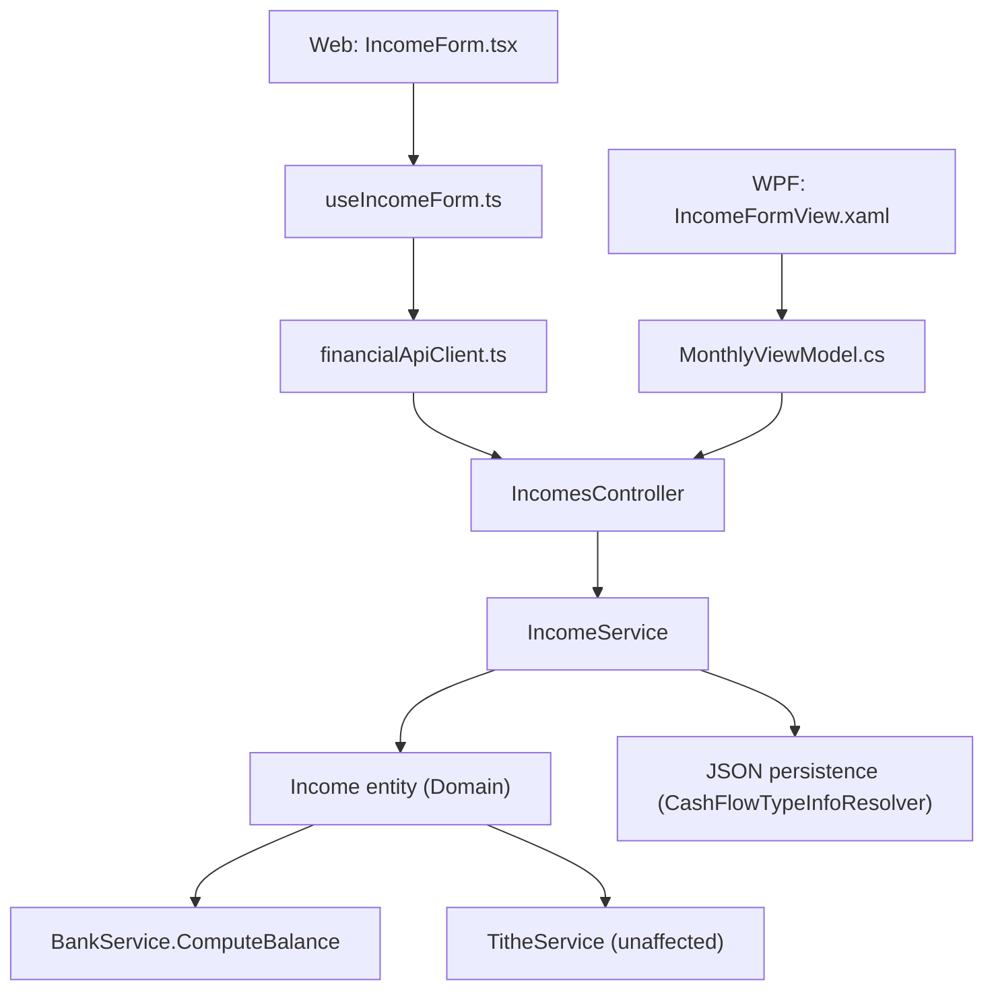

## 1. Technical Overview

**What:** Make `Income.Bank` optional (currently a required non-nullable navigation property) and add a new optional `Description` field (free text, up to 200 characters) to `Income`. Both changes propagate from the Domain entity through the Application DTOs/services, the JSON persistence layer, the REST API, and both front ends (React Web and WPF App), which must stay at feature parity.

**Why:** `Income.Bank` is currently required, so income that never lands in a tracked bank account (e.g. ISA dividends) cannot be recorded at all. The codebase already has an established pattern for an optional bank reference — `Expense.PaymentSourceBank` (`Bank?`) — and an established pattern for an optional/required free-text description — `Expense.Description`. This feature mirrors both patterns onto `Income`, adjusting only the "required" aspect since Income's Description is optional where Expense's is required.

**Scope:**
- Included: `Income.Bank` becomes nullable; new optional `Income.Description` (≤200 chars); bank-balance calculation excludes bank-less incomes; tithe calculation is confirmed unaffected (no code change there); Create/Edit Income forms and Incomes list/grid in both Web and WPF; API DTOs; persistence (works automatically via existing nullable-reference-converter machinery — no infrastructure code change required).
- Excluded (per PRD Out of Scope): a synthetic "external" bank placeholder; data migration of existing incomes (all pre-existing incomes already have a Bank); any change to `TitheService` (already bank-agnostic); Categories changes.

## 2. Architecture Impact

**Affected components:**
- `Financial.CashFlow.Domain/Entities/Income.cs` — `Bank` becomes nullable, new `Description` property, updated validation.
- `Financial.CashFlow.Application/DTOs/IncomeCreateDTO.cs`, `IncomeUpdateDTO.cs`, `IncomeDTO.cs` — nullable `BankId`/`BankName`, new `Description`.
- `Financial.CashFlow.Application/Services/IncomeService.cs` — conditional bank resolution, description length validation, null-safe `ToDto`.
- `Financial.CashFlow.Application/Services/BankService.cs` — null-safe bank match in `ComputeBalance`.
- `Financial.Api/Controllers/IncomesController.cs` — no code change (thin passthrough); contract changes only via DTOs.
- `Financial.Web/src/api/types.ts`, `financialApiClient.ts` (types only) — nullable bank fields, new `description`.
- `Financial.Web/src/components/IncomeForm.tsx`, `IncomeSection.tsx` — optional bank selection, new description input/column.
- `Financial.Web/src/hooks/useIncomeForm.ts` — remove bank-required validation, add description to payload.
- `Financial.App/Views/CashFlow/IncomeFormView.xaml`, `IncomeSectionView.xaml` — bank ComboBox gets a "(None)" option, new Description TextBox/column.
- `Financial.App/ViewModels/CashFlow/MonthlyViewModel.cs`, `IncomeFormValidation.cs` — new `IncomeFormDescription` property, default-to-none bank selection, remove bank-required check.
- No change needed: `CashFlowTypeInfoResolver.cs`, `ReferenceConverter.cs`, `BankReferenceConverter.cs` (nullable-reference serialization already generic), `TitheService.cs` (already bank-agnostic).



## 3. Technical Decisions

| Decision | Chosen Approach | Alternative Considered | Trade-off |
|----------|----------------|----------------------|-----------|
| Bank association type | `Bank? Bank` nullable owned-reference navigation, mirroring `Expense.PaymentSourceBank` | `Guid? BankId` scalar + separate lookup | Consistency with existing `Expense` pattern; JSON reference-converter machinery already handles this generically |
| Description length rule | Application-layer-only validation (`IncomeService`, mirroring `ExpenseService.ValidateFields`); no domain-entity check | Enforce in `Income.cs` domain entity | Matches existing convention: `Expense.Description`'s length rule also lives in the service, not the entity |
| Description "required" check | Omitted entirely — `Description` may be null/blank, unlike `Expense.Description` | Copy Expense's `IsNullOrWhiteSpace` required-check | PRD explicitly states Description is optional with no minimum |
| Blank Description storage | Normalize blank/whitespace-only input to `null` before persisting | Store as empty string `""` | Consistent with the nullable-optional convention already used for `GrossValue` and the new nullable `Bank`; avoids null/empty ambiguity in list rendering |
| WPF new-income default bank selection | Default to no bank selected (`IncomeFormBank = null`) | Keep pre-selecting the first bank in the list | Matches the field's new optional semantics; avoids silently attaching new incomes to a bank the user didn't choose |
| WPF "clear bank" interaction | Add a `"(None)"` sentinel item at the top of the Bank-bound `ComboBox` items | Add a separate "Clear bank" button | Simplest, most discoverable option; same interaction model as picking any other bank; no new UI control needed |
| Description column position (Web + WPF lists) | Appended after the Bank column, at the end of the row | Mirror Expense's order (Description near the start) | Keeps Income's existing column order (`Date, Source, Gross, Net, Bank`) stable; new field is purely additive |

## 4. Component Overview

**Backend — Domain:**

| File Path | New/Modified | Purpose | Key Responsibilities |
|-----------|--------------|---------|---------------------|
| `Financial.CashFlow.Domain/Entities/Income.cs` | Modified | Core entity | `Bank` property becomes `Bank?`; remove `ValidateBank`'s null-throw (or delete the method); add `string? Description` property + `ValidateDescription` (length-only, ≤200, optional) invoked from `Create`/`UpdateDetails` |

**Backend — Application:**

| File Path | New/Modified | Purpose | Key Responsibilities |
|-----------|--------------|---------|---------------------|
| `Financial.CashFlow.Application/DTOs/IncomeCreateDTO.cs` | Modified | Create request DTO | `BankId` becomes `Guid?` (drop `required`); add `string? Description` |
| `Financial.CashFlow.Application/DTOs/IncomeUpdateDTO.cs` | Modified | Update request DTO | Same shape change as Create DTO |
| `Financial.CashFlow.Application/DTOs/IncomeDTO.cs` | Modified | Read model | `BankId`/`BankName` become nullable; add `string? Description` |
| `Financial.CashFlow.Application/Services/IncomeService.cs` | Modified | Business logic | `ValidateFields` takes `Guid? bankId`, calls `BankNameResolver.TryResolve` only when non-null (mirror `ExpenseService.ValidateFields`); add description length validation (≤200 chars, no required check); normalize blank description to `null`; `ToDto` uses `income.Bank?.Id`/`?.Name` |
| `Financial.CashFlow.Application/Services/BankService.cs` | Modified | Bank balance calc | `ComputeBalance`: change `i.Bank.Id == bank.Id` to `i.Bank?.Id == bank.Id` so bank-less incomes are excluded from every bank's balance |

**Backend — Presentation (API):**

| File Path | New/Modified | Purpose | Key Responsibilities |
|-----------|--------------|---------|---------------------|
| `Financial.Api/Controllers/IncomesController.cs` | Unmodified | REST endpoints | No code change — thin passthrough to `IIncomeService`; existing routes/DTOs already flow the new shape through |

**Frontend — Web:**

| File Path | New/Modified | Purpose | Key Responsibilities |
|-----------|--------------|---------|---------------------|
| `Financial.Web/src/api/types.ts` | Modified | Client-side DTO types | `IncomeDto.bankId`/`bankName` → `string \| null`; `CreateIncomeDto.bankId`/`UpdateIncomeDto.bankId` → `string \| null`; add `description?: string \| null` to all three |
| `Financial.Web/src/components/IncomeForm.tsx` | Modified | Create/edit form | Add `'description'` to `IncomeFormField` union; add a Description text input (mirror `ExpenseForm.tsx`'s description field, no `maxLength` HTML attribute, consistent with the codebase's server-side-only length enforcement); Bank `<select>` gets a blank/"none" option |
| `Financial.Web/src/hooks/useIncomeForm.ts` | Modified | Form state/validation | Remove the "Bank is required" checks in `submitCreateIncome`/`saveEditIncome`; add `description` to create/edit payload construction; no client-side length validation (matches Expense's hook, which also doesn't length-validate client-side) |
| `Financial.Web/src/components/IncomeSection.tsx` | Modified | Incomes list/table | Bank column renders `income.bankName ?? '—'` (mirror the existing `grossValue != null ? … : '—'` null-display idiom); append new Description column after Bank |

**Frontend — WPF (Financial.App):**

| File Path | New/Modified | Purpose | Key Responsibilities |
|-----------|--------------|---------|---------------------|
| `Financial.App/Views/CashFlow/IncomeFormView.xaml` | Modified | Create/edit form view | Bank `ComboBox`'s bound items gain a `"(None)"` sentinel entry at the top; add a Description `TextBox` row (mirror `ExpenseFormView.xaml`'s Description row, no `MaxLength` XAML attribute) |
| `Financial.App/Views/CashFlow/IncomeSectionView.xaml` | Modified | Incomes grid | Append a `DataGridTextColumn` bound to `Description`, after the existing Bank column |
| `Financial.App/ViewModels/CashFlow/MonthlyViewModel.cs` | Modified | View model | `ShowCreateIncomeForm` sets `IncomeFormBank = null` (no longer defaults to `Banks[0].Id`); add `_incomeFormDescription` backing field + `IncomeFormDescription` property (mirror `ExpenseFormDescription`); `SaveIncomeAsync` passes `BankId = IncomeFormBank` directly (drop the `!.Value` null-forgiving operator) and includes `Description = IncomeFormDescription` |
| `Financial.App/ViewModels/CashFlow/IncomeFormValidation.cs` | Modified | Static validation helper | Remove the `if (bank is null) { errors.Add("Bank is required."); }` check; do not add a required-check for description (optional per PRD) |

**Persistence:** No file changes required. `CashFlowTypeInfoResolver.cs`'s `ConfigureReferenceProperty` and `ReferenceConverter<T>` already handle a null-valued reference property generically (confirmed working today for `Expense.PaymentSourceBank`); a new plain `string?` property serializes via the default reflection path with no extra configuration, same as `Expense.Description`.

## 5. API Contracts

No new endpoints. The three existing Income endpoints change their request/response body shape only.

**Endpoint: Create Income**
- **Method:** POST
- **Path:** `/api/v1/financial/incomes`
- **Authentication:** None (single-user, self-hosted app — matches existing endpoints)

**Request:**

| Field | Type | Required | Validation | Description |
|-------|------|----------|------------|--------------|
| `date` | `date` | Yes | valid date | Unchanged |
| `incomeSourceId` | `uuid` | Yes | must resolve to an existing `IncomeSource` | Unchanged |
| `grossValue` | `decimal \| null` | No | — | Unchanged |
| `netValue` | `decimal` | Yes | `>= 0` | Unchanged |
| `bankId` | `uuid \| null` | No (changed from required) | when present, must resolve to an existing `Bank` | Omit/null for a bank-less income |
| `description` | `string \| null` | No (new) | `<= 200` characters | Free-text note; e.g. "Chip ISA dividend" |

**Request Example (bank-less income with description):**
```json
{
  "date": "2026-08-15",
  "incomeSourceId": "3fa85f64-5717-4562-b3fc-2c963f66afa6",
  "grossValue": null,
  "netValue": 42.50,
  "bankId": null,
  "description": "Chip ISA dividend"
}
```

**Response (Success - 200):**

| Field | Type | Description |
|-------|------|--------------|
| `id` | `uuid` | Created income ID |
| `date` | `date` | Unchanged |
| `incomeSourceId` / `incomeSourceName` | `uuid` / `string` | Unchanged |
| `grossValue` | `decimal \| null` | Unchanged |
| `netValue` | `decimal` | Unchanged |
| `bankId` | `uuid \| null` | Null when the income has no bank |
| `bankName` | `string \| null` | Null when the income has no bank |
| `description` | `string \| null` | Null when omitted |

**Response Example:**
```json
{
  "id": "660e8400-e29b-41d4-a716-446655440001",
  "date": "2026-08-15",
  "incomeSourceId": "3fa85f64-5717-4562-b3fc-2c963f66afa6",
  "incomeSourceName": "Chip ISA Dividends",
  "grossValue": null,
  "netValue": 42.50,
  "bankId": null,
  "bankName": null,
  "description": "Chip ISA dividend"
}
```

**Error Codes:**

| Code | HTTP Status | Description |
|------|-------------|--------------|
| — | 400 | `"Net value cannot be negative."` (unchanged) |
| — | 400 | `"Bank '{id}' is not recognized."` (unchanged — only thrown when a `bankId` is supplied but doesn't resolve) |
| — | 400 | `"Description must not exceed 200 characters."` (new, mirrors `ExpenseService`'s message format) |

**Endpoint: Update Income**
- **Method:** PUT
- **Path:** `/api/v1/financial/incomes/{id:guid}`
- Same request/response/error shape as Create, full-replace semantics (unchanged from today).

**Endpoint: List Incomes by Month**
- **Method:** GET
- **Path:** `/api/v1/financial/incomes/month/{year:int}/{month:int}`
- Response: `IncomeDTO[]`, each item shaped as above (nullable `bankId`/`bankName`, new `description`).

## 6. Data Model

No relational schema — persistence is a single JSON document (`data-cashflow.json`) via `Financial.Shared.Infrastructure`. No migration needed: existing `Income` records all have a non-null `bank` reference already (bank was previously required), and simply gain an absent/`null` `description` key, which the reflection-based serializer treats as its default (`null`) on read. New optional field, old documents remain valid without modification.

**Income entry shape (conceptual, JSON):**

| Field | Type | Nullable | Notes |
|-------|------|----------|-------|
| `id` | `guid` | No | Unchanged |
| `date` | `date` | No | Unchanged |
| `incomeSourceId` | `guid` (reference) | No | Unchanged |
| `grossValue` | `decimal` | Yes | Unchanged |
| `netValue` | `decimal` | No | Unchanged |
| `bankId` | `guid` (reference) | Yes (was No) | Wire name unchanged (`BankId`, per `CashFlowTypeInfoResolver.ReferenceProperties`); now resolves to `null` when absent |
| `description` | `string` | Yes (new) | Plain scalar property, no `ReferenceProperties` entry needed |

## 7. Testing Strategy

Per `testing-guide-Financial`: Domain entities get unit tests for validation/invariants; Application services get unit tests against `StubCashFlowRepository` for business rules and error paths; API endpoints get integration tests for contract/status-code behavior; WPF validation helpers get unit tests for the static validation methods. Review existing Income tests for ones that assert the now-removed "Bank is required" behavior and flip/replace them rather than leaving contradictory tests in place.

**Test File Structure:**

| Test File | Test Type | Target | Coverage Goal |
|-----------|-----------|--------|----------------|
| `Tests/Financial.CashFlow.Domain.Tests/Entities/IncomeTests.cs` | Unit | `Income` entity | All validation branches (net value, income source, description length, bank now optional) |
| `Tests/Financial.CashFlow.Application.Tests/Services/IncomeServiceTests.cs` | Unit | `IncomeService` | Create/update with and without bank, description length validation, `ToDto` null-bank mapping |
| `Tests/Financial.CashFlow.Application.Tests/Services/BankServiceTests.cs` | Unit | `BankService.ComputeBalance` | Bank-less income excluded from balance; existing banked-income cases still pass |
| `Tests/Financial.Api.Tests/IncomesEndpointsTests.cs` | Integration | Income endpoints | Create with omitted `bankId` returns 200; create with a description over 200 chars returns 400; existing "unrecognized bank" test unaffected |
| `Tests/Financial.Presentation.Tests/ViewModels/CashFlow/IncomeFormValidationTests.cs` | Unit | `IncomeFormValidation.BuildValidationMessage` | Bank-null case no longer produces an error; other validation cases unchanged |

**Key test cases (`IncomeTests.cs`):**

| Test Function | Description | Assertions |
|----------------|-------------|------------|
| `Create_WithoutABank_DoesNotThrow` | Replaces the current `Create_WithoutABank_Throws` (now-contradictory) | `income.Bank.Should().BeNull()`, no exception |
| `Create_WithNegativeNetValue_Throws` | Existing behavior preserved | `ArgumentException` with unchanged message |
| `Create_WithDescriptionOver200Characters` | New — domain-layer boundary check, if any is kept at this layer per the "length lives in Application" decision, this is instead an Application-layer test (see below); Domain layer simply accepts any string length if no entity-level check is added | N/A — see Application-layer test instead |

**Key test cases (`IncomeServiceTests.cs`):**

| Test Function | Description | Assertions |
|----------------|-------------|------------|
| `AddIncomeAsync_WithoutBank_Succeeds` | Bank omitted entirely | Returned DTO has `BankId == null`, `BankName == null` |
| `AddIncomeAsync_WithUnrecognizedBank_ThrowsArgumentException` | Existing test, unaffected (bank supplied but invalid) | `ArgumentException` with `"is not recognized"` message |
| `AddIncomeAsync_WithDescriptionOver200Characters_ThrowsArgumentException` | Mirrors `ExpenseServiceTests`'s equivalent test | `ArgumentException` with `"200 characters"` in message |
| `AddIncomeAsync_WithBlankDescription_StoresNull` | Normalizes whitespace-only description | Returned DTO has `Description == null` |
| `UpdateIncomeAsync_RemovingBank_SetsBankNull` | Edit flips a banked income to bank-less | Returned DTO has `BankId == null` |

**Key test cases (`BankServiceTests.cs`):**

| Test Function | Description | Assertions |
|----------------|-------------|------------|
| `ComputeBalance_ExcludesBankLessIncome` | A bank-less income exists alongside a banked one | Bank-less income's `NetValue` is not included in the bank's computed balance |

**Key test cases (`IncomesEndpointsTests.cs`):**

| Test Function | Description | Assertions |
|----------------|-------------|------------|
| `AddIncome_WithoutBank_ReturnsOk` | New — `bankId` field omitted/null in request body | 200, response `bankId` is `null` |
| `AddIncome_WithDescriptionOver200Characters_ReturnsBadRequest` | New | 400, error message mentions the 200-character limit |

**Cross-feature integration test (per PRD Section 9):**

| Test Function | Description | Assertions |
|----------------|-------------|------------|
| `TitheServiceTests.GetTitheSummary_IncludesBankLessIncomeInCalculatedTithe` | A bank-less income recorded in the target month | `CalculatedTithe` includes that income's `NetValue * 10%` — proves `TitheService` needed no code change |
