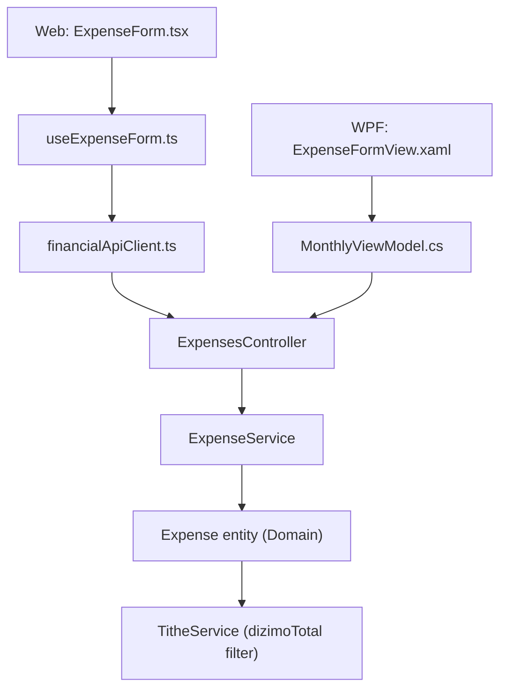

## 1. Technical Overview

**What:** Add a new boolean flag `CountsAsTithe` to the `Expense` entity, defaulting to `true` on creation. `TitheService`'s "already paid" total sums only expenses where both `Category.IsTithe` is `true` AND `CountsAsTithe` is `true`. The flag propagates through Application DTOs/services, the REST API, and both front ends (React Web and WPF App), which stay at feature parity.

**Why:** `Category` is seeded and read-only (confirmed: `Category.cs` has no update method, `CategoriesController` exposes only `GET`), so the offer/tithe distinction can't live at the category level without a redesign the user has explicitly deferred. The flag lives on `Expense` instead — the one place already capable of carrying per-record state — and `TitheService`'s existing `Category.IsTithe` check gets a second condition added alongside it.

**Scope:**
- Included: `Expense.CountsAsTithe` (bool, defaults `true`); `TitheService` filter updated to `e.Category.IsTithe && e.CountsAsTithe`; a "Counts toward tithe" checkbox in the Create/Edit Expense form on both Web and WPF, visible/enabled only when the selected category's `IsTithe` is `true`; DTOs and API contract updated.
- Excluded (per PRD Out of Scope): any Category CRUD; a new "Oferta" category; bulk-editing the flag across existing expenses; any visual indicator of the flag's value in the Expenses list (confirmed with user — the PRD's "appears normally in the category's expense list" wording is taken literally; the checkbox and the updated Tithe summary are the only surfaces).

## 2. Architecture Impact

**Affected components:**
- `Financial.CashFlow.Domain/Entities/Expense.cs` — new `CountsAsTithe` property, set in `Create`/`UpdateDetails`, no validation needed (plain boolean, always valid).
- `Financial.CashFlow.Application/Services/TitheService.cs` — `dizimoTotal` filter gains `&& e.CountsAsTithe`.
- `Financial.CashFlow.Application/DTOs/ExpenseCreateDTO.cs`, `ExpenseUpdateDTO.cs`, `ExpenseDTO.cs` — new `CountsAsTithe` property, defaults `true` when omitted.
- `Financial.CashFlow.Application/Services/ExpenseService.cs` — passes `request.CountsAsTithe` through to `Expense.Create`/`UpdateDetails` and `ToDto`.
- `Financial.Api/Controllers/ExpensesController.cs` — no code change (thin passthrough).
- `Financial.Web/src/api/types.ts`, `financialApiClient.ts` (types only) — new `countsAsTithe` field on `ExpenseDto`/`CreateExpenseDto`/`UpdateExpenseDto`.
- `Financial.Web/src/components/ExpenseForm.tsx` — new checkbox, shown only when the selected category's `isTithe` is `true` (mirrors the existing `showRoundUpField` derived-in-render pattern).
- `Financial.Web/src/hooks/useExpenseForm.ts` — new boolean field in create/edit state, defaulting to `true`; included in create/update payloads.
- `Financial.App/Views/CashFlow/ExpenseFormView.xaml` — new `CheckBox` row, visibility bound to a new `ShowCountsAsTitheField` computed property.
- `Financial.App/ViewModels/CashFlow/MonthlyViewModel.cs` — new `ExpenseFormCountsAsTithe` property; `ExpenseFormCategoryId`'s setter raises `OnPropertyChanged(nameof(ShowCountsAsTitheField))` (mirrors `ExpenseFormPaymentSource`'s setter driving `ShowRoundUpField`); new `ShowCountsAsTitheField` computed property reading `Categories`.
- No change needed: `Category.cs` (flag stays read-only/seeded), `CashFlowTypeInfoResolver.cs` (a plain `bool` property serializes via the default reflection path, same as any other scalar Expense property), `ExpensesSection.tsx`/`ExpenseSectionView.xaml` (no list-level indicator per the confirmed decision).



## 3. Technical Decisions

| Decision | Chosen Approach | Alternative Considered | Trade-off |
|----------|----------------|----------------------|-----------|
| Where the flag lives | `Expense.CountsAsTithe`, a plain unvalidated boolean property | A `Category` hierarchy (Dizimo/Offer) | PRD explicitly defers Category redesign; a per-expense flag needs no schema change to the read-only, seeded `Category` entity |
| Tithe-category detection in UI | Check the selected category's `IsTithe`/`isTithe` flag (already loaded via `Categories`/`categories`) | Hardcode a "Dizimo" name check | No hardcoded category name exists anywhere in the current codebase (confirmed by repo-wide search); `IsTithe` is the only mechanism the app already uses (`TitheService.cs`), and nothing prevents more than one category from being tithe-flagged in the future |
| List-level visual indicator | None — the checkbox (form) and the Tithe summary are the only surfaces | A badge/marker on Dizimo rows where the flag is unchecked | Confirmed with user: keeps the PRD's literal "appears normally in the category's expense list" wording; avoids adding a `categoryIsTithe` passthrough to `ExpenseDto` and new list columns on both front ends for a single-user app |
| DTO default when `CountsAsTithe` is omitted | `true` (not `required`) on `ExpenseCreateDTO`/`ExpenseUpdateDTO` | `required bool` | Matches the PRD capability "defaulting to true on creation" at the API boundary itself, not just in the domain entity; robust if a client omits the field |
| Value sent for a non-tithe-category expense | Whatever the toggle currently holds (no server-side forcing to `true`) | Force `true`/ignore the field server-side when `Category.IsTithe` is `false` | PRD AC: "Changing an expense's category away from Dizimo does not affect the tithe calculation, regardless of the flag's stored value" — `TitheService`'s `Category.IsTithe && CountsAsTithe` check already makes the stored value irrelevant for non-tithe expenses, so no extra server logic is needed |
| Web checkbox wiring | `onFieldChange('countsAsTithe', e.target.checked ? 'true' : 'false')`, parsed back to boolean at submit time | Extend `onFieldChange`'s signature to accept `boolean \| string` | Keeps `ExpenseFormField`'s existing `(field, value: string) => void` signature consistent with every other field in the form; no breaking change to the callback shape |

## 4. Component Overview

**Backend — Domain:**

| File Path | New/Modified | Purpose | Key Responsibilities |
|-----------|--------------|---------|---------------------|
| `Financial.CashFlow.Domain/Entities/Expense.cs` | Modified | Core entity | Add `bool CountsAsTithe { get; private set; }`; `Create`/`UpdateDetails` accept and assign it (default `true` via a parameter default, mirroring `Income.Description`'s optional-parameter style from F01) |

**Backend — Application:**

| File Path | New/Modified | Purpose | Key Responsibilities |
|-----------|--------------|---------|---------------------|
| `Financial.CashFlow.Application/DTOs/ExpenseCreateDTO.cs` | Modified | Create request DTO | Add `bool CountsAsTithe { get; init; } = true;` |
| `Financial.CashFlow.Application/DTOs/ExpenseUpdateDTO.cs` | Modified | Update request DTO | Same shape change as Create DTO |
| `Financial.CashFlow.Application/DTOs/ExpenseDTO.cs` | Modified | Read model | Add `required bool CountsAsTithe { get; init; }` |
| `Financial.CashFlow.Application/Services/ExpenseService.cs` | Modified | Business logic | `AddExpenseAsync`/`UpdateExpenseAsync` pass `request.CountsAsTithe` to `Expense.Create`/`UpdateDetails`; `ToDto` maps `expense.CountsAsTithe` |
| `Financial.CashFlow.Application/Services/TitheService.cs` | Modified | Tithe calculation | `dizimoTotal` `.Where(...)` clause gains `&& e.CountsAsTithe` |

**Backend — Presentation (API):**

| File Path | New/Modified | Purpose | Key Responsibilities |
|-----------|--------------|---------|---------------------|
| `Financial.Api/Controllers/ExpensesController.cs` | Unmodified | REST endpoints | No code change — thin passthrough; existing routes/DTOs flow the new field through |

**Frontend — Web:**

| File Path | New/Modified | Purpose | Key Responsibilities |
|-----------|--------------|---------|---------------------|
| `Financial.Web/src/api/types.ts` | Modified | Client-side DTO types | Add `countsAsTithe: boolean` to `ExpenseDto`, `CreateExpenseDto`, `UpdateExpenseDto` |
| `Financial.Web/src/components/ExpenseForm.tsx` | Modified | Create/edit form | Add `'countsAsTithe'` to `ExpenseFormField` union; add `countsAsTithe: boolean` prop; derive `selectedCategory`/`showCountsAsTitheField` from `categories`/`categoryId` (mirrors `showRoundUpField`); render a checkbox labeled "Counts toward tithe" only when `showCountsAsTitheField` is true |
| `Financial.Web/src/hooks/useExpenseForm.ts` | Modified | Form state/payload | Add `createCountsAsTithe`/`editCountsAsTithe` to state, defaulting to `true`; include `countsAsTithe` in create/update payloads, parsed from the field's `'true'`/`'false'` string |
| `Financial.Web/src/pages/MonthlyPage.tsx` | Modified | Field-mapping glue | Extend `CREATE_EXPENSE_FIELD_BY_FORM_FIELD`/`EDIT_EXPENSE_FIELD_BY_FORM_FIELD`-equivalent maps and the `ExpenseForm` prop wiring with the new field (mirrors how F01 wired `description` for Income) |

**Frontend — WPF (Financial.App):**

| File Path | New/Modified | Purpose | Key Responsibilities |
|-----------|--------------|---------|---------------------|
| `Financial.App/Views/CashFlow/ExpenseFormView.xaml` | Modified | Create/edit form view | Add a `CheckBox` row bound to `ExpenseFormCountsAsTithe`, `Visibility` bound to `ShowCountsAsTitheField` via `BoolToVisibilityConverter` |
| `Financial.App/ViewModels/CashFlow/MonthlyViewModel.cs` | Modified | View model | Add `_expenseFormCountsAsTithe` backing field + `ExpenseFormCountsAsTithe` property; `ExpenseFormCategoryId`'s setter raises `OnPropertyChanged(nameof(ShowCountsAsTitheField))` (mirrors `ExpenseFormPaymentSource`'s setter for `ShowRoundUpField`); new `ShowCountsAsTitheField` computed property (`Categories.FirstOrDefault(c => c.Id == ExpenseFormCategoryId)?.IsTithe == true`); `ShowCreateExpenseForm` defaults `ExpenseFormCountsAsTithe = true`; `ShowEditExpenseForm` populates it from `expense.CountsAsTithe`; `SaveExpenseAsync` includes `CountsAsTithe = ExpenseFormCountsAsTithe` in both DTOs |

**Persistence:** No file changes required. A plain `bool` property serializes via `CashFlowTypeInfoResolver`'s default reflection path (no `ReferenceProperties` entry needed, same as `Expense.Description`/`Expense.Value`). No migration needed: existing expense records simply gain the property with its default (`false` for a missing JSON key under `System.Text.Json`'s default boolean handling) — this is addressed explicitly in Data Model below since it diverges from the "defaults to true" capability for *new* expenses.

## 5. API Contracts

No new endpoints. The existing Expense endpoints change their request/response body shape only.

**Endpoint: Create Expense**
- **Method:** POST
- **Path:** `/api/v1/financial/expenses`

**Request (new field only — all other fields unchanged from today):**

| Field | Type | Required | Validation | Description |
|-------|------|----------|------------|--------------|
| `countsAsTithe` | `boolean` | No (new) | — | Whether this expense counts toward the tithe-paid total; only meaningful when the expense's category is tithe-flagged. Defaults to `true` when omitted. |

**Request Example (Dizimo expense recorded as a non-counting offer):**
```json
{
  "date": "2026-08-16",
  "description": "Charitable offer",
  "value": 50.00,
  "categoryId": "8f3b1c1a-2e3a-4b1a-9a7f-200000000001",
  "paymentSourceBankId": "8f3b1c1a-2e3a-4b1a-9a7f-100000000001",
  "creditCardId": null,
  "invoiceDate": null,
  "roundUpAmount": null,
  "countsAsTithe": false
}
```

**Response (Success - 200):**

| Field | Type | Description |
|-------|------|--------------|
| `countsAsTithe` | `boolean` | Echoes the stored value |

**Response Example:**
```json
{
  "id": "660e8400-e29b-41d4-a716-446655440002",
  "date": "2026-08-16",
  "description": "Charitable offer",
  "value": 50.00,
  "categoryId": "8f3b1c1a-2e3a-4b1a-9a7f-200000000001",
  "categoryName": "Dizimo",
  "paymentSourceBankId": "8f3b1c1a-2e3a-4b1a-9a7f-100000000001",
  "paymentSourceBankName": "Barclays",
  "creditCardId": null,
  "creditCardName": null,
  "chargeDate": null,
  "invoiceDate": null,
  "paymentStatus": "ImmediatePayment",
  "roundUpAmount": null,
  "suggestedRoundUpAmount": null,
  "countsAsTithe": false
}
```

**Error Codes:** No new error codes — `countsAsTithe` is a plain boolean with no validation.

**Endpoint: Update Expense**
- **Method:** PUT
- **Path:** `/api/v1/financial/expenses/{id:guid}`
- Same request/response shape change as Create.

**Endpoint: Get Expenses by Month / Get Tithe Summary**
- Unchanged routes; `GET /api/v1/financial/expenses/month/{year}/{month}` responses now include `countsAsTithe`. `GET /api/v1/financial/tithe/month/{year}/{month}` (`TitheSummaryDTO`) has no shape change — only its computed `titheBalance` value changes when an offer expense is recorded.

## 6. Data Model

No relational schema — persistence is a single JSON document (`data-cashflow.json`). No migration file/tool needed: `System.Text.Json`'s default deserialization gives a missing `bool` property `false`, not `true` — meaning pre-existing expense records (recorded before this feature, all implicitly "counted" toward tithe under the old code) would silently read as `CountsAsTithe = false` once this ships, understating tithe already paid for every historical Dizimo expense. This must be handled explicitly (see Testing Strategy below for the covering test) — the domain-level default (`true`) only applies to the `Create` factory path, not to deserialization of existing JSON.

**Chosen handling:** `Expense.cs`'s private parameterless constructor path (used by the JSON deserializer) leaves `CountsAsTithe` at its C# default (`false`) unless the property has an explicit field initializer. Set `public bool CountsAsTithe { get; private set; } = true;` as the property's default value — this makes both the deserializer's uninitialized-property path and the `Create` factory converge on `true` unless the JSON explicitly contains `"countsAsTithe": false`, with no migration tool required.

**Expense entry shape (conceptual, JSON):**

| Field | Type | Nullable | Notes |
|-------|------|----------|-------|
| `countsAsTithe` | `bool` | No (new) | Property default `true`; absent in pre-existing JSON records deserializes to `true` via the C# property initializer, preserving today's behavior for every historical expense |

## 7. Testing Strategy

Per `testing-guide-Financial`: Domain entity gets unit tests for the new property's default and explicit-value paths; `TitheService` gets unit tests for both new filter branches (flag true/false) plus the pre-existing-record default; `ExpenseService` gets unit tests for create/update/`ToDto` mapping; API endpoint gets integration tests for the contract; WPF `MonthlyViewModel` gets tests for the new computed property and default-on-create/populate-on-edit behavior.

**Test File Structure:**

| Test File | Test Type | Target | Coverage Goal |
|-----------|-----------|--------|----------------|
| `Tests/Financial.CashFlow.Domain.Tests/Entities/ExpenseTests.cs` | Unit | `Expense` entity | `CountsAsTithe` defaults to `true` when omitted; explicit `false` is preserved; `UpdateDetails` replaces the value |
| `Tests/Financial.CashFlow.Application.Tests/Services/TitheServiceTests.cs` | Unit | `TitheService.GetTitheSummary` | Dizimo expense with `CountsAsTithe = false` excluded from `dizimoTotal`; `CountsAsTithe = true` (default) included as today; non-tithe category expense unaffected regardless of flag value |
| `Tests/Financial.CashFlow.Application.Tests/Services/ExpenseServiceTests.cs` | Unit | `ExpenseService` | New expense defaults `CountsAsTithe` to `true`; explicit `false` round-trips through create/update/`ToDto` |
| `Tests/Financial.Api.Tests/ExpenseEndpointsTests.cs` | Integration | Expense endpoints | Create/update with `countsAsTithe: false` returns 200 with the value echoed; omitting the field defaults to `true` |
| `Tests/Financial.Presentation.Tests/ViewModels/CashFlow/MonthlyViewModelTests.cs` | Unit | `MonthlyViewModel` | `ShowCountsAsTitheField` is `true` only when the selected category `IsTithe`; `ShowCreateExpenseForm` defaults `ExpenseFormCountsAsTithe` to `true`; `ShowEditExpenseForm` populates it from the edited expense; `SaveExpenseAsync` sends the toggled value |

**Key test cases (`ExpenseTests.cs`):**

| Test Function | Description | Assertions |
|----------------|-------------|------------|
| `Create_WithoutCountsAsTithe_DefaultsToTrue` | Omits the parameter | `expense.CountsAsTithe.Should().BeTrue()` |
| `Create_WithCountsAsTitheFalse_AssignsFalse` | Explicit `false` | `expense.CountsAsTithe.Should().BeFalse()` |
| `UpdateDetails_TogglingCountsAsTithe_ReplacesValue` | Create `true`, update to `false` | `expense.CountsAsTithe.Should().BeFalse()` after update |

**Key test cases (`TitheServiceTests.cs`):**

| Test Function | Description | Assertions |
|----------------|-------------|------------|
| `GetTitheSummary_DizimoExpenseWithCountsAsTitheFalse_ExcludedFromDizimoTotal` | Dizimo expense, flag unchecked | `TitheBalance` equals `CalculatedTithe` (nothing subtracted) |
| `GetTitheSummary_DizimoExpenseWithCountsAsTitheTrue_IncludedInDizimoTotal` | Existing behavior, explicit flag | Matches current passing test's assertions |
| `GetTitheSummary_NonTitheCategoryExpenseWithCountsAsTitheFalse_StillIgnored` | Non-Dizimo category, flag false | `TitheBalance` unaffected — proves the flag is irrelevant outside a tithe-flagged category |

**Key test cases (`ExpenseServiceTests.cs`):**

| Test Function | Description | Assertions |
|----------------|-------------|------------|
| `AddExpenseAsync_WithoutCountsAsTithe_DefaultsToTrue` | Create DTO omits the field | Returned DTO has `CountsAsTithe == true` |
| `AddExpenseAsync_WithCountsAsTitheFalse_SavesFalse` | Explicit `false` | Returned DTO has `CountsAsTithe == false` |
| `UpdateExpenseAsync_TogglingCountsAsTithe_UpdatesValue` | Edit an existing expense's flag | Returned DTO reflects the new value |

**Key test cases (`ExpenseEndpointsTests.cs`):**

| Test Function | Description | Assertions |
|----------------|-------------|------------|
| `AddExpense_WithCountsAsTitheFalse_ReturnsOkWithFlagFalse` | New — Dizimo expense, flag unchecked | 200, response `countsAsTithe` is `false` |
| `AddExpense_OmittingCountsAsTithe_ReturnsOkWithFlagTrue` | New — field omitted from request body | 200, response `countsAsTithe` is `true` |

**Cross-feature integration test (per PRD Section 9):**

| Test Function | Description | Assertions |
|----------------|-------------|------------|
| `TitheServiceTests.GetTitheSummary_BankLessIncomeAndOfferExpenseTogether_ReflectsBothInSameMonth` | A bank-less income (F01) and a Dizimo expense with `CountsAsTithe = false` (F02) recorded in the same month | `CalculatedTithe` includes the bank-less income's `NetValue`; `TitheBalance` is not reduced by the offer expense — proves both F01 and F02 compose correctly |
