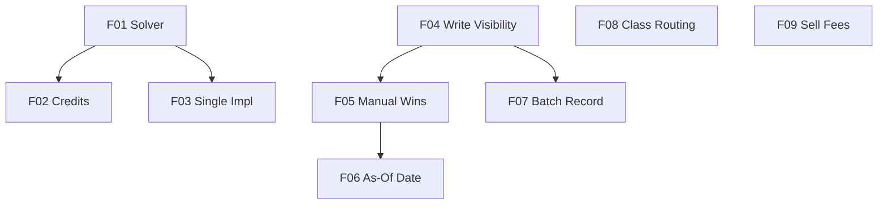

# Investment Return and Price Recording Accuracy

## 1. Executive Summary

The Investment bounded context of the Financial app reports each asset's performance through four headline figures — Total Current Value, Result %, XIRR, and XIRR w/ Credits — and maintains a per-asset Price History built from prices scraped from Google Finance, Yahoo Finance, and StatusInvest. This PRD covers a set of correctness defects in that reporting and recording chain, found while investigating why asset TASA4 displayed `XIRR —` alongside `XIRR w/ Credits -28.73%`.

The investigation established that none of the symptoms were data problems. The XIRR solver is a bare Newton-Raphson iteration seeded at +0.10 with no guard against stepping below `rate = -1`; for TASA4 the very first step lands at -1.258, `Math.Pow` on a negative base with a fractional exponent returns NaN, and because `NaN == 0` evaluates false the existing zero-derivative guard never trips. The loop burns all 100 iterations and returns null, which renders as an em dash. The credits-bearing series escaped only because its first step happened to land at -0.960, just inside the domain. Separately, the terminal value for "XIRR w/ Credits" adds total credits a second time even though every dividend is already present as a dated positive flow, and on the price side a failed persistence is caught by a bare `catch` whose fallback finds the entry still sitting in memory — producing an HTTP 200 with the correct price, no log, and a telemetry span marked successful.

The value is trustworthy numbers and a diagnosable pipeline. After this work an XIRR resolves whenever a rate mathematically exists rather than when the seed happens to be lucky, a "with credits" figure counts each dividend once, a manual price outranks a scrape and shows its own date, every price-fetch surface records to Price History, and a write that fails says so instead of reporting success.

## 2. Problem and Opportunity

### The Problem

**Returns are silently wrong or silently absent**
- XIRR renders as an em dash for any position whose true rate is deeply negative, because the solver diverges out of its mathematical domain rather than failing to have a root. TASA4's real answer is -32.21%.
- "XIRR w/ Credits" is systematically overstated because credits are counted twice — once as dated flows, once again in the terminal value. TASA4 shows -28.73% instead of -30.94%.
- The two figures disagree with the portfolio grid's XIRR column for the same asset, because the grid computes its terminal value correctly while the asset detail panel does not.
- A displayed em dash carries no distinction between "no rate exists for these cash flows" and "the solver gave up", so the user cannot tell a real answer from a bug.

**Sell transactions overstate proceeds**
- `TotalPrice` is `UnitPrice * Quantity + Fees`, correct for a purchase but inverted for a sale, where the fee is deducted from what is received rather than added.
- The error is twice the fee against truth and propagates into Realized Gain/Loss, Average Sell Price, Total Sold, and the XIRR cash-flow series.
- Verified against live data: 138 sell transactions, 43 carrying a non-zero fee and none negative, 8 of them material, totalling 10.31 in fees and therefore 20.62 of overstated proceeds.

**Price History fails to build, invisibly**
- When persistence fails, the in-memory entry has already been written, so the fallback branch finds it, returns HTTP 200 with the right price, logs nothing, and marks the telemetry span as a success. A lost write is indistinguishable from a recorded one.
- When the broker/portfolio/asset triple does not resolve, the service quietly returns an unrecorded price rather than reporting that it could not record.
- The result is a Price History that fills in unpredictably: 142 of 159 assets have no history at all, and the user resorts to opening assets one at a time.

**Manual prices do not survive**
- A successful scrape overwrites a manual price entered for the same day, contradicting the rest of the design, where automatic entries cannot be edited or deleted and the documented remedy is to add a manual entry for that date.
- The current-price response hardcodes the manual flag to false on the success path, so the `(Manual)` badge never appears while scraping works.
- A price sourced from history returns a null timestamp, so "As of" renders an em dash and the user cannot tell how stale the value is.

**Whole surfaces skip recording**
- The batch "Check Prices" screen omits the portfolio and asset name from its request, so it takes the no-record passthrough on every asset it fetches.
- An asset class with no matching fetcher falls through to the first registered fetcher instead of reporting the gap, so a PrivateCredit holding is looked up as an equity ticker and returns HTTP 500 — and only from the portfolio grid, because that path always sends the stored class while the asset page often sends none.

### The Opportunity

Replacing the seeded Newton iteration with a bracketed solver that refuses to leave `(-1, +INF)` turns an em dash into a number wherever a root exists, and makes a returned null mean exactly one thing: no rate exists for these flows. Removing the duplicate credit term makes the asset panel agree with the portfolio grid. Making fee direction depend on transaction type corrects proceeds at the single point that every consumer reads. Separating the record step from the fetch step, and refusing to mark a swallowed persistence failure as a success, converts an invisible fault into a logged one — which matters more than any individual fix, because it is the reason these defects went unnoticed. Extending the identity parameters to the batch screen and making unsupported asset classes explicit closes the two surfaces that were skipping the pipeline entirely.

The differentiator is that every fix is anchored to a reproduction against real data, with the expected post-fix value stated numerically, so each one is verifiable rather than plausible.

## 3. Target Audience

### Primary Users

**Self-hosted individual investor**
- Runs a single-tenant deployment tracking investment transactions across Brazilian and UK brokers alongside household cash flow, with no expectation of multi-user scale.
- Reads Result %, XIRR, and XIRR w/ Credits to judge whether a position is worth holding, and needs those figures to be correct rather than merely present.
- Builds Price History by browsing portfolios, uses the Price History chart to see a position's trajectory, and enters a manual price when a scraper returns a wrong or missing value.

## 4. Objectives

**Resolve** every XIRR that mathematically has a solution
- Metric: 100% of asset positions with at least one sign change in their cash-flow series return a numeric XIRR rather than an em dash, verified across all 159 assets in the live data file.
- Condition: measured after a full portfolio browse with prices loaded.

**Correct** the reported return figures
- Metric: TASA4 reports XIRR -32.21% and XIRR w/ Credits -30.94% (currently em dash and -28.73%), both within 0.05 percentage points.
- Condition: measured against the asset detail panel in both front ends with the live price 4.91.

**Eliminate** double-counting and fee-direction errors
- Metric: the asset detail panel's XIRR w/ Credits equals the portfolio grid's XIRR column for the same asset to within 0.01 percentage points; sell proceeds for the 8 materially-fee-bearing sells drop by exactly the fee amount, a total of 10.31.
- Condition: verified by unit test and by comparing both surfaces for the same asset.

**Guarantee** that a price fetch either records or reports why not
- Metric: 0 code paths return HTTP 200 with a successful telemetry span after a persistence failure; every non-recording outcome emits a log entry naming the broker, portfolio, and asset.
- Condition: verified by a test that injects a throwing storage layer.

**Unify** price recording across every fetch surface
- Metric: all 4 fetch surfaces (asset Refresh, portfolio grid, batch Check Prices in Web, batch in WPF) record an automatic entry on a successful fetch; 1 shared XIRR implementation remains instead of 2.
- Condition: verified by test per surface, and by the absence of `Financial.Web/src/utils/xirr.ts`.

## 5. User Stories

### F01. XIRR Solver Convergence
- As an investor, I want to see the XIRR for a position that has lost most of its value so that I can judge whether to hold or exit
- As an investor, I want an em dash to mean that no rate exists for these cash flows so that I can trust the figure when one is shown
- As the system, I want to reject a cash-flow series with no sign change before iterating so that an undefined problem is distinguished from a solver failure

### F02. Credits Double-Count Correction
- As an investor, I want XIRR w/ Credits to count each dividend exactly once so that the figure is not flattering
- As an investor, I want the asset panel's XIRR w/ Credits to match the portfolio grid's XIRR for the same asset so that I am not shown two different answers

### F03. Single XIRR Implementation
- As the system, I want one XIRR implementation so that a correction cannot be applied to one surface and forgotten on the other
- As an investor, I want the portfolio grid's XIRR column to use the same corrected solver as the asset panel so that both agree

### F04. Price-History Write-Failure Visibility
- As the system, I want a failed price-history write to be logged and marked as a failure so that a lost write is diagnosable
- As the system, I want a price fetch that cannot resolve its asset to log the broker, portfolio, and asset name so that a misrouted request is visible
- As an investor, I want to trust that a displayed price was actually recorded so that my Price History reflects what I saw

### F05. Manual Price Precedence
- As an investor, I want a manual price I entered today to survive a live fetch so that my correction is not silently discarded
- As an investor, I want the current value to show the `(Manual)` badge whenever it came from my own entry so that I know its origin

### F06. Manual Price As-Of Date
- As an investor, I want a manual current value to show the date it was recorded so that I can tell how stale it is
- As an investor, I want a date-only display for a stored price so that I am not shown a fabricated clock time

### F07. Batch Check Prices Recording
- As an investor, I want the batch Check Prices run to build Price History so that I do not have to browse each portfolio to populate it
- As an investor, I want the WPF and Web batch screens to behave identically so that the front end I choose does not change the outcome

### F08. Asset Class Fetcher Routing
- As an investor, I want an asset whose class has no price source to report that clearly so that I am not shown a server error
- As an investor, I want the portfolio grid and the asset page to agree on an asset's class so that a row does not fail in one view and work in the other

### F09. Sell Fee Direction
- As an investor, I want a sale's proceeds to have its fee deducted rather than added so that Realized Gain/Loss is accurate
- As the system, I want a sale imported from a total amount to derive its fee in the correct direction so that the fee is not clamped away

## 6. Functionalities

### F01. XIRR Solver Convergence

**Provides:**
- Converged annualised rate, or an explicit null, for a dated cash-flow series plus terminal value (used by F02, F03)

**Capabilities:**
- Solves for the rate where net present value is zero over the open interval `(-1, +INF)`, day-count basis 365.
- Rejects a series of fewer than 2 flows, a series whose flows all share one date, and a series with no sign change between positive and negative amounts — each returns null, meaning no rate exists.
- Every candidate rate is constrained to be strictly greater than -1. A step that would land at or below -1 is rejected rather than evaluated, because a negative base with a fractional exponent is not a real number.
- A non-finite present value or derivative is treated as a failed step, never propagated. The existing exact `derivative == 0` comparison is replaced, since it cannot detect NaN.
- Bracket-and-bisect guarantees convergence once a sign change is bracketed; a Newton step is used only while it remains inside the bracket.
- Convergence tolerance 1e-7 on net present value, iteration ceiling 100 per method.
- The returned rate is converted to decimal through a range guard; an out-of-range result returns null rather than throwing, because the conversion is evaluated inside WPF data-binding getters where an exception is unrecoverable.

**Experience:**
- A resolved rate renders as a percentage to 2 decimal places, coloured by sign, in the asset detail panel of both front ends and in the portfolio grid's XIRR column.
- An unresolved rate renders as an em dash, which after this change means only that the cash flows admit no rate.
- TASA4, whose flows are three purchases of -1,539.15, -1,439.69, and -157.80 against a terminal 1,080.20, resolves to -32.21% where it previously showed an em dash.

### F02. Credits Double-Count Correction

**Consumes:**
- F01: converged annualised rate for a dated cash-flow series plus terminal value

**Capabilities:**
- The terminal value paired with a credits-bearing cash-flow series is the current market value alone — quantity multiplied by current price — with no credits term added.
- The credits-bearing series continues to carry every dividend as a dated positive flow on its own date; that is the single place credits enter the calculation.
- The "Total Current + Credits" display figure is unchanged: it remains a legitimate summary of value plus income received, and is simply not used as an XIRR terminal value.
- Applies to the active-scope calculation in both front ends. The historic-scope calculation already uses a terminal value of zero and requires no change.

**Experience:**
- TASA4's XIRR w/ Credits moves from -28.73% to -30.94%. Every asset holding credits shifts in the same direction, becoming less flattering.
- The asset detail panel's XIRR w/ Credits and the portfolio grid's XIRR column now agree for the same asset, where they previously differed by the credits term.

### F03. Single XIRR Implementation

**Consumes:**
- F01: converged annualised rate for a dated cash-flow series plus terminal value

**Capabilities:**
- The portfolio grid obtains each row's XIRR from the existing calculate endpoint rather than from a browser-local implementation, issuing one request per row once that row's price has arrived.
- The duplicate TypeScript implementation and its test file are deleted. One implementation remains.
- Historic rows continue to use a terminal value of zero; active rows use current price multiplied by current quantity.
- Measured cost against live data: the largest portfolio issues 9 additional requests, the largest body carrying 73 cash flows at roughly 3.2 KB. This sits alongside the price-scraping requests the grid already issues per row.

**Experience:**
- Each row's XIRR cell shows a loading indicator until that row's price and rate have both arrived, then the percentage, coloured by sign. A row whose price fetch failed continues to show an em dash.
- Rows resolve independently, so a slow scrape on one asset does not delay another row's XIRR.

### F04. Price-History Write-Failure Visibility

**Provides:**
- Recorded automatic price snapshot (date, price, manual flag) and an explicit persistence outcome (used by F05, F07)

**Core Scope:**
- Separating the record step from the fetch step, removing the success-marking on a swallowed failure, and logging both the persistence failure and the unresolved-asset passthrough

**Full Scope additions:**
- Structured diagnostics distinguishing a fetch failure, a persistence failure, and an unresolved asset in telemetry attributes

**Capabilities:**
- The record step is executed outside the fetch's exception handler, so a persistence failure can never be reclassified as a fetch failure and absorbed by the price-history fallback.
- In-memory state and persisted state cannot diverge: the entry is persisted before it is observable in memory, or the in-memory write is reverted when persistence fails.
- A persistence failure marks its telemetry span failed and emits a log entry at warning level or above. It is never reported as a success.
- A fetch that supplies portfolio and asset name but resolves no matching asset emits a warning naming the broker, portfolio, and asset, rather than silently returning an unrecorded price.
- The existing recording rule is preserved: one entry per asset per date, written when no entry exists for today or when today's automatic entry holds a different price.
- Automatic entries remain non-editable and non-deletable through the price endpoints.

**Experience:**
- On success, behaviour is unchanged: the fetched price is returned and today's entry appears in the Price History tab marked Automatic.
- On a persistence failure, the price is still returned so the user is not blocked, but the failure is present in the log and in telemetry, and the response does not claim the value was recorded.
- On an unresolved asset, the price is returned and the log names the triple that failed to resolve.

**Error Handling:**
- Persistence layer throws while saving: log at error level with the broker, portfolio, asset, and exception; mark the span failed; return the fetched price without asserting it was recorded.
- Serialization throws mid-write because the object graph was mutated concurrently: same handling as above; the underlying race is tracked separately and is out of scope here.
- Portfolio and asset supplied but no matching asset found: log at warning level naming the triple; return the fetched price via the passthrough.
- Live fetch throws and no entry exists for today: propagate the failure so the caller sees an error rather than a fabricated value. This existing behaviour is preserved.
- Live fetch throws and an entry exists for today: return that entry with its manual flag, as today.

### F05. Manual Price Precedence

**Consumes:**
- F04: today's stored price snapshot (date, price, manual flag) and the persistence outcome

**Provides:**
- Current-price response carrying the manual flag and the originating snapshot's date (used by F06)

**Capabilities:**
- When today's Price History entry is manual, the automatic write is skipped entirely — the manual value is never overwritten by a scrape.
- When today's entry is manual, the current-price response returns that manual price with its manual flag set true, rather than the scraped value.
- The manual flag is no longer hardcoded false on the successful-fetch path; it reflects the actual origin of the value returned.
- Precedence is scoped to the current date. A manual entry for an earlier date does not suppress today's automatic recording.
- This aligns the runtime with the existing documented rule that a manual entry for a date overrides the automatic one.

**Experience:**
- After entering a manual price for today and pressing Refresh, the manual value remains on screen and the `(Manual)` badge is shown, where previously the value was replaced by the scraped price and the badge never appeared.
- The Price History tab continues to show that entry as Manual, with edit and delete available.

**Error Handling:**
- Live fetch succeeds but today's entry is manual: skip the write, return the manual entry; no error state.
- Live fetch fails and today's entry is manual: return the manual entry with its flag set, as today.
- Manual entry recorded for today while a fetch for the same asset is in flight: the manual value wins on the next read; the in-flight automatic write is skipped on re-evaluation of today's entry.

### F06. Manual Price As-Of Date

**Consumes:**
- F05: current-price response carrying the manual flag and the originating snapshot's date

**Capabilities:**
- A price sourced from Price History returns the originating entry's date instead of a null timestamp, so the "As of" field has a value to render.
- A price sourced from a live fetch continues to return the scraper's own quote timestamp, which carries a time of day.
- A history-sourced value is displayed as a date only. A stored entry holds no clock time, so rendering one would be fabricated precision.
- A live-fetched value continues to display date and time, as today.
- Applies to both front ends, which currently render an em dash for a history-sourced price.

**Experience:**
- A manual current value shows, for example, `Current Value 4.91 (Manual)` with `As of 16/08/2026` — the date the entry was recorded, with no time component.
- A live-fetched value is unchanged: `As of 17/08/2026 10:51`.
- An em dash under "As of" now indicates only that no price has been obtained at all.

### F07. Batch Check Prices Recording

**Consumes:**
- F04: record-on-fetch orchestration keyed by broker, portfolio, and asset name

**Capabilities:**
- The batch screen supplies the broker, portfolio, and asset name on every request, so each successful fetch records an automatic entry under the same rules as the other surfaces.
- Both front ends route through the same orchestration; neither bypasses it to call the price fetcher directly.
- Both batch loops remain sequential, one asset at a time, so the run does not multiply concurrent writes against the shared document.
- The existing per-asset progress reporting and the run's continue-on-error behaviour are preserved: one asset's failure does not abort the run.
- Revises the earlier decision recorded in P32 F03, which deliberately excluded this screen from recording.

**Experience:**
- Running Check Prices over the configured portfolios populates Price History for every asset priced, so the user no longer needs to browse each portfolio to build history.
- Progress continues to show position, total, and current ticker; a failed asset is listed with its error and the run continues.

**Error Handling:**
- One asset's fetch fails: record nothing for that asset, show its error in the results list, continue to the next.
- One asset's persistence fails: surfaced per F04, the run continues.
- An asset in the configured scope no longer exists in the data: log the unresolved triple per F04 and continue.

### F08. Asset Class Fetcher Routing

**Capabilities:**
- An asset class with no supporting fetcher is reported as unsupported rather than being routed to the first registered fetcher, which currently causes a private-credit holding to be looked up as an equity ticker.
- The portfolio grid and the asset page resolve an asset's class from one agreed source, so a class value does not differ between the two views of the same asset.
- Existing routing is unchanged for supported classes: cryptocurrency and bond keep their dedicated fetchers, everything else uses the standard fetcher.

**Experience:**
- An asset whose class has no price source shows an unavailable indicator in the grid with an explanatory message, instead of the row failing with a server error.
- A row that previously failed only in the portfolio grid and worked on the asset page now behaves the same in both.

**Error Handling:**
- No fetcher supports the asset's class: return an unsupported-class result naming the class; do not attempt a lookup.
- Class differs between the grid and the asset page for one asset: both resolve from the agreed source, so the discrepancy cannot arise.
- A supported class whose lookup fails at the source: existing behaviour, surfaced as a fetch failure.

### F09. Sell Fee Direction

**Capabilities:**
- A transaction's total is direction-aware: a purchase totals unit price multiplied by quantity plus fees, a sale totals unit price multiplied by quantity minus fees.
- Deriving a transaction from a known total amount is likewise direction-aware, so a sale whose recorded total is net proceeds yields a positive fee rather than a negative one clamped to zero.
- The correction is made once, at the single property every consumer reads, so Realized Gain/Loss, Average Sell Price, Total Sold, and the XIRR cash-flow series are all corrected together.
- Purchase-side arithmetic, including average cost basis, is unaffected.
- Verified scope against live data: 138 sales, 43 with a non-zero fee, none negative; 8 materially affected, totalling 10.31 in fees.

**Experience:**
- Realized Gain/Loss and Average Sell Price shift slightly downward for the 8 affected sales; the largest single correction is 5.74.
- Assets with no sales, including TASA4, are unaffected, so the XIRR targets in F01 and F02 do not move.

**Error Handling:**
- Fees exceed gross proceeds on a sale, yielding negative net proceeds: allow the negative value rather than clamping, since a sale can genuinely net negative after costs; flag it in the import log.
- A total-derived sale whose fee computes as negative: treat as a data-quality problem and log it, rather than silently clamping to zero as today.
- Historical transactions already stored with a clamped zero fee: unchanged by this fix and not retroactively repaired; the import path is corrected going forward.

## 7. Out of Scope

**Persistence concurrency**
- Serializing the shared object graph without synchronisation while parallel row fetches mutate it. Reachable and demonstrated, but a shared-persistence concern rather than an Investment-domain one, and tracked separately in the backlog.
- Coalescing or locking writes for the local JSON provider.

**Deployment and environment**
- The deployed instance running a stale build against a different storage provider than the local data file. This is an operations concern, not product behaviour. It is recorded here only because it invalidated a live observation during the investigation.
- Verification rule adopted as a consequence: any check of price-recording behaviour must state which storage provider and which running instance it was performed against, because an instance configured for cloud storage does not write the local data file and does not write immediately.

**Data repair**
- Backfilling Price History for assets that have none.
- Retroactively correcting historical transactions whose fee was clamped to zero on import.

**User interface**
- Any redesign of the asset detail panel or portfolio grid layout.
- Distinguishing "no rate exists" from "price unavailable" with different indicators; both continue to render an em dash.

**Presentation parity**
- The WPF tree-selection path firing twice and dropping the first pass's fetches. Fragile but not incorrect in outcome, and tracked in the backlog.

## 8. Dependency Graph

| # | Feature | Priority | Dependencies |
|---|---------|----------|--------------|
| F01 | XIRR Solver Convergence | 1 | None |
| F02 | Credits Double-Count Correction | 1 | F01 |
| F03 | Single XIRR Implementation | 2 | F01 |
| F04 | Price-History Write-Failure Visibility | 1 | None |
| F05 | Manual Price Precedence | 1 | F04 |
| F06 | Manual Price As-Of Date | 2 | F05 |
| F07 | Batch Check Prices Recording | 2 | F04 |
| F08 | Asset Class Fetcher Routing | 2 | None |
| F09 | Sell Fee Direction | 2 | None |

### Execution Waves
Features within the same wave can be built in parallel. A wave starts only after every feature in earlier waves is complete.

- **Wave 1**: F01, F04, F08, F09
- **Wave 2**: F02, F05, F03, F07
- **Wave 3**: F06

### Priority levels
- **1** = Essential — product does not work without it
- **2** = Important — significant value addition
- **3** = Desirable — incremental improvement

## 9. Acceptance Criteria

### F01. XIRR Solver Convergence
- [ ] TASA4's series — purchases of -1,539.15, -1,439.69, -157.80 and terminal 1,080.20 — returns -32.21% within 0.05 percentage points
- [ ] A series whose first Newton step from +0.10 would land below -1 still converges
- [ ] A series with no sign change returns null
- [ ] A series of fewer than 2 flows returns null
- [ ] A series whose flows all share one date returns null
- [ ] No candidate rate at or below -1 is ever evaluated
- [ ] A result outside decimal range returns null rather than throwing
- [ ] Reordering an unsorted series does not change the result

### F02. Credits Double-Count Correction
- [ ] TASA4 reports XIRR w/ Credits -30.94% within 0.05 percentage points
- [ ] The terminal value paired with a credits-bearing series equals quantity multiplied by current price, with no credits added
- [ ] The "Total Current + Credits" displayed figure is unchanged
- [ ] Historic-scope calculations, which use a terminal value of zero, are unchanged

### F03. Single XIRR Implementation
- [ ] `Financial.Web/src/utils/xirr.ts` and its test file no longer exist
- [ ] Each portfolio grid row's XIRR is obtained from the calculate endpoint
- [ ] A row shows a loading indicator until its price and rate have arrived
- [ ] A row whose price fetch failed shows an em dash and issues no rate request
- [ ] Historic rows compute with a terminal value of zero

### F04. Price-History Write-Failure Visibility
- [ ] With a storage layer that throws, the call does not mark its telemetry span successful
- [ ] With a storage layer that throws, a log entry naming broker, portfolio, and asset is emitted
- [ ] With a storage layer that throws, in-memory state does not retain an entry that was never persisted
- [ ] A fetch supplying portfolio and asset name that resolves no asset emits a warning naming the triple
- [ ] On success, exactly one entry exists for today, marked automatic, asserted against persisted content rather than in-memory state
- [ ] A repeat fetch on the same day at the same price performs no second write
- [ ] A live fetch failure with no entry for today still propagates as an error

### F05. Manual Price Precedence
- [ ] A manual price recorded for today survives a subsequent successful fetch
- [ ] With a manual entry for today, the current-price response returns that price with its manual flag true
- [ ] With a manual entry for today, no automatic write occurs
- [ ] The `(Manual)` badge is displayed in both front ends when the value is manual
- [ ] A manual entry dated earlier than today does not suppress today's automatic recording

### F06. Manual Price As-Of Date
- [ ] A history-sourced price returns the originating entry's date rather than null
- [ ] A history-sourced price displays a date with no time component in both front ends
- [ ] A live-fetched price continues to display date and time
- [ ] "As of" shows an em dash only when no price was obtained

### F07. Batch Check Prices Recording
- [ ] The Web batch request carries broker, portfolio, and asset name
- [ ] The WPF batch call routes through the price orchestration, not the fetcher directly
- [ ] A successful batch run records one automatic entry per priced asset
- [ ] One asset's failure does not abort the run, and its error is listed
- [ ] Both batch loops process assets sequentially

### F08. Asset Class Fetcher Routing
- [ ] An asset class with no supporting fetcher returns an unsupported-class result naming the class
- [ ] An unsupported class does not fall through to the standard fetcher
- [ ] The portfolio grid and asset page resolve the same class for the same asset
- [ ] Cryptocurrency and bond classes continue to route to their dedicated fetchers
- [ ] A row with an unsupported class shows an unavailable indicator, not a server error

### F09. Sell Fee Direction
- [ ] A purchase totals unit price multiplied by quantity plus fees
- [ ] A sale totals unit price multiplied by quantity minus fees
- [ ] Deriving a sale from a net total amount yields a positive fee, not zero
- [ ] Realized Gain/Loss for a sale deducts the fee from proceeds
- [ ] Average Sell Price reflects net proceeds per unit
- [ ] Average cost basis for purchases is unchanged
- [ ] An asset with no sales produces an identical XIRR before and after

### Cross-Feature Integration
- [ ] The converged rate from the solver (F01) produces the corrected credits-bearing figure in the asset panel (F02), and that figure equals the portfolio grid's XIRR for the same asset
- [ ] The converged rate from the solver (F01) is what the portfolio grid renders per row (F03), with no browser-local implementation involved
- [ ] Today's stored snapshot and persistence outcome from the record step (F04) drive manual precedence (F05), so a manual entry suppresses the automatic write
- [ ] The manual flag and snapshot date returned by manual precedence (F05) are what the "As of" field renders date-only (F06)
- [ ] The record-on-fetch orchestration keyed by broker, portfolio, and asset (F04) is exercised by the batch screen (F07), producing an automatic entry per priced asset
