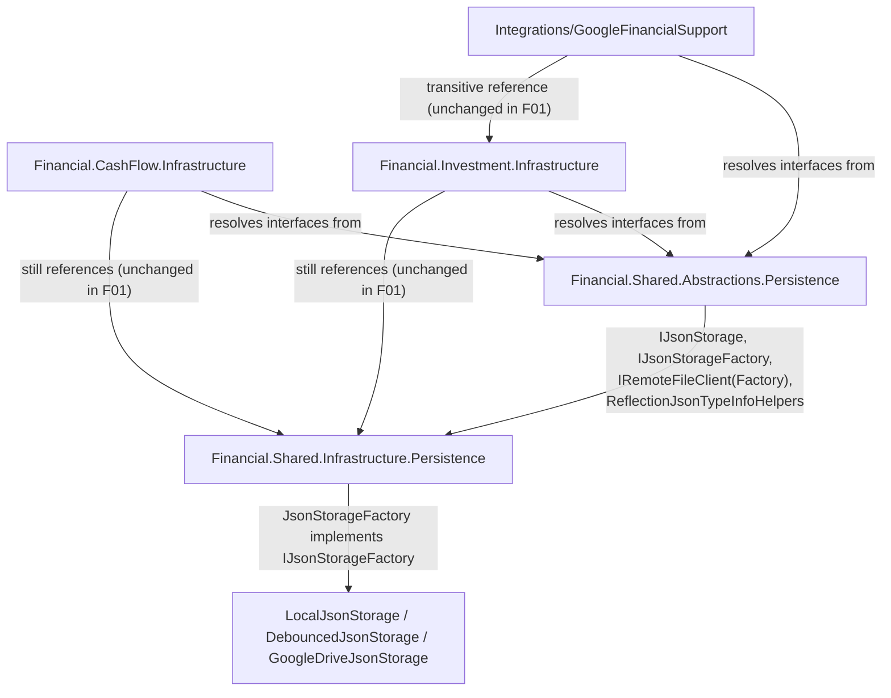

# F01. Persistence Abstraction Extraction

## 1. Technical Overview

**What:** Move `IJsonStorage`, `IRemoteFileClient`, `IRemoteFileClientFactory`, and `ReflectionJsonTypeInfoHelpers` out of `Financial.Shared.Infrastructure.Persistence` into a new `Financial.Shared.Abstractions.Persistence` namespace, unchanged. Define a new `IJsonStorageFactory` contract in the same namespace, and convert the existing static `JsonStorageFactory` class (which stays in `Financial.Shared.Infrastructure.Persistence`) into an instance class that implements it.

**Why:** Today `Financial.CashFlow.Infrastructure` and `Financial.Investment.Infrastructure` can only obtain storage by calling concrete `Financial.Shared.Infrastructure` types directly (the static `JsonStorageFactory`, `DebouncedJsonStorage`, `GoogleDriveStorageFactory`). That is a compile-time dependency on an implementation detail shared between two bounded contexts that are supposed to stay isolated. Moving the contracts to `Financial.Shared.Abstractions` — the project every downstream consumer already references — lets F06/F07 later drop the `Financial.Shared.Infrastructure` project reference from both contexts entirely, and lets F09 do the same for `Integrations/GoogleFinancialSupport`.

**Scope:**
- Included: the type moves themselves; the new `IJsonStorageFactory` interface; converting `JsonStorageFactory` to an instance implementation; the minimal, mechanical fix-ups (namespace `using` updates, and swapping two static call sites for instance calls) needed everywhere else in the solution so the build stays green and every existing test keeps passing, exactly as they do today.
- Excluded (deferred to later features in this PRD): removing the `ProjectReference` to `Financial.Shared.Infrastructure` from `Financial.CashFlow.Infrastructure`/`Financial.Investment.Infrastructure` (F06/F07); changing `CashFlowRepositoryFactory`/`InvestmentRepositoryFactory` to receive `IJsonStorageFactory` via DI constructor injection (F06/F07); registering `IJsonStorageFactory` at the composition roots (F08); adding an explicit `ProjectReference` to `Financial.Shared.Abstractions` from `Integrations/GoogleFinancialSupport` (F09); moving `ISyncStatusProvider`/`SyncStatus`/`SyncState`/`JsonStorageSyncExtensions` (F02); moving `RepositoryProviderResolver` (F04); moving `TransientStorageException` (F03).

## 2. Architecture Impact

**Affected components:**
- `Financial.Shared.Abstractions/Persistence/` (new folder) — receives `IJsonStorage.cs`, `IRemoteFileClient.cs`, `IRemoteFileClientFactory.cs`, `ReflectionJsonTypeInfoHelpers.cs`, `IJsonStorageFactory.cs`
- `Financial.Shared.Infrastructure/Persistence/JsonStorageFactory.cs` — rewritten from a static class to an instance class implementing `IJsonStorageFactory`
- `Financial.Shared.Infrastructure/Persistence/{DebouncedJsonStorage,GoogleDriveJsonStorage,GoogleDriveStorageFactory,LocalJsonStorage}.cs` — `using` statement only, no logic change
- `Financial.Shared.Infrastructure/Sync/JsonStorageSyncExtensions.cs` — `using` statement only (the file itself still belongs to F02; it only needs to resolve the relocated `IJsonStorage`)
- `Financial.CashFlow.Infrastructure/{DependencyInjection/CashFlowInfrastructureServiceCollectionExtensions,Persistence/CashFlowLoader,Persistence/CashFlowTypeInfoResolver,Repositories/CashFlowJsonRepository,Repositories/CashFlowRepositoryFactory}.cs` — `using` statement updates; `CashFlowRepositoryFactory.CreateStorage` swaps its two static `JsonStorageFactory.CreateLocal`/`CreateGoogleDrive` calls for an inline-instantiated `JsonStorageFactory`
- `Financial.Investment.Infrastructure/{DependencyInjection/InvestmentInfrastructureServiceCollectionExtensions,Persistence/InvestmentsLoader,Persistence/InvestmentsTypeInfoResolver,Repositories/InvestmentJsonRepository,Repositories/InvestmentRepositoryFactory}.cs` — same pattern as CashFlow's equivalents
- `Integrations/GoogleFinancialSupport/{GoogleFileClientFactory,GoogleFinancialSupportServiceCollectionExtensions,GoogleGenerator,GoogleService}.cs` — `using` statement only
- `Tests/Financial.TestUtilities/FakeSyncStatusStorage.cs`, `Tests/Financial.Shared.Infrastructure.Tests/Persistence/ControllableJsonStorage.cs`, and the other test files listed in Section 7 — `using` statement only



## 3. Technical Decisions

| Decision | Chosen Approach | Alternative Considered | Trade-off |
|----------|-----------------|-------------------------|-----------|
| Keeping the build green after F01 lands alone, before F06/F07 do their DI refactor | `CashFlowRepositoryFactory.CreateStorage`/`InvestmentRepositoryFactory.CreateStorage` construct a private `JsonStorageFactory` instance inline (`new JsonStorageFactory(_remoteFileClientFactory, _tracer, _storageLogger)`) and call its instance methods instead of the old static ones. No constructor signature, DI registration, or `ProjectReference` changes. | Land F01 together with F06/F07/F08 in one PR | A larger PR that mixes an unrelated wave's scope; rejected because the user's workflow processes one PRD feature per PR and `main` must stay deployable after every merge (CLAUDE.md invariant #5) |
| `ITelemetryTracer` null-handling inside the new inline `JsonStorageFactory` construction | `_tracer ?? NoOpTelemetryTracer.Instance`, matching the null-object pattern `DebouncedJsonStorage`/`GoogleDriveJsonStorage` already use internally | Make the factory constructor accept `ITelemetryTracer?` | `IJsonStorageFactory`'s concrete implementation constructor takes a non-nullable `ITelemetryTracer` per PRD Core Scope (F01 §106); the existing `CashFlowRepositoryFactory`/`InvestmentRepositoryFactory` fields stay nullable (`ITelemetryTracer? _tracer`) because their own constructor signature is untouched (owned by F06/F07) |
| Folder/namespace shape inside `Financial.Shared.Abstractions` | New `Persistence/` subfolder, mirroring the `Persistence/`, `Sync/`, `Resilience/`, `Configuration/`, `Hosting/` folder-per-namespace convention `Financial.Shared.Infrastructure` already uses | Keep it flat like the current `Observability` types | PRD explicitly calls out this per-concern namespace shape as the target pattern (F05 will apply the same shape retroactively to Observability) |
| `IJsonStorageFactory` method signatures | `CreateLocal(string? localDataPath, string defaultDataFileName)` / `CreateGoogleDrive(string? credentialsPath, string? driveFilePath, string credentialsConfigKey, string providerName)`, both returning `IJsonStorage` | Keep the `IRemoteFileClientFactory?`/`ITelemetryTracer?`/`ILogger?` parameters on the interface methods | PRD Core Scope (F01) states these three move to constructor-injected dependencies of the concrete implementation since they're identical on every call a given factory instance makes |

## 4. Component Overview

**New files (`Financial.Shared.Abstractions/Persistence/`):**

| File Path | New/Modified | Purpose | Key Responsibilities |
|-----------|--------------|---------|------------------------|
| `Financial.Shared.Abstractions/Persistence/IJsonStorage.cs` | New (moved) | Storage contract | `ReadAsync()`/`WriteAsync(string)`, signatures unchanged |
| `Financial.Shared.Abstractions/Persistence/IRemoteFileClient.cs` | New (moved) | Remote file I/O contract | `DownloadFileContent`/`UploadFileContent`, signatures unchanged |
| `Financial.Shared.Abstractions/Persistence/IRemoteFileClientFactory.cs` | New (moved) | Remote client construction contract | `Create(string credentialsPath)`, signature unchanged |
| `Financial.Shared.Abstractions/Persistence/ReflectionJsonTypeInfoHelpers.cs` | New (moved) | Shared `JsonTypeInfoResolver` reflection wiring | `EnablePrivateConstructor`, `WirePropertySetter`, unchanged |
| `Financial.Shared.Abstractions/Persistence/IJsonStorageFactory.cs` | New | Storage construction contract | `CreateLocal(string?, string)` and `CreateGoogleDrive(string?, string?, string, string)`, both returning `IJsonStorage` |

**Modified files (`Financial.Shared.Infrastructure`):**

| File Path | New/Modified | Purpose | Key Responsibilities |
|-----------|--------------|---------|------------------------|
| `Financial.Shared.Infrastructure/Persistence/JsonStorageFactory.cs` | Modified | Concrete storage factory | Becomes `public sealed class JsonStorageFactory : IJsonStorageFactory`, constructor-injected with `IRemoteFileClientFactory?`, `ITelemetryTracer`, `ILogger<DebouncedJsonStorage>?`; `CreateLocal`/`CreateGoogleDrive` become instance methods producing the identical `IJsonStorage` graph (direct for Local, debounce-wrapped for Google Drive) |
| `Financial.Shared.Infrastructure/Persistence/DebouncedJsonStorage.cs` | Modified | Debounced write wrapper | `using` update only (implements the relocated `IJsonStorage`) |
| `Financial.Shared.Infrastructure/Persistence/GoogleDriveJsonStorage.cs` | Modified | Google Drive storage | `using` update only |
| `Financial.Shared.Infrastructure/Persistence/GoogleDriveStorageFactory.cs` | Modified | Google Drive storage construction | `using` update only |
| `Financial.Shared.Infrastructure/Persistence/LocalJsonStorage.cs` | Modified | Local file storage | `using` update only |
| `Financial.Shared.Infrastructure/Sync/JsonStorageSyncExtensions.cs` | Modified | `IJsonStorage` sync extensions (stays here until F02) | `using` update only |

**Modified files (bounded-context Infrastructure — mechanical fix-ups only, no behavior change):**

| File Path | New/Modified | Purpose | Key Responsibilities |
|-----------|--------------|---------|------------------------|
| `Financial.CashFlow.Infrastructure/Repositories/CashFlowRepositoryFactory.cs` | Modified | CashFlow repository construction | `using` update; `CreateStorage` builds one `JsonStorageFactory` instance and calls `.CreateLocal`/`.CreateGoogleDrive` on it instead of the static class |
| `Financial.CashFlow.Infrastructure/DependencyInjection/CashFlowInfrastructureServiceCollectionExtensions.cs` | Modified | DI wiring | `using` update only (resolves `IRemoteFileClientFactory` from `Financial.Shared.Abstractions.Persistence`) |
| `Financial.CashFlow.Infrastructure/Persistence/CashFlowLoader.cs` | Modified | Startup data load | `using` update only |
| `Financial.CashFlow.Infrastructure/Persistence/CashFlowTypeInfoResolver.cs` | Modified | JSON type info resolver | `using` update only (`ReflectionJsonTypeInfoHelpers`) |
| `Financial.CashFlow.Infrastructure/Repositories/CashFlowJsonRepository.cs` | Modified | Repository implementation | `using` update only (`IJsonStorage`) |
| `Financial.Investment.Infrastructure/Repositories/InvestmentRepositoryFactory.cs` | Modified | Investment repository construction | Same pattern as `CashFlowRepositoryFactory` |
| `Financial.Investment.Infrastructure/DependencyInjection/InvestmentInfrastructureServiceCollectionExtensions.cs` | Modified | DI wiring | `using` update only |
| `Financial.Investment.Infrastructure/Persistence/InvestmentsLoader.cs` | Modified | Startup data load | `using` update only |
| `Financial.Investment.Infrastructure/Persistence/InvestmentsTypeInfoResolver.cs` | Modified | JSON type info resolver | `using` update only |
| `Financial.Investment.Infrastructure/Repositories/InvestmentJsonRepository.cs` | Modified | Repository implementation | `using` update only |

**Modified files (`Integrations/GoogleFinancialSupport` — no new `ProjectReference`; F09 adds the explicit one):**

| File Path | New/Modified | Purpose | Key Responsibilities |
|-----------|--------------|---------|------------------------|
| `Integrations/GoogleFinancialSupport/GoogleFileClientFactory.cs` | Modified | `IRemoteFileClientFactory` implementation | `using` update only |
| `Integrations/GoogleFinancialSupport/GoogleFinancialSupportServiceCollectionExtensions.cs` | Modified | DI registration | `using` update only |
| `Integrations/GoogleFinancialSupport/GoogleGenerator.cs` | Modified | Uses `IJsonStorage` | `using` update only |
| `Integrations/GoogleFinancialSupport/GoogleService.cs` | Modified | `IRemoteFileClient` implementation | `using` update only |

No Frontend, API, or Database files are affected. No API Contracts or Data Model sections apply to this feature (pure internal type relocation).

## 5. API Contracts

N/A — this feature makes no change visible outside the .NET solution's internal project structure.

## 6. Data Model

N/A — no persisted schema changes; `LocalJsonStorage`/`GoogleDriveJsonStorage`/`DebouncedJsonStorage` write the exact same JSON documents as before.

## 7. Testing Strategy

No test behavior changes; every existing test keeps asserting what it asserts today. This feature is exempt from adding coverage — it is a supervised type relocation, not new logic — but every touched test file must still compile and pass.

**Test files requiring a `using` update only (no assertion changes):**

| Test File | Test Type | Target | Change |
|-----------|-----------|--------|--------|
| `Tests/Financial.CashFlow.Infrastructure.Tests/Repositories/CashFlowJsonRepositoryTests.cs` | Unit | `CashFlowJsonRepository` | `using` update (`IJsonStorage`) |
| `Tests/Financial.CashFlow.Infrastructure.Tests/Repositories/CashFlowRepositoryFactoryTests.cs` | Unit | `CashFlowRepositoryFactory` | `using` update; verify Local/Google Drive provider selection still resolves via the inline-instantiated `JsonStorageFactory` |
| `Tests/Financial.Investment.Infrastructure.Tests/Integrations/GoogleFinancialSupportServiceCollectionExtensionsTests.cs` | Unit | `GoogleFinancialSupportServiceCollectionExtensions` | `using` update (`IRemoteFileClientFactory`) |
| `Tests/Financial.Investment.Infrastructure.Tests/Repositories/InvestmentJsonRepositoryTests.cs` | Unit | `InvestmentJsonRepository` | `using` update |
| `Tests/Financial.Investment.Infrastructure.Tests/Repositories/InvestmentRepositoryFactoryTests.cs` | Unit | `InvestmentRepositoryFactory` | `using` update; same provider-selection check as CashFlow's equivalent |
| `Tests/Financial.Investment.Infrastructure.Tests/Services/PriceServiceTests.cs` | Unit | (incidental `IJsonStorage` reference) | `using` update |
| `Tests/Financial.Shared.Infrastructure.Tests/Persistence/ControllableJsonStorage.cs` | Test double | `IJsonStorage` test double | `using` update |
| `Tests/Financial.TestUtilities/FakeSyncStatusStorage.cs` | Test double | `IJsonStorage`/`ISyncStatusProvider` test double | `using` update (`IJsonStorage` only; `ISyncStatusProvider` stays put until F02) |

**New coverage added by this feature:**

| Test File | Test Type | Target | Coverage Goal |
|-----------|-----------|--------|-----------------|
| `Tests/Financial.Shared.Infrastructure.Tests/Persistence/JsonStorageFactoryTests.cs` | Unit | `JsonStorageFactory` (now instance-based) | `CreateLocal` returns a working `LocalJsonStorage`-backed `IJsonStorage`; `CreateGoogleDrive` returns a `DebouncedJsonStorage`-wrapped storage (assert via its `ISyncStatusProvider`/`GetStatus()` surface, since the wrapped type is otherwise opaque behind `IJsonStorage`) and throws when `IRemoteFileClientFactory` is not supplied — mirrors the existing behavior asserted today only indirectly through `CashFlowRepositoryFactoryTests`/`InvestmentRepositoryFactoryTests` |

**Acceptance criteria this feature satisfies (PRD Section 9, F01):**
- `IJsonStorage`, `IRemoteFileClient`, `IRemoteFileClientFactory`, `ReflectionJsonTypeInfoHelpers` compile in `Financial.Shared.Abstractions.Persistence` with identical public signatures
- `IJsonStorageFactory` is defined in `Financial.Shared.Abstractions.Persistence` with `CreateLocal`/`CreateGoogleDrive` returning `IJsonStorage`
- The concrete `JsonStorageFactory` implements `IJsonStorageFactory` and produces the same `IJsonStorage` graph as before
- `Financial.Shared.Abstractions.csproj` gains zero new `PackageReference` entries

**Verification commands:**
```
dotnet build --configuration Release
dotnet test --settings coverlet.runsettings --results-directory TestResults
```
Both must succeed with no other project's test behavior changed, confirming `main` stays deployable after this PR merges alone.
