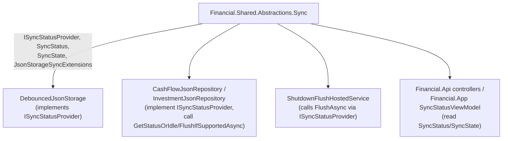

# F02. Sync Abstraction Extraction

## 1. Technical Overview

**What:** Move `ISyncStatusProvider`, `SyncStatus`, `SyncState`, and `JsonStorageSyncExtensions` (the `GetStatusOrIdle`/`FlushIfSupportedAsync` extension methods on `IJsonStorage`) out of `Financial.Shared.Infrastructure.Sync` into a new `Financial.Shared.Abstractions.Sync` namespace, unchanged.

**Why:** `CashFlowJsonRepository`/`InvestmentJsonRepository` implement `ISyncStatusProvider` and call `IJsonStorage.GetStatusOrIdle()`/`.FlushIfSupportedAsync()` today only by referencing `Financial.Shared.Infrastructure` directly — the same coupling F01 removed for the storage contracts themselves. Unlike F01's `JsonStorageFactory`, every type this feature touches is already a pure contract with no concrete implementation to keep behind — all four types move together and the `Financial.Shared.Infrastructure/Sync/` folder becomes empty. There is no static-to-instance conversion here and no interim compile-fix pattern is needed: this is a straight move plus `using` updates everywhere.

**Scope:**
- Included: the four type moves; every consumer's `using` statement fix-up across `Financial.Shared.Infrastructure`, both bounded contexts' Infrastructure projects, `Financial.Api`, `Financial.App`, and their tests.
- Excluded (deferred to later features in this PRD): removing the `ProjectReference` to `Financial.Shared.Infrastructure` from `Financial.CashFlow.Infrastructure`/`Financial.Investment.Infrastructure` (F06/F07); any DI/composition-root change (F08); `RepositoryProviderResolver` (F04); `TransientStorageException` (F03).

## 2. Architecture Impact

**Affected components:**
- `Financial.Shared.Abstractions/Sync/` (new folder) — receives `ISyncStatusProvider.cs`, `SyncState.cs`, `SyncStatus.cs`, `JsonStorageSyncExtensions.cs`
- `Financial.Shared.Infrastructure/Sync/` — deleted (empty after the move)
- `Financial.Shared.Infrastructure/Persistence/DebouncedJsonStorage.cs`, `Financial.Shared.Infrastructure/Hosting/ShutdownFlushHostedService.cs` — `using` update only
- `Financial.CashFlow.Infrastructure/Repositories/CashFlowJsonRepository.cs`, `Financial.Investment.Infrastructure/Repositories/InvestmentJsonRepository.cs` — `using` update only
- `Financial.Api/Controllers/{DiagnosticsController,SyncStatusController}.cs` — `using` update only
- `Financial.App/ViewModels/SyncStatusViewModel.cs` — `using` update only
- Every test file and test double listed in Section 7 — `using` update only



## 3. Technical Decisions

| Decision | Chosen Approach | Alternative Considered | Trade-off |
|----------|-----------------|-------------------------|-----------|
| Move all four types together in one feature | Matches PRD Core Scope exactly — `ISyncStatusProvider`, `SyncStatus`, `SyncState`, `JsonStorageSyncExtensions` all move to `Financial.Shared.Abstractions.Sync` in F02, no split across features | Move the extension methods separately from the interface/types | Rejected — the extension methods are meaningless without `ISyncStatusProvider`/`SyncStatus`/`SyncState` in scope, and the PRD groups them as one unit |
| `Financial.Shared.Infrastructure/Sync/` folder | Delete it — nothing remains in it after the move | Leave an empty folder | An empty folder with no files has no reason to exist; deleting it matches how F01 left no empty `Persistence` remnants (that folder still holds `JsonStorageFactory` and the concrete storage classes) |
| No new coverage needed | Unlike F01 (which converted a static factory into an instantiable class and needed new tests for that instantiation), F02 changes zero logic — every existing test for `DebouncedJsonStorage`, `CashFlowJsonRepository`, `InvestmentJsonRepository`, `ShutdownFlushHostedService`, `SyncStatusViewModel`, and the sync API endpoints already exercises this behavior and needs only a `using` fix | Add a dedicated `Financial.Shared.Abstractions.Sync` test project | Rejected — no precedent in this codebase: pure-contract Abstractions types (e.g. `ITelemetryTracer`, `NoOpTelemetryTracer`) have no dedicated Abstractions test project; they're exercised through their consumers |

## 4. Component Overview

**New files (`Financial.Shared.Abstractions/Sync/`):**

| File Path | New/Modified | Purpose | Key Responsibilities |
|-----------|--------------|---------|------------------------|
| `Financial.Shared.Abstractions/Sync/ISyncStatusProvider.cs` | New (moved) | Sync status contract | `GetStatus()`/`FlushAsync()`, unchanged |
| `Financial.Shared.Abstractions/Sync/SyncState.cs` | New (moved) | Sync state enum | `Idle`/`Pending`/`Saving`/`Failed`, unchanged |
| `Financial.Shared.Abstractions/Sync/SyncStatus.cs` | New (moved) | Sync status record | `SyncStatus(SyncState, string?, DateTime?)`, unchanged |
| `Financial.Shared.Abstractions/Sync/JsonStorageSyncExtensions.cs` | New (moved) | `IJsonStorage` sync extension methods | `GetStatusOrIdle()`/`FlushIfSupportedAsync()`, unchanged |

**Deleted:**

| File Path | Reason |
|-----------|--------|
| `Financial.Shared.Infrastructure/Sync/ISyncStatusProvider.cs` | Moved to Abstractions |
| `Financial.Shared.Infrastructure/Sync/SyncState.cs` | Moved to Abstractions |
| `Financial.Shared.Infrastructure/Sync/SyncStatus.cs` | Moved to Abstractions |
| `Financial.Shared.Infrastructure/Sync/JsonStorageSyncExtensions.cs` | Moved to Abstractions |

**Modified files (`using` statement only, no logic change):**

| File Path | New/Modified | Purpose |
|-----------|--------------|---------|
| `Financial.Shared.Infrastructure/Persistence/DebouncedJsonStorage.cs` | Modified | Implements `ISyncStatusProvider` from the new namespace |
| `Financial.Shared.Infrastructure/Hosting/ShutdownFlushHostedService.cs` | Modified | Calls `ISyncStatusProvider.FlushAsync()` from the new namespace |
| `Financial.CashFlow.Infrastructure/Repositories/CashFlowJsonRepository.cs` | Modified | Implements `ISyncStatusProvider`, calls the relocated extension methods |
| `Financial.Investment.Infrastructure/Repositories/InvestmentJsonRepository.cs` | Modified | Same as CashFlow's equivalent |
| `Financial.Api/Controllers/DiagnosticsController.cs` | Modified | Reads `SyncStatus`/`SyncState` from the new namespace |
| `Financial.Api/Controllers/SyncStatusController.cs` | Modified | Reads `SyncStatus`/`SyncState` from the new namespace |
| `Financial.App/ViewModels/SyncStatusViewModel.cs` | Modified | Reads `SyncStatus`/`SyncState` from the new namespace |

No Frontend (React), API contract, or Database changes — `SyncStatusController`'s response shape is unchanged (same `SyncState` enum values serialize identically). No API Contracts or Data Model sections apply.

## 5. API Contracts

N/A — `SyncStatusController`'s existing endpoint shape and JSON payload are unchanged; this feature only relocates the .NET type backing them.

## 6. Data Model

N/A — no persisted data.

## 7. Testing Strategy

No test behavior changes. Every test already exercising sync status (repository status reporting, `DebouncedJsonStorage`'s `GetStatus`/`FlushAsync`, `ShutdownFlushHostedService`'s shutdown flush, the WPF `SyncStatusViewModel`, and the API's sync status endpoint) keeps its exact assertions — only `using` statements move.

**Test files requiring a `using` update only:**

| Test File | Test Type | Target |
|-----------|-----------|--------|
| `Tests/Financial.Api.Tests/SyncStatusEndpointsTests.cs` | E2E | Sync status API endpoint |
| `Tests/Financial.CashFlow.Infrastructure.Tests/Repositories/CashFlowJsonRepositoryTests.cs` | Unit | `CashFlowJsonRepository` |
| `Tests/Financial.CashFlow.Infrastructure.Tests/Repositories/CashFlowRepositoryFactoryTests.cs` | Unit | `CashFlowRepositoryFactory` |
| `Tests/Financial.Investment.Infrastructure.Tests/Repositories/InvestmentJsonRepositoryTests.cs` | Unit | `InvestmentJsonRepository` |
| `Tests/Financial.Investment.Infrastructure.Tests/Repositories/InvestmentRepositoryFactoryTests.cs` | Unit | `InvestmentRepositoryFactory` |
| `Tests/Financial.Presentation.Tests/ViewModels/SyncStatusViewModelTests.cs` | Unit | `SyncStatusViewModel` |
| `Tests/Financial.Shared.Infrastructure.Tests/Hosting/ShutdownFlushHostedServiceTests.cs` | Unit | `ShutdownFlushHostedService<T>` |
| `Tests/Financial.Shared.Infrastructure.Tests/Persistence/DebouncedJsonStorageTests.cs` | Unit | `DebouncedJsonStorage` |
| `Tests/Financial.Shared.Infrastructure.Tests/Persistence/JsonStorageFactoryTests.cs` | Unit | `JsonStorageFactory` (F01) |
| `Tests/Financial.Shared.Infrastructure.Tests/Sync/SyncStatusTests.cs` | Unit | `SyncState` enum |
| `Tests/Financial.TestUtilities/FakeSyncStatusStorage.cs` | Test double | `IJsonStorage`/`ISyncStatusProvider` double |
| `Tests/Financial.TestUtilities/SyncStatusCashFlowRepositoryStub.cs` | Test double | `ISyncStatusProvider` stub |
| `Tests/Financial.TestUtilities/SyncStatusInvestmentRepositoryStub.cs` | Test double | `ISyncStatusProvider` stub |

**No new test files** — this feature adds no new logic to cover.

**Acceptance criteria this feature satisfies (PRD Section 9, F02):**
- `ISyncStatusProvider`, `SyncStatus`, `SyncState`, `JsonStorageSyncExtensions` compile in `Financial.Shared.Abstractions.Sync` with identical public signatures
- `DebouncedJsonStorage.GetStatus()`/`FlushAsync()` continue to satisfy `ISyncStatusProvider` from the new namespace with no behavior change

**Verification commands:**
```
dotnet build --configuration Release
dotnet test --settings coverlet.runsettings --results-directory TestResults
```
Both must succeed with no other project's test behavior changed, confirming `main` stays deployable after this PR merges alone.
