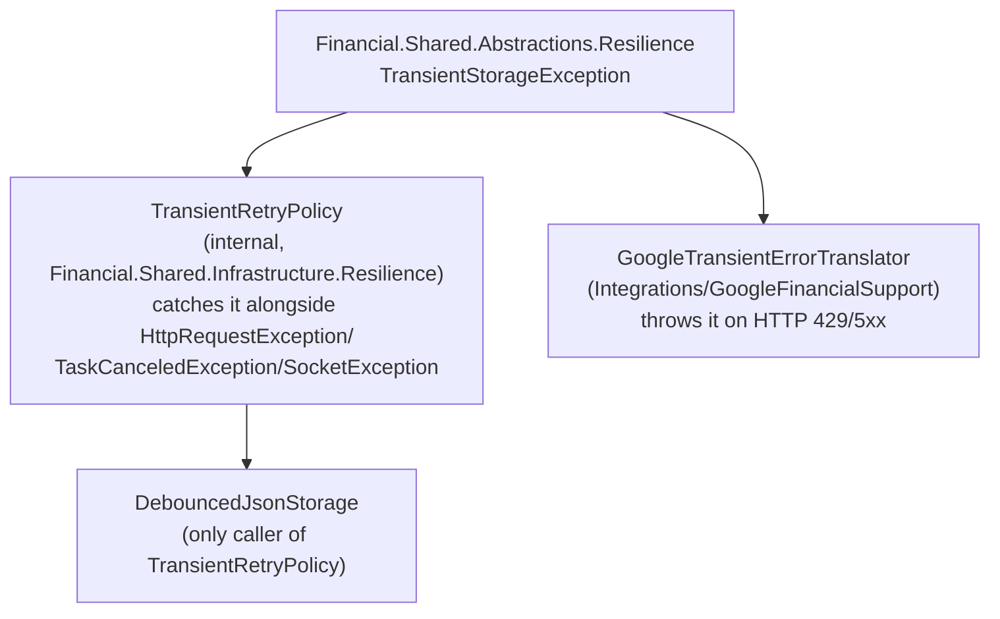

# F03. Resilience Abstraction Extraction

## 1. Technical Overview

**What:** Move `TransientStorageException` out of `Financial.Shared.Infrastructure.Resilience` into a new `Financial.Shared.Abstractions.Resilience` namespace, unchanged. `TransientRetryPolicy` (internal, used only inside `DebouncedJsonStorage`) stays in `Financial.Shared.Infrastructure.Resilience`, referencing the relocated exception type.

**Why:** `Integrations/GoogleFinancialSupport`'s `GoogleTransientErrorTranslator` throws `TransientStorageException` today only by referencing `Financial.Shared.Infrastructure` directly — the smallest instance of the same coupling F01/F02 already removed for storage and sync. This is the smallest of the four Wave 1 extractions: exactly one public type moves, one internal type stays behind and gets a `using` update, and a handful of consumers/tests follow.

**Scope:**
- Included: the `TransientStorageException` move; `TransientRetryPolicy`'s `using` update; every consumer's `using` statement fix-up (`GoogleTransientErrorTranslator`, `ControllableJsonStorage`, and the tests that reference the exception).
- Excluded (deferred to later features in this PRD): adding an explicit `ProjectReference` to `Financial.Shared.Abstractions` in `Integrations/GoogleFinancialSupport.csproj` (F09 — it keeps resolving the relocated type transitively through `Financial.Investment.Infrastructure` until then); `RepositoryProviderResolver` (F04); anything already moved by F01/F02.

## 2. Architecture Impact

**Affected components:**
- `Financial.Shared.Abstractions/Resilience/` (new folder) — receives `TransientStorageException.cs`
- `Financial.Shared.Infrastructure/Resilience/TransientRetryPolicy.cs` — `using` update only, still `internal`, still only reachable from `DebouncedJsonStorage`
- `Integrations/GoogleFinancialSupport/GoogleTransientErrorTranslator.cs` — `using` update only
- `Tests/Financial.Shared.Infrastructure.Tests/Persistence/ControllableJsonStorage.cs`, `Tests/Financial.Shared.Infrastructure.Tests/Persistence/DebouncedJsonStorageTests.cs`, `Tests/Financial.Shared.Infrastructure.Tests/Resilience/TransientRetryPolicyTests.cs`, `Tests/Financial.Investment.Infrastructure.Tests/Integrations/GoogleTransientErrorTranslatorTests.cs` — `using` update only



## 3. Technical Decisions

| Decision | Chosen Approach | Alternative Considered | Trade-off |
|----------|-----------------|-------------------------|-----------|
| `TransientRetryPolicy` stays `internal` in `Financial.Shared.Infrastructure` | Matches PRD Core Scope exactly — only `TransientStorageException` is public/shared; the retry loop itself is an implementation detail of `DebouncedJsonStorage` with no other caller | Move `TransientRetryPolicy` to Abstractions too | Rejected — PRD explicitly scopes this feature to the exception type only; the policy has no consumer outside `Financial.Shared.Infrastructure` |
| Dual `using` on files that need both the moved exception and the policy that stays behind | `TransientRetryPolicyTests.cs`, `DebouncedJsonStorageTests.cs` keep `using Financial.Shared.Infrastructure.Resilience;` (for `TransientRetryPolicy`) and add `using Financial.Shared.Abstractions.Resilience;` (for `TransientStorageException`) | Single using per file | Not possible — the two types now live in different namespaces; matches the same dual-using pattern F01 used for files needing both a moved interface and a type that stayed behind |

## 4. Component Overview

**New files (`Financial.Shared.Abstractions/Resilience/`):**

| File Path | New/Modified | Purpose |
|-----------|--------------|---------|
| `Financial.Shared.Abstractions/Resilience/TransientStorageException.cs` | New (moved) | Marks a storage failure as retryable; same constructor signature `(string message, Exception innerException)` |

**Modified files (`using` statement only, no logic change):**

| File Path | New/Modified | Purpose |
|-----------|--------------|---------|
| `Financial.Shared.Infrastructure/Resilience/TransientRetryPolicy.cs` | Modified | `IsRetryable` keeps catching `TransientStorageException` from the new namespace, plus `HttpRequestException`/`TaskCanceledException`/`SocketException` unchanged |
| `Integrations/GoogleFinancialSupport/GoogleTransientErrorTranslator.cs` | Modified | Throws the relocated `TransientStorageException` on HTTP 429/5xx, unchanged logic |

No Frontend, API, or Database changes. No API Contracts or Data Model sections apply.

## 5. API Contracts

N/A — internal exception type, never serialized or exposed at an API boundary.

## 6. Data Model

N/A — no persisted data.

## 7. Testing Strategy

No test behavior changes — every existing test for `TransientRetryPolicy`'s retry branches and `GoogleTransientErrorTranslator`'s HTTP-status-to-exception mapping keeps its exact assertions, only `using` statements move.

**Test files requiring a `using` update only:**

| Test File | Test Type | Target | Change |
|-----------|-----------|--------|--------|
| `Tests/Financial.Shared.Infrastructure.Tests/Resilience/TransientRetryPolicyTests.cs` | Unit | `TransientRetryPolicy` | Add `using Financial.Shared.Abstractions.Resilience;`, keep `using Financial.Shared.Infrastructure.Resilience;` |
| `Tests/Financial.Shared.Infrastructure.Tests/Persistence/DebouncedJsonStorageTests.cs` | Unit | `DebouncedJsonStorage` | Add `using Financial.Shared.Abstractions.Resilience;`, keep `using Financial.Shared.Infrastructure.Resilience;` (unused after this move — remove if the compiler flags it unused) |
| `Tests/Financial.Shared.Infrastructure.Tests/Persistence/ControllableJsonStorage.cs` | Test double | `IJsonStorage` test double that throws `TransientStorageException` | Replace `using Financial.Shared.Infrastructure.Resilience;` with `using Financial.Shared.Abstractions.Resilience;` |
| `Tests/Financial.Investment.Infrastructure.Tests/Integrations/GoogleTransientErrorTranslatorTests.cs` | Unit | `GoogleTransientErrorTranslator` | Replace `using Financial.Shared.Infrastructure.Resilience;` with `using Financial.Shared.Abstractions.Resilience;` |

**No new test files** — this feature adds no new logic to cover.

**Acceptance criteria this feature satisfies (PRD Section 9, F03):**
- `TransientStorageException` compiles in `Financial.Shared.Abstractions.Resilience` with the same constructor signature
- `TransientRetryPolicy.IsRetryable` in `Financial.Shared.Infrastructure` still catches the relocated exception type

**Verification commands:**
```
dotnet build --configuration Release
dotnet test --settings coverlet.runsettings --results-directory TestResults
```
Both must succeed with no other project's test behavior changed, confirming `main` stays deployable after this PR merges alone.
