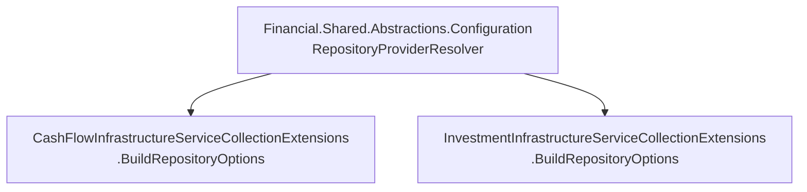

# F04. Configuration Abstraction Extraction

## 1. Technical Overview

**What:** Move `RepositoryProviderResolver` out of `Financial.Shared.Infrastructure.Configuration` into a new `Financial.Shared.Abstractions.Configuration` namespace, unchanged.

**Why:** `CashFlowInfrastructureServiceCollectionExtensions.BuildRepositoryOptions` and `InvestmentInfrastructureServiceCollectionExtensions.BuildRepositoryOptions` resolve their configured storage provider (Local vs Google Drive) today only by referencing `Financial.Shared.Infrastructure` directly. This is the smallest of the Wave 1 extractions after F03: one static class, two consumers, zero tests reference it directly (its `Enum.TryParse` behavior — default provider and unsupported-provider error message — is already exercised indirectly through `CashFlowInfrastructureServiceCollectionExtensionsTests`/`InvestmentInfrastructureServiceCollectionExtensionsTests`, which build a real DI container).

**Scope:**
- Included: the `RepositoryProviderResolver` move; the two DI extension files' `using` statement fix-up.
- Excluded (deferred to later features in this PRD): anything already moved by F01/F02/F03; removing the `ProjectReference` to `Financial.Shared.Infrastructure` (F06/F07).

## 2. Architecture Impact

**Affected components:**
- `Financial.Shared.Abstractions/Configuration/` (new folder) — receives `RepositoryProviderResolver.cs`
- `Financial.Shared.Infrastructure/Configuration/` — deleted (empty after the move)
- `Financial.CashFlow.Infrastructure/DependencyInjection/CashFlowInfrastructureServiceCollectionExtensions.cs`, `Financial.Investment.Infrastructure/DependencyInjection/InvestmentInfrastructureServiceCollectionExtensions.cs` — `using` update only



## 3. Technical Decisions

| Decision | Chosen Approach | Alternative Considered | Trade-off |
|----------|-----------------|-------------------------|-----------|
| `Financial.Shared.Infrastructure/Configuration/` folder | Delete it — nothing remains after the move | Leave an empty folder | Same precedent as F02's `Sync/` folder removal |
| No new coverage needed | `RepositoryProviderResolver.Resolve`'s default-provider and unsupported-provider-error branches are already exercised through `CashFlowInfrastructureServiceCollectionExtensionsTests`/`InvestmentInfrastructureServiceCollectionExtensionsTests` (real `ServiceProvider` resolution per the `dependency-injection-modules` testing pattern); no direct unit test exists today and none is added — this is a pure move | Add a dedicated `RepositoryProviderResolverTests.cs` | Rejected — no logic changed, and the existing DI-module tests already cover both branches at the layer where they matter (per `testing-guide-Financial`, DI module resolution is tested by resolving the real container, not by unit-testing the static helper in isolation) |

## 4. Component Overview

**New files (`Financial.Shared.Abstractions/Configuration/`):**

| File Path | New/Modified | Purpose |
|-----------|--------------|---------|
| `Financial.Shared.Abstractions/Configuration/RepositoryProviderResolver.cs` | New (moved) | `Resolve<TEnum>(string?, TEnum)` — same `Enum.TryParse` logic and `InvalidOperationException` message format |

**Modified files (`using` statement only, no logic change):**

| File Path | New/Modified | Purpose |
|-----------|--------------|---------|
| `Financial.CashFlow.Infrastructure/DependencyInjection/CashFlowInfrastructureServiceCollectionExtensions.cs` | Modified | `BuildRepositoryOptions` keeps calling `RepositoryProviderResolver.Resolve(...)` from the new namespace |
| `Financial.Investment.Infrastructure/DependencyInjection/InvestmentInfrastructureServiceCollectionExtensions.cs` | Modified | Same as CashFlow's equivalent |

No Frontend, API, or Database changes. No API Contracts or Data Model sections apply.

## 5. API Contracts

N/A — internal configuration-resolution helper, never exposed at an API boundary.

## 6. Data Model

N/A — no persisted data.

## 7. Testing Strategy

No test behavior changes. Every existing DI-module test (default provider selection, unsupported-provider error) keeps its exact assertions.

**Test files requiring re-verification (no `using` change expected — they don't reference `RepositoryProviderResolver` by name, only through `AddFinancialCashFlowInfrastructure`/`AddFinancialInfrastructure`):**

| Test File | Test Type | Target |
|-----------|-----------|--------|
| `Tests/Financial.CashFlow.Infrastructure.Tests/DependencyInjection/CashFlowInfrastructureServiceCollectionExtensionsTests.cs` | Unit (real container) | Default + unsupported provider resolution |
| `Tests/Financial.Investment.Infrastructure.Tests/DependencyInjection/InvestmentInfrastructureServiceCollectionExtensionsTests.cs` | Unit (real container) | Default + unsupported provider resolution |

**No new test files** — this feature adds no new logic to cover.

**Acceptance criteria this feature satisfies (PRD Section 9, F04):**
- `RepositoryProviderResolver.Resolve<TEnum>` compiles in `Financial.Shared.Abstractions.Configuration` with identical behavior, including the `InvalidOperationException` message format on an unrecognized provider value

**Verification commands:**
```
dotnet build --configuration Release
dotnet test --settings coverlet.runsettings --results-directory TestResults
```
Both must succeed with no other project's test behavior changed, confirming `main` stays deployable after this PR merges alone.
