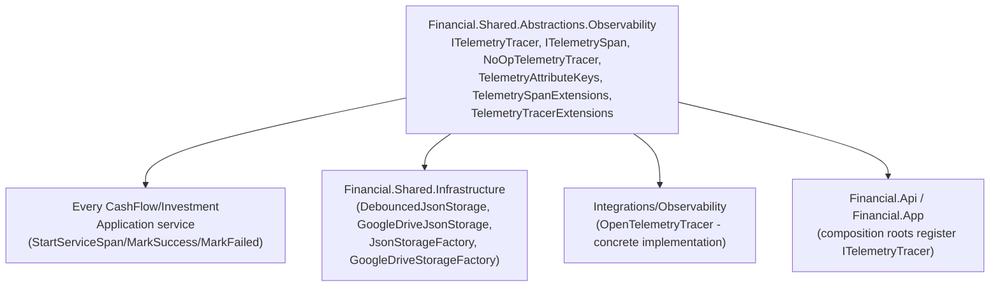

# F05. Observability Namespace Reorganization

## 1. Technical Overview

**What:** Move `ITelemetryTracer`, `ITelemetrySpan`, `NoOpTelemetryTracer`, `TelemetryAttributeKeys` (and its sibling `TelemetryOperationResults`, defined in the same file), `TelemetrySpanExtensions`, and `TelemetryTracerExtensions` from the flat `Financial.Shared.Abstractions` namespace into `Financial.Shared.Abstractions.Observability`, keeping every member and signature unchanged.

**Why:** These six types are the only ones left directly in the flat `Financial.Shared.Abstractions` namespace — F01–F04 already extracted Persistence, Sync, Resilience, and Configuration into their own per-concern subnamespaces. Observability's split (interface in Abstractions, concrete `OpenTelemetryTracer` implementation in a separate `Integrations/Observability` project, wired only at the composition root) is already the reference pattern this whole PRD generalizes — this feature just gives it the same folder/namespace shape as every other concern, so a maintainer reading `Financial.Shared.Abstractions/` sees one consistent convention rather than "everything else is organized by concern, Observability is flat because it came first."

**Scope:**
- Included: the six-file move; a mechanical `using` fix-up in every one of the 82 consumer files across the solution that references any of these types (plus 2 files using fully-qualified `Financial.Shared.Abstractions.ITelemetryTracer`/`NoOpTelemetryTracer` instead of a `using` directive).
- Excluded: no consumer's actual tracing/instrumentation logic changes — `StartServiceSpan`, `MarkSuccess`, `MarkFailed` behave identically; `ObservabilityIsolationRuleTests` (which asserts on assembly references, not namespaces) is expected to pass completely unmodified.

## 2. Architecture Impact

**Affected components:**
- `Financial.Shared.Abstractions/Observability/` (new folder) — receives all six files
- `Financial.Shared.Abstractions/` flat root — now empty; nothing remains directly in the `Financial.Shared.Abstractions` namespace after this feature
- 82 consumer files across `Financial.CashFlow.Application` (17), `Financial.Investment.Application` (10), `Financial.CashFlow.Infrastructure` (2), `Financial.Investment.Infrastructure` (2), `Financial.Shared.Infrastructure` (4), `Financial.App` (2), `Integrations/*` (2), and their `Tests/*` counterparts (43) — `using` statement only
- `Tests/Financial.CashFlow.Infrastructure.Tests/DependencyInjection/CashFlowInfrastructureServiceCollectionExtensionsTests.cs`, `Tests/Financial.Investment.Infrastructure.Tests/DependencyInjection/InvestmentInfrastructureServiceCollectionExtensionsTests.cs` — these two reference `Financial.Shared.Abstractions.ITelemetryTracer`/`NoOpTelemetryTracer` by fully-qualified name (no `using` directive) and need the qualified name itself updated, not just a `using` line



## 3. Technical Decisions

| Decision | Chosen Approach | Alternative Considered | Trade-off |
|----------|-----------------|-------------------------|-----------|
| `TelemetryOperationResults` (defined in `TelemetryAttributeKeys.cs`, not separately named in the PRD's type list) | Moves together with `TelemetryAttributeKeys` since it's physically the same file | Split it into its own file/location | Rejected — it's a companion constants class always used alongside `TelemetryAttributeKeys` (`MarkSuccess`/`MarkFailed` reference both); moving the file as a unit is the faithful "keep every member and signature unchanged" interpretation |
| Bulk mechanical `using` replace across 82 files | One global find-and-replace (`using Financial.Shared.Abstractions;` → `using Financial.Shared.Abstractions.Observability;`), verified safe because after F01–F04 nothing else remains in the flat namespace for any file to depend on | File-by-file manual review | The blanket replace is correct by construction (confirmed via `find "Financial.Shared.Abstractions" -maxdepth 1 -name "*.cs"` returning empty after the move) and matches this PRD's own precedent for repeats-identically-across-many-files changes being exempt from the project's PR-size guideline |
| Two files using fully-qualified names instead of `using` | Caught by the build (`CS0234`), fixed by updating the qualified name itself (`Financial.Shared.Abstractions.ITelemetryTracer` → `Financial.Shared.Abstractions.Observability.ITelemetryTracer`) | Add a `using` alias instead | Simpler and consistent with how the rest of the codebase references these types directly, without introducing an alias just for two call sites |

## 4. Component Overview

**Moved files (`Financial.Shared.Abstractions/Observability/`):**

| File Path | New/Modified | Purpose |
|-----------|--------------|---------|
| `Financial.Shared.Abstractions/Observability/ITelemetryTracer.cs` | New (moved) | `StartSpan(string)` contract |
| `Financial.Shared.Abstractions/Observability/ITelemetrySpan.cs` | New (moved) | `SetAttribute`/`RecordException`, `IDisposable` |
| `Financial.Shared.Abstractions/Observability/NoOpTelemetryTracer.cs` | New (moved) | Null-object `ITelemetryTracer`/`ITelemetrySpan` pair |
| `Financial.Shared.Abstractions/Observability/TelemetryAttributeKeys.cs` | New (moved) | `TelemetryAttributeKeys` + `TelemetryOperationResults` constants |
| `Financial.Shared.Abstractions/Observability/TelemetrySpanExtensions.cs` | New (moved) | `MarkSuccess`/`MarkFailed` extension methods |
| `Financial.Shared.Abstractions/Observability/TelemetryTracerExtensions.cs` | New (moved) | `StartServiceSpan` extension method |

**Modified files (`using` statement only, no logic change) — 84 files total:**

| Area | File count | Representative examples |
|------|-----------|--------------------------|
| `Financial.CashFlow.Application/Services/*.cs` | 17 | `ExpenseService`, `TitheService`, `ControleMaeService`, ... |
| `Financial.Investment.Application/Services/*.cs` (and adjacent) | 10 | Application services calling `StartServiceSpan` |
| `Financial.Shared.Infrastructure` (Persistence classes) | 4 | `DebouncedJsonStorage`, `GoogleDriveJsonStorage`, `JsonStorageFactory`, `GoogleDriveStorageFactory` |
| `Financial.CashFlow.Infrastructure` / `Financial.Investment.Infrastructure` | 4 | DI extensions, repository factories |
| `Financial.App` | 2 | `App.xaml.cs`, `MonthlyViewModel.cs` |
| `Integrations/*` | 2 | `Integrations/Observability`'s `OpenTelemetryTracer`, `GoogleFinancialSupport` |
| `Tests/*` | 43 | Every test file that stubs/asserts against `ITelemetryTracer`/`RecordingTelemetryTracer` |
| Fully-qualified name fix (no `using` line) | 2 | `CashFlowInfrastructureServiceCollectionExtensionsTests.cs`, `InvestmentInfrastructureServiceCollectionExtensionsTests.cs` |

No Frontend, API, or Database changes. No API Contracts or Data Model sections apply.

## 5. API Contracts

N/A — internal cross-cutting instrumentation contracts, never exposed at an API boundary.

## 6. Data Model

N/A — no persisted data.

## 7. Testing Strategy

No test behavior changes — every existing test asserting on span names, attributes, `MarkSuccess`/`MarkFailed` outcomes, or DI resolution of `ITelemetryTracer` keeps its exact assertions. Only `using` statements (or, for the two fully-qualified references, the qualified name itself) change.

**Acceptance criteria this feature satisfies (PRD Section 9, F05):**
- `ITelemetryTracer`, `ITelemetrySpan`, `NoOpTelemetryTracer`, `TelemetryAttributeKeys`, `TelemetrySpanExtensions`, `TelemetryTracerExtensions` compile in `Financial.Shared.Abstractions.Observability`
- Every existing consumer (`Financial.CashFlow.Infrastructure`, `Financial.Investment.Infrastructure`, `Financial.Shared.Infrastructure`, `Integrations/Observability`, `Financial.Api`, `Financial.App`) builds successfully against the new namespace
- `ObservabilityIsolationRuleTests` passes unmodified — verified: the test file itself required no code change and its 24 sibling architecture tests all still pass

**No new test files** — this feature adds no new logic to cover.

**Verification commands:**
```
dotnet build --configuration Release
dotnet test --settings coverlet.runsettings --results-directory TestResults
```
Both must succeed with no other project's test behavior changed, confirming `main` stays deployable after this PR merges alone. This completes Wave 1 (F01–F05) of the PRD.
