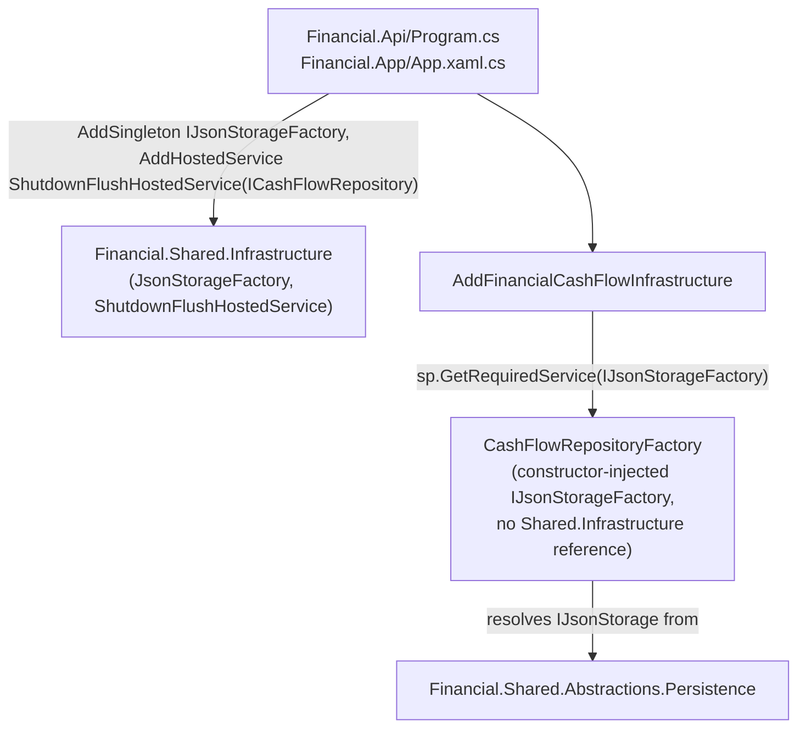

# F06. CashFlow Infrastructure Dependency Realignment

## 1. Technical Overview

**What:** Drop `Financial.CashFlow.Infrastructure`'s `ProjectReference` to `Financial.Shared.Infrastructure` entirely. `CashFlowRepositoryFactory` receives `IJsonStorageFactory` via constructor injection instead of instantiating `JsonStorageFactory` itself (the interim compile-fix F01 introduced). `CashFlowInfrastructureServiceCollectionExtensions.AddFinancialCashFlowInfrastructure` resolves `IJsonStorageFactory` from the container instead of constructing storage inline, and stops registering `ShutdownFlushHostedService<ICashFlowRepository>` itself.

**Why:** F01 moved the storage contracts to `Financial.Shared.Abstractions`, but `Financial.CashFlow.Infrastructure` still reaches into `Financial.Shared.Infrastructure` directly (the `ProjectReference` itself, plus `CashFlowRepositoryFactory`'s inline `new JsonStorageFactory(...)`, plus `AddFinancialCashFlowInfrastructure`'s own `AddHostedService<ShutdownFlushHostedService<...>>()` call). This feature is what actually severs that reference, completing the isolation F01 set up the contracts for.

**Scope:**
- Included: everything in PRD Core Scope for F06, plus the composition-root wiring change described in the Technical Decisions section below (required for CashFlow to keep working at runtime — see the "why now, not F08" rationale).
- Excluded (deferred): `Financial.Investment.Infrastructure`'s equivalent realignment (F07); `Integrations/GoogleFinancialSupport`'s explicit `Financial.Shared.Abstractions` reference (F09); the architecture-test enforcement (F10).

## 2. Architecture Impact

**Affected components:**
- `Financial.CashFlow.Infrastructure/Financial.CashFlow.Infrastructure.csproj` — drops the `ProjectReference` to `Financial.Shared.Infrastructure`
- `Financial.CashFlow.Infrastructure/Repositories/CashFlowRepositoryFactory.cs` — constructor takes `IJsonStorageFactory` instead of `IRemoteFileClientFactory?`/`ITelemetryTracer?`/`ILogger?`; `CreateStorage` calls the injected factory directly
- `Financial.CashFlow.Infrastructure/DependencyInjection/CashFlowInfrastructureServiceCollectionExtensions.cs` — resolves `IJsonStorageFactory` from `sp`, drops the `AddHostedService<ShutdownFlushHostedService<ICashFlowRepository>>()` call and the now-unused `Microsoft.Extensions.Hosting` `using`
- `Financial.Shared.Infrastructure/Persistence/JsonStorageFactory.cs` — `remoteFileClientFactory` constructor parameter gets a `= null` default (see Technical Decisions)
- `Financial.Api/Program.cs`, `Financial.App/App.xaml.cs` — register `IJsonStorageFactory` (before both `Add*Infrastructure` calls) and `ShutdownFlushHostedService<ICashFlowRepository>` (after `AddFinancialCashFlowInfrastructure`) — the CashFlow-relevant half of F08's composition-root wiring, pulled forward (see Technical Decisions)
- `Tests/Financial.CashFlow.Infrastructure.Tests/Repositories/CashFlowRepositoryFactoryTests.cs` — constructor call sites updated to pass a real `JsonStorageFactory` (the test project keeps its transitive reference to `Financial.Shared.Infrastructure` via `Financial.TestUtilities`)
- `Tests/Financial.CashFlow.Infrastructure.Tests/DependencyInjection/CashFlowInfrastructureServiceCollectionExtensionsTests.cs` — `BuildServiceProvider` registers `IJsonStorageFactory`; the hosted-service-registration test is removed (the behavior it tested no longer lives in this extension method)
- `Tests/Financial.Presentation.Tests/DependencyInjection/{CashFlowServiceRegistrationTests,ObservabilityServiceRegistrationTests}.cs` — `BuildServiceProvider` registers `IJsonStorageFactory`
- New: `Tests/Financial.Api.Tests/ShutdownFlushHostedServiceRegistrationTests.cs` — verifies the real host (`ApiTestFactory`, which boots the actual `Program.cs`) registers `ShutdownFlushHostedService<ICashFlowRepository>`, replacing the coverage lost by removing the extension-method-level test



## 3. Technical Decisions

| Decision | Chosen Approach | Alternative Considered | Trade-off |
|----------|-----------------|-------------------------|-----------|
| Composition-root registration timing | Pull forward the CashFlow-relevant half of F08's Core Scope (`IJsonStorageFactory` + `ShutdownFlushHostedService<ICashFlowRepository>` registration in `Program.cs`/`App.xaml.cs`) into this PR, rather than waiting for F08's own PR | Land F06 alone and let `main` be temporarily non-deployable until F08 also merges | Rejected — once `CashFlowInfrastructureServiceCollectionExtensions` stops self-registering the hosted service and stops constructing storage inline, `Financial.Api`/`Financial.App` would either crash at DI-resolution time (`IJsonStorageFactory` unregistered) or silently stop flushing pending CashFlow writes on shutdown (a data-loss regression) — both violate the hard "main always deployable, no regressions" constraint (CLAUDE.md invariant #5). F07 will do the identical pull-forward for Investment's half; by the time the F08 feature is reached, its Core Scope will already be satisfied and F08's own PR will mainly be a verification pass |
| `JsonStorageFactory`'s `remoteFileClientFactory` parameter gets `= null` | Needed so `services.AddSingleton<IJsonStorageFactory, JsonStorageFactory>()` can construct the type via pure DI reflection in contexts where `IRemoteFileClientFactory` isn't registered (the three minimal test containers below) — matches the same nullable-with-default pattern `CashFlowRepositoryFactory`'s own constructor already uses. C# requires every parameter after the first optional one to also be optional, so `tracer` gets `= null!` too — its own null-guard (`?? throw new ArgumentNullException`) still fires if DI construction is ever attempted without `ITelemetryTracer` registered, which never happens in practice (both composition roots and all three test containers touched by this feature always register it) | Register a stub `IRemoteFileClientFactory` in every minimal test container instead; or reorder the constructor's parameters instead of defaulting `tracer` | Rejected the stub-registration alternative — a constructor default is a one-line, purely-additive change versus three separate test-container changes, and it matches production reality (`AddGoogleDriveFileClient()` is called unconditionally at both real composition roots). Rejected reordering — it would require also touching `InvestmentRepositoryFactory.cs`'s untouched positional call site to `new JsonStorageFactory(...)`, which is out of scope for F06 |
| `IJsonStorageFactory` registration in `CashFlowInfrastructureServiceCollectionExtensionsTests`, `CashFlowServiceRegistrationTests`, `ObservabilityServiceRegistrationTests` | Each minimal test container adds `services.AddSingleton<IJsonStorageFactory, JsonStorageFactory>();`, mirroring the real composition roots exactly | Give these tests a hand-written fake `IJsonStorageFactory` | Rejected — these tests exist to catch a missing-registration bug the same way the real host would hit it; using the real `JsonStorageFactory` (already covered by its own `JsonStorageFactoryTests`) proves DI wiring end-to-end without adding a redundant test double |
| Coverage for the moved hosted-service registration | New `ShutdownFlushHostedServiceRegistrationTests.cs` in `Financial.Api.Tests`, using `ApiTestFactory` (which boots the real `Program.cs`) to assert `ShutdownFlushHostedService<ICashFlowRepository>` is present in `IHostedService` | Extend `CashFlowInfrastructureServiceCollectionExtensionsTests` instead | Rejected — the registration no longer belongs to `AddFinancialCashFlowInfrastructure`; testing it there would mean re-implementing the composition root's own wiring inside the test, which drifts from what's actually registered. Testing via the real booted host is strictly more faithful. No equivalent WPF-side test is added — `Financial.App`'s composition root has no existing pattern for booting the real host and inspecting hosted services (consistent with F08's own acceptance criteria treating the WPF shutdown-flush check as a manual verification, not an automated one) |

## 4. Component Overview

| File Path | New/Modified | Purpose | Key Responsibilities |
|-----------|--------------|---------|------------------------|
| `Financial.CashFlow.Infrastructure/Financial.CashFlow.Infrastructure.csproj` | Modified | Project references | Drops `ProjectReference` to `Financial.Shared.Infrastructure`; `Financial.Shared.Abstractions` remains reachable transitively via the existing `Financial.CashFlow.Application` reference |
| `Financial.CashFlow.Infrastructure/Repositories/CashFlowRepositoryFactory.cs` | Modified | CashFlow repository construction | Constructor `(ICashFlowSerializer, IJsonStorageFactory)`; `CreateStorage` calls `_storageFactory.CreateLocal`/`.CreateGoogleDrive` directly, no inline instantiation |
| `Financial.CashFlow.Infrastructure/DependencyInjection/CashFlowInfrastructureServiceCollectionExtensions.cs` | Modified | DI wiring | `AddFinancialCashFlowInfrastructure` resolves `IJsonStorageFactory` via `sp.GetRequiredService`; no longer calls `AddHostedService<ShutdownFlushHostedService<ICashFlowRepository>>()` |
| `Financial.Shared.Infrastructure/Persistence/JsonStorageFactory.cs` | Modified | Concrete storage factory | `remoteFileClientFactory` constructor parameter gets a `= null` default |
| `Financial.Api/Program.cs` | Modified | API composition root | Registers `IJsonStorageFactory` and `ShutdownFlushHostedService<ICashFlowRepository>` |
| `Financial.App/App.xaml.cs` | Modified | WPF composition root | Same two registrations as `Program.cs` |
| `Tests/Financial.CashFlow.Infrastructure.Tests/Repositories/CashFlowRepositoryFactoryTests.cs` | Modified | Factory tests | Constructs `CashFlowRepositoryFactory` with a real `JsonStorageFactory` in place of the old constructor's separate parameters |
| `Tests/Financial.CashFlow.Infrastructure.Tests/DependencyInjection/CashFlowInfrastructureServiceCollectionExtensionsTests.cs` | Modified | DI module tests | `BuildServiceProvider` registers `IJsonStorageFactory`; removes the hosted-service-registration test |
| `Tests/Financial.Presentation.Tests/DependencyInjection/CashFlowServiceRegistrationTests.cs`, `ObservabilityServiceRegistrationTests.cs` | Modified | DI module tests | `BuildServiceProvider` registers `IJsonStorageFactory` |
| `Tests/Financial.Api.Tests/ShutdownFlushHostedServiceRegistrationTests.cs` | New | E2E-level DI verification | Boots the real host via `ApiTestFactory`, asserts `ShutdownFlushHostedService<ICashFlowRepository>` is registered |

No Frontend, API contract, or Database changes.

## 5. API Contracts

N/A — internal DI wiring change; no HTTP-visible behavior changes.

## 6. Data Model

N/A — no persisted schema changes; storage selection and debounce behavior are unchanged, only how the storage factory is obtained.

## 7. Testing Strategy

**Test files requiring behavior-relevant updates (not pure `using` swaps):**

| Test File | Test Type | Change |
|-----------|-----------|--------|
| `Tests/Financial.CashFlow.Infrastructure.Tests/Repositories/CashFlowRepositoryFactoryTests.cs` | Unit/Integration | Every `new CashFlowRepositoryFactory(...)` call site updated to pass a `JsonStorageFactory` instance instead of the old separate parameters; assertions unchanged |
| `Tests/Financial.CashFlow.Infrastructure.Tests/DependencyInjection/CashFlowInfrastructureServiceCollectionExtensionsTests.cs` | Unit (real container) | Add `IJsonStorageFactory` registration to `BuildServiceProvider`; remove `AddFinancialCashFlowInfrastructure_RegistersCashFlowShutdownFlushHostedService` |
| `Tests/Financial.Presentation.Tests/DependencyInjection/CashFlowServiceRegistrationTests.cs` | Unit (real container) | Add `IJsonStorageFactory` registration to `BuildServiceProvider` |
| `Tests/Financial.Presentation.Tests/DependencyInjection/ObservabilityServiceRegistrationTests.cs` | Unit (real container) | Add `IJsonStorageFactory` registration to `BuildServiceProvider` |

**New test file:**

| Test File | Test Type | Target | Coverage Goal |
|-----------|-----------|--------|-----------------|
| `Tests/Financial.Api.Tests/ShutdownFlushHostedServiceRegistrationTests.cs` | E2E (`ApiTestFactory`, real `Program.cs`) | Composition-root hosted-service wiring | `factory.Services.GetServices<IHostedService>()` contains `ShutdownFlushHostedService<ICashFlowRepository>` |

**Acceptance criteria this feature satisfies (PRD Section 9, F06):**
- `Financial.CashFlow.Infrastructure.csproj` has no `ProjectReference` to `Financial.Shared.Infrastructure.csproj`
- `dotnet build Financial.CashFlow.Infrastructure` succeeds standalone
- All existing `Financial.CashFlow.Infrastructure.Tests` pass (one test removed because its behavior moved to the composition root, replaced by equivalent coverage at the new home — the closest achievable reading of "unmodified behavior" given the Core Scope explicitly moves this responsibility)
- Local and Google Drive provider selection for CashFlow data still produces a working repository, verified by `CashFlowRepositoryFactoryTests`

**Verification commands:**
```
dotnet build --configuration Release
dotnet test --settings coverlet.runsettings --results-directory TestResults
```
Both must succeed, confirming `main` stays deployable after this PR merges alone — including a working shutdown flush, verified by the new `ShutdownFlushHostedServiceRegistrationTests`.
