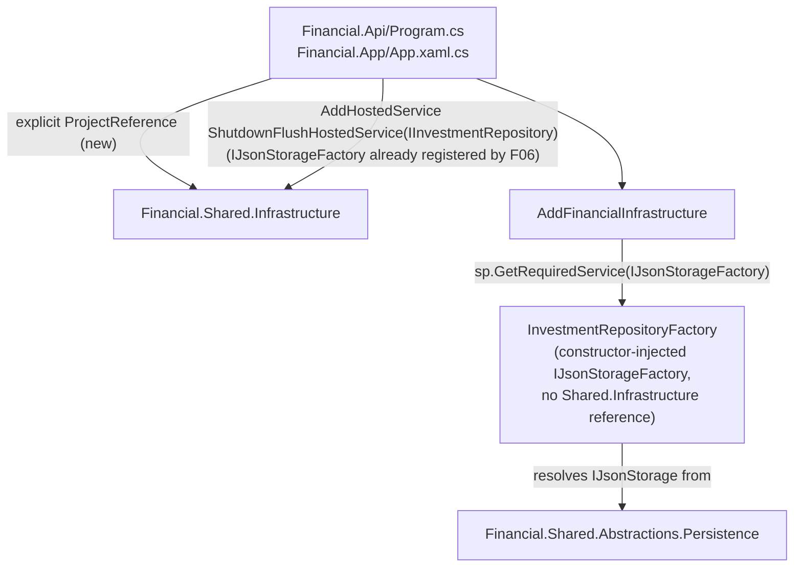

# F07. Investment Infrastructure Dependency Realignment

## 1. Technical Overview

**What:** Drop `Financial.Investment.Infrastructure`'s `ProjectReference` to `Financial.Shared.Infrastructure` entirely — the mirror of F06 for the Investment bounded context. `InvestmentRepositoryFactory` receives `IJsonStorageFactory` via constructor injection instead of instantiating `JsonStorageFactory` itself (F01's interim compile-fix). `InvestmentInfrastructureServiceCollectionExtensions.AddFinancialInfrastructure` resolves `IJsonStorageFactory` from the container instead of constructing storage inline, and stops registering `ShutdownFlushHostedService<IInvestmentRepository>` itself.

**Why:** Same rationale as F06 — F01 moved the storage contracts to `Financial.Shared.Abstractions`, but `Financial.Investment.Infrastructure` still reaches into `Financial.Shared.Infrastructure` directly.

**Scope:**
- Included: everything in PRD Core Scope for F07, plus the composition-root wiring this feature now depends on (see Technical Decisions — same "why now, not F08" rationale as F06, with one addition specific to F07), plus one PRD-unanticipated fix: `Tools/ImportGoogleSpreadSheets` (in-solution, not mentioned anywhere in the PRD) used `LocalJsonStorage` only by riding `Financial.Investment.Infrastructure`'s transitive reference to `Financial.Shared.Infrastructure`. Once that reference is dropped, the tool needs its own explicit `ProjectReference` to keep building — a one-line, unavoidable fix surfaced by the full-solution build, not a scope choice.
- Excluded (deferred): `Integrations/GoogleFinancialSupport`'s explicit `Financial.Shared.Abstractions` reference (F09 — unaffected by this feature, since `GoogleFinancialSupport` still reaches `Financial.Shared.Abstractions` transitively via `Financial.Investment.Infrastructure` → `Financial.Investment.Application`, which is untouched here); the architecture-test enforcement (F10).

## 2. Architecture Impact

**Affected components:**
- `Financial.Investment.Infrastructure/Financial.Investment.Infrastructure.csproj` — drops the `ProjectReference` to `Financial.Shared.Infrastructure`
- `Financial.Investment.Infrastructure/Repositories/InvestmentRepositoryFactory.cs` — constructor takes `IJsonStorageFactory` instead of `IRemoteFileClientFactory?`/`ITelemetryTracer?`/`ILogger?`; `CreateStorage` calls the injected factory directly
- `Financial.Investment.Infrastructure/DependencyInjection/InvestmentInfrastructureServiceCollectionExtensions.cs` — resolves `IJsonStorageFactory` from `sp`, drops the `AddHostedService<ShutdownFlushHostedService<IInvestmentRepository>>()` call and the now-unused `Microsoft.Extensions.Hosting` `using`
- `Financial.Api/Financial.Api.csproj`, `Financial.App/Financial.App.csproj` — **new for F07** (F06 didn't need this): add an explicit `ProjectReference` to `Financial.Shared.Infrastructure`. Once Investment.Infrastructure also drops its reference, neither bounded-context Infrastructure project provides a transitive path to it any more, and both composition roots' `Program.cs`/`App.xaml.cs` already use `JsonStorageFactory`/`ShutdownFlushHostedService<T>` directly (since F06)
- `Financial.Api/Program.cs`, `Financial.App/App.xaml.cs` — register `ShutdownFlushHostedService<IInvestmentRepository>` (after `AddFinancialInfrastructure`); `IJsonStorageFactory`'s own registration already exists from F06 and needs no change
- `Tests/Financial.Investment.Infrastructure.Tests/Repositories/InvestmentRepositoryFactoryTests.cs` — constructor call sites updated to pass a real `JsonStorageFactory` (the test project keeps its transitive reference to `Financial.Shared.Infrastructure` via `Financial.TestUtilities`)
- `Tests/Financial.Investment.Infrastructure.Tests/DependencyInjection/InvestmentInfrastructureServiceCollectionExtensionsTests.cs` — `BuildServiceProvider` registers `IJsonStorageFactory`; the hosted-service-registration test is removed
- `Tests/Financial.Api.Tests/ShutdownFlushHostedServiceRegistrationTests.cs` — extended with a second fact asserting `ShutdownFlushHostedService<IInvestmentRepository>` is also registered



## 3. Technical Decisions

| Decision | Chosen Approach | Alternative Considered | Trade-off |
|----------|-----------------|-------------------------|-----------|
| Composition-root registration timing | Same pull-forward rationale as F06: register `ShutdownFlushHostedService<IInvestmentRepository>` in `Program.cs`/`App.xaml.cs` now, rather than waiting for F08 | Land F07 alone and let `main` be temporarily non-deployable until F08 merges | Rejected for the identical reason F06 documented — CLAUDE.md invariant #5. `IJsonStorageFactory` itself needs no new registration here since F06 already added it (shared by both contexts) |
| Explicit `ProjectReference` to `Financial.Shared.Infrastructure` in `Financial.Api.csproj`/`Financial.App.csproj` | Add it now, in F07, rather than in F08 | Leave it to F08, accepting that `main` won't build between F07 merging and F08 landing | Rejected — same "main always deployable" constraint. F06 didn't need this because `Financial.Investment.Infrastructure` (untouched by F06) still provided a transitive path to `Financial.Shared.Infrastructure` for `Financial.Api`/`Financial.App`. F07 removes that last transitive path, so the composition roots need their own direct reference the moment this PR merges — not a moment later. This satisfies F08's own Capabilities bullet ("Financial.Api and Financial.App are the only two composition-root projects with a ProjectReference to Financial.Shared.Infrastructure") ahead of F08's own PR, mirroring how F06 already pulled forward the registration half of F08's scope |
| Coverage for the second hosted-service registration | Add a second `[Fact]` to the existing `ShutdownFlushHostedServiceRegistrationTests` (from F06) rather than a new file | New dedicated test file | Rejected a new file — one file asserting both hosted services are registered in the real host reads better than two near-duplicate files, and keeps the "shutdown flush is wired for both bounded contexts" invariant in one place |

## 4. Component Overview

| File Path | New/Modified | Purpose | Key Responsibilities |
|-----------|--------------|---------|------------------------|
| `Financial.Investment.Infrastructure/Financial.Investment.Infrastructure.csproj` | Modified | Project references | Drops `ProjectReference` to `Financial.Shared.Infrastructure`; `Financial.Shared.Abstractions` remains reachable transitively via the existing `Financial.Investment.Application` reference |
| `Financial.Investment.Infrastructure/Repositories/InvestmentRepositoryFactory.cs` | Modified | Investment repository construction | Constructor `(IInvestmentsSerializer, IJsonStorageFactory)`; `CreateStorage` calls `_storageFactory.CreateLocal`/`.CreateGoogleDrive` directly |
| `Financial.Investment.Infrastructure/DependencyInjection/InvestmentInfrastructureServiceCollectionExtensions.cs` | Modified | DI wiring | `AddFinancialInfrastructure` resolves `IJsonStorageFactory` via `sp.GetRequiredService`; no longer calls `AddHostedService<ShutdownFlushHostedService<IInvestmentRepository>>()` |
| `Financial.Api/Financial.Api.csproj` | Modified | Project references | Adds explicit `ProjectReference` to `Financial.Shared.Infrastructure` |
| `Financial.App/Financial.App.csproj` | Modified | Project references | Adds explicit `ProjectReference` to `Financial.Shared.Infrastructure` |
| `Financial.Api/Program.cs` | Modified | API composition root | Registers `ShutdownFlushHostedService<IInvestmentRepository>` |
| `Financial.App/App.xaml.cs` | Modified | WPF composition root | Same registration as `Program.cs` |
| `Tests/Financial.Investment.Infrastructure.Tests/Repositories/InvestmentRepositoryFactoryTests.cs` | Modified | Factory tests | Constructs `InvestmentRepositoryFactory` with a real `JsonStorageFactory` in place of the old separate constructor parameters |
| `Tests/Financial.Investment.Infrastructure.Tests/DependencyInjection/InvestmentInfrastructureServiceCollectionExtensionsTests.cs` | Modified | DI module tests | `BuildServiceProvider` registers `IJsonStorageFactory`; removes the hosted-service-registration test |
| `Tests/Financial.Api.Tests/ShutdownFlushHostedServiceRegistrationTests.cs` | Modified | E2E-level DI verification | Adds a second fact for `ShutdownFlushHostedService<IInvestmentRepository>` |

No Frontend, API contract, or Database changes.

## 5. API Contracts

N/A — internal DI wiring change; no HTTP-visible behavior changes.

## 6. Data Model

N/A — no persisted schema changes.

## 7. Testing Strategy

**Test files requiring behavior-relevant updates (not pure `using` swaps):**

| Test File | Test Type | Change |
|-----------|-----------|--------|
| `Tests/Financial.Investment.Infrastructure.Tests/Repositories/InvestmentRepositoryFactoryTests.cs` | Unit/Integration | Every `new InvestmentRepositoryFactory(...)` call site updated to pass a `JsonStorageFactory` instance; assertions unchanged |
| `Tests/Financial.Investment.Infrastructure.Tests/DependencyInjection/InvestmentInfrastructureServiceCollectionExtensionsTests.cs` | Unit (real container) | Add `IJsonStorageFactory` registration to `BuildServiceProvider`; remove `AddFinancialInfrastructure_RegistersInvestmentShutdownFlushHostedService` |
| `Tests/Financial.Api.Tests/ShutdownFlushHostedServiceRegistrationTests.cs` | E2E (`ApiTestFactory`, real `Program.cs`) | Add a fact asserting `ShutdownFlushHostedService<IInvestmentRepository>` is also registered |

**Acceptance criteria this feature satisfies (PRD Section 9, F07):**
- `Financial.Investment.Infrastructure.csproj` has no `ProjectReference` to `Financial.Shared.Infrastructure.csproj`
- `dotnet build Financial.Investment.Infrastructure` succeeds standalone
- All existing `Financial.Investment.Infrastructure.Tests` pass (one test removed because its behavior moved to the composition root, replaced by equivalent coverage at the new home — same reasoning as F06)
- Local and Google Drive provider selection for Investment data still produces a working repository, verified by `InvestmentRepositoryFactoryTests`

**Verification commands:**
```
dotnet build --configuration Release
dotnet test --settings coverlet.runsettings --results-directory TestResults
```
Both must succeed, confirming `main` stays deployable after this PR merges alone — including a working shutdown flush for both bounded contexts.
