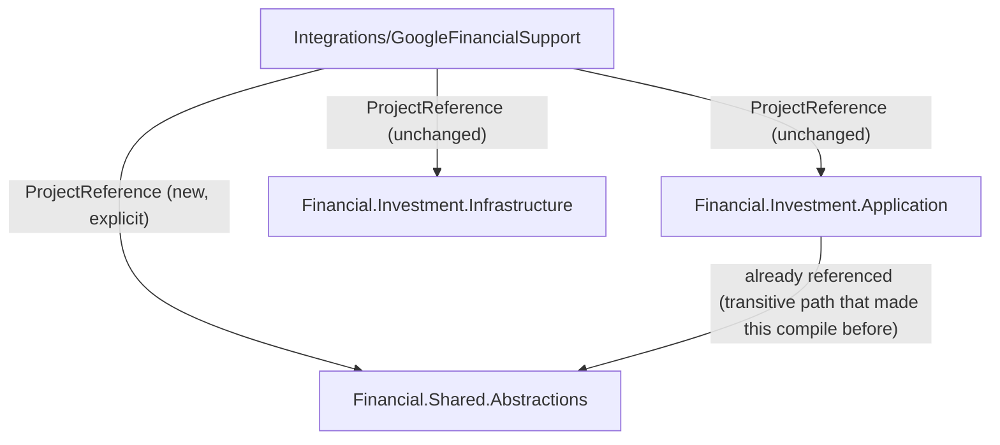

# F09. GoogleFinancialSupport Integration Reference Realignment

## 1. Technical Overview

**What:** Add an explicit `ProjectReference` to `Financial.Shared.Abstractions` in `Integrations/GoogleFinancialSupport/GoogleFinancialSupport.csproj`.

**Why:** `GoogleFileClientFactory` implements `IRemoteFileClient`/`IRemoteFileClientFactory` and `GoogleTransientErrorTranslator` throws `TransientStorageException` — both types F01/F03 already moved into `Financial.Shared.Abstractions`. `GoogleFinancialSupport.csproj` has never declared a `ProjectReference` to `Financial.Shared.Abstractions` at all; it compiles today only because it references `Financial.Investment.Application` and `Financial.Investment.Infrastructure` directly, and both of those re-expose `Financial.Shared.Abstractions` transitively. This is the "invisible coupling" the PRD's Problem Statement calls out (§2, bullet 4): nothing currently declares that `GoogleFinancialSupport` actually needs `Financial.Shared.Abstractions` — it only happens to compile because of what its other references bring along.

**Scope:**
- Included: the one-line `ProjectReference` addition. No source file changes — `GoogleFileClientFactory.cs`, `GoogleTransientErrorTranslator.cs`, and `GoogleFinancialSupportServiceCollectionExtensions.cs` already reference `Financial.Shared.Abstractions.Persistence`/`.Resilience` (done in F01/F03); there is nothing left to update in them.
- Excluded: nothing else changes — `Financial.Investment.Infrastructure` and `Financial.Investment.Application` project references stay as-is; this feature only makes an existing implicit dependency explicit.

## 2. Architecture Impact

**Affected components:**
- `Integrations/GoogleFinancialSupport/GoogleFinancialSupport.csproj` — gains one `ProjectReference`



## 3. Technical Decisions

| Decision | Chosen Approach | Alternative Considered | Trade-off |
|----------|-----------------|-------------------------|-----------|
| Scope of the fix | Add only the `ProjectReference` — no source changes | Also review whether `Financial.Investment.Infrastructure`'s `ProjectReference` could be dropped now that the real dependency (`Financial.Shared.Abstractions`) is explicit | Rejected the broader review — `GoogleFinancialSupport` genuinely uses `Financial.Investment.Infrastructure` types (`GoogleGenerator` takes `IJsonStorage` plus Investment domain/persistence types); PRD Core Scope for F09 is scoped to the one reference, not a wider dependency audit |

## 4. Component Overview

| File Path | New/Modified | Purpose |
|-----------|--------------|---------|
| `Integrations/GoogleFinancialSupport/GoogleFinancialSupport.csproj` | Modified | Declares the `Financial.Shared.Abstractions` dependency the project already has at the source-code level |

No other files change. No Frontend, API, or Database changes.

## 5. API Contracts

N/A.

## 6. Data Model

N/A.

## 7. Testing Strategy

No test or source changes — this is a build-graph correction with zero runtime behavior change. Existing coverage already exercises everything this feature touches:

| Test File | Test Type | Target |
|-----------|-----------|--------|
| `Tests/Financial.Investment.Infrastructure.Tests/Integrations/GoogleTransientErrorTranslatorTests.cs` | Unit | `GoogleTransientErrorTranslator` throwing the (already-relocated) `TransientStorageException` |
| `Tests/Financial.Investment.Infrastructure.Tests/Integrations/GoogleFinancialSupportServiceCollectionExtensionsTests.cs` | Unit (real container) | `AddGoogleDriveFileClient` registering `GoogleFileClientFactory` as `IRemoteFileClientFactory` |

**Acceptance criteria this feature satisfies (PRD Section 9, F09):**
- `Integrations/GoogleFinancialSupport/GoogleFinancialSupport.csproj` has an explicit `ProjectReference` to `Financial.Shared.Abstractions.csproj`
- `dotnet build Integrations/GoogleFinancialSupport` succeeds standalone (without relying on `Financial.Investment.Infrastructure`'s transitive reference — verified by the fact it already compiled correctly against the relocated types before this PR, since the transitive path already carried `Financial.Shared.Abstractions`; this PR makes that path explicit rather than accidental)
- Existing `GoogleTransientErrorTranslatorTests` and `GoogleFinancialSupportServiceCollectionExtensionsTests` pass unmodified in behavior

**Verification commands:**
```
dotnet build --configuration Release
dotnet test --settings coverlet.runsettings --results-directory TestResults
```
Both must succeed with zero test changes, confirming `main` stays deployable after this PR merges alone.
