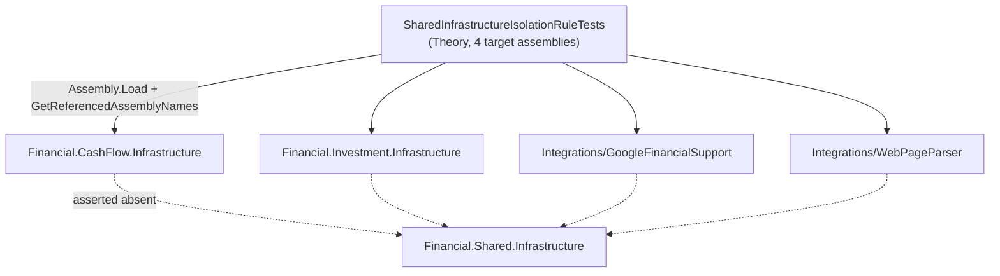

# F10. Shared Infrastructure Isolation Enforcement Test

## 1. Technical Overview

**What:** Add `SharedInfrastructureIsolationRuleTests.cs` to `Tests/Financial.Architecture.Tests`, following the existing `ObservabilityIsolationRuleTests` shape: a `[Theory]` over `Financial.CashFlow.Infrastructure`, `Financial.Investment.Infrastructure`, `Integrations/GoogleFinancialSupport`, `Integrations/WebPageParser` asserting `ProjectAssembly.GetReferencedAssemblyNames(...)` never contains `Financial.Shared.Infrastructure`.

**Why:** F06/F07/F09 removed every direct reference from those four projects to `Financial.Shared.Infrastructure`; this feature is the mechanical guard that keeps it removed. Without it, a future PR could reintroduce the reference and only be caught by code review, exactly the gap PRD §2 (Problem, bullet 1) calls out — `Financial.Architecture.Tests` already proves the *other* two directions (`Financial.Shared.Infrastructure` never reaches back into CashFlow/Investment via `SharedInfrastructureDependencyRuleTests`; Observability isolation via `ObservabilityIsolationRuleTests`) but not this one.

**Scope:**
- Included: the one new test file, following the established `[Theory]`/`ProjectAssembly` pattern exactly.
- Excluded: no production code changes — F06/F07/F09 already did the isolation work; this only adds the regression guard.

## 2. Architecture Impact

**Affected components:**
- `Tests/Financial.Architecture.Tests/SharedInfrastructureIsolationRuleTests.cs` (new)

**Assembly names** (the four target projects, resolved via `Assembly.Load(simpleName)` per `ProjectAssembly`'s existing pattern — note two of the four have an `AssemblyName` that differs from their folder name):

| Project folder | Assembly simple name |
|---|---|
| `Financial.CashFlow.Infrastructure` | `Financial.CashFlow.Infrastructure` |
| `Financial.Investment.Infrastructure` | `Financial.Investment.Infrastructure` |
| `Integrations/GoogleFinancialSupport` | `Financial.Investment.Infrastructure.Integrations.GoogleFinancialSupport` |
| `Integrations/WebPageParser` | `Financial.Investment.Infrastructure.Integrations.WebPageParser` |



## 3. Technical Decisions

| Decision | Chosen Approach | Alternative Considered | Trade-off |
|----------|-----------------|-------------------------|-----------|
| Assembly resolution for the two `Integrations/*` projects without a direct `ProjectReference` from `Financial.Architecture.Tests` | Rely on `Assembly.Load` resolving them from the test binary's probing path — both DLLs are already copied there transitively (`Financial.Api`/`Financial.App`, both directly referenced by the test project, each reference `GoogleFinancialSupport`; `Financial.Investment.Infrastructure`, also directly referenced, references `WebPageParser`) | Add explicit `ProjectReference`s to both `Integrations/*` projects in the test csproj | Rejected the explicit references — `ObservabilityIsolationRuleTests` already proves the transitive-load pattern works in this exact test project (it loads `Financial.CashFlow.Domain` etc., none of which are odd cases, but the mechanism — `Assembly.Load` against the test binary's deps — is identical); adding direct references for two assemblies already on the transitive closure would be redundant. Verified empirically by running the new tests, not assumed |
| `WebPageParser` has no current reference to `Financial.Shared.*` (per PRD §7 Out of Scope) | Include it in the theory anyway | Omit it since it can't currently fail | PRD Core Scope explicitly names it as a guard against a *future* regression, not because it fails today — the theory data matches the PRD's literal instruction |

## 4. Component Overview

| File Path | New/Modified | Purpose | Key Responsibilities |
|-----------|--------------|---------|------------------------|
| `Tests/Financial.Architecture.Tests/SharedInfrastructureIsolationRuleTests.cs` | New | Isolation regression guard | `[Theory]` over the four target assemblies, asserting none references `Financial.Shared.Infrastructure` |

No production code changes. No Frontend, API, or Database changes.

## 5. API Contracts

N/A.

## 6. Data Model

N/A.

## 7. Testing Strategy

This feature *is* a test — no additional coverage needed. Validation is the test itself.

**Negative verification performed:** a bare `ProjectReference` to `Financial.Shared.Infrastructure` added back to `Financial.CashFlow.Infrastructure.csproj` alone did *not* fail the test — Roslyn only emits an `AssemblyRef` for a project reference whose types are actually used in code, so an unused reference is invisible to `GetReferencedAssemblies()`. Adding one real type usage (a `LocalJsonStorage?` field) alongside the reference did fail the theory case for `Financial.CashFlow.Infrastructure`, with the exact assertion message naming the offending assembly and every one of its referenced assemblies. Both changes were reverted immediately after; `git diff` confirmed a clean revert before committing anything else.

| Test File | Test Type | Target | Coverage Goal |
|-----------|-----------|--------|-----------------|

| Test File | Test Type | Target | Coverage Goal |
|-----------|-----------|--------|-----------------|
| `Tests/Financial.Architecture.Tests/SharedInfrastructureIsolationRuleTests.cs` | Architecture (assembly-reference assertion) | `Financial.CashFlow.Infrastructure`, `Financial.Investment.Infrastructure`, `Integrations/GoogleFinancialSupport`, `Integrations/WebPageParser` | Each of the 4 theory cases passes today (post F06/F07/F09); manually confirmed to fail with a clear message when one of F06/F07's isolation changes is temporarily reverted (see Acceptance Criteria) |

**Acceptance criteria this feature satisfies (PRD Section 9, F10):**
- A new theory-based test in `Tests/Financial.Architecture.Tests` asserts the four projects never reference `Financial.Shared.Infrastructure`
- The test passes once F06, F07, and F09 are complete — all three merged to `main` before this feature starts
- Reverting any one of F06/F07/F09 locally causes this test to fail with a message naming the offending project (manually verified once, not a permanent regression test)

**Verification commands:**
```
dotnet build --configuration Release
dotnet test --settings coverlet.runsettings --results-directory TestResults
```
