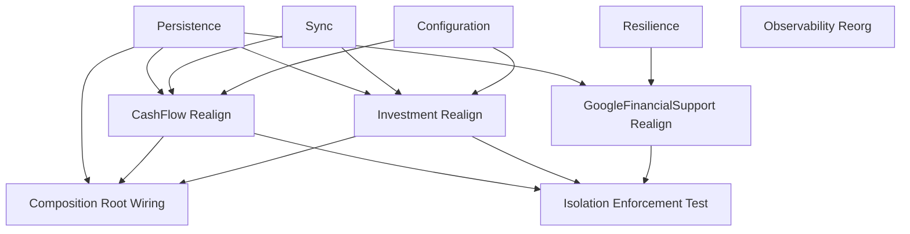

# Shared Domain Structure and Abstractions

## 1. Executive Summary

This is an internal architecture refactor of `Financial.Shared`, the code both the Investment and CashFlow bounded contexts depend on for persistence, sync status, retry behavior, and telemetry. Today, `Financial.Shared` is split into `Financial.Shared.Abstractions` (interfaces only, zero dependencies) and `Financial.Shared.Infrastructure` (concrete implementations — local/Google Drive JSON storage, debounced writes, retry policy, hosted-service shutdown flush), but only the Observability slice of that split is actually enforced: `ITelemetryTracer` lives in Abstractions, `OpenTelemetryTracer` lives in a separate `Integrations/Observability` project, and every consumer reaches the concrete implementation only through DI, never through a direct project reference. Every other concern — Persistence, Sync, Resilience, Configuration — skips that boundary: `Financial.CashFlow.Infrastructure` and `Financial.Investment.Infrastructure` each reference `Financial.Shared.Infrastructure` directly (8 files apiece), calling its static factories and concrete classes straight from their DI wiring and repository factories.

The product is a codebase change for the people who maintain Financial: the two bounded-context infrastructure projects, and the `Integrations/*` support projects, stop being able to see `Financial.Shared.Infrastructure` at all. Everything they need — `IJsonStorage`, a new `IJsonStorageFactory`, `IRemoteFileClient`/`IRemoteFileClientFactory`, `ISyncStatusProvider`/`SyncStatus`/`SyncState`, `TransientStorageException`, `RepositoryProviderResolver`, and the reflection helpers the two JSON type-info resolvers share — moves into concern-scoped namespaces under `Financial.Shared.Abstractions` (`.Persistence`, `.Sync`, `.Resilience`, `.Configuration`), following the same shape the existing `.Observability` split already proves works. The two composition roots, `Financial.Api` and `Financial.App`, pick up the wiring that CashFlow/Investment Infrastructure can no longer do themselves — constructing the concrete `IJsonStorageFactory` and registering the shutdown-flush hosted service — exactly as they already do for `OpenTelemetryTracer` today.

No user-facing behavior changes. Storage selection (Local vs Google Drive), debounced saves, retry-on-transient-failure, and shutdown flush all keep working identically; this PRD only relocates which project is allowed to see which type. Success is measured by a new architecture test that mechanically forbids the reference `Financial.Architecture.Tests` doesn't yet catch, and by every existing test — unit, integration, and architecture — plus a clean `docker-compose up`, still passing once the move is done.

## 2. Problem and Opportunity

**The Problem**

- **The dependency rule is asymmetric and unenforced.** `Financial.Architecture.Tests` already proves `Financial.Shared.Infrastructure` never reaches back into CashFlow or Investment (`SharedInfrastructureDependencyRuleTests`), and proves telemetry consumers never reach past `Financial.Shared.Abstractions` into the concrete Observability implementation (`ObservabilityIsolationRuleTests`). No test exists for the third direction: CashFlow.Infrastructure and Investment.Infrastructure reaching *into* `Financial.Shared.Infrastructure`. That gap is exactly where the violations live today — 8 files in each context's Infrastructure project import `Financial.Shared.Infrastructure.Persistence`, `.Sync`, `.Configuration`, and `.Hosting` directly.
- **A concrete implementation detail is a compile-time dependency for two unrelated bounded contexts.** Changing how `LocalJsonStorage` or `DebouncedJsonStorage` is constructed today means touching `CashFlowInfrastructureServiceCollectionExtensions` and `InvestmentInfrastructureServiceCollectionExtensions` in lockstep, because both call the same static `JsonStorageFactory.CreateLocal`/`CreateGoogleDrive` methods and construct `ShutdownFlushHostedService<TRepository>` by name. The two contexts are supposed to be isolated (per the project's own architecture invariants); this coupling routes around that isolation through a shared implementation rather than a shared contract.
- **The one place this pattern *is* done right has no name to point at.** Observability's split (interface in Abstractions, implementation in a dedicated `Integrations/Observability` project, wired only at the composition root) is the reference pattern by convention, discovered by reading `ObservabilityIsolationRuleTests.cs`, not by any structural rule that says "this is how Financial.Shared works." Nothing stops the next new shared capability from being added the old way.
- **`Financial.Shared.Abstractions` is flat.** All Observability types sit directly in the `Financial.Shared.Abstractions` namespace with no folder grouping. As more concerns move in (Persistence, Sync, Resilience, Configuration), a flat namespace stops making it obvious which interface belongs to which concern.
- **An `Integrations` project depends on `Financial.Shared.Infrastructure` without declaring it.** `Integrations/GoogleFinancialSupport` uses `IRemoteFileClientFactory` and `TransientStorageException` — both currently in `Financial.Shared.Infrastructure` — without a `ProjectReference` to that project at all; it only compiles today because `Financial.Investment.Infrastructure` transitively re-exposes the reference. That's an invisible coupling that would silently break the moment Investment.Infrastructure's own reference to `Financial.Shared.Infrastructure` is removed.

**The Opportunity**

- Extracting Persistence, Sync, Resilience, and Configuration contracts into `Financial.Shared.Abstractions` (F01–F04) closes the compile-time coupling: CashFlow and Investment can each evolve their storage wiring independently of what `Financial.Shared.Infrastructure` does internally, as long as the contract holds.
- Giving Observability its own `.Observability` folder/namespace (F05) turns the "reference pattern" into a literal, visible template — every future shared capability gets organized the same way from day one, per concern, not per project.
- Realigning CashFlow.Infrastructure, Investment.Infrastructure, and Integrations/GoogleFinancialSupport's project references (F06, F07, F09) and moving the two remaining construction responsibilities — `IJsonStorageFactory` composition and shutdown-flush hosted-service registration — into the two composition roots (F08) makes `Financial.Api`/`Financial.App` the only places that ever see a concrete `Financial.Shared.Infrastructure` type, matching how they already own `OpenTelemetryTracer` construction.
- A new architecture test (F10), built the same way `ObservabilityIsolationRuleTests` already is, makes the whole rule self-enforcing: a future PR that reintroduces a direct `Financial.Shared.Infrastructure` reference from a non-composition-root project fails CI instead of passing silent review.

## 3. Target Audience

### Primary Users

**Financial maintainer (the repo's own engineers, including the `architecture-reviewer` agent)**
- Adds or changes a shared capability (persistence, sync, resilience, or a brand-new concern like caching or messaging) and needs a template that says exactly where the interface goes and where the implementation goes.
- Works inside a single bounded context (CashFlow or Investment) and needs assurance that nothing they do there can accidentally create a compile-time dependency on another context's Infrastructure internals, directly or through the shared project.
- Reviews a PR against this repo's own architecture invariants and currently has to know the Observability precedent by memory rather than being able to point at a passing/failing test.

### Behavioral Profile

Works directly in the `.NET` solution with `dotnet build`/`dotnet test` as the primary feedback loop; treats `Financial.Architecture.Tests` as the source of truth for whether a dependency-direction rule holds, not code review alone; expects `main` to stay deployable (buildable, tests green, `docker-compose up` still starts cleanly) after every merge, per this repo's own architecture invariants.

## 4. Objectives

**Product Objectives**

- **Eliminate** every direct reference from `Financial.CashFlow.Infrastructure`, `Financial.Investment.Infrastructure`, and the `Integrations/*` projects to `Financial.Shared.Infrastructure`.
- **Establish** concern-scoped namespaces (`Persistence`, `Sync`, `Resilience`, `Configuration`, `Observability`) under `Financial.Shared.Abstractions` as the one documented pattern for shared capabilities.
- **Preserve** all existing runtime behavior — storage provider selection, debounced saves, retry-on-transient-failure, shutdown flush, sync status reporting — with zero functional change.
- **Enforce** the new dependency rule mechanically, so a future regression fails a test instead of passing review.

**Success Metrics**

- 0 references to `Financial.Shared.Infrastructure` from any project other than `Financial.Api`, `Financial.App`, and `Financial.Shared.Infrastructure.Tests` — verified by the new architecture test (F10) passing in CI.
- 100% of the 8 pre-existing `Financial.Shared.Infrastructure` usages in `Financial.CashFlow.Infrastructure` and the 8 in `Financial.Investment.Infrastructure` resolved (removed or replaced with an `Abstractions` equivalent) — verified by `grep`/build success once the `ProjectReference` is dropped from both `.csproj` files.
- 100% of pre-existing tests (`dotnet test` across the full solution, all Domain/Application/Infrastructure/Presentation test projects) still pass, with no test logic changes required to accommodate the refactor beyond namespace updates.
- `docker-compose up` still builds and serves the app on port 8080 with existing functionality intact, checked once at the end of the refactor.

## 5. User Stories

### F01. Persistence Abstraction Extraction
- As a Financial maintainer, I want `IJsonStorage` in `Financial.Shared.Abstractions.Persistence` so that a bounded context's Infrastructure project can depend on the storage contract without depending on any concrete storage implementation
- As a Financial maintainer, I want a new `IJsonStorageFactory` interface exposing `CreateLocal`/`CreateGoogleDrive` so that a bounded context's DI wiring can obtain a fully-configured `IJsonStorage` (including Google Drive selection and debounce wrapping) without calling the concrete `JsonStorageFactory`/`DebouncedJsonStorage`/`GoogleDriveStorageFactory` classes directly
- As a Financial maintainer, I want `IRemoteFileClient`/`IRemoteFileClientFactory` in `Financial.Shared.Abstractions.Persistence` so that `Integrations/GoogleFinancialSupport`'s `GoogleFileClientFactory` can keep implementing them without a project reference to `Financial.Shared.Infrastructure`
- As a Financial maintainer, I want `ReflectionJsonTypeInfoHelpers` in `Financial.Shared.Abstractions.Persistence` so that `CashFlowTypeInfoResolver` and `InvestmentsTypeInfoResolver` can keep wiring private constructors/setters without an Infrastructure reference

### F02. Sync Abstraction Extraction
- As a Financial maintainer, I want `ISyncStatusProvider`, `SyncStatus`, and `SyncState` in `Financial.Shared.Abstractions.Sync` so that a repository (e.g. `CashFlowJsonRepository`) can implement and expose sync status without depending on `Financial.Shared.Infrastructure`
- As a Financial maintainer, I want the `GetStatusOrIdle`/`FlushIfSupportedAsync` extension methods on `IJsonStorage` available from `Financial.Shared.Abstractions.Sync` so that a repository can call them on the storage it holds without an Infrastructure reference

### F03. Resilience Abstraction Extraction
- As a Financial maintainer, I want `TransientStorageException` in `Financial.Shared.Abstractions.Resilience` so that `Integrations/GoogleFinancialSupport`'s `GoogleTransientErrorTranslator` can throw it without a project reference to `Financial.Shared.Infrastructure`

### F04. Configuration Abstraction Extraction
- As a Financial maintainer, I want `RepositoryProviderResolver` in `Financial.Shared.Abstractions.Configuration` so that a bounded context's DI wiring can resolve its configured storage provider (Local vs Google Drive) without an Infrastructure reference

### F05. Observability Namespace Reorganization
- As a Financial maintainer, I want `ITelemetryTracer`, `ITelemetrySpan`, `NoOpTelemetryTracer`, `TelemetryAttributeKeys`, and the tracer/span extension methods moved into a `Financial.Shared.Abstractions.Observability` folder/namespace so that Observability visibly follows the same per-concern organization as every other capability

### F06. CashFlow Infrastructure Dependency Realignment
- As a Financial maintainer, I want `Financial.CashFlow.Infrastructure` to drop its `ProjectReference` to `Financial.Shared.Infrastructure` entirely so that the project can only see shared contracts, never shared implementation details
- As a Financial maintainer, I want `CashFlowRepositoryFactory` to receive an `IJsonStorageFactory` instead of calling the static `JsonStorageFactory` class so that storage construction happens through the new abstraction

### F07. Investment Infrastructure Dependency Realignment
- As a Financial maintainer, I want `Financial.Investment.Infrastructure` to drop its `ProjectReference` to `Financial.Shared.Infrastructure` entirely so that the project can only see shared contracts, never shared implementation details
- As a Financial maintainer, I want `InvestmentRepositoryFactory` to receive an `IJsonStorageFactory` instead of calling the static `JsonStorageFactory` class so that storage construction happens through the new abstraction

### F08. Composition Root Wiring for Shared Infrastructure
- As the system, I want `Financial.Api`'s `Program.cs` to register the concrete `JsonStorageFactory` as `IJsonStorageFactory` and to register `ShutdownFlushHostedService<ICashFlowRepository>`/`<IInvestmentRepository>` after each context's infrastructure is added, so that the API host keeps flushing pending writes on shutdown with no behavior change
- As the system, I want `Financial.App`'s `App.xaml.cs` to perform the same registrations so that the WPF desktop app keeps flushing pending writes on shutdown with no behavior change

### F09. GoogleFinancialSupport Integration Reference Realignment
- As a Financial maintainer, I want `Integrations/GoogleFinancialSupport` to declare an explicit `ProjectReference` to `Financial.Shared.Abstractions` so that `GoogleFileClientFactory` and `GoogleTransientErrorTranslator` compile against the moved interfaces/exception without relying on a transitive reference through `Financial.Investment.Infrastructure`

### F10. Shared Infrastructure Isolation Enforcement Test
- As a Financial maintainer, I want a new architecture test asserting that `Financial.CashFlow.Infrastructure`, `Financial.Investment.Infrastructure`, `Integrations/GoogleFinancialSupport`, and `Integrations/WebPageParser` never reference `Financial.Shared.Infrastructure`, so that a future PR reintroducing the violation fails CI instead of passing review

## 6. Functionalities

### F01. Persistence Abstraction Extraction

**Provides:**
- `IJsonStorage`, `IJsonStorageFactory` contracts, and `ReflectionJsonTypeInfoHelpers` (used by F06, F07)
- `IJsonStorageFactory` contract (also used by F08, to register the concrete implementation)
- `IRemoteFileClient`, `IRemoteFileClientFactory` contracts (used by F09)

**Core Scope:**
- Move `IJsonStorage`, `IRemoteFileClient`, `IRemoteFileClientFactory`, `ReflectionJsonTypeInfoHelpers` unchanged into `Financial.Shared.Abstractions.Persistence`
- Define `IJsonStorageFactory` with `CreateLocal(string? localDataPath, string defaultDataFileName)` and `CreateGoogleDrive(string? credentialsPath, string? driveFilePath, string credentialsConfigKey, string providerName)` — both returning `IJsonStorage` — matching the parameter shape `JsonStorageFactory`'s two static methods already take today, minus the `IRemoteFileClientFactory`/`ITelemetryTracer`/`ILogger` parameters (those become constructor-injected dependencies of the concrete implementation instead of per-call parameters, since they're the same for every call the factory makes)

**Capabilities:**
- `Financial.Shared.Abstractions.csproj` gains zero new package references — the moved types have no framework dependency beyond `System.Text.Json` (already implicit via `ImplicitUsings`) and `System.Reflection`
- `Financial.Shared.Infrastructure`'s existing `JsonStorageFactory` static class is replaced by a `JsonStorageFactory` instance class implementing `IJsonStorageFactory`, constructor-injected with `IRemoteFileClientFactory?`, `ITelemetryTracer`, and `ILogger<DebouncedJsonStorage>?`, registered as a singleton at each composition root
- `LocalJsonStorage`, `GoogleDriveJsonStorage`, `GoogleDriveStorageFactory`, `DebouncedJsonStorage`, `PathResolution` stay in `Financial.Shared.Infrastructure` unchanged

**Experience:**
- A Financial maintainer working in `Financial.CashFlow.Infrastructure` or `Financial.Investment.Infrastructure` sees `IJsonStorage`/`IJsonStorageFactory` resolve from `using Financial.Shared.Abstractions.Persistence;` with no other change to how storage is consumed — `ReadAsync`/`WriteAsync` signatures are identical

### F02. Sync Abstraction Extraction

**Provides:**
- `ISyncStatusProvider`, `SyncStatus`, `SyncState`, and the `GetStatusOrIdle`/`FlushIfSupportedAsync` extension methods (used by F06, F07)

**Core Scope:**
- Move `ISyncStatusProvider`, `SyncStatus`, `SyncState`, `JsonStorageSyncExtensions` unchanged into `Financial.Shared.Abstractions.Sync`

**Capabilities:**
- `DebouncedJsonStorage` (stays in `Financial.Shared.Infrastructure`) keeps implementing `ISyncStatusProvider` against the relocated interface with no behavior change

**Experience:**
- `CashFlowJsonRepository`/`InvestmentJsonRepository` (which already implement `ISyncStatusProvider` and call `_storage.GetStatusOrIdle()`/`.FlushIfSupportedAsync()`) need only their `using` statement updated from `Financial.Shared.Infrastructure.Sync` to `Financial.Shared.Abstractions.Sync`

### F03. Resilience Abstraction Extraction

**Provides:**
- `TransientStorageException` (used by F09)

**Core Scope:**
- Move `TransientStorageException` unchanged into `Financial.Shared.Abstractions.Resilience`
- `TransientRetryPolicy` (internal, used only inside `DebouncedJsonStorage`) stays in `Financial.Shared.Infrastructure.Resilience`, referencing the relocated exception type

**Capabilities:**
- No behavior change to retry logic — `TransientRetryPolicy.IsRetryable` keeps catching `TransientStorageException`, `HttpRequestException`, `TaskCanceledException`, `SocketException` exactly as today

**Experience:**
- `Integrations/GoogleFinancialSupport`'s `GoogleTransientErrorTranslator` throws the relocated `TransientStorageException` with an updated `using` statement, no other change

### F04. Configuration Abstraction Extraction

**Provides:**
- `RepositoryProviderResolver.Resolve<TEnum>(string?, TEnum)` (used by F06, F07)

**Core Scope:**
- Move `RepositoryProviderResolver` unchanged into `Financial.Shared.Abstractions.Configuration`

**Capabilities:**
- No behavior change — same `Enum.TryParse` logic, same exception message format on an unsupported provider value

**Experience:**
- `CashFlowInfrastructureServiceCollectionExtensions.BuildRepositoryOptions` and `InvestmentInfrastructureServiceCollectionExtensions.BuildRepositoryOptions` keep calling `RepositoryProviderResolver.Resolve(...)` exactly as today, from the new namespace

### F05. Observability Namespace Reorganization

**Core Scope:**
- Move `ITelemetryTracer`, `ITelemetrySpan`, `NoOpTelemetryTracer`, `TelemetryAttributeKeys`, `TelemetrySpanExtensions`, `TelemetryTracerExtensions` from the flat `Financial.Shared.Abstractions` namespace into `Financial.Shared.Abstractions.Observability`, keeping every member and signature unchanged

**Capabilities:**
- Every consumer across the solution (`Financial.CashFlow.Infrastructure`, `Financial.Investment.Infrastructure`, `Financial.Shared.Infrastructure`, `Integrations/Observability`, `Financial.Api`, `Financial.App`) updates its `using Financial.Shared.Abstractions;` to `using Financial.Shared.Abstractions.Observability;` where it references any of these six types — a mechanical, compiler-driven change with no logic touched

**Experience:**
- `ObservabilityIsolationRuleTests` continues to pass unmodified — it asserts on assembly references, not namespaces, so the folder/namespace move is invisible to that test

### F06. CashFlow Infrastructure Dependency Realignment

**Consumes:**
- F01: `IJsonStorage`, `IJsonStorageFactory`, `ReflectionJsonTypeInfoHelpers`
- F02: `ISyncStatusProvider`, `SyncStatus`, `SyncState`, sync extension methods
- F04: `RepositoryProviderResolver`

**Core Scope:**
- Remove the `ProjectReference` to `Financial.Shared.Infrastructure` from `Financial.CashFlow.Infrastructure.csproj`
- `CashFlowRepositoryFactory`'s constructor takes `IJsonStorageFactory` in place of the `IRemoteFileClientFactory?`/`ITelemetryTracer?`/`ILogger?` parameters it takes today; `CreateStorage` calls `_storageFactory.CreateLocal(...)`/`.CreateGoogleDrive(...)` instead of the static `JsonStorageFactory`
- `CashFlowInfrastructureServiceCollectionExtensions.AddFinancialCashFlowInfrastructure` resolves `IJsonStorageFactory` from the service collection (registered by the composition root per F08) instead of constructing storage inline, and no longer calls `services.AddHostedService<ShutdownFlushHostedService<ICashFlowRepository>>()` (moved to F08)
- `CashFlowTypeInfoResolver`, `CashFlowLoader`, `CashFlowJsonRepository` update their `using` statements to the `Financial.Shared.Abstractions.*` namespaces from F01/F02, with no other changes

**Capabilities:**
- Building `Financial.CashFlow.Infrastructure.csproj` in isolation (`dotnet build Financial.CashFlow.Infrastructure`) succeeds with `Financial.Shared.Abstractions` as its only `Financial.Shared.*` reference

**Experience:**
- No user-visible change; CashFlow's Local/Google Drive storage selection, debounce window, and shutdown flush behave identically to before the refactor

### F07. Investment Infrastructure Dependency Realignment

**Consumes:**
- F01: `IJsonStorage`, `IJsonStorageFactory`, `ReflectionJsonTypeInfoHelpers`
- F02: `ISyncStatusProvider`, `SyncStatus`, `SyncState`, sync extension methods
- F04: `RepositoryProviderResolver`

**Core Scope:**
- Remove the `ProjectReference` to `Financial.Shared.Infrastructure` from `Financial.Investment.Infrastructure.csproj`
- `InvestmentRepositoryFactory`'s constructor takes `IJsonStorageFactory` in place of the `IRemoteFileClientFactory?`/`ITelemetryTracer?`/`ILogger?` parameters it takes today; storage construction calls `_storageFactory.CreateLocal(...)`/`.CreateGoogleDrive(...)` instead of the static `JsonStorageFactory`
- `InvestmentInfrastructureServiceCollectionExtensions.AddFinancialInfrastructure` resolves `IJsonStorageFactory` from the service collection (registered by the composition root per F08) instead of constructing storage inline, and no longer calls `services.AddHostedService<ShutdownFlushHostedService<IInvestmentRepository>>()` (moved to F08)
- `InvestmentsTypeInfoResolver`, `InvestmentsLoader`, `InvestmentJsonRepository` update their `using` statements to the `Financial.Shared.Abstractions.*` namespaces from F01/F02, with no other changes

**Capabilities:**
- Building `Financial.Investment.Infrastructure.csproj` in isolation (`dotnet build Financial.Investment.Infrastructure`) succeeds with `Financial.Shared.Abstractions` as its only `Financial.Shared.*` reference

**Experience:**
- No user-visible change; Investment's Local/Google Drive storage selection, debounce window, and shutdown flush behave identically to before the refactor

### F08. Composition Root Wiring for Shared Infrastructure

**Consumes:**
- F01: `IJsonStorageFactory` (interface to register, concrete `JsonStorageFactory` to construct)

**Core Scope:**
- `Financial.Api/Program.cs` registers `services.AddSingleton<IJsonStorageFactory, JsonStorageFactory>()` before calling `AddFinancialCashFlowInfrastructure`/`AddFinancialInfrastructure`, and registers `services.AddHostedService<ShutdownFlushHostedService<ICashFlowRepository>>()` and `services.AddHostedService<ShutdownFlushHostedService<IInvestmentRepository>>()` after those calls
- `Financial.App/App.xaml.cs` performs the identical three registrations in its own `ConfigureServices` block

**Capabilities:**
- `Financial.Api` and `Financial.App` are the only two composition-root projects with a `ProjectReference` to `Financial.Shared.Infrastructure` once this feature lands (test projects and `Tools/CashFlowSpreadsheetImport` keep their existing references unchanged, per Section 7)

**Experience:**
- No user-visible change; on process shutdown, both hosts still flush any pending debounced write to disk/Google Drive before exiting, exactly as today

### F09. GoogleFinancialSupport Integration Reference Realignment

**Consumes:**
- F01: `IRemoteFileClient`, `IRemoteFileClientFactory`
- F03: `TransientStorageException`

**Core Scope:**
- Add an explicit `ProjectReference` to `Financial.Shared.Abstractions` in `Integrations/GoogleFinancialSupport/GoogleFinancialSupport.csproj`
- `GoogleFileClientFactory` and `GoogleTransientErrorTranslator` update their `using` statements to the new `Financial.Shared.Abstractions.*` namespaces

**Capabilities:**
- Building `Integrations/GoogleFinancialSupport` in isolation succeeds without relying on any transitive reference through `Financial.Investment.Infrastructure`

**Experience:**
- No user-visible change; Google Drive transient-error translation behaves identically

### F10. Shared Infrastructure Isolation Enforcement Test

**Core Scope:**
- Add a new `SharedInfrastructureIsolationRuleTests.cs` to `Tests/Financial.Architecture.Tests`, following the existing `ObservabilityIsolationRuleTests` shape: a `[Theory]` over `Financial.CashFlow.Infrastructure`, `Financial.Investment.Infrastructure`, `Integrations/GoogleFinancialSupport`, `Integrations/WebPageParser` asserting `ProjectAssembly.GetReferencedAssemblyNames(...)` never contains `Financial.Shared.Infrastructure`

**Capabilities:**
- The test fails loudly (naming the offending assembly) if any of the four projects reintroduces a `Financial.Shared.Infrastructure` reference in a future change

**Experience:**
- A Financial maintainer or the `architecture-reviewer` agent sees this test run as part of the existing `dotnet test` / CI `backend` job with no separate invocation needed

## 7. Out of Scope

**Not touched by this refactor:**
- No behavior change to storage selection, debounce timing, retry counts/backoff, or sync status reporting — this is a pure move of types between projects and namespaces
- No renaming of the existing `AddFinancialInfrastructure` (Investment) or `AddFinancialCashFlowInfrastructure` (CashFlow) DI extension method names, even though the naming is inconsistent between the two contexts today — out of scope for this PRD
- No changes to `.github/scripts/detect-changes.sh`, `.github/workflows/build.yml`, `Dockerfile`, `docker-compose.yml`, `docker-compose.observability.yml`, or `scripts/deploy.ps1` — all five are insulated because this refactor moves files between two existing top-level projects (`Financial.Shared.Abstractions`, `Financial.Shared.Infrastructure`) rather than adding, removing, or renaming any project; each script/config already references both project folders by their unchanged names or builds the solution as a whole
- No new shared capability (Caching, Messaging, or any other concern beyond Persistence/Sync/Resilience/Configuration/Observability) is introduced — this PRD only relocates what already exists
- `Financial.Shared.Infrastructure.Tests` keeps its existing direct reference to `Financial.Shared.Infrastructure` — test projects are exempt from the isolation rule, consistent with how `Financial.Architecture.Tests` itself already treats test projects
- `Financial.TestUtilities` and `Tools/CashFlowSpreadsheetImport` keep their existing references to `Financial.Shared.Infrastructure` unchanged — neither is a bounded-context Infrastructure project or an `Integrations/*` project, so the enforcement rule (F10) does not apply to them
- `WebPageParser` has no current reference to `Financial.Shared.*` and gains none — it is included in F10's enforcement scope only to guard against a future regression, not because it changes in this PRD

## 8. Dependency Graph

| # | Feature | Priority | Dependencies |
|---|---------|----------|--------------|
| F01 | Persistence Abstraction Extraction | 1 | None |
| F02 | Sync Abstraction Extraction | 1 | None |
| F03 | Resilience Abstraction Extraction | 2 | None |
| F04 | Configuration Abstraction Extraction | 2 | None |
| F05 | Observability Namespace Reorganization | 3 | None |
| F06 | CashFlow Infrastructure Dependency Realignment | 1 | F01, F02, F04 |
| F07 | Investment Infrastructure Dependency Realignment | 1 | F01, F02, F04 |
| F08 | Composition Root Wiring for Shared Infrastructure | 1 | F01, F06, F07 |
| F09 | GoogleFinancialSupport Integration Reference Realignment | 1 | F01, F03 |
| F10 | Shared Infrastructure Isolation Enforcement Test | 2 | F06, F07, F09 |

### Execution Waves

Features within the same wave can be built in parallel. A wave starts only after every feature in earlier waves is complete.

- **Wave 1**: F01, F02, F03, F04, F05
- **Wave 2**: F06, F07, F09
- **Wave 3**: F08, F10

### Priority levels
- **1** = Essential — product does not work without it
- **2** = Important — significant value addition
- **3** = Desirable — incremental improvement

## 9. Acceptance Criteria

### F01. Persistence Abstraction Extraction
- [x] `IJsonStorage`, `IRemoteFileClient`, `IRemoteFileClientFactory`, `ReflectionJsonTypeInfoHelpers` compile in `Financial.Shared.Abstractions.Persistence` with identical public signatures to their current `Financial.Shared.Infrastructure.Persistence` versions
- [x] `IJsonStorageFactory` is defined in `Financial.Shared.Abstractions.Persistence` with `CreateLocal` and `CreateGoogleDrive` methods returning `IJsonStorage`
- [x] The concrete `JsonStorageFactory` in `Financial.Shared.Infrastructure` implements `IJsonStorageFactory` and produces the same `IJsonStorage` graph (debounce-wrapped for Google Drive, direct for Local) as the current static methods
- [x] `Financial.Shared.Abstractions.csproj` has zero new `PackageReference` entries after the move

### F02. Sync Abstraction Extraction
- [x] `ISyncStatusProvider`, `SyncStatus`, `SyncState`, `JsonStorageSyncExtensions` compile in `Financial.Shared.Abstractions.Sync` with identical public signatures
- [x] `DebouncedJsonStorage.GetStatus()`/`FlushAsync()` continue to satisfy `ISyncStatusProvider` from the new namespace with no behavior change

### F03. Resilience Abstraction Extraction
- [x] `TransientStorageException` compiles in `Financial.Shared.Abstractions.Resilience` with the same constructor signature
- [x] `TransientRetryPolicy.IsRetryable` in `Financial.Shared.Infrastructure` still catches the relocated exception type

### F04. Configuration Abstraction Extraction
- [x] `RepositoryProviderResolver.Resolve<TEnum>` compiles in `Financial.Shared.Abstractions.Configuration` with identical behavior, including the `InvalidOperationException` message format on an unrecognized provider value

### F05. Observability Namespace Reorganization
- [x] `ITelemetryTracer`, `ITelemetrySpan`, `NoOpTelemetryTracer`, `TelemetryAttributeKeys`, `TelemetrySpanExtensions`, `TelemetryTracerExtensions` compile in `Financial.Shared.Abstractions.Observability`
- [x] Every existing consumer (`Financial.CashFlow.Infrastructure`, `Financial.Investment.Infrastructure`, `Financial.Shared.Infrastructure`, `Integrations/Observability`, `Financial.Api`, `Financial.App`) builds successfully against the new namespace
- [x] `ObservabilityIsolationRuleTests` passes unmodified

### F06. CashFlow Infrastructure Dependency Realignment
- [x] `Financial.CashFlow.Infrastructure.csproj` has no `ProjectReference` to `Financial.Shared.Infrastructure.csproj`
- [x] `dotnet build Financial.CashFlow.Infrastructure` succeeds standalone
- [x] All existing `Financial.CashFlow.Infrastructure.Tests` pass unmodified in behavior (signature/namespace-only test updates permitted)
- [x] Local and Google Drive provider selection for CashFlow data still produces a working repository, verified by existing `CashFlowRepositoryFactoryTests`

### F07. Investment Infrastructure Dependency Realignment
- [x] `Financial.Investment.Infrastructure.csproj` has no `ProjectReference` to `Financial.Shared.Infrastructure.csproj`
- [x] `dotnet build Financial.Investment.Infrastructure` succeeds standalone
- [x] All existing `Financial.Investment.Infrastructure.Tests` pass unmodified in behavior (signature/namespace-only test updates permitted)
- [x] Local and Google Drive provider selection for Investment data still produces a working repository, verified by existing `InvestmentRepositoryFactoryTests`

### F08. Composition Root Wiring for Shared Infrastructure
- [x] `Financial.Api/Program.cs` registers `IJsonStorageFactory` and both `ShutdownFlushHostedService<T>` instances
- [x] `Financial.App/App.xaml.cs` registers `IJsonStorageFactory` and both `ShutdownFlushHostedService<T>` instances
- [x] `docker-compose up` starts the API cleanly and a shutdown (container stop) still flushes a pending debounced write before exit
- [x] The WPF app starts cleanly and exits cleanly, flushing any pending write — confirmed by the user running the app manually from Visual Studio (not the literal `scripts/deploy.ps1`/`deploy/start-app.ps1` path, but the same `App.xaml.cs` composition root and DI wiring); worked fine

### F09. GoogleFinancialSupport Integration Reference Realignment
- [x] `Integrations/GoogleFinancialSupport/GoogleFinancialSupport.csproj` has an explicit `ProjectReference` to `Financial.Shared.Abstractions.csproj`
- [x] `dotnet build Integrations/GoogleFinancialSupport` succeeds standalone (without relying on `Financial.Investment.Infrastructure`'s transitive reference)
- [x] Existing `GoogleTransientErrorTranslatorTests` and `GoogleFinancialSupportServiceCollectionExtensionsTests` pass unmodified in behavior

### F10. Shared Infrastructure Isolation Enforcement Test
- [ ] A new theory-based test in `Tests/Financial.Architecture.Tests` asserts `Financial.CashFlow.Infrastructure`, `Financial.Investment.Infrastructure`, `Integrations/GoogleFinancialSupport`, and `Integrations/WebPageParser` never reference `Financial.Shared.Infrastructure`
- [ ] The test passes once F06, F07, and F09 are complete
- [ ] Reverting any one of F06/F07/F09 locally causes this test to fail with a message naming the offending project (manually verified once, not a permanent regression test)

### Cross-Feature Integration
- [x] F06 and F07 each correctly resolve the `IJsonStorage` produced by F01's `IJsonStorageFactory` (local file path or Google Drive document, per configured provider) with no change in the resulting `CashFlowData`/investment data loaded at startup
- [x] F06 and F07 each correctly report sync status (`Idle`/`Pending`/`Saving`/`Failed`) via F02's `ISyncStatusProvider`/`SyncStatus`/`SyncState` through the same API/WPF sync indicator that reads it today
- [x] F06 and F07 each correctly resolve their configured storage provider via F04's `RepositoryProviderResolver`, including the unsupported-provider error path
- [x] F09's `GoogleFileClientFactory` correctly implements F01's `IRemoteFileClient`/`IRemoteFileClientFactory`, and F09's `GoogleTransientErrorTranslator` correctly throws F03's `TransientStorageException`, both consumed transparently by F06/F07's Google Drive storage path
- [x] F08's composition-root registration of F01's `IJsonStorageFactory` is what F06 and F07 resolve at startup — removing the registration causes both hosts to fail DI resolution at startup, verified once manually during implementation
