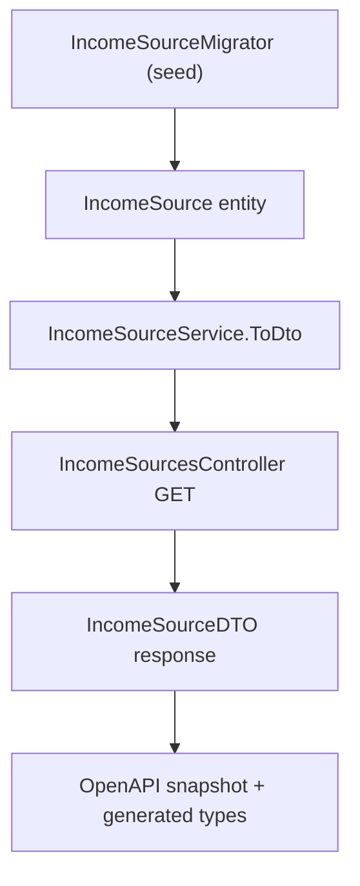

## 1. Technical Overview

**What:** Add a new boolean flag `AutoSplitToReserve` to the `IncomeSource` entity, defaulting to `false`. The flag is exposed on `IncomeSourceDTO`/`GET /income-sources` so both front ends can later decide whether to offer a reserve-split option for a given source. `IncomeSourceMigrator`'s seed data is updated so a freshly seeded "Ariana" income source has the flag enabled; every other seeded source keeps it disabled.

**Why:** `IncomeSource` is a create-only, seeded entity (`IncomeSource.cs` has no update method; `IncomeSourcesController` exposes only `GET`), and — per an explicit decision made during this feature's spec interview — that stays true here: correcting the flag on the "Ariana" record that already exists in the live data file is a one-time manual JSON edit the user will do themselves, not tooling this feature builds. That removes the need for any new domain mutator or migrator "already-present, fix mismatch" logic; the feature is scoped to a plain new property with a create-time default, the same shape as `Expense.CountsAsTithe` (P33-F02).

**Scope:**
- Included: `IncomeSource.AutoSplitToReserve` (bool, defaults `false`, settable via `Create`); `IncomeSourceDTO.AutoSplitToReserve`; `IncomeSourceService.GetIncomeSources()` mapping; `IncomeSourceMigrator`'s seed tuple extended with the flag (`Ariana = true`, all others `false`); OpenAPI snapshot and `Financial.Web` generated types regenerated to reflect the new field.
- Excluded: any `IncomeSource` create/update/delete UI or API (still fully out of scope per the PRD); retroactively correcting a pre-existing "Ariana" record via tooling (explicit user decision — manual one-time fix instead); the Income-side split flag, split orchestration, and both front ends' checkbox/lock UI (F02, F03, F04 — separate features).

## 2. Architecture Impact

**Affected components:**
- `Financial.CashFlow.Domain/Entities/IncomeSource.cs` — new `AutoSplitToReserve` property with a property-initializer default of `false`; `Create` gains an optional `bool autoSplitToReserve = false` parameter, assigned on the new instance.
- `Financial.CashFlow.Application/DTOs/IncomeSourceDTO.cs` — new `required bool AutoSplitToReserve { get; init; }`.
- `Financial.CashFlow.Application/Services/IncomeSourceService.cs` — `ToDto` maps `source.AutoSplitToReserve`.
- `Tools/CashFlowSpreadsheetImport/Migrations/IncomeSources/IncomeSourceMigrator.cs` — `SeededIncomeSources` tuple gains a third element; `SeedIncomeSources` passes it into `IncomeSource.Create`.
- `Financial.Api/Controllers/IncomeSourcesController.cs` — no code change (thin passthrough); response shape changes only because `IncomeSourceDTO` changed.
- `Tests/Financial.Api.Tests/Contract/openapi-v1.snapshot.json` — regenerated (`IncomeSourceDTO` schema gains `autoSplitToReserve`).
- `Financial.Web/src/api/generated/openapi.ts` — regenerated from the snapshot via `npm run generate-api-types`.

**No change needed:** `CashFlowTypeInfoResolver.cs` (a plain `bool` property serializes via the default reflection path, no `ReferenceProperties` entry required, same as `Expense.CountsAsTithe`); any WPF view/view model (no WPF surface consumes `IncomeSourceDTO` fields beyond `Name` today — F03's job); `Income`/`ReserveMovement` (F02's job).



## 3. Technical Decisions

| Decision | Chosen Approach | Alternative Considered | Trade-off |
|----------|----------------|----------------------|-----------|
| Backward-compat default | Property initializer `= false` on `AutoSplitToReserve` (mirrors `Expense.CountsAsTithe`'s `= true` pattern, but here the desired default happens to match `System.Text.Json`'s own default for a missing `bool`) | A migration-tool backfill step | No migration code needed; the property initializer and the deserializer's default already agree, so a plain field default fully satisfies the PRD's backward-compatibility requirement |
| Correcting the pre-existing "Ariana" record | Out of scope for this feature — left as a manual, one-time hand-edit of the live JSON, explicitly accepted by the user during the spec interview | Add `IncomeSource.SetAutoSplitToReserve(bool)` + migrator "already-present → correct mismatch" logic | Keeps `IncomeSource` create-only/immutable-after-creation, unchanged from today; avoids building a mutator that only exists to serve one manual data fix, ahead of the general `IncomeSource` CRUD work the user has deferred |
| Migrator seed data shape | Extend `SeededIncomeSources` from `(string Name, IncomeGroup Group)[]` to `(string Name, IncomeGroup Group, bool AutoSplitToReserve)[]`, with only the "Ariana" entry `true` | A separate lookup set of "auto-split" names consulted at seed time | Keeps seed data as a single source of truth in one array literal, consistent with the existing pattern, instead of a second structure that could drift out of sync |
| API contract regeneration timing | Regenerate `openapi-v1.snapshot.json` and `Financial.Web/src/api/generated/openapi.ts` in this feature, not deferred to F03 | Defer contract regeneration to F03 (first feature that actually renders the field) | `IncomeSourceDTO` is a Domain-facing controller DTO returned as-is (`OpenApiContractTests` policy) — its shape changes in F01 itself; regenerating now keeps `main` deployable after this PR and the snapshot never trails the real DTO shape, per CLAUDE.md's required workflow for any API DTO change |

## 4. Component Overview

**Backend — Domain:**

| File Path | New/Modified | Purpose | Key Responsibilities |
|-----------|--------------|---------|---------------------|
| `Financial.CashFlow.Domain/Entities/IncomeSource.cs` | Modified | Core entity | Add `bool AutoSplitToReserve { get; private set; } = false;`; `Create` gains optional `bool autoSplitToReserve = false` parameter, assigned on the new instance |

**Backend — Application:**

| File Path | New/Modified | Purpose | Key Responsibilities |
|-----------|--------------|---------|---------------------|
| `Financial.CashFlow.Application/DTOs/IncomeSourceDTO.cs` | Modified | Read model | Add `required bool AutoSplitToReserve { get; init; }` |
| `Financial.CashFlow.Application/Services/IncomeSourceService.cs` | Modified | Business logic | `ToDto` maps `source.AutoSplitToReserve` |

**Backend — Infrastructure / Tools:**

| File Path | New/Modified | Purpose | Key Responsibilities |
|-----------|--------------|---------|---------------------|
| `Tools/CashFlowSpreadsheetImport/Migrations/IncomeSources/IncomeSourceMigrator.cs` | Modified | Seed migration | `SeededIncomeSources` tuple gains `AutoSplitToReserve`; only the "Ariana" entry is `true`; `SeedIncomeSources` passes the value to `IncomeSource.Create` |

**Backend — Presentation (API):**

| File Path | New/Modified | Purpose | Key Responsibilities |
|-----------|--------------|---------|---------------------|
| `Financial.Api/Controllers/IncomeSourcesController.cs` | Unmodified | REST endpoint | No code change — thin passthrough; existing route/DTO flows the new field through |

**Contract artifacts:**

| File Path | New/Modified | Purpose | Key Responsibilities |
|-----------|--------------|---------|---------------------|
| `Tests/Financial.Api.Tests/Contract/openapi-v1.snapshot.json` | Regenerated | OpenAPI snapshot | `IncomeSourceDTO` schema gains `autoSplitToReserve: boolean` |
| `Financial.Web/src/api/generated/openapi.ts` | Regenerated | Frontend generated types | Mirrors the snapshot change via `npm run generate-api-types` |

**Persistence:** No file changes required. A plain `bool` property serializes via `CashFlowTypeInfoResolver`'s default reflection path, the same as `Expense.CountsAsTithe`/`Income.Description`.

## 5. API Contracts

No new endpoints. The existing income sources endpoint changes its response body shape only.

**Endpoint: List Income Sources**
- **Method:** GET
- **Path:** `/api/v1/financial/income-sources`

**Response (Success - 200, new field only — all other fields unchanged from today):**

| Field | Type | Description |
|-------|------|--------------|
| `autoSplitToReserve` | `boolean` | Whether the Income form should offer a "split to reserve" option for incomes recorded against this source |

**Response Example:**
```json
[
  {
    "id": "8f3b1c1a-2e3a-4b1a-9a7f-300000000001",
    "name": "Ariana",
    "isActive": true,
    "group": "Salary",
    "autoSplitToReserve": true
  },
  {
    "id": "8f3b1c1a-2e3a-4b1a-9a7f-300000000002",
    "name": "Gleison",
    "isActive": true,
    "group": "Salary",
    "autoSplitToReserve": false
  }
]
```

**Error Codes:** No new error codes — read-only `GET`, no request body.

## 6. Data Model

No relational schema — persistence is a single JSON document (`data-cashflow.json`). No migration tool step is needed: an `IncomeSource` entry missing `autoSplitToReserve` in stored JSON deserializes to `false` via both `System.Text.Json`'s default `bool` handling and the property's own `= false` initializer — the two already agree, unlike the `Expense.CountsAsTithe` precedent (P33-F02), which needed an explicit `= true` initializer specifically because `false` was the *wrong* default there. This is exactly why the pre-existing "Ariana" record isn't auto-corrected by this feature: from the deserializer's point of view it's indistinguishable from any other legacy record missing the field, and correctly defaults to `false` under this feature's own backward-compatibility rule. The user's manual JSON edit afterward is what makes that specific record diverge from the default.

**IncomeSource entry shape (conceptual, JSON):**

| Field | Type | Nullable | Notes |
|-------|------|----------|-------|
| `autoSplitToReserve` | `bool` | No (new) | Property default `false`; absent in any existing JSON record (including the pre-existing "Ariana" entry) deserializes to `false` |

## 7. Testing Strategy

Per `testing-guide-Financial`: the domain entity gets unit tests for the new property's default and explicit-value paths on `Create`; the migrator gets unit tests confirming the new seed values (Ariana `true`, others `false`) and confirming the already-present skip path still performs no correction; `IncomeSourceService` gets a unit test for the `ToDto` mapping; the API endpoint gets an integration test for the response contract; the existing OpenAPI freshness test proves the contract regeneration step was actually done.

**Test File Structure:**

| Test File | Test Type | Target | Coverage Goal |
|-----------|-----------|--------|----------------|
| `Tests/Financial.CashFlow.Domain.Tests/Entities/IncomeSourceTests.cs` | Unit | `IncomeSource` entity | `AutoSplitToReserve` defaults to `false` when omitted; explicit `true` is preserved |
| `Tests/Financial.CashFlowSpreadsheetImport.Tests/Migrations/IncomeSources/IncomeSourceMigratorTests.cs` | Unit | `IncomeSourceMigrator` | Seeded "Ariana" has `AutoSplitToReserve = true`; every other freshly seeded source has it `false`; an already-present "Ariana" (pre-existing, flag `false`) is left untouched by a second migration run |
| `Tests/Financial.CashFlow.Application.Tests/Services/IncomeSourceServiceTests.cs` | Unit | `IncomeSourceService.GetIncomeSources` | Returned DTOs' `AutoSplitToReserve` matches each entity's value |
| `Tests/Financial.Api.Tests/IncomeSourcesEndpointsTests.cs` | Integration | `GET /income-sources` | Response includes `autoSplitToReserve` for every source |
| `Financial.Web/src/api/generated/__tests__/openapiFreshness.test.ts` | Existing (unchanged) | Generated types freshness | Fails if generated types drift from the regenerated snapshot — proves the regeneration step was actually performed |

**Key test cases (`IncomeSourceTests.cs`):**

| Test Function | Description | Assertions |
|----------------|-------------|------------|
| `Create_WithoutAutoSplitToReserve_DefaultsToFalse` | Omits the parameter | `incomeSource.AutoSplitToReserve.Should().BeFalse()` |
| `Create_WithAutoSplitToReserveTrue_AssignsTrue` | Explicit `true` | `incomeSource.AutoSplitToReserve.Should().BeTrue()` |

**Key test cases (`IncomeSourceMigratorTests.cs`):**

| Test Function | Description | Assertions |
|----------------|-------------|------------|
| `Migrate_OnEmptyData_SeedsAriana_WithAutoSplitToReserveTrue` | Fresh seed | `data.IncomeSources.Should().ContainSingle(s => s.Name == "Ariana" && s.AutoSplitToReserve)` |
| `Migrate_OnEmptyData_SeedsNonArianaSources_WithAutoSplitToReserveFalse` | Fresh seed | Gleison/Lottery/DividendoJuros all have `AutoSplitToReserve == false` |
| `Migrate_WithArianaAlreadyPresentWithoutFlag_LeavesExistingRecordUnchanged` | Pre-seed "Ariana" via `IncomeSource.Create("Ariana", IncomeGroup.Salary)` (flag defaults `false`) before migrating | `summary.SourcesAlreadyPresentCount` counts it; `data.IncomeSources.Single(s => s.Name == "Ariana").AutoSplitToReserve.Should().BeFalse()` after `Migrate` — documents the accepted manual-fix gap from Section 3 |

**Key test cases (`IncomeSourceServiceTests.cs`):**

| Test Function | Description | Assertions |
|----------------|-------------|------------|
| `GetIncomeSources_ReturnsAutoSplitToReserveField` | Mixed sources (some flagged, some not) | Returned DTOs' `AutoSplitToReserve` matches each source entity |

**Key test cases (`IncomeSourcesEndpointsTests.cs`):**

| Test Function | Description | Assertions |
|----------------|-------------|------------|
| `GetIncomeSources_ReturnsAutoSplitToReserveInResponse` | New | 200, response includes `autoSplitToReserve` per source |

No cross-feature integration test is added in this feature: F01 has no `Consumes` block, and nothing downstream (F02/F03) is implemented yet within this PR. The Cross-Feature Integration criteria from PRD Section 9 that reference F01 (as the provider) are covered by F02's and F03's own specs, once those features exist to consume the flag.
