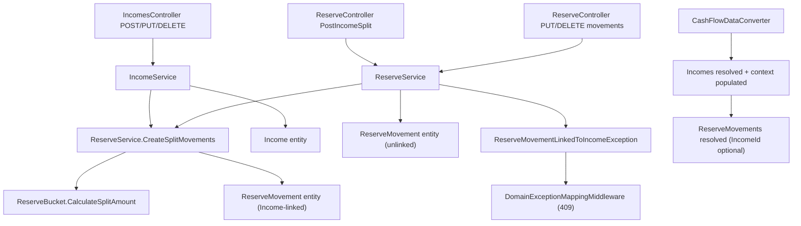

## 1. Technical Overview

**What:** Add `SplitToReserve` to `Income` and a nullable `Income` back-reference to `ReserveMovement`. When an `Income` is created or updated with `SplitToReserve = true` (only allowed when its `IncomeSource.AutoSplitToReserve` is `true`, per F01), the system computes `NetValue × 0.90` (net minus the existing 10% tithe rate) and fans it out across every active `ReserveBucket`, exactly like the existing manual "New Income Split" flow (`ReserveService.PostIncomeSplitAsync`) — but each created `ReserveMovement` now carries a real `IncomeId` reference back to the `Income` that created it. Updating a split-linked `Income` deletes and recreates its linked movements from the new values; deleting the `Income` deletes them too. A `ReserveMovement` with a non-null `Income` is rejected by the Reserve section's direct update/delete endpoints — it can only change as a side effect of editing its parent `Income`.

**Why:** The manual split already has the correct fan-out math (`ReserveBucket.CalculateSplitAmount`) and the correct atomic-create/rollback pattern (`ApplyAndSaveAsync` + compensating delete on save failure) — this feature reuses both rather than reinventing them. The only genuinely new problem is the link itself: `ReserveMovement` has never referenced anything outside its own bucket before, and the codebase's JSON persistence layer (`CashFlowTypeInfoResolver`/`CashFlowDataConverter`) currently treats every reference property as JSON-required, which breaks on every pre-existing `ReserveMovement` record the moment a new required key is introduced. Solving that backward-compatibility gap correctly is the load-bearing technical problem this feature solves.

**Scope:**
- Included: `Income.SplitToReserve` (bool, default `false`); `ReserveMovement.Income` (nullable back-reference, default `null`); split-eligibility validation on Income create/update; the split computation and fan-out (reusing `ReserveBucket.CalculateSplitAmount` via a small shared helper also used by the existing manual split); atomic create-with-rollback (extends the existing pattern to also roll back the `Income`); update-triggered delete-and-recreate of linked movements with full rollback on save failure; delete-cascades-to-linked-movements; locking `PUT`/`DELETE /reserve/movements/{id}` against any `Income`-linked movement; the JSON serialization ordering/backward-compatibility fix needed to make `ReserveMovement.IncomeId` an optional wire key; `IncomeDTO`/`ReserveMovementDTO` exposing the new fields; OpenAPI contract regeneration.
- Excluded (per PRD Out of Scope): any change to the manual "New Income Split" flow's own request/validation shape (it stays exactly as-is, still creates unlinked movements); the Income form checkbox and Reserve section lock UI (F03, F04 — this feature is backend/API only); retroactive linking of historical movements; tithe calculation changes (still reads `Income.NetValue` unconditionally, unaffected by `SplitToReserve`).

## 2. Architecture Impact

**Affected components:**
- `Financial.CashFlow.Domain/Entities/Income.cs` — new `SplitToReserve` property, threaded through `Create`/`UpdateDetails`.
- `Financial.CashFlow.Domain/Entities/ReserveMovement.cs` — new nullable `Income` navigation property, threaded through `Create` (not `Update` — a locked movement is never updated in place).
- `Financial.CashFlow.Application/DTOs/IncomeCreateDTO.cs`, `IncomeUpdateDTO.cs` — new `SplitToReserve` (bool, default `false`).
- `Financial.CashFlow.Application/DTOs/IncomeDTO.cs` — new `SplitToReserve`. (No split-movement summary is embedded here — see Section 3's PR-review revision.)
- `Financial.CashFlow.Application/DTOs/ReserveMovementDTO.cs` — new nullable `IncomeId`.
- `Financial.CashFlow.Application/Services/IncomeService.cs` — split-eligibility validation; split computation/fan-out on create; delete-and-recreate on update; cascade delete; atomic save with rollback.
- `Financial.CashFlow.Application/Services/ReserveService.cs` — `PostIncomeSplitAsync` refactored to call the new shared fan-out helper (behavior unchanged); `UpdateMovementAsync`/`DeleteMovementAsync` gain a locked-movement guard; `DeleteMovementAsync`'s existing Date+Description group-delete excludes linked movements from the group.
- `Financial.CashFlow.Application/Services/ReserveService.cs` gains `internal static CreateSplitMovements(...)` — the bucket fan-out loop extracted from `PostIncomeSplitAsync` onto `ReserveService` itself (not a separate class, per PR review), called by both `PostIncomeSplitAsync` and `IncomeService` (a plain static call, no new dependency).
- `Financial.CashFlow.Application/Exceptions/ReserveMovementLinkedToIncomeException.cs` (**new**) — thrown by the locked-movement guard.
- `Financial.CashFlow.Infrastructure/Persistence/CashFlowDataConverter.cs` — reorders deserialization so `Incomes` resolve (and populate a new lookup) before `ReserveMovements` are read.
- `Financial.CashFlow.Infrastructure/Persistence/ReferenceResolutionContext.cs` — new `Incomes` lookup dictionary.
- `Financial.CashFlow.Infrastructure/Persistence/IncomeReferenceConverter.cs` (**new**) — mirrors `ReserveBucketReferenceConverter`.
- `Financial.CashFlow.Infrastructure/Persistence/CashFlowTypeInfoResolver.cs` — `ReferenceProperties` gains an `IsRequired` flag per entry (all existing entries stay `true`; the new `ReserveMovement.Income → "IncomeId"` entry is `false`, the first optional reference property in the codebase) and a new `IncomeReferenceConverter` registration.
- `Financial.Api/Middleware/DomainExceptionMappingMiddleware.cs` — maps `ReserveMovementLinkedToIncomeException` to 409, alongside the existing `OverdraftConfirmationRequiredException`/`InvestmentRuleViolationException` entries.
- `Tests/Financial.Api.Tests/Contract/openapi-v1.snapshot.json`, `Financial.Web/src/api/generated/openapi.ts` — regenerated.
- `Financial.CashFlow.Domain/Rules/TitheRule.cs` (**new**, PR review) — the 10% tithe rate and its two derived amounts (`CalculateTithe`, `NetOfTithe`), extracted so `IncomeService`'s split-base calculation and `TitheService`'s monthly calculation share one source of truth instead of each hardcoding the percentage.
- `Financial.CashFlow.Application/Services/TitheService.cs` (PR review) — `GetTitheSummary` calls `TitheRule.CalculateTithe` instead of its own `TithePercentage` constant; still reads every `Income.NetValue` unconditionally (unchanged behavior, only the rate's source changed).

**No change needed:** `IncomesController.cs`/`ReserveController.cs` (thin passthroughs — the new validation/locking surfaces through existing routes as exceptions the middleware already maps); `Financial.Web`/`Financial.App` (F03/F04's job).



## 3. Technical Decisions

| Decision | Chosen Approach | Alternative Considered | Trade-off |
|----------|----------------|----------------------|-----------|
| Making `ReserveMovement.IncomeId` backward-compatible in JSON | Extend `CashFlowTypeInfoResolver.ReferenceProperties`'s value from a bare wire-name string to `(string WireName, bool IsRequired)`; every existing entry keeps `IsRequired: true` (zero behavior change); the new entry is `IsRequired: false` | Write a data migration that backfills an explicit `"IncomeId": null` key onto every existing `ReserveMovement` record | A migration only fixes the *live* file; any older backup/example file would still break on load. Making the property genuinely optional fixes every file, forever, with no migration step — consistent with F01's "missing key deserializes to the safe default" pattern |
| Deserialization ordering for the new `ReserveMovement → Income` reference | Reorder `CashFlowDataConverter.Read`: deserialize `Incomes` (which only needs the already-resolved Bank/IncomeSource) and populate a new `context.Incomes` lookup *before* deserializing `ReserveMovements` | Two-pass deserialization of `ReserveMovements` itself (resolve without Income first, patch in Income references after) | The existing converter/context machinery already assumes a strict "build lookup, then deserialize dependents" order (see `CashFlowDataConverter`'s two-tier structure); moving one collection earlier in that same order is a 6-line change, while a second deserialization pass would duplicate the whole read path for one property |
| Where the split fan-out logic lives | Extract `PostIncomeSplitAsync`'s bucket loop into `ReserveService.CreateSplitMovements(activeBuckets, amount, date, description, income)` — an `internal static` method on `ReserveService` itself, called by `PostIncomeSplitAsync` (manual, `income: null`) and by `IncomeService` as a plain static call (automated, `income: <the new Income>`), no new class and no new DI dependency | (a) A separate `ReserveSplitMovementFactory` static class *(original implementation, reverted per PR review — "why a new class when the mechanism already lives in ReserveService")*; (b) `IncomeService` takes an `IReserveService` dependency and calls `PostIncomeSplitAsync` directly | (a) added a file with no state of its own for no reason once the method has a natural home; keeping it *on* `ReserveService` avoids introducing a file whose only purpose is holding one static method. (b) still doesn't work: `PostIncomeSplitAsync` enforces `Amount > 0` and non-empty `Description` (a ₤0 net income and a null `Income.Description` are both valid on the automated path), and its public signature has no way to pass a linking `Income` — extending it would leak an automation-only concern into the user-facing manual-split contract |
| `ReserveMovement.Description` type | Stays non-nullable `string`; the automated path passes `income.Description ?? string.Empty` | Widen `ReserveMovement.Description` to `string?` to mirror `Income.Description` exactly | `ReserveMovementDTO.Description`, the OpenAPI contract, and both front ends' Reserve display all currently assume a non-null string; widening ripples into all three for a distinction (`null` vs `""`) with no observable difference to the user. The PRD's "copied as-is" is satisfied in substance — an income with no description produces a movement with no description either way |
| Locked-movement rejection | New `ReserveMovementLinkedToIncomeException` (409), added to `DomainExceptionMappingMiddleware` alongside `OverdraftConfirmationRequiredException` | Reuse `ArgumentException` (400) | The request is well-formed and the movement is real — the domain refuses on its own rule, matching this middleware's existing 409 rationale for `InvestmentRuleViolationException` ("not malformed, the distinction is what tells a client whether re-sending the same body could ever succeed") |
| `DeleteMovementAsync`'s existing Date+Description group-delete vs. locked movements | The grouping query gains `&& m.Income is null`, and the target movement itself is checked for `Income is not null` *before* the group is even computed | Leave the group query as-is; rely only on the direct-target check | A manually created movement could coincidentally share the same Date+Description text as an automated split's movements; without excluding linked rows from the *group*, deleting the coincidental manual movement would still delete the linked ones as collateral damage |
| Update rollback scope | `UpdateIncomeAsync` captures the income's pre-update field values and its currently-linked movements (the same object instances, not copies) *before* mutating anything; on a save failure it re-applies the old values via a second `UpdateDetails` call and re-adds the captured old movement instances, mirroring `PostIncomeSplitAsync`'s existing Add-then-compensate pattern extended to cover Update's delete+recreate | Do not roll back Update failures, matching every *other* existing `Update*Async` method in the codebase (none of which roll back today) | PRD Section 9 explicitly requires it: "A simulated failure during split-movement recreation on Update rolls back the entire operation." This is a deliberate, tested exception to the codebase's general Update behavior, not a new codebase-wide convention |
| `DeleteIncomeAsync` rollback scope | No rollback on save failure — matches the *existing*, unchanged behavior of `DeleteIncomeAsync`/`DeleteMovementAsync` today | Add symmetric rollback, matching Create/Update | No PRD acceptance criterion requires it, and every existing delete path in this codebase already accepts this risk; adding it here would be new complexity the PRD never asked for |
| *(PR review)* Where the 10% tithe rate lives | Extracted to `Financial.CashFlow.Domain/Rules/TitheRule.cs` (`Percentage`, `CalculateTithe`, `NetOfTithe`); both `TitheService` and `IncomeService` call it | Each service keeps its own private constant (`TitheService.TithePercentage` / `IncomeService.NetOfTithePercentage`, the original implementation) | The two constants encoded the same business fact independently — a rate change would need two edits that could silently drift apart. A single Domain-layer rule (matching the existing `Rules/` folder's `AnnualResultCalculator`/`YearScopedInvestmentAccountResolver` pattern) is the one place that number can live |
| *(PR review)* `IncomeDTO`'s split-movement summary | Removed entirely — `IncomeDTO` carries only `SplitToReserve`; the created movements are read via the existing `GET /reserve/movements` | Keep `ReserveSplitMovements` (the original implementation) so the Income form could show confirmation feedback | No consumer needs it: the Reserve section already displays split movements, and F03's Income form has no requirement to duplicate that view. Keeping it would have meant deciding *now* whether Income and Reserve read-models should compose (edging toward a CQRS-style read-model split) for a need nobody has yet |
| *(PR review)* Duplication across `AddIncomeAsync`/`UpdateIncomeAsync`/`DeleteIncomeAsync` | Extracted `GetLinkedMovements(incomeId)` (shared by Update/Delete) and merged `ValidateSplitEligibility` into `ValidateFields` (every caller invoked both together). `AddIncomeAsync`/`UpdateIncomeAsync` keep their own inline try/`ApplyAndSaveAsync`/catch/compensate block each, rather than a shared `SaveWithRollbackAsync(apply, rollback)` helper — tried that extraction first, but reverted per explicit feedback: each method should read as its own complete operation, not two `Action` closures handed to a shared runner | A `SaveWithRollbackAsync(apply, rollback)` helper wrapping both blocks *(tried, reverted)* | The lookup and validation dedup removed genuine repeated logic with no readability cost; collapsing the save/rollback shape into a generic runner traded a few duplicated lines for indirection the user didn't want — not every repeated shape is worth extracting |

## 4. Component Overview

**Backend — Domain:**

| File Path | New/Modified | Purpose | Key Responsibilities |
|-----------|--------------|---------|---------------------|
| `Financial.CashFlow.Domain/Entities/Income.cs` | Modified | Core entity | Add `bool SplitToReserve { get; private set; } = false;`; `Create`/`UpdateDetails` accept an optional `bool splitToReserve = false` parameter |
| `Financial.CashFlow.Domain/Entities/ReserveMovement.cs` | Modified | Core entity | Add `Income? Income { get; private set; }`; `Create` accepts an optional `Income? income = null` parameter; `Update` unchanged (never called on a linked movement) |
| `Financial.CashFlow.Domain/Rules/TitheRule.cs` | **New**, PR review | Shared domain rule | `Percentage` (0.10m), `CalculateTithe(amount)`, `NetOfTithe(amount)` — single source of truth for the tithe rate |

**Backend — Application:**

| File Path | New/Modified | Purpose | Key Responsibilities |
|-----------|--------------|---------|---------------------|
| `Financial.CashFlow.Application/DTOs/IncomeCreateDTO.cs` | Modified | Create request DTO | Add `bool SplitToReserve { get; init; } = false;` |
| `Financial.CashFlow.Application/DTOs/IncomeUpdateDTO.cs` | Modified | Update request DTO | Same shape change as Create DTO |
| `Financial.CashFlow.Application/DTOs/IncomeDTO.cs` | Modified | Read model | Add `required bool SplitToReserve { get; init; }` only — no embedded split-movement summary (see Section 3) |
| `Financial.CashFlow.Application/DTOs/ReserveMovementDTO.cs` | Modified | Read model | Add `Guid? IncomeId { get; init; }` (null when unlinked) |
| `Financial.CashFlow.Application/Services/IncomeService.cs` | Modified | Business logic | `ValidateFields` gains a `splitToReserve` parameter and performs the eligibility check inline (single validation pass, not a separate method call); `AddIncomeAsync` computes the split base, builds movements via `ReserveService.CreateSplitMovements`, and saves Income + movements atomically via its own inline try/`ApplyAndSaveAsync`/catch/compensate block; `UpdateIncomeAsync` captures pre-update state, deletes old linked movements, builds new ones when still split, saves via its own equivalent inline block; `DeleteIncomeAsync` deletes linked movements (found via a shared `GetLinkedMovements` helper, also used by Update) in the same `ApplyAndSaveAsync` call; `ToDto` maps `SplitToReserve` only |
| `Financial.CashFlow.Application/Services/ReserveService.cs` | Modified | Business logic | Gains `internal static CreateSplitMovements(activeBuckets, amount, date, description, income = null)` — the fan-out loop extracted from `PostIncomeSplitAsync`, called by both `PostIncomeSplitAsync` (unchanged behavior) and `IncomeService`; `UpdateMovementAsync`/`DeleteMovementAsync` throw `ReserveMovementLinkedToIncomeException` when `movement.Income is not null`; `DeleteMovementAsync`'s group query adds `&& m.Income is null`; `ToDto` maps `IncomeId` |
| `Financial.CashFlow.Application/Exceptions/ReserveMovementLinkedToIncomeException.cs` | **New** | Domain exception | Single-purpose exception, mirrors `OverdraftConfirmationRequiredException`'s shape (message-only constructor) |

**Backend — Infrastructure:**

| File Path | New/Modified | Purpose | Key Responsibilities |
|-----------|--------------|---------|---------------------|
| `Financial.CashFlow.Infrastructure/Persistence/ReferenceResolutionContext.cs` | Modified | Lookup tables for JSON read | Add `Dictionary<Guid, Income> Incomes { get; } = new();` |
| `Financial.CashFlow.Infrastructure/Persistence/IncomeReferenceConverter.cs` | **New** | Reference converter | `sealed class IncomeReferenceConverter(Dictionary<Guid, Income>? lookup) : ReferenceConverter<Income>(lookup, income => income.Id, "Income")`, mirrors `ReserveBucketReferenceConverter` |
| `Financial.CashFlow.Infrastructure/Persistence/CashFlowTypeInfoResolver.cs` | Modified | JSON type customization | `ReferenceProperties`'s value becomes `(string WireName, bool IsRequired)`; every existing entry keeps `IsRequired: true`; new entry `[(typeof(ReserveMovement), nameof(ReserveMovement.Income))] = ("IncomeId", false)`; `ConfigureReferenceProperty` sets `jsonProp.IsRequired` from the tuple instead of hardcoding `true`; `CreateReferenceConverter` gains an `Income` branch |
| `Financial.CashFlow.Infrastructure/Persistence/CashFlowDataConverter.cs` | Modified | Top-level (de)serializer | Moves the `Incomes` deserialize-and-context-populate step to run before `ReserveMovements` is deserialized (both still use the same `resolvedOptions`, since `Income` only needs the already-resolved Bank/IncomeSource) |

**Backend — Presentation (API):**

| File Path | New/Modified | Purpose | Key Responsibilities |
|-----------|--------------|---------|---------------------|
| `Financial.Api/Middleware/DomainExceptionMappingMiddleware.cs` | Modified | Exception → HTTP mapping | New `catch (ReserveMovementLinkedToIncomeException ex)` → 409, placed alongside the existing `OverdraftConfirmationRequiredException` case |
| `Financial.Api/Controllers/IncomesController.cs`, `ReserveController.cs` | Unmodified | REST endpoints | No code change — thin passthroughs; new behavior surfaces via the existing routes' request/response shapes and the exception middleware |

**Contract artifacts:**

| File Path | New/Modified | Purpose | Key Responsibilities |
|-----------|--------------|---------|---------------------|
| `Tests/Financial.Api.Tests/Contract/openapi-v1.snapshot.json` | Regenerated | OpenAPI snapshot | `IncomeCreateDTO`/`IncomeUpdateDTO`/`IncomeDTO`/`ReserveMovementDTO` schemas gain the new fields |
| `Financial.Web/src/api/generated/openapi.ts` | Regenerated | Frontend generated types | Mirrors the snapshot change via `npm run generate-api-types` |

## 5. API Contracts

No new endpoints. Four existing endpoints change request/response shape or gain new failure modes.

**Endpoint: Create Income**
- **Method:** POST
- **Path:** `/api/v1/financial/incomes`

**Request (new field only):**

| Field | Type | Required | Validation | Description |
|-------|------|----------|------------|--------------|
| `splitToReserve` | `boolean` | No (new) | Only `true` when the referenced `incomeSourceId`'s `autoSplitToReserve` is `true` | Defaults to `false` when omitted |

**Request Example (Ariana income, split requested):**
```json
{
  "date": "2026-08-16",
  "incomeSourceId": "8f3b1c1a-2e3a-4b1a-9a7f-000000000002",
  "grossValue": 3200.00,
  "netValue": 2450.00,
  "bankId": "8f3b1c1a-2e3a-4b1a-9a7f-100000000001",
  "description": "August salary",
  "splitToReserve": true
}
```

**Response (Success - 200, new field only):**

| Field | Type | Description |
|-------|------|--------------|
| `splitToReserve` | `boolean` | Echoes whether this income triggered a split |

The resulting movements themselves are not embedded in the Income response — they're read via the existing `GET /reserve/movements` (filtered client-side by `incomeId`, see below), which is also where the Reserve section already displays them. Embedding a duplicate summary here was reconsidered during PR review as unnecessary coupling: the Income form has no requirement to show split details, only whether the entry is split.

**Response Example:**
```json
{
  "id": "660e8400-e29b-41d4-a716-446655440010",
  "date": "2026-08-16",
  "incomeSourceId": "8f3b1c1a-2e3a-4b1a-9a7f-000000000002",
  "incomeSourceName": "Ariana",
  "grossValue": 3200.00,
  "netValue": 2450.00,
  "bankId": "8f3b1c1a-2e3a-4b1a-9a7f-100000000001",
  "bankName": "Barclays",
  "description": "August salary",
  "splitToReserve": true
}
```

**Error Codes:**

| Condition | HTTP Status | Description |
|------|-------------|-------------|
| `splitToReserve: true` for a non-eligible source | 400 | `"This income source does not support automatic reserve splitting."` |
| Split-movement creation fails during save | 500 (propagated) | Income and any partially created movements are rolled back first; the underlying save exception propagates unchanged (matches `PostIncomeSplitAsync`'s existing behavior) |

**Endpoint: Update Income**
- **Method:** PUT
- **Path:** `/api/v1/financial/incomes/{id:guid}`
- Same request shape change as Create. Toggling `splitToReserve` off deletes linked movements; toggling it on creates them; leaving it on recomputes and recreates them from the new values. A save failure rolls the Income and its movements back to their pre-update state (see Section 3).

**Endpoint: Delete Income**
- **Method:** DELETE
- **Path:** `/api/v1/financial/incomes/{id:guid}`
- Unchanged response shape (200/404). Now also deletes any linked `ReserveMovement`s in the same save.

**Endpoint: Update / Delete Reserve Movement**
- **Method:** PUT / DELETE
- **Path:** `/api/v1/financial/reserve/movements/{id:guid}`

**New error code:**

| Condition | HTTP Status | Description |
|------|-------------|-------------|
| Target movement's `incomeId` is non-null | 409 | `"This reserve movement is linked to an income and can only be changed by editing that income."` |

**Endpoint: List Movement History / Post Income Split (manual)**
- Unchanged request/response shape apart from `ReserveMovementDTO` gaining `incomeId` (null for every movement the manual flow itself creates).

## 6. Data Model

No relational schema — persistence is a single JSON document (`data-cashflow.json`). Two backward-compatibility concerns, both resolved without a migration tool:

**`Income.SplitToReserve`:** a plain `bool` serialized via `CashFlowTypeInfoResolver`'s default reflection path (no `ReferenceProperties` entry). A record missing the key deserializes to `false` via the property's own `= false` initializer, matching `System.Text.Json`'s own default for an absent `bool` — the two already agree, so no migration is needed (same reasoning as F01's `AutoSplitToReserve`).

**`ReserveMovement.IncomeId`:** the first *optional* reference property in the codebase. Every existing `ReferenceProperties` entry marks its wire key `IsRequired: true`, because every one of them was already present (even if null-valued) in 100% of pre-existing records the day it was introduced. `IncomeId` is different: it's a brand-new key with zero pre-existing occurrences anywhere. Marking it `IsRequired: false` means an absent key simply leaves `ReserveMovement.Income` at its default (`null`) — exactly "not linked" — with no migration required for any existing or historical data file.

**ReserveMovement entry shape (conceptual, JSON):**

| Field | Type | Nullable | Notes |
|-------|------|----------|-------|
| `IncomeId` | `guid` (reference) | Yes, and the key itself may be **absent** (the only reference property with this shape) | Resolves against the `Incomes` collection when present; absent or `null` means the movement was created manually |

**Income entry shape (conceptual, JSON):**

| Field | Type | Nullable | Notes |
|-------|------|----------|-------|
| `SplitToReserve` | `bool` | No (new) | Property default `false`; absent in any existing JSON record deserializes to `false` |

**Read ordering (`CashFlowDataConverter`):** `Incomes` must be deserialized, and its entries added to `ReferenceResolutionContext.Incomes`, before `ReserveMovements` is deserialized — otherwise a genuinely-linked movement's `IncomeId` would fail to resolve (`Income '<id>' referenced but not found`) even though the referenced `Income` exists elsewhere in the same document. This mirrors the existing two-tier pattern (Bank/IncomeSource/etc. resolved before anything that references them) with `Income` added as an extra tier between them and `ReserveMovement`.

## 7. Testing Strategy

Per `testing-guide-Financial`: `Income`/`ReserveMovement` entity tests for the new properties' defaults and explicit values; `IncomeService`/`ReserveService` unit tests (hand-written `StubCashFlowRepository`) for every branch — eligibility validation, split computation, create/update/delete cascade, rollback-on-save-failure (`StubCashFlowRepository.ThrowOnNextSave`, the same mechanism `PostIncomeSplitAsync_WhenSaveFails_RollsBackAllFourMovements` already uses), and the locked-movement guard; `CashFlowDataConverter`/`CashFlowTypeInfoResolver` round-trip and backward-compatibility tests at the Infrastructure layer; API endpoint E2E tests for the new request/response fields and the new 400/409 codes.

**Test File Structure:**

| Test File | Test Type | Target | Coverage Goal |
|-----------|-----------|--------|----------------|
| `Tests/Financial.CashFlow.Domain.Tests/Entities/IncomeTests.cs` | Unit | `Income` entity | `SplitToReserve` defaults `false`; explicit `true` preserved; `UpdateDetails` replaces it |
| `Tests/Financial.CashFlow.Domain.Tests/Entities/ReserveMovementTests.cs` | Unit | `ReserveMovement` entity | `Income` defaults `null`; explicit value preserved; `Update` leaves `Income` untouched |
| `Tests/Financial.CashFlow.Domain.Tests/Rules/TitheRuleTests.cs` *(PR review)* | Unit | `TitheRule` | `CalculateTithe`/`NetOfTithe` return the correct 10%/90% split; the two sum back to the original amount |
| `Tests/Financial.CashFlow.Application.Tests/Services/IncomeServiceTests.cs` | Unit | `IncomeService` | See key test cases below |
| `Tests/Financial.CashFlow.Application.Tests/Services/ReserveServiceTests.cs` | Unit | `ReserveService` | Locked-movement guard on update/delete; group-delete excludes linked movements; `PostIncomeSplitAsync`'s existing behavior/tests unaffected by the factory refactor |
| `Tests/Financial.CashFlow.Infrastructure.Tests/Persistence/CashFlowSerializerAdapterTests.cs` | Integration | Round-trip | A linked `ReserveMovement`'s `Income` round-trips to the same instance as its owning `Income`; an unlinked movement's `Income` round-trips as `null` |
| `Tests/Financial.CashFlow.Infrastructure.Tests/Persistence/CashFlowSerializerAdapterTests.cs` (new fact) | Integration | Backward compatibility | Raw JSON with a `ReserveMovements` entry that has **no** `IncomeId` key at all deserializes successfully with `Income == null` |
| `Tests/Financial.Api.Tests/IncomesEndpointsTests.cs` | Integration | Income endpoints | See key test cases below |
| `Tests/Financial.Api.Tests/ReserveEndpointsTests.cs` | Integration | Reserve endpoints | `PUT`/`DELETE /reserve/movements/{id}` on a linked movement returns 409; manual `POST /reserve/income-split` still returns unlinked movements |

**Key test cases (`IncomeServiceTests.cs`):**

| Test Function | Description | Assertions |
|----------------|-------------|------------|
| `AddIncomeAsync_WithSplitForEligibleSource_CreatesLinkedMovementsForEveryActiveBucket` | Ariana income, `SplitToReserve = true`, 4 active buckets | 4 `ReserveMovement`s added, each `Income == income`, `Amount == bucket.CalculateSplitAmount(NetValue * 0.90m)` |
| `AddIncomeAsync_WithSplitForIneligibleSource_ThrowsAndPersistsNothing` | `SplitToReserve = true`, source `AutoSplitToReserve = false` | Throws `ArgumentException`; no income, no movement persisted |
| `AddIncomeAsync_WithSplitAndZeroActiveBuckets_SucceedsWithNoMovements` | 0 active buckets | Income saved; zero movements created; no exception |
| `AddIncomeAsync_WhenSaveFails_RollsBackIncomeAndAllMovements` | `ThrowOnNextSave = true` | Throws; `repository.Incomes` and `repository.ReserveMovements` both empty afterward |
| `UpdateIncomeAsync_TogglingSplitOff_DeletesLinkedMovements` | Previously split income, update with `SplitToReserve = false` | Linked movements removed; income's `SplitToReserve` is `false` |
| `UpdateIncomeAsync_TogglingSplitOn_CreatesLinkedMovements` | Previously unsplit income (eligible source), update with `SplitToReserve = true` | New linked movements created |
| `UpdateIncomeAsync_StillSplitWithChangedNetValue_RecreatesMovementsWithNewAmounts` | Split income, `NetValue` changed | Old movement IDs gone; new movements reflect the new `NetValue * 0.90m` |
| `UpdateIncomeAsync_WhenSaveFails_RestoresIncomeAndOriginalMovements` | `ThrowOnNextSave = true` on an update that changes value and recreates movements | Income's fields equal their pre-update values; `repository.ReserveMovements` contains exactly the original (pre-update) movement instances |
| `DeleteIncomeAsync_WithLinkedMovements_DeletesIncomeAndMovements` | Split income | Both income and its linked movements removed from the repository |
| `DeleteIncomeAsync_WithoutLinkedMovements_DeletesOnlyIncome` | Unsplit income | Unrelated movements untouched |

**Key test cases (`ReserveServiceTests.cs`):**

| Test Function | Description | Assertions |
|----------------|-------------|------------|
| `UpdateMovementAsync_OnLinkedMovement_ThrowsReserveMovementLinkedToIncomeException` | Movement with non-null `Income` | Throws; movement unchanged |
| `DeleteMovementAsync_OnLinkedMovement_ThrowsReserveMovementLinkedToIncomeException` | Movement with non-null `Income` | Throws; movement not removed |
| `DeleteMovementAsync_OnUnlinkedMovementSharingDateAndDescriptionWithALinkedOne_DeletesOnlyTheUnlinkedGroup` | A manual movement coincidentally shares Date+Description with a linked one | Manual movement (and any other unlinked movements sharing the same Date+Description) deleted; the linked movement survives |
| `PostIncomeSplitAsync_StillCreatesUnlinkedMovements` | Regression guard after the factory extraction | Every created movement has `Income == null` |

**Key test cases (`IncomesEndpointsTests.cs`):**

| Test Function | Description | Assertions |
|----------------|-------------|------------|
| `AddIncome_WithSplitForEligibleSource_ReturnsOkAndCreatesLinkedReserveMovements` | New | 200; `GET /reserve/movements` has one entry per seeded active bucket linked to the new income |
| `AddIncome_WithSplitForIneligibleSource_ReturnsBadRequest` | New | 400 |
| `DeleteIncome_WithLinkedMovements_RemovesThemFromMovementHistory` | New | Subsequent `GET /reserve/movements` no longer lists the deleted income's movements |

**Cross-Feature Integration test (per PRD Section 9):**

| Test Function | Description | Assertions |
|----------------|-------------|------------|
| `IncomeServiceTests.AddIncomeAsync_ForArianaSource_ValidatesAgainstF01AutoSplitToReserveFlag` | Uses a real `IncomeSource` seeded with `AutoSplitToReserve` from F01 (not a hand-rolled bypass) | Confirms F02's eligibility check reads the actual F01 flag, not a duplicated/hardcoded rule |
