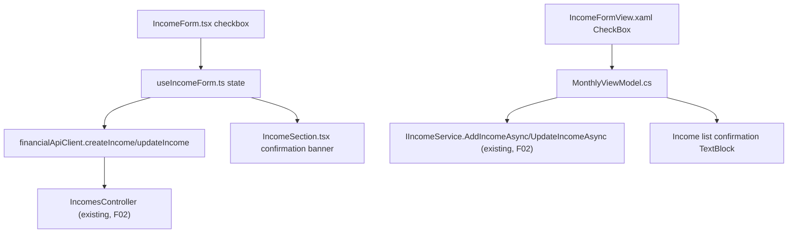

## 1. Technical Overview

**What:** Add a "Split to reserve" checkbox to the Income form in both front ends, visible only when the currently selected `IncomeSource.AutoSplitToReserve` is `true` (F01), submitting `Income.SplitToReserve` (F02) on save. The checkbox's default (checked) and visibility re-evaluate live as the user changes the selected source, and reflect the persisted value when editing an existing Income. After a save whose response comes back with `SplitToReserve = true`, a brief, detail-free confirmation ("Income saved and split to reserve") appears near the Income list, then disappears on its own.

**Why:** F01/F02 already did all the eligibility/orchestration work server-side; this feature is purely the client surface that lets the user actually reach it, mirrored identically across React (source of truth) and WPF (parity). No new API contract is needed — both existing `IncomeSourceDTO.autoSplitToReserve`/`IncomeDTO.splitToReserve` fields already exist from F01/F02.

**Scope:**
- Included: the checkbox itself (visibility, default, live re-evaluation on source change, persisted-state reflection on edit) in both `Financial.Web` and `Financial.App`; wiring the checkbox's value into the existing create/update payloads (replacing the hardcoded `splitToReserve: false` / `SplitToReserve = false` that F02 left in place since no UI existed yet); the post-save confirmation message (text-only, auto-dismissing).
- Excluded (per PRD Out of Scope): any change to the manual "New Income Split" form; any embedded per-bucket split summary in the confirmation (F02's `IncomeDTO` carries no such data — the PRD was updated during this feature's own interview to match); F04's Reserve section lock/indicator UI (separate feature, same wave).

## 2. Architecture Impact

**Affected components:**
- `Financial.Web/src/hooks/useIncomeForm.ts` — new `createIncomeSplitToReserve`/`editIncomeSplitToReserve` string state (`'true'`/`'false'`, mirrors the existing `createCountsAsTithe`/`editCountsAsTithe` pattern from P33-F02); recomputed whenever the selected source changes; populated from `IncomeDto.splitToReserve` on edit; replaces the two hardcoded `splitToReserve: false` payload values; new `splitConfirmationMessage` state, set from the save response and auto-cleared after a fixed delay via `useEffect`+`setTimeout`.
- `Financial.Web/src/components/IncomeForm.tsx` — new `splitToReserve` boolean prop and `'splitToReserve'` form field; new `Checkbox` (Fluent), shown only when the selected source's `autoSplitToReserve` is `true` (mirrors the existing `showGrossValueField` derivation).
- `Financial.Web/src/components/IncomeSection.tsx` — new optional `splitConfirmationMessage` prop; renders a `MessageBar` (`intent="success"`) above the list when present.
- `Financial.Web/src/pages/MonthlyPage.tsx` — field-mapping records gain `splitToReserve`; destructures and threads the new hook state through to `IncomeForm`/`IncomeSection`.
- `Financial.App/ViewModels/CashFlow/MonthlyViewModel.cs` — new `IncomeFormSplitToReserve` bound property; new `ShowIncomeSplitField` computed property (mirrors `ShowIncomeGrossValueField`); `IncomeFormSource`'s setter re-evaluates both visibility and default on change; `ShowCreateIncomeForm`/`ShowEditIncomeForm` set the default/persisted value; `SaveIncomeAsync` sends the guarded value and, on a split-true response, shows and then auto-clears a confirmation message (mirrors `AssetPriceFetchViewModel`'s existing `Task.Delay`-then-clear pattern).
- `Financial.App/Views/CashFlow/IncomeFormView.xaml` — new `CheckBox`, visibility bound to `ShowIncomeSplitField` via the existing `BoolToVisibilityConverter` (mirrors `ExpenseFormView.xaml`'s `CountsAsTithe` checkbox).
- `Financial.App/Views/CashFlow/IncomeSectionView.xaml` (or wherever the Income list header sits) — bound `TextBlock`/banner for the confirmation message.

**No change needed:** any backend file (F01/F02 already shipped the full contract); `Financial.Web/src/api/*` (no new fields — `autoSplitToReserve`/`splitToReserve` already exist in the generated types); `IncomeFormValidation.cs` (no new client-side validation rule — an invalid split state is unreachable via the UI since the checkbox is hidden for ineligible sources, and the one remaining server-side rejection path is already surfaced through the existing `IncomeSaveError`/`saveError` display).

## 3. Technical Decisions

| Decision | Chosen Approach | Alternative Considered | Trade-off |
|----------|----------------|----------------------|-----------|
| Checkbox value storage in React | String `'true'`/`'false'` field in `useIncomeForm`'s reducer state, parsed to boolean only at the prop boundary and at submit time | A native boolean field, changing `onFieldChange`'s signature to accept `string \| boolean` | Every other field in this form (and `ExpenseForm`'s established `countsAsTithe` precedent from P33-F02) already uses the string-keyed `onFieldChange(field, value: string)` callback; keeping the same shape avoids a one-off signature change for a single field |
| Recomputing the checkbox's default/visibility on source change | `setCreateIncomeField`/`setEditIncomeField` (React) and `IncomeFormSource`'s setter (WPF) explicitly recompute and overwrite the split value whenever the source changes, in addition to the existing gross-value-reset side effect | Leave the split value untouched across a source change (only recompute visibility) | PRD Experience: "selecting an eligible source shows it, checked by default" — read literally, every landing on an eligible source resets to checked, not just the first time; matches the same "recompute on source change" shape already established for the Gross Value field |
| Post-save confirmation mechanism | Plain, detail-free text message ("Income saved and split to reserve"), shown near the Income list (not inside the form, which closes immediately on any save) for a fixed 4-second window, then cleared automatically | (a) Per-bucket split summary in the confirmation (original PRD wording); (b) keep the form open with the message instead of auto-closing | (a) was reconsidered and dropped during this feature's own interview, consistent with F02's PR-review decision to drop `IncomeDTO`'s split-movement summary — no data to show. (b) would change the form's existing close-on-any-save behavior for every save, not just split ones, which the interview explicitly ruled out |
| Confirmation display duration | 4000ms in both front ends (a named constant in each) | Match `AssetPriceFetchViewModel`'s existing 2000ms progress-hide delay exactly | This is a message the user needs to actually read, not a progress indicator disappearing — a slightly longer window is warranted; kept as one clearly-named constant per front end so either can be tuned independently later |
| WPF checkbox placement | Row 2 of `IncomeFormView.xaml` (alongside Bank/Description), narrowing Description's `ColumnSpan` from 3 to 2 to make room in column 3 | Add a 5th column to Row 1 (next to Net Value, matching the PRD's React placement literally) | Row 1 is already visually full (Date/Source/Gross Value/Net Value); `ExpenseFormView.xaml`'s own `CountsAsTithe` checkbox — the closest existing precedent for "a conditional checkbox next to a conditional numeric field" — already established the "own column in the row below" placement, so this follows the codebase's own convention rather than inventing a new one |

## 4. Component Overview

**Frontend — Web:**

| File Path | New/Modified | Purpose | Key Responsibilities |
|-----------|--------------|---------|---------------------|
| `Financial.Web/src/hooks/useIncomeForm.ts` | Modified | Form state/payload | Add `createIncomeSplitToReserve`/`editIncomeSplitToReserve` (`string`, default computed from the selected source's eligibility); add `'createIncomeSplitToReserve'`/`'editIncomeSplitToReserve'` to the `CreateIncomeField`/`EditIncomeField` unions; `showCreateIncomeForm`/`SHOW_EDIT_FORM` set the initial value; `setCreateIncomeField`/`setEditIncomeField` recompute it whenever the source field changes; `submitCreateIncome`/`saveEditIncome` send `splitToReserve: <field> === 'true'` instead of the hardcoded `false`, and capture the response `IncomeDto` to set `splitConfirmationMessage` when `splitToReserve` is `true`; new `useEffect` clears `splitConfirmationMessage` after `SPLIT_CONFIRMATION_DELAY_MS` (4000) |
| `Financial.Web/src/components/IncomeForm.tsx` | Modified | Create/edit form | Add `'splitToReserve'` to `IncomeFormField`; add `splitToReserve: boolean` prop; derive `showSplitField` from `incomeSources`/`incomeSource` (mirrors `showGrossValueField`); render a Fluent `Checkbox` labeled "Split to reserve" only when `showSplitField`, near the Net Value field |
| `Financial.Web/src/components/IncomeSection.tsx` | Modified | Income list | Add optional `splitConfirmationMessage?: string \| null` prop; render a `MessageBar` (`intent="success"`) above the table when non-null |
| `Financial.Web/src/pages/MonthlyPage.tsx` | Modified | Field-mapping glue | Extend `CREATE_INCOME_FIELD_BY_FORM_FIELD`/`EDIT_INCOME_FIELD_BY_FORM_FIELD` with `splitToReserve`; destructure the new hook state; pass `splitToReserve={(isIncomeEditing ? editIncomeSplitToReserve : createIncomeSplitToReserve) === 'true'}` to `IncomeForm` and `splitConfirmationMessage` to `IncomeSection` |

**Frontend — WPF (`Financial.App`):**

| File Path | New/Modified | Purpose | Key Responsibilities |
|-----------|--------------|---------|---------------------|
| `Financial.App/ViewModels/CashFlow/MonthlyViewModel.cs` | Modified | View model | Add `_incomeFormSplitToReserve` backing field + `IncomeFormSplitToReserve` property; add `ShowIncomeSplitField` computed property (`IncomeSources.FirstOrDefault(s => s.Id == IncomeFormSource)?.AutoSplitToReserve == true`); `IncomeFormSource`'s setter raises `OnPropertyChanged(nameof(ShowIncomeSplitField))` and recomputes `IncomeFormSplitToReserve`; `ShowCreateIncomeForm` sets the default from the initial source's eligibility; `ShowEditIncomeForm` sets it from `income.SplitToReserve`; `SaveIncomeAsync` sends `SplitToReserve = ShowIncomeSplitField && IncomeFormSplitToReserve`, captures the returned `IncomeDTO`, and — when its `SplitToReserve` is `true` — sets `IncomeSplitConfirmationMessage`, awaits `Task.Delay(IncomeSplitConfirmationHideDelayMs)`, then clears it; new `IncomeSplitConfirmationMessage` (`string?`, private set) property |
| `Financial.App/Views/CashFlow/IncomeFormView.xaml` | Modified | Create/edit form view | Add a `CheckBox` in Row 2 (Description's `ColumnSpan` narrowed from 3 to 2 to make room), `Content="Split to reserve"`, `Visibility` bound to `ShowIncomeSplitField` via `BoolToVisibilityConverter`, `IsChecked` bound to `IncomeFormSplitToReserve` |
| `Financial.App/Views/CashFlow/IncomeSectionView.xaml` | Modified | Income list view | Add a `TextBlock` bound to `IncomeSplitConfirmationMessage`, visible only when non-empty (via the existing `BoolToVisibilityConverter` on a small `IsIncomeSplitConfirmationVisible`-style property, or a converter that treats non-null/non-empty string as visible — whichever this view already uses elsewhere for a similar optional-message binding) |

**Persistence / API:** No changes — this feature only wires the client to fields F01/F02 already expose.

## 5. API Contracts

No new endpoints and no contract changes. This feature is the first real consumer, on both front ends, of two fields that already exist in the shipped contract:
- `GET /income-sources` → `IncomeSourceDTO.autoSplitToReserve` (F01) — read by both forms to decide checkbox visibility/default.
- `POST /incomes` / `PUT /incomes/{id}` → request body's `splitToReserve` (F02) — now sent as the user's actual checkbox state instead of a hardcoded `false`.
- Both endpoints' response `IncomeDTO.splitToReserve` (F02) — read to decide whether to show the post-save confirmation message.

## 6. Data Model

No persistence/data-model changes — this feature is UI-only, consuming fields F01/F02 already persist and expose.

## 7. Testing Strategy

Per `testing-guide-Financial`: React hook (`useIncomeForm`) tests for the new field's default/recompute-on-source-change/edit-population/submit-payload/confirmation-timeout branches; React component (`IncomeForm`, `IncomeSection`) tests for conditional rendering; WPF `MonthlyViewModel` tests for the equivalent computed-property/command-flow branches, following the existing `ShowCountsAsTitheField`/`ExpenseFormCountsAsTithe` test shape from P33-F02.

**Test File Structure:**

| Test File | Test Type | Target | Coverage Goal |
|-----------|-----------|--------|----------------|
| `Financial.Web/src/hooks/__tests__/useIncomeForm.test.ts` | Hook | `useIncomeForm` | See key test cases below |
| `Financial.Web/src/components/__tests__/IncomeForm.test.tsx` | Component | `IncomeForm` | Checkbox shown/hidden per source eligibility; checked state reflects the `splitToReserve` prop; toggling calls `onFieldChange('splitToReserve', ...)` |
| `Financial.Web/src/components/__tests__/IncomeSection.test.tsx` | Component | `IncomeSection` | `splitConfirmationMessage` renders as a success `MessageBar` when present; renders nothing extra when `null`/omitted |
| `Tests/Financial.Presentation.Tests/ViewModels/CashFlow/MonthlyViewModelTests.cs` | Unit | `MonthlyViewModel` | See key test cases below |

**Key test cases (`useIncomeForm.test.ts`):**

| Test Function | Description | Assertions |
|----------------|-------------|------------|
| `showCreateIncomeForm_WithEligibleDefaultSource_DefaultsSplitToReserveTrue` | Default active source is Ariana (eligible) | `createIncomeSplitToReserve === 'true'` |
| `showCreateIncomeForm_WithIneligibleDefaultSource_DefaultsSplitToReserveFalse` | Default active source is Gleison (not eligible) | `createIncomeSplitToReserve === 'false'` |
| `setCreateIncomeField_SwitchingToEligibleSource_SetsSplitToReserveTrue` | Change `createIncomeSource` to Ariana's id | `createIncomeSplitToReserve === 'true'` |
| `setCreateIncomeField_SwitchingToIneligibleSource_SetsSplitToReserveFalse` | Change `createIncomeSource` to Gleison's id, starting from `'true'` | `createIncomeSplitToReserve === 'false'` |
| `showEditIncomeForm_WithSplitIncome_PopulatesSplitToReserveTrue` | `IncomeDto.splitToReserve === true` | `editIncomeSplitToReserve === 'true'` |
| `showEditIncomeForm_WithUnsplitIncome_PopulatesSplitToReserveFalse` | `IncomeDto.splitToReserve === false` | `editIncomeSplitToReserve === 'false'` |
| `submitCreateIncome_WithSplitChecked_SendsSplitToReserveTrue` | `createIncomeSplitToReserve = 'true'` at submit | `createIncomeMock` called with `splitToReserve: true` |
| `submitCreateIncome_WhenResponseSplitToReserveTrue_SetsConfirmationMessage` | Mocked response has `splitToReserve: true` | `splitConfirmationMessage` becomes `'Income saved and split to reserve'` |
| `submitCreateIncome_WhenResponseSplitToReserveFalse_LeavesConfirmationMessageNull` | Mocked response has `splitToReserve: false` | `splitConfirmationMessage` stays `null` |
| `splitConfirmationMessage_ClearsAutomaticallyAfterTimeout` | Uses fake timers, advances past the delay | `splitConfirmationMessage` becomes `null` again without further action |

**Key test cases (`MonthlyViewModelTests.cs`):**

| Test Function | Description | Assertions |
|----------------|-------------|------------|
| `ShowIncomeSplitField_ForEligibleSource_IsTrue` | `IncomeFormSource` set to Ariana's id | `ShowIncomeSplitField` is `true` |
| `ShowIncomeSplitField_ForIneligibleSource_IsFalse` | `IncomeFormSource` set to Gleison's id | `ShowIncomeSplitField` is `false` |
| `ShowCreateIncomeForm_DefaultsIncomeFormSplitToReserve_FromInitialSourceEligibility` | Default source is eligible | `IncomeFormSplitToReserve` is `true` |
| `ShowEditIncomeForm_PopulatesIncomeFormSplitToReserve_FromIncome` | Edited income has `SplitToReserve = true` | `IncomeFormSplitToReserve` is `true` after `ShowEditIncomeFormCommand` execution |
| `SaveIncomeAsync_WithSplitChecked_SendsSplitToReserveTrue` | `IncomeFormSplitToReserve = true`, eligible source | Stub service's captured request has `SplitToReserve == true` |
| `SaveIncomeAsync_WithIneligibleSourceEvenIfChecked_SendsSplitToReserveFalse` | `IncomeFormSplitToReserve = true` but source switched to ineligible without recompute (defensive guard) | Captured request has `SplitToReserve == false` |
| `SaveIncomeAsync_WhenResponseSplitToReserveTrue_SetsThenClearsConfirmationMessage` | Stub service returns `SplitToReserve = true` | `IncomeSplitConfirmationMessage` is non-null immediately after save, then `null` after awaiting past the hide delay |

**Cross-Feature Integration tests (per PRD Section 9):**

| Test Function | Description | Assertions |
|----------------|-------------|------------|
| `useIncomeForm.test.ts` / `MonthlyViewModelTests.cs`: `*_ChecksBoxVisibilityAgainstRealIncomeSourceDtoFlag` | Uses a real fetched `IncomeSourceDto`/`IncomeSourceDTO` list (not a hand-rolled bypass) with F01's `autoSplitToReserve` set | Confirms the checkbox's visibility reads the actual F01 flag |
| `submitCreateIncome_result_LinkedMovementsAppearInReserveSection` (documented as a manual/smoke check, not automated) | Out of automated scope — F04 (same wave) owns the Reserve section's own display of the resulting movements; this feature only confirms the *request* carries the right flag and the confirmation message appears | N/A — covered by F02's own endpoint tests proving the movements are created, and by this feature's own submit-payload tests |
