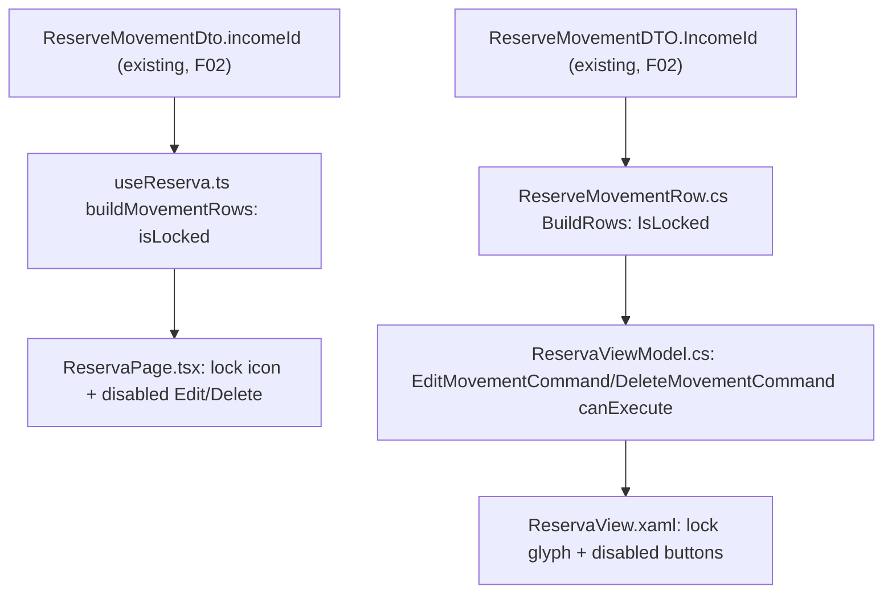

## 1. Technical Overview

**What:** In the Reserve section's movement list (both front ends), any `ReserveMovement` whose `IncomeId` is non-null (i.e. created by F02's automated split) shows a small lock indicator, and its Edit/Delete controls are disabled. Attempting to discover why relies on the lock indicator itself carrying the explanation (tooltip + accessible name), since a disabled control isn't reliably hoverable/focusable. Movements with `IncomeId = null` (everything from the existing manual "New Income Split" feature, and all historical data) are completely unaffected.

**Why:** F02 already created the `IncomeId` link and rejects direct `PUT`/`DELETE` on a locked movement server-side (409). This feature closes the loop on the client: today a user can still click Edit/Delete on a linked movement and get a raw server rejection. Locking the controls in the UI itself, with an explanation, prevents that dead-end interaction entirely.

**Scope:**
- Included: a lock indicator column in the Reserve section's movement grid (React `ReservaPage.tsx`, WPF `ReservaView.xaml`) for any row with a non-null `IncomeId`; disabling that row's Edit/Delete controls in both front ends; the explanatory message, accessible via the lock indicator's tooltip/accessible name.
- Excluded (per PRD Out of Scope / already shipped): the `IncomeId` link itself and the server-side 409 rejection (F02, already shipped — kept as-is, defense-in-depth); any change to unlinked (`IncomeId = null`) movements' existing Edit/Delete/group-delete behavior; any change to the Income form (F03, already shipped).

## 2. Architecture Impact

**Affected components:**
- `Financial.Web/src/hooks/useReserva.ts` — `ReserveMovementRow` (already extends `ReserveMovementDto`, which already carries `incomeId` from F02's shipped contract) gains a derived `isLocked` boolean, computed in `buildMovementRows` alongside the existing `groupTotal`/`isPartOfGroup` derivation.
- `Financial.Web/src/pages/ReservaPage.tsx` — movement grid gains a third icon column (lock glyph), rendered only when `m.isLocked`; Edit/Delete buttons get `disabled={m.isLocked || ...}` (composed with the existing `deletingMovementId === m.id` disablement) and a `title` attribute explaining the lock, in addition to the lock icon's own tooltip.
- `Financial.Web/src/pages/ReservaPage.css` — new style for the lock icon; `Financial.Web/src/styles/data-table.css` gains a shared `.data-table__action-btn:disabled` rule (didn't exist yet — every other disabled-button case in this codebase is a full-width submit button, not an inline icon action button).
- `Financial.App/ViewModels/CashFlow/ReserveMovementRow.cs` — gains `IncomeId` (`Guid?`) and a computed `IsLocked` property, populated in `BuildRows` alongside the existing `GroupTotal`/`IsPartOfGroup` derivation.
- `Financial.App/ViewModels/CashFlow/ReservaViewModel.cs` — `EditMovementCommand`/`DeleteMovementCommand` gain a `canExecute` predicate (`row => row?.IsLocked != true`), the idiomatic WPF `RelayCommand<T>` mechanism that automatically disables the bound `Button` — no new guard code needed inside `ShowEditForm`/`DeleteMovementAsync` themselves.
- `Financial.App/Views/CashFlow/ReservaView.xaml` — movement `DataGrid` gains a third `DataGridTemplateColumn` (lock glyph, visible via `BoolToVisibilityConverter` on `IsLocked`), with `ToolTip` and `AutomationProperties.Name` set to the explanation text; Edit/Delete `Button`s get `ToolTipService.ShowOnDisabled="True"` so their own tooltip remains visible once `IsEnabled` follows the command's `CanExecute`.

**No change needed:** any backend file (F02 already shipped `ReserveMovementDTO.IncomeId` and the 409 rejection); `Financial.Web/src/api/*` (no new fields — `incomeId` already exists in the generated types); `Financial.CashFlow.Application`/`Infrastructure` (no application/domain logic changes — this is UI-only).

## 3. Technical Decisions

| Decision | Chosen Approach | Alternative Considered | Trade-off |
|----------|----------------|----------------------|-----------|
| Where the indicator sits | A third icon column in the movement grid, alongside the existing Edit/Delete icon columns, in both front ends | An inline badge next to the Description/Amount cell | The grid already has an established "one icon per action, one column each" convention (✏ Edit, 🗑 Delete at a fixed 32px-equivalent width) — the lock indicator follows that same convention rather than introducing a new placement pattern (per explicit user direction during this feature's interview) |
| How the explanation reaches keyboard/screen-reader users | The explanation text lives on the lock icon itself (`title` + `aria-label` in React; `ToolTip` + `AutomationProperties.Name` in WPF), not solely on the disabled Edit/Delete buttons | Explanation only via `title`/`ToolTip` on the disabled Edit/Delete buttons | A native HTML `disabled` button suppresses `title` hover in Chromium/Firefox, and WPF suppresses `ToolTip` on a disabled control unless `ToolTipService.ShowOnDisabled` is set — the lock icon is never itself disabled, so it's the one element guaranteed to expose the explanation on hover/focus in both stacks. The disabled buttons still carry `title`/`ToolTip` (with `ShowOnDisabled="True"` in WPF) as a secondary path for platforms/AT that do support it. |
| Explanatory message wording | Reuse F02's existing 409 rejection text verbatim: "This reserve movement is linked to an income and can only be changed by editing that income." | A shorter, UI-specific message | One message to maintain; already proven wording from F02's own tests; the user is never actually shown a server error in practice (the control is disabled before any request is attempted), so consistency matters more than brevity here |
| Disabling Edit/Delete in WPF | `RelayCommand<ReserveMovementRow>`'s existing `canExecute` predicate parameter (`row?.IsLocked != true`), which WPF's command binding automatically reflects into the bound `Button.IsEnabled` | An explicit `IsEnabled` binding on each `Button` to a converter over `IsLocked` | `RelayCommand<T>` already supports `canExecute` (used nowhere yet in this file, but it's the idiomatic mechanism the codebase's own command class was built for) — no new converter, no duplicated locked-check between the binding and the command body |
| Lock icon glyph | Text glyph "🔒", matching the existing Edit button's plain-text glyph convention ("✏") in both front ends, rather than an SVG (used only by Delete) | An SVG lock icon matching Delete's SVG style | Keeps the new column's implementation trivial and identical in both front ends (a literal glyph), and cross-platform visual parity is exact by construction rather than requiring two separately-drawn icons |

## 4. Component Overview

**Frontend — Web:**

| File Path | New/Modified | Purpose | Key Responsibilities |
|-----------|--------------|---------|---------------------|
| `Financial.Web/src/hooks/useReserva.ts` | Modified | Movement row derivation | `ReserveMovementRow` gains `isLocked: boolean`; `buildMovementRows` sets it from `m.incomeId != null`, alongside the existing group-total derivation |
| `Financial.Web/src/pages/ReservaPage.tsx` | Modified | Reserve grid | `MovementColumns` gains a third `col`; header row gains a matching empty `<th />`; each row renders a lock `` (role="img", `aria-label`/`title` = the explanation) when `m.isLocked`; Edit/Delete `<button>`s get `disabled={m.isLocked || ...existing...}` and `title` set to the explanation when locked |
| `Financial.Web/src/pages/ReservaPage.css` | Modified | Lock icon style | New `.reserva-page__lock-icon` rule (sizing/color consistent with `.data-table__action-btn`) |
| `Financial.Web/src/styles/data-table.css` | Modified | Shared disabled-button style | New `.data-table__action-btn:disabled` rule (opacity + `cursor: not-allowed`, mirroring `.reserva-page__submit-btn:disabled`) |

**Frontend — WPF (`Financial.App`):**

| File Path | New/Modified | Purpose | Key Responsibilities |
|-----------|--------------|---------|---------------------|
| `Financial.App/ViewModels/CashFlow/ReserveMovementRow.cs` | Modified | Movement row derivation | Add `IncomeId` (`Guid?`) and computed `IsLocked => IncomeId.HasValue`; `BuildRows` maps `movement.IncomeId` through |
| `Financial.App/ViewModels/CashFlow/ReservaViewModel.cs` | Modified | Movement commands | `InitializeEditDeleteCommands` passes a `canExecute` predicate (`row => row?.IsLocked != true`) to both `EditMovementCommand` and `DeleteMovementCommand` |
| `Financial.App/Views/CashFlow/ReservaView.xaml` | Modified | Reserve grid | New `DataGridTemplateColumn` (lock glyph "🔒", `Visibility` bound to `IsLocked` via `BoolToVisibilityConverter`, `ToolTip` + `AutomationProperties.Name` = the explanation); Edit/Delete `Button`s gain `ToolTip` = the explanation and `ToolTipService.ShowOnDisabled="True"` |

**Persistence / API:** No changes — this feature only reads a field (`IncomeId`/`incomeId`) F02 already persists and exposes.

## 5. API Contracts

No new endpoints and no contract changes. This feature is the first client-side reader, in both front ends, of a field F02 already shipped:
- `GET /reserve/movements` → `ReserveMovementDTO.IncomeId` (F02) — read to compute each row's locked state.

The existing `PUT /reserve/movements/{id}` / `DELETE /reserve/movements/{id}` 409 rejection (F02) remains as defense-in-depth; this feature makes it unreachable through the normal UI path rather than replacing it.

## 6. Data Model

No persistence/data-model changes — this feature is UI-only, consuming a field F02 already persists and exposes.

## 7. Testing Strategy

Per `testing-guide-Financial`: React hook (`useReserva`) tests for the `isLocked` derivation; React component (`ReservaPage`) tests for the lock icon's conditional rendering and the disabled state/tooltip of Edit/Delete on a locked row, and that an unlocked row is fully unaffected; WPF `ReserveMovementRow`/`ReservaViewModel` tests for the equivalent `IsLocked` derivation and `CanExecute` gating.

**Test File Structure:**

| Test File | Test Type | Target | Coverage Goal |
|-----------|-----------|--------|----------------|
| `Financial.Web/src/hooks/__tests__/useReserva.test.ts` | Hook | `useReserva` / `buildMovementRows` | See key test cases below |
| `Financial.Web/src/pages/__tests__/ReservaPage.test.tsx` | Component | `ReservaPage` | See key test cases below |
| `Tests/Financial.Presentation.Tests/ViewModels/CashFlow/ReservaViewModelTests.cs` | Unit | `ReservaViewModel` / `ReserveMovementRow` | See key test cases below |

**Key test cases (`useReserva.test.ts`):**

| Test Function | Description | Assertions |
|----------------|-------------|------------|
| `buildMovementRows_WithIncomeId_MarksRowLocked` | A movement with a non-null `incomeId` | Resulting row's `isLocked === true` |
| `buildMovementRows_WithoutIncomeId_MarksRowUnlocked` | A movement with `incomeId: null` (or omitted) | Resulting row's `isLocked === false` |

**Key test cases (`ReservaPage.test.tsx`):**

| Test Function | Description | Assertions |
|----------------|-------------|------------|
| `rendersLockIcon_ForLockedMovement` | A row with `isLocked: true` | Lock icon element present with the explanatory `aria-label`/`title` |
| `rendersNoLockIcon_ForUnlockedMovement` | A row with `isLocked: false` | Lock icon element absent |
| `disablesEditAndDelete_ForLockedMovement` | A row with `isLocked: true` | Both Edit and Delete buttons are `disabled`, with `title` set to the explanation |
| `keepsEditAndDeleteEnabled_ForUnlockedMovement` | A row with `isLocked: false` | Both Edit and Delete buttons remain enabled and clickable (existing `onEdit`/`onDelete`-equivalent behavior unchanged) |
| `groupDeleteWarning_StillWorks_ForUnlockedGroupedMovement` | Regression check: an unlocked, grouped (`isPartOfGroup: true`) movement | Clicking Delete still shows the existing multi-line group-delete confirmation wording, unaffected by this feature |

**Key test cases (`ReservaViewModelTests.cs`):**

| Test Function | Description | Assertions |
|----------------|-------------|------------|
| `BuildRows_WithIncomeId_SetsIsLockedTrue` | A `ReserveMovementDTO` with a non-null `IncomeId` | Resulting `ReserveMovementRow.IsLocked` is `true` |
| `BuildRows_WithoutIncomeId_SetsIsLockedFalse` | A `ReserveMovementDTO` with `IncomeId = null` | Resulting `ReserveMovementRow.IsLocked` is `false` |
| `EditMovementCommand_CanExecute_FalseForLockedRow` | `CanExecute` called with a locked row | Returns `false` |
| `EditMovementCommand_CanExecute_TrueForUnlockedRow` | `CanExecute` called with an unlocked row | Returns `true` |
| `DeleteMovementCommand_CanExecute_FalseForLockedRow` | `CanExecute` called with a locked row | Returns `false` |
| `DeleteMovementCommand_CanExecute_TrueForUnlockedRow` | `CanExecute` called with an unlocked row | Returns `true` |

**Cross-Feature Integration tests (per PRD Section 9):**

| Test Function | Description | Assertions |
|----------------|-------------|------------|
| `buildMovementRows_ForServiceCreatedSplit_LocksAllLinkedMovements` / `BuildRows_...` equivalent | A set of `ReserveMovementDto`/`ReserveMovementDTO` shaped like F02's actual split output (same `IncomeId` across several bucket movements) | All of them come back `isLocked`/`IsLocked === true`, none of the existing group-total/`isPartOfGroup` derivation is disturbed |
| (Documented as a manual/smoke check, not automated) F02 creates a linked movement → it appears locked immediately; F02 removes the link (Income edit/delete) → it appears unlocked/disappears immediately | Out of automated scope — covered by this feature's derivation tests (locked state is a pure function of `IncomeId`) plus F02's own tests proving `IncomeId` is set/cleared correctly on create/update/delete | N/A |
