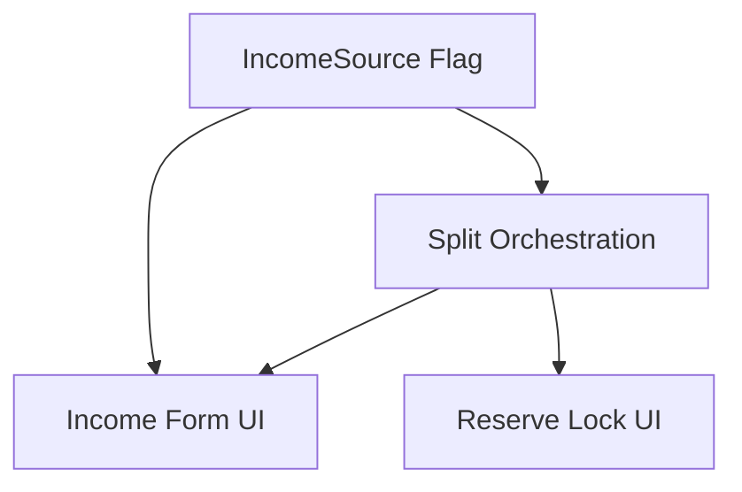

# Automated Income Reserve Split

## 1. Executive Summary

Automated Income Reserve Split closes a gap in the CashFlow bounded context of the Financial app: today, recording an income that should feed a reserve bucket (e.g. the "Ariana" income source) requires two disconnected manual actions — creating the `Income` entry, then separately opening the Reserve section's "New Income Split" form and re-typing the same date, amount, and description to fan the value out across reserve buckets. The two records have no real link to each other, so editing or deleting one never keeps the other in sync.

This feature turns that into a single step for the app's one user. An `IncomeSource`-level flag (`AutoSplitToReserve`) marks which income sources are eligible for splitting — starting with "Ariana", the only source that needs it today. The Income form shows a "split to reserve" checkbox only for eligible sources, defaulting to checked; when the Income is saved with the checkbox on, the system automatically calculates the net-of-tithe amount and creates the matching `ReserveMovement`s across the active reserve buckets, using the same percentage-split rule the manual feature already uses.

The two records are now genuinely linked: editing a split-linked Income recalculates and recreates its reserve movements, deleting the Income deletes them, and the reserve movements themselves become read-only outside the Income form — eliminating the drift that the old Date+Description string-matching approach could never prevent. The existing manual "New Income Split" feature is untouched and remains available for one-off splits that don't originate from a specific Income entry.

## 2. Problem and Opportunity

**The Problem**

- **Duplicate manual entry.** Every eligible income requires typing the same date, amount, and description twice — once in the Income form, once in the separate Reserve "New Income Split" form — pure repeated effort with no added value.
- **Easy to forget.** The split is an optional second step with nothing forcing or reminding the user to perform it. A recorded income can silently go un-split, leaving the reserve bucket balances understated with no indication anything is missing.
- **Fragile, invisible linkage.** The only relationship between an income and its manually created reserve movements is that they happen to share the same Date and Description text. There is no real foreign key, so editing or deleting the Income never propagates to the reserve movements (or vice versa) — the two records can drift apart silently over time.
- **No system-encoded eligibility.** Nothing in the data model records which income sources are supposed to be split. The user has to remember, purely from memory, that only "Ariana" income needs this treatment.

**The Opportunity**

- A checkbox on the Income form, driven by a per-`IncomeSource` flag, collapses the two manual steps into one — the split happens automatically as part of saving the Income, removing both the duplicate typing and the risk of forgetting it.
- A real `IncomeId` reference on `ReserveMovement` (using the codebase's existing reference-property pattern) replaces the fragile Date+Description matching, making update/delete cascade reliably and making the linkage explicit and inspectable rather than implicit.
- Encoding eligibility directly on `IncomeSource.AutoSplitToReserve` means the UI's behavior is data-driven: today only "Ariana" is flagged, but extending the behavior to a future income source is a data change (via the migration tool), not a UI code change.

## 3. Target Audience

### Primary Users

**Household Finance Manager**
- The single self-hosted user of the Financial app, personally recording their own income, expenses, and reserve bucket movements every month.
- Already uses the existing Income form and Reserve section regularly and is familiar with today's two-step manual split process for "Ariana" income.
- Wants their reserve bucket balances to always be accurate and consistent with recorded income, without having to remember or repeat manual bookkeeping steps.

## 4. Objectives

**Product Objectives**

- **Eliminate** the manual two-step entry for reserve-eligible incomes.
- **Guarantee** that a split-linked Income and its `ReserveMovement`s never drift out of sync.
- **Preserve** the existing manual "New Income Split" workflow and unlinked reserve movements exactly as they behave today.
- **Maintain** backward compatibility with the existing `data-cashflow.json` file with no required manual migration for the default case.

**Success Metrics**

- 100% of new "Ariana" incomes created after launch produce their matching reserve movements with zero additional user actions beyond saving the Income form.
- 0 orphaned reserve movements or un-updated stale movements after editing or deleting a split-linked Income, verified by acceptance tests covering create, update (value change, source change, flag toggle), and delete.
- 100% of existing acceptance scenarios for the manual "New Income Split" feature and for editing/deleting unlinked reserve movements continue to pass unchanged.
- The existing `data-cashflow.json`/`data-cashflow.example.json` files, and any pre-existing "Ariana" `IncomeSource` record created before this feature, load with zero errors and end up with the correct `AutoSplitToReserve` value (`true` for Ariana, `false` for every other source) after running the updated import/migration tool.

## 5. User Stories

### F01. IncomeSource Auto-Split Eligibility Flag
- As the system, I want an `IncomeSource` missing the `AutoSplitToReserve` field in stored JSON to default to `false`, so existing data keeps loading without requiring a manual migration.
- As the user running the import/migration tool, I want the "Ariana" `IncomeSource` to end up with `AutoSplitToReserve = true` — whether it's being seeded fresh or already exists from a prior migration — so only that source offers the split option going forward.
- As the system, I want the `AutoSplitToReserve` flag exposed on the `IncomeSource` read API, so both front ends can decide whether to offer the split checkbox for a given source.

### F02. Automated Income-to-Reserve Split Orchestration
- As a user, I want submitting an Income with the split option checked to automatically create the matching `ReserveMovement`s, so I no longer have to open the Reserve section separately.
- As a user, I want the system to reject an Income submission that requests a split for an `IncomeSource` that doesn't allow it, so an invalid state can never be saved.
- As a user, I want editing a split-linked Income's value, date, description, or source to automatically recreate its linked `ReserveMovement`s with the updated values, so the reserve stays in sync without manual cleanup.
- As a user, I want deleting a split-linked Income to automatically delete its linked `ReserveMovement`s, so no orphaned reserve entries are left behind.
- As a user, I want turning off the split checkbox on an already-saved split Income to remove its linked `ReserveMovement`s, so I can undo a split without deleting the Income itself.
- As a user, I want turning on the split checkbox on an already-saved unsplit Income (source allows it) to create the linked `ReserveMovement`s retroactively, so I can split an income I initially entered without splitting.
- As the system, I want a failure during the split step of a Create or Update to roll back the entire operation, so the Income and its reserve movements never end up partially saved.
- As the system, I want a `ReserveMovement` linked to an Income to be rejected by the Reserve section's direct update/delete endpoints, so it can only ever be changed through its parent Income.

### F03. Income Form Split Control
- As a user, I want to see a "split to reserve" checkbox on the Income form only when the selected `IncomeSource` allows it, so I'm never offered an option that doesn't apply.
- As a user, I want the split checkbox to default to checked when I select an `IncomeSource` that allows splitting, so I don't have to remember to turn it on for a new entry.
- As a user, I want the checkbox to appear or disappear immediately when I change the selected `IncomeSource`, so the form always reflects the current source's eligibility.
- As a user, I want to see the checkbox pre-checked when editing an existing split Income, so its current split state is clear.

### F04. Reserve Movement Lock & Indicator
- As a user, I want reserve movements created by an income split to show a visual indicator in the Reserve section's movement list, so I can tell them apart from manually created movements.
- As a user, I want the Edit and Delete actions disabled on income-linked reserve movements in the Reserve section, so I can't accidentally create an inconsistency by editing them outside the Income form.
- As a user, I want a clear message when I try to edit or delete a locked movement, telling me it's managed through its linked income, so I know how to actually make the change.

## 6. Functionalities

### F01. IncomeSource Auto-Split Eligibility Flag

**Provides:**
- `AutoSplitToReserve` eligibility flag per `IncomeSource` (used by F02, F03)

**Capabilities:**
- New boolean property `AutoSplitToReserve` on the `IncomeSource` domain entity, defaulting to `false`.
- An `IncomeSource` record missing the field in stored JSON deserializes with `AutoSplitToReserve = false` (property-initializer default), requiring no migration step for the general backward-compatibility case.
- `IncomeSourceDTO` and the `GET /income-sources` response include `AutoSplitToReserve`, so both front ends can gate the split checkbox per source.
- The `Tools/CashFlowSpreadsheetImport` migration tool is updated so that when it seeds the "Ariana" `IncomeSource` for the first time, it has `AutoSplitToReserve = true`. Every other newly seeded `IncomeSource` (e.g. "Gleison") ends up `false`. An "Ariana" record that already exists from a prior migration run (as it does in the live data today) is not retroactively corrected by the tool — the user updates that one existing record by hand until general `IncomeSource` CRUD exists.
- No new `IncomeSource` create/edit UI is introduced by this feature — `IncomeSource` remains a read-only/seeded entity from the front ends' perspective; the flag is only settable by running the migration tool.

**Experience:**
- No new end-user screen. This feature is surfaced only through the `IncomeSource` read API (consumed by F03) and through running the migration tool (a developer/maintenance action, not part of the app's UI).

**Error Handling:**
- If the migration tool finds more than one "Ariana" `IncomeSource` record (data anomaly), it logs a warning, updates the first match, and leaves the rest untouched rather than failing the run.
- If the migration tool's write to the data file fails, no partial write is committed — consistent with the storage layer's existing atomic whole-document write behavior.

### F02. Automated Income-to-Reserve Split Orchestration

**Consumes:**
- F01: `AutoSplitToReserve` eligibility flag per `IncomeSource`

**Provides:**
- `Income.SplitToReserve` state and linked `ReserveMovement` records (via a new `IncomeId` reference) (used by F03, F04)

**Capabilities:**
- New boolean property `SplitToReserve` on the `Income` domain entity, defaulting to `false`; missing in stored JSON deserializes as `false`.
- On Create or Update, if `SplitToReserve = true`, the system validates that the submitted `Income`'s `IncomeSource.AutoSplitToReserve = true`; otherwise the request is rejected with a validation error and nothing is persisted.
- Split base amount = `Income.NetValue × (1 − 0.10)` (net value minus the existing 10% tithe rate used by `TitheService`), rounded to 2 decimal places away-from-zero.
- The split fans the base amount out across every **active** `ReserveBucket` using the exact same per-bucket percentage rule the manual split already uses (`ReserveBucket.CalculateSplitAmount`): one `ReserveMovement` created per active bucket, with `Amount` from that rule, `Date = Income.Date`, and `Description = Income.Description` (copied as-is, including when null/blank).
- Each created `ReserveMovement` stores a new `IncomeId` reference back to its parent `Income` (added to the codebase's existing entity-reference pattern: `CashFlowTypeInfoResolver.ReferenceProperties` + a matching reference converter), so the link is a real, resolvable relationship rather than text matching.
- If there are zero active `ReserveBucket`s at the moment of split, zero `ReserveMovement`s are created and the Income is still saved normally — no error, matching the manual split's existing behavior for an empty active-bucket set.
- Updating a split-linked Income — any field, including flipping `SplitToReserve` — first deletes all of its currently linked `ReserveMovement`s, then, if the resulting `SplitToReserve` is `true`, recreates them from the updated values. Flipping `SplitToReserve` from `false` to `true` on an existing Income creates the linked movements for the first time; flipping it from `true` to `false` simply deletes them and leaves the Income without any linked movements.
- Deleting a split-linked Income deletes all of its linked `ReserveMovement`s as part of the same operation.
- The Create/Update operation is atomic across the Income write and its linked-movement writes: if any part of the split step fails, the entire operation is rolled back and no partial result (an Income without its expected movements, or an orphaned movement without its Income) is ever persisted — extending the rollback-on-failure behavior the manual split already has for its own movement creation.
- `PUT /reserve/movements/{id}` and `DELETE /reserve/movements/{id}` reject any request targeting a `ReserveMovement` whose `IncomeId` is non-null. Movements with `IncomeId = null` — every movement that exists today, plus every movement created by the unchanged manual "New Income Split" feature — are completely unaffected and keep their current full edit/delete behavior, including the existing same-Date-and-Description group delete.

**Experience:**
- No new screen of its own; this is orchestration behind the Income form's existing Save action (F03) and behind the Reserve section's existing movement Edit/Delete actions (F04).
- `IncomeDTO` (the Income read/response shape) includes `SplitToReserve` and a summary of the resulting split (per-bucket amounts and total, mirroring what the manual split's `IncomeSplitResultDTO` already returns), so the Income form can show confirmation feedback after a successful save.

**Error Handling:**
- Submitting `SplitToReserve = true` for an `IncomeSource` with `AutoSplitToReserve = false` → rejected with "This income source does not support automatic reserve splitting."
- Submitting `SplitToReserve = true` together with an otherwise-invalid `Income` (e.g. `NetValue < 0`) → the existing Income validation error fires first; no split is attempted.
- Split-movement creation fails partway during Create (e.g. a persistence error) → the entire Income creation is rolled back; the user sees a generic save-failure error and neither the Income nor any movement is persisted.
- Split-movement recreation fails during Update → the entire update is rolled back; the Income and its previously linked movements remain exactly as they were before the edit attempt.
- Attempting `PUT`/`DELETE` on a locked (`IncomeId` non-null) `ReserveMovement` directly through the Reserve endpoints → rejected with "This reserve movement is linked to an income and can only be changed by editing that income."

### F03. Income Form Split Control

**Consumes:**
- F01: `AutoSplitToReserve` eligibility flag per `IncomeSource`
- F02: `Income.SplitToReserve` field and its create/update validation and submit behavior

**Capabilities:**
- New "Split to reserve" checkbox on the Income form (`Financial.Web`'s `IncomeForm.tsx`/`useIncomeForm.ts`, and the WPF `IncomeFormView.xaml` equivalent), rendered only when the currently selected `IncomeSource`'s `AutoSplitToReserve = true`. When the selected source doesn't allow splitting, the checkbox is not rendered at all, and the submitted `SplitToReserve` value is always `false`.
- When rendered, the checkbox defaults to checked (`true`) for a new Income; the user can uncheck it to opt that specific entry out of splitting.
- Changing the selected `IncomeSource` re-evaluates the checkbox's visibility and default immediately, without a form resubmit — selecting a non-eligible source hides the checkbox and clears its value; selecting an eligible source shows it, checked by default.
- Editing an existing Income shows the checkbox in its current persisted `SplitToReserve` state (checked for a split Income, not rendered for a non-eligible source, unchecked for an eligible source the user previously chose not to split).
- After a successful save that included a split, the form shows the resulting split confirmation (per-bucket amounts and total) surfaced by F02's response.

**Experience:**
- Creating a new Income with an eligible source selected: the "Split to reserve" checkbox appears near the Net Value field, pre-checked; the user reviews and saves, or unchecks it first if this particular entry shouldn't split.
- Creating a new Income with a non-eligible source selected: no split checkbox appears anywhere on the form.
- Editing a previously split Income: the checkbox appears pre-checked; unchecking it and saving removes its linked reserve movements (per F02); leaving it checked and changing the amount/date/description recreates the movements with the new values.
- Editing a previously unsplit Income for an eligible source: the checkbox appears unchecked; checking it and saving creates the linked reserve movements for the first time.
- Switching the Income's source from an eligible one to a non-eligible one on an existing split Income: the checkbox disappears and, on save, the Income's split is removed (its `SplitToReserve` is forced to `false` and its linked movements are deleted), consistent with F02's non-eligible-source validation.

### F04. Reserve Movement Lock & Indicator

**Consumes:**
- F02: `ReserveMovement.IncomeId` link set by the automated split orchestration

**Capabilities:**
- The Reserve section's movement list/grid (`Financial.Web`'s `ReservaPage.tsx`, and the WPF Reserve views) shows a visual indicator (badge/icon) on any `ReserveMovement` row whose `IncomeId` is non-null.
- The Edit and Delete actions for such a row are disabled (non-interactive), while the row otherwise displays normally (amount, date, description, bucket) alongside unlinked movements.
- Attempting to interact with a disabled Edit/Delete control on a locked row shows an explanatory message (tooltip or inline text) stating the movement is managed through its linked income.
- Movements with `IncomeId = null` — everything created via the existing manual "New Income Split" feature, and all pre-existing historical data — are unaffected: they display and behave exactly as they do today, including full Edit/Delete and the existing same-Date-and-Description group-delete warning.

**Experience:**
- Browsing the Reserve section's movement history: locked rows are visually distinguishable at a glance (e.g. a small "linked to income" badge) from manually created ones.
- Hovering or clicking a locked row's Edit/Delete control: the control is visibly disabled and a tooltip/message explains the row is managed via its Income; no edit dialog or delete confirmation opens.
- Manually created movements (from the still-available "New Income Split" feature) keep their current interactive Edit/Delete behavior with no visible change from today.

## 7. Out of Scope

**Not changing:**
- The existing "New Income Split" manual feature (`PostIncomeSplitAsync`, its React and WPF forms) — it stays exactly as-is and remains the way to create a one-off reserve split that doesn't originate from a specific Income entry.
- The 10% tithe rate and `TitheService`'s on-demand, unstored monthly tithe calculation — this feature only reuses the existing rate for the split-base calculation; it does not change how tithe itself is computed or displayed.
- `ReserveBucket` definitions, active/inactive state, or `SplitPercentage` values — unchanged; the automated split reads them exactly as the manual split does today.

**Not building in this feature:**
- Any `IncomeSource` create/edit/delete UI or API — `AutoSplitToReserve` remains settable only via the import/migration tool; a general `IncomeSource` admin CRUD experience is tracked separately (the deferred Admin-area CRUD work already noted for reserve buckets).
- Retroactive backfill/linking of any pre-existing `ReserveMovement` to a matching historical `Income` — linking only applies to splits created or updated after this feature ships; historical movements stay exactly as they are, unlinked and fully manually editable.
- Extending `AutoSplitToReserve` eligibility to any income source other than "Ariana" — the flag mechanism is general-purpose, but only "Ariana" is turned on by this feature's migration tool update.
- Per-bucket customization of the split target for a given Income — the split always fans out across all active reserve buckets by their existing percentages, identical to the manual split's fan-out.
- Notifications, reminders, or reports about incomes that were never split.

## 8. Dependency Graph

| # | Feature | Priority | Dependencies |
|---|---------|----------|--------------|
| F01 | IncomeSource Auto-Split Eligibility Flag | 1 | None |
| F02 | Automated Income-to-Reserve Split Orchestration | 1 | F01 |
| F03 | Income Form Split Control | 1 | F01, F02 |
| F04 | Reserve Movement Lock & Indicator | 2 | F02 |

### Execution Waves
Features within the same wave can be built in parallel. A wave starts only after every feature in earlier waves is complete.

- **Wave 1**: F01
- **Wave 2**: F02
- **Wave 3**: F03, F04

### Priority levels
- **1** = Essential — product does not work without it
- **2** = Important — significant value addition
- **3** = Desirable — incremental improvement

## 9. Acceptance Criteria

### F01. IncomeSource Auto-Split Eligibility Flag
- [x] An `IncomeSource` record absent from stored JSON's `AutoSplitToReserve` field loads with `AutoSplitToReserve = false`.
- [x] After running the updated import/migration tool against a fresh data file, the "Ariana" `IncomeSource` has `AutoSplitToReserve = true` and every other source has `AutoSplitToReserve = false`.
- [x] Running the updated import/migration tool against a data file where "Ariana" already exists without the flag leaves that existing record's `AutoSplitToReserve` untouched (no crash, no duplicate record) — correcting it is a manual, one-time hand-edit of the live data file, not tool behavior.
- [x] `GET /income-sources` returns `AutoSplitToReserve` for every income source.

### F02. Automated Income-to-Reserve Split Orchestration
- [ ] Creating an Income with `SplitToReserve = true` for an eligible `IncomeSource` creates one `ReserveMovement` per active `ReserveBucket`, each with `Amount = CalculateSplitAmount(NetValue × 0.90)`, `Date = Income.Date`, `Description = Income.Description`, and `IncomeId` set to the new Income's id.
- [ ] Creating an Income with `SplitToReserve = true` for a non-eligible `IncomeSource` is rejected and nothing is persisted.
- [ ] Creating an Income with `SplitToReserve = true` when zero `ReserveBucket`s are active succeeds, saves the Income, and creates zero `ReserveMovement`s.
- [ ] Updating a split-linked Income's `NetValue`, `Date`, or `Description` deletes its previously linked `ReserveMovement`s and recreates them with the new values, preserving the same set of active buckets' fan-out.
- [ ] Unchecking `SplitToReserve` on an update to an existing split Income deletes its linked `ReserveMovement`s and leaves the Income with no linked movements.
- [ ] Checking `SplitToReserve` on an update to an existing unsplit Income (eligible source) creates the linked `ReserveMovement`s for the first time.
- [ ] Deleting a split-linked Income deletes all of its linked `ReserveMovement`s in the same operation.
- [ ] A simulated failure during split-movement creation on Create rolls back the entire operation — no Income and no movement are persisted.
- [ ] A simulated failure during split-movement recreation on Update rolls back the entire operation — the Income and its previously linked movements remain unchanged from before the edit.
- [ ] `PUT /reserve/movements/{id}` on a movement with a non-null `IncomeId` is rejected.
- [ ] `DELETE /reserve/movements/{id}` on a movement with a non-null `IncomeId` is rejected.
- [ ] `PUT`/`DELETE /reserve/movements/{id}` on a movement with `IncomeId = null` succeeds exactly as it does today.

### F03. Income Form Split Control
- [ ] Selecting an eligible `IncomeSource` on a new Income shows the split checkbox, checked by default.
- [ ] Selecting a non-eligible `IncomeSource` on a new Income shows no split checkbox, and the submitted `SplitToReserve` is `false`.
- [ ] Switching the selected `IncomeSource` from eligible to non-eligible (or back) updates the checkbox's visibility/default immediately without a page reload.
- [ ] Opening an existing split Income for edit shows the checkbox checked; opening an existing unsplit Income for an eligible source shows it unchecked; opening an Income for a non-eligible source shows no checkbox.
- [ ] After a save that triggers a split, the form displays the resulting per-bucket split amounts and total.
- [ ] The WPF Income form provides the same checkbox behavior, defaults, and visibility rules as the React form for the same scenarios.

### F04. Reserve Movement Lock & Indicator
- [ ] A `ReserveMovement` with a non-null `IncomeId` shows a visual "linked to income" indicator in the Reserve section's movement list.
- [ ] Edit and Delete controls are disabled for a locked movement, and attempting to use them shows an explanatory message.
- [ ] A `ReserveMovement` with `IncomeId = null` shows no indicator and keeps fully working Edit/Delete, including the existing same-Date-and-Description group-delete warning.
- [ ] The WPF Reserve views show the same lock indicator and disabled-action behavior as the React Reserve page for the same scenarios.

### Cross-Feature Integration
- [ ] F02's split validation correctly reads F01's `AutoSplitToReserve` flag: a request with `SplitToReserve = true` succeeds only when the referenced `IncomeSource.AutoSplitToReserve = true`, and is rejected otherwise.
- [ ] F03's checkbox visibility and default state on the Income form correctly reflect the `AutoSplitToReserve` value returned by F01's `GET /income-sources` for the currently selected source.
- [ ] Submitting F03's checked checkbox results in F02 creating the linked `ReserveMovement`s, and the resulting split summary returned by F02 renders correctly in F03's post-save confirmation.
- [ ] F04's lock indicator and disabled Edit/Delete state correctly reflect the `IncomeId` link created and maintained by F02 — a movement appears locked immediately after F02 creates it, and becomes unlocked (or disappears) immediately after F02 removes the link via an Income edit/delete.
