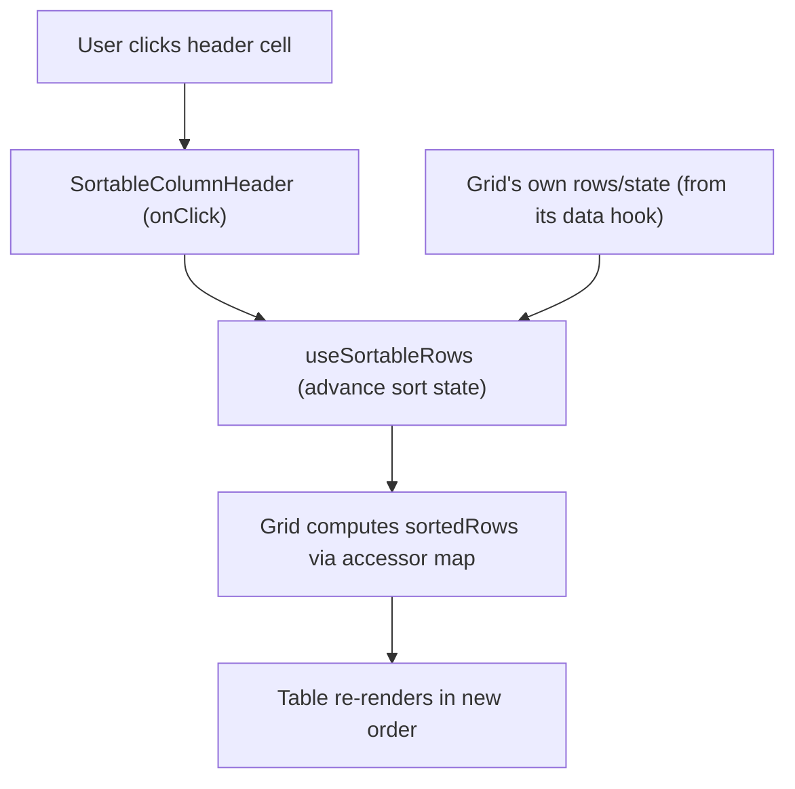

## 1. Technical Overview

**What:** Add click-to-sort behavior to every column of every in-scope data grid in `Financial.Web`, backed by one shared hook (`useSortableRows`) and one shared presentational header cell component (`SortableColumnHeader`), then wire that pair into all ~19 in-scope grids.

**Why:** `Financial.Web` has zero sorting infrastructure today — every grid is a hand-rolled `<table>` with no hook, comparator, or shared header component (confirmed by a full codebase sweep during PRD authoring). Building the mechanism once and reusing it everywhere avoids 19 divergent, inconsistent implementations, and gives F03 (CashFlow column filtering) a single header cell to extend with a filter icon rather than 19 separate integration points.

**Scope:**
- **Included:** a generic, type-aware sort hook and header cell component; wiring into every grid listed in PRD Section 6 under F01 (all Web grids except `ReservaPage`'s Movements grid, per PRD Section 7); single-column 3-state click cycle (unsorted → ascending → descending → unsorted); pinned totals/footer/spacer rows excluded from sorting.
- **Excluded (per PRD Section 7):** multi-column sort, sort-state persistence (`localStorage` or otherwise), server-side sorting, the `ReservaPage` Movements grid.

## 2. Architecture Impact

**Affected components:**

- `src/hooks/useSortableRows.ts` — new generic sort hook
- `src/components/grid/SortableColumnHeader.tsx` — new shared header cell component
- `src/components/grid/SortableColumnHeader.css` — new styles (arrow glyph, hover state)
- `src/components/TotalsGrid.tsx` — modified (shared by `BanksGrid`, `CategoryTotalsGrid`, `IncomingGrid`)
- `src/components/ExpensesSection.tsx`, `IncomeSection.tsx`, `BankOperationsSection.tsx`, `TransactionsTab.tsx`, `PriceHistoryTab.tsx`, `CreditsTab.tsx`, `PortfolioSummaryTab.tsx`, `CardsGrid.tsx` — modified
- `src/pages/CurrentValuesPage.tsx`, `DividendCheckPage.tsx`, `AnnualSummaryPage.tsx`, `InvestmentSnapshotsPage.tsx`, `ControleMaePage.tsx`, `ReservaPage.tsx` (Balances grid only), `MensaisPage.tsx` — modified

## 3. Technical Decisions

| Decision | Chosen Approach | Alternative Considered | Trade-off |
|----------|------------------|-------------------------|-----------|
| Where sort logic lives | One shared generic hook, `useSortableRows<T>(rows, accessors)`, used by every grid | Duplicate `useState` + `.sort()` inline in each of the 19 grids | One hook to maintain and test vs. requiring every grid to call it with an accessor map instead of writing ad-hoc sort code |
| How columns expose a sortable value | Each grid supplies a `Record<columnKey, (row: T) => string \| number \| Date \| null>` accessor map so sorting compares underlying values, not rendered text | Sort by scraping the rendered `<td>` text | Reliable, locale-independent comparison (e.g. currency/date columns) at the cost of one small accessor map per grid |
| Null/undefined value handling | A row whose accessor returns `null`/`undefined` for the active column always sorts to the end, in both ascending and descending order | Treat null as the lowest possible value | Matches the common spreadsheet convention (Excel/Google Sheets) and keeps missing data visually distinct instead of clustering it at the top on ascending sort |
| File location for new shared code | `src/hooks/useSortableRows.ts` + `src/components/grid/SortableColumnHeader.tsx` (new `grid/` subfolder) | Flat `src/components/SortableColumnHeader.tsx` | Anticipates F03 adding a sibling `ColumnFilterMenu.tsx` in the same `grid/` folder, keeping the two header-cell-composing pieces discoverable together |
| Sort direction cycle | Single column, 3-state: unsorted → ascending → descending → unsorted; selecting a different column resets the previous one | Multi-column (shift-click) sort | Matches PRD F01 Capabilities exactly; multi-column sort is explicitly out of scope (PRD Section 7) |

## 4. Component Overview

**Frontend:**

| File Path | New/Modified | Purpose | Key Responsibilities |
|-----------|--------------|---------|------------------------|
| `src/hooks/useSortableRows.ts` | New | Generic, reusable sort state + comparison logic | Track `{ columnKey, direction } \| null`; advance the 3-state cycle on `requestSort(columnKey)`; return `sortedRows` computed via the caller's accessor map; type-aware comparison (string/number/Date); null-last ordering |
| `src/components/grid/SortableColumnHeader.tsx` | New | Presentational `<th>` wrapper | Render header label + click target spanning the full cell; render the ascending/descending arrow glyph when this column is the active sort column; call `onSort` on click; expose an optional `children` slot so F03 can later render a filter icon in the same cell |
| `src/components/grid/SortableColumnHeader.css` | New | Header cell styling | Pointer cursor, hover affordance, arrow glyph layout |
| `src/components/TotalsGrid.tsx` | Modified | Shared table renderer for Banks/CategoryTotals/Incoming grids | Wire `useSortableRows` + `SortableColumnHeader` once at the shared-component level using the existing `columns` config's `key` |
| `src/components/ExpensesSection.tsx` | Modified | Expenses grid | Accessor map for Date/Description/Category/Value/Payment Source/Card |
| `src/components/IncomeSection.tsx` | Modified | Income grid | Accessor map for Date/Source/Gross/Net/Bank/Description |
| `src/components/BankOperationsSection.tsx` | Modified | Bank operations grid | Accessor map for Date/Type/Bank(s)/Amount-Delta/Note |
| `src/components/TransactionsTab.tsx` | Modified | Investment transactions grid | Accessor map for Date/Type/Quantity/Unit Price/Fees/Total |
| `src/components/PriceHistoryTab.tsx` | Modified | Price history grid | Accessor map for Date/Price/Source |
| `src/components/CreditsTab.tsx` | Modified | Investment credits grid | Accessor map for Date/Type/Value |
| `src/components/PortfolioSummaryTab.tsx` | Modified | Portfolio summary grid (largest, all-computed-column grid) | Accessor map covering every column, including derived ones (Current Value, Profit %, XIRR, etc.) |
| `src/components/CardsGrid.tsx` | Modified | Cards grid | Accessor map for Card/Outstanding/Status/Next Invoice Due Date/Active |
| `src/pages/CurrentValuesPage.tsx` | Modified | Current asset prices grid | Accessor map for Ticker/Name/Price |
| `src/pages/DividendCheckPage.tsx` | Modified | Two grids: Dividend History, By Year | Accessor maps for both; replaces each grid's current hardcoded `useMemo` sort with the interactive hook, using the existing hardcoded order as the initial sort state |
| `src/pages/AnnualSummaryPage.tsx` | Modified | Three tabs: Category Totals, Investments, Historic Summary Average | Accessor maps for each tab's data rows; spacer/total rows (rendered outside the sortable row array) stay pinned |
| `src/pages/InvestmentSnapshotsPage.tsx` | Modified | Investment snapshots grid | Accessor map for Account/Value; footer total row stays pinned |
| `src/pages/ControleMaePage.tsx` | Modified | Controle Mãe grid | Accessor map for Date/Description/Note/BRL/GBP; footer total row stays pinned |
| `src/pages/ReservaPage.tsx` | Modified | Balances grid only (Movements grid excluded per PRD Section 7) | Accessor map for Bucket/Balance; footer total row stays pinned |
| `src/pages/MensaisPage.tsx` | Modified | Brasil and UK bill tables (shared `BillTable` render logic within the page) | Accessor map for Due Day/Description/Note/NIT/Min. Wage/Value/Status |

**Backend:** None — this feature is purely client-side; no API, DTO, or OpenAPI changes.

**Database:** None.

## 5. API Contracts

Not applicable — this feature operates entirely on data already loaded into each grid via its existing data hook. No new endpoints, request/response shapes, or changes to existing ones.

## 6. Data Model

Not applicable — no persistence layer changes. Sort state lives in React component/hook memory only and is discarded on unmount/reload, per PRD Section 6 Capabilities ("session-only").

## 7. Testing Strategy

**Test File Structure:**

| Test File | Test Type | Target | Coverage Goal |
|-----------|-----------|--------|------------------|
| `src/hooks/__tests__/useSortableRows.test.ts` | Unit | `useSortableRows` | All cycle states, type-aware comparison, null-last ordering |
| `src/components/grid/__tests__/SortableColumnHeader.test.tsx` | Unit | `SortableColumnHeader` | Click handling, arrow glyph rendering per state, children slot rendering |
| `src/components/__tests__/TotalsGrid.test.tsx` | Unit | `TotalsGrid` sorting integration | New file — TotalsGrid currently has no dedicated test; add one covering sort wiring since it's shared by 3 grids |
| `src/components/__tests__/ExpensesSection.test.tsx` | Unit | Sorting integration | Extend existing file |
| `src/components/__tests__/IncomeSection.test.tsx` | Unit | Sorting integration | Extend existing file |
| `src/components/__tests__/BankOperationsSection.test.tsx` | Unit | Sorting integration | Extend existing file |
| `src/components/__tests__/TransactionsTab.test.tsx` | Unit | Sorting integration | Extend existing file |
| `src/components/__tests__/PriceHistoryTab.test.tsx` | Unit | Sorting integration | Extend existing file |
| `src/components/__tests__/CreditsTab.test.tsx` | Unit | Sorting integration | Extend existing file |
| `src/components/__tests__/PortfolioSummaryTab.test.tsx` | Unit | Sorting integration, including computed columns | Extend existing file |
| `src/components/__tests__/CardsGrid.test.tsx` | Unit | Sorting integration | Extend existing file |
| `src/components/__tests__/BanksGrid.test.tsx`, `CategoryTotalsGrid.test.tsx`, `IncomingGrid.test.tsx` | Unit | Sorting via `TotalsGrid` | Extend existing files with one representative sort assertion each |
| `src/pages/__tests__/CurrentValuesPage.test.tsx` | Unit | Sorting integration | Extend existing file |
| `src/pages/__tests__/DividendCheckPage.test.tsx` | Unit | Sorting integration, both grids | Extend existing file |
| `src/pages/__tests__/AnnualSummaryPage.test.tsx` | Unit | Sorting integration, all 3 tabs, pinned rows stay pinned | Extend existing file |
| `src/pages/__tests__/InvestmentSnapshotsPage.test.tsx` | Unit | Sorting integration, footer pinned | Extend existing file |
| `src/pages/__tests__/ControleMaePage.test.tsx` | Unit | Sorting integration, footer pinned | Extend existing file |
| `src/pages/__tests__/ReservaPage.test.tsx` | Unit | Balances grid sorting integration; Movements grid asserted to remain unsortable | Extend existing file |
| `src/pages/__tests__/MensaisPage.test.tsx` | Unit | Sorting integration, both bill tables | Extend existing file |

**Representative test functions:**

| Test Function | Description | Assertions |
|----------------|--------------|-------------|
| `advances unsorted -> ascending -> descending -> unsorted on repeated calls` | `useSortableRows` cycle | Sort state and `sortedRows` order after each `requestSort` call |
| `resets the previous column when a different column is requested` | `useSortableRows` | Previously active column's state clears; new column starts at ascending |
| `sorts numeric/currency accessor values numerically, not as strings` | `useSortableRows` | e.g. `9.99` sorts before `42.5` |
| `sorts date accessor values chronologically` | `useSortableRows` | ISO date strings/`Date` values sort by calendar order, not string order |
| `places rows with a null accessor value last regardless of direction` | `useSortableRows` | Null rows stay last in both ascending and descending sorts |
| `renders an ascending arrow only on the active ascending column` | `SortableColumnHeader` | Glyph presence/absence per `sortDirection` prop |
| `calls onSort when the header cell is clicked anywhere` | `SortableColumnHeader` | Click on label text and on cell padding both trigger `onSort` |
| `clicking the Value header sorts Expenses rows by numeric value` | `ExpensesSection` integration | Row order after click matches expected numeric order |
| `Reserva Movements grid has no sortable headers` | `ReservaPage` | Movements grid header cells are plain `<th>`, not `SortableColumnHeader` |
| `footer total row stays last after sorting` | `ControleMaePage` / `InvestmentSnapshotsPage` / `ReservaPage` Balances / `MensaisPage` | Footer row position unchanged pre/post sort |
