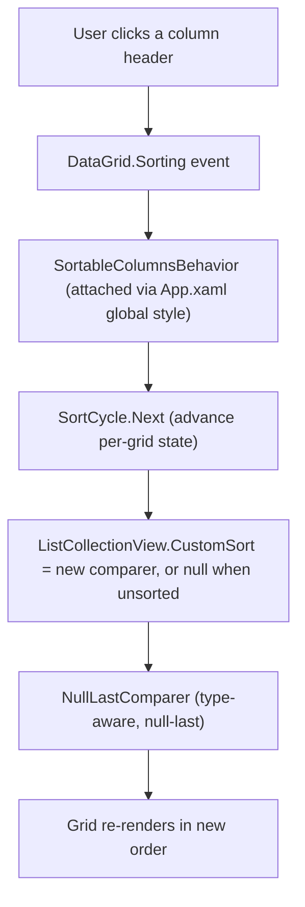

## 1. Technical Overview

**What:** Add a 3-state (unsorted → ascending → descending → unsorted), null-last, type-aware column sort to every `DataGrid` in `Financial.App`, matching F01's Web behavior exactly, via one shared attached behavior applied globally through the existing `App.xaml` implicit `DataGrid` style, plus per-view `SortMemberPath` fixes on the handful of computed/template columns that don't already expose one.

**Why:** WPF's `CanUserSortColumns="True"` (already global, in `App.xaml`) gives every plain `DataGridTextColumn` free ascending/descending sorting today, because `SortMemberPath` defaults to the column's own `Binding.Path`. That native behavior is 2-state only (no "return to unsorted"), sorts nulls first (not last), and silently does nothing on any `DataGridTemplateColumn` that never got an explicit `SortMemberPath` — roughly half of `PortfolioSummaryView`'s columns and a handful of others across the app, confirmed during PRD research. A shared attached behavior fixes the cycle and null ordering everywhere at once via one `App.xaml` edit, instead of requiring bespoke code in each of ~19 views the way F01 needed on Web (which has no equivalent global style mechanism).

**Scope:**
- **Included:** the shared behavior + comparer; `SortMemberPath` added to every `DataGridTemplateColumn` currently missing one; the 3-state cycle and null-last ordering applied identically to every in-scope grid.
- **Excluded (per PRD Section 7):** `ReservaView`'s Movements grid (same exclusion as Web — split-group rows are conceptually linked via `RowDetailsTemplate`/`HasGroupTotal`, and reordering would separate a split's members from their total). Multi-column sort, persistence, and any backend change (per PRD Section 7, shared with F01).
- **Platform-specific exclusion (new, WPF-only — see Decisions):** `AnnualSummaryView`'s three tabs (Category Totals, Investments, Historic Summary Average) are also excluded from sorting in WPF, unlike their Web counterparts.

## 2. Architecture Impact

**Affected files:**

- `Financial.App/Behaviors/SortCycle.cs` — new, pure state-transition logic
- `Financial.App/Behaviors/NullLastComparer.cs` — new, pure value comparison
- `Financial.App/Behaviors/SortableColumnsBehavior.cs` — new, attached property + `DataGrid.Sorting` event wiring
- `Financial.App/App.xaml` — modified (global style Setter + opt-out xmlns)
- `Financial.App/Views/Investment/PortfolioSummaryView.xaml` — modified (9 `SortMemberPath` additions across the Active and Historic templates)
- `Financial.App/Views/CashFlow/CardsGridView.xaml` — modified (3 `SortMemberPath` additions: Outstanding, Status, Next Invoice Due Date, Active)
- `Financial.App/Views/Investment/PriceHistoryView.xaml` — modified (1 `SortMemberPath` addition: Source)
- `Financial.App/Views/CashFlow/ReservaView.xaml` — modified (explicit opt-out on the Movements `DataGrid`)
- `Financial.App/Views/CashFlow/AnnualSummaryView.xaml` — modified (explicit opt-out on all 3 tab `DataGrid`s)

Every other `DataGrid` in the app (Banks, Category Totals, Income Totals, Bank Section, Expense Section, Credit Card Expenses, Controle Mae, Investment Snapshots, Bill Table, Reserva Balances, Asset Price, Transactions, Credits, Dividend Check's two auto-generated grids) needs **no XAML change** — their columns are already plain bound `DataGridTextColumn`s (or, for Dividend Check, auto-generated bound columns), which already carry a correct `SortMemberPath` inferred from their binding path; they pick up the 3-state/null-last behavior automatically once the global style change lands.

## 3. Technical Decisions

| Decision | Chosen Approach | Alternative Considered | Trade-off |
|----------|------------------|-------------------------|-----------|
| Where the sort mechanism lives | One attached behavior (`SortableColumnsBehavior`) applied once via the existing global `App.xaml` `Style TargetType="DataGrid"` Setter, so every grid opts in by default | Wiring a `Sorting` handler into each of ~19 views individually, mirroring F01's Web approach | WPF's implicit style mechanism has no Web equivalent — reusing it here means one file change instead of per-view wiring; matches this project's existing pattern of centralizing `DataGrid` behavior in `App.xaml` (`CanUserSortColumns`, row/cell styling) |
| Pure logic vs. thin glue split | `SortCycle` (state transition) and `NullLastComparer` (value comparison) are plain, WPF-free classes, fully unit-tested; `SortableColumnsBehavior` itself (the `DependencyProperty` + event subscription) is thin glue, not unit-tested | Test the behavior end-to-end against a live `DataGrid` | Matches this project's existing `DecimalInputBehavior`/`DecimalInputHelper` split (`artifacts/wpf-presentation.md`): the untestable event-wiring shell stays thin, the actual logic is pure and covered |
| Extracting a column's sort value | The attached behavior reads `DataGridColumn.SortMemberPath` (already required so the behavior knows what to sort by) and resolves it via reflection against the row object, supporting dotted paths (e.g. `CreditCard.NextInvoiceDueDate`) | A per-column accessor delegate configured in XAML, mirroring Web's accessor-map | `SortMemberPath` is already the idiomatic WPF mechanism for "which property does this column sort by" — reusing it (rather than inventing a parallel mechanism) means most grids need zero XAML change, since `DataGridTextColumn` already sets it implicitly from its `Binding.Path` |
| Null/undefined value handling | `NullLastComparer` places a row whose resolved value is `null` last, in both ascending and descending order | Let WPF's default `IComparable`-based ordering apply (nulls sort first for nullable value types) | Matches F01's Web requirement exactly (PRD Capabilities: "Null/undefined values always sort last in both directions") — WPF's own default is the opposite, so this must be explicit |
| Annual Summary's 3 tabs (WPF-only exclusion) | Excluded from sorting entirely, via the same explicit opt-out used for Reserva Movements | Sort the full `ItemsSource` collection, same simplification already applied to Web's Historic Summary Average tab | On Web, each Annual Summary tab's fixed rows (Salary, Dividendo/Juros, Resultado, Total despesas) and spacer rows are separate JSX elements outside the sortable array — cheap to keep pinned. On WPF, `CategoryTotalRows`/`HistoricSummaryRows` are single flat collections where every row (data, spacer, emphasized total) is the same object type, discriminated only by an `IsSpacer`/`IsEmphasized` flag consumed by `DataGridRowStyle` triggers. Sorting the whole collection would scatter blank spacer rows and bold total rows throughout the sorted output — a worse outcome than not sorting at all. Excluding these grids is the platform-native adaptation CLAUDE.md's UI invariant #1 explicitly allows when a Web mechanic doesn't map cleanly; flagged to the user as a deliberate, documented parity gap rather than a silent omission. |
| Sort direction glyph | The behavior sets `DataGridColumn.SortDirection` directly (WPF's built-in header arrow renders off this property regardless of who sets it) and clears every other column's `SortDirection` on each change | A custom header template with a manually drawn glyph | Reuses WPF's existing header arrow rendering — zero visual/XAML work, and it already matches the project's current (accidental) sort glyph appearance |

## 4. Component Overview

**Frontend (WPF):**

| File Path | New/Modified | Purpose | Key Responsibilities |
|-----------|--------------|---------|------------------------|
| `Financial.App/Behaviors/SortCycle.cs` | New | Pure 3-state cycle logic | `Next(currentColumnPath, currentDirection, requestedColumnPath)` → next `ListSortDirection?`; returns `Ascending` when a different column is requested; cycles `null → Ascending → Descending → null` on repeated requests for the same column |
| `Financial.App/Behaviors/NullLastComparer.cs` | New | Pure value comparison | `Compare(x, y, direction)` → `int`; null always sorts last regardless of direction; delegates to `IComparable` for same-typed non-null values (numeric, `DateTime`, `string`) |
| `Financial.App/Behaviors/SortableColumnsBehavior.cs` | New | Attached behavior wiring | `IsEnabled` attached `DependencyProperty` (default `true` via the global style); subscribes/unsubscribes `DataGrid.Sorting`; on each sort request, resolves the clicked column's `SortMemberPath` via reflection (dotted-path aware), calls `SortCycle.Next`, applies a `ListCollectionView.CustomSort` comparer built on `NullLastComparer` (or clears it when the state returns to unsorted), and updates `DataGridColumn.SortDirection` on all columns to keep the header glyph correct; sets `e.Handled = true` to suppress WPF's native 2-state sort |
| `Financial.App/App.xaml` | Modified | Global opt-in | Adds `<Setter Property="local:SortableColumnsBehavior.IsEnabled" Value="True"/>` to the existing `Style TargetType="DataGrid"`, plus the `xmlns` for the `Behaviors` namespace |
| `Financial.App/Views/Investment/PortfolioSummaryView.xaml` | Modified | Fix missing `SortMemberPath` | Active template: `Current Value` → `CurrentValue`, `Current Price` → `CurrentPrice`, `%` → `ProfitPercent`, `w/ Credits` → `ProfitWithCreditsPercent`, `XIRR` → `Xirr`. Historic template: `Realized Gain/Loss` → `RealizedGainLoss`, `%` → `HistoricProfitPercent`, `w/ Credits` → `HistoricProfitWithCreditsPercent`, `XIRR` → `HistoricXirr` — all pre-existing raw `decimal`/`decimal?` properties on `PortfolioAssetSummaryRowViewModel`, already computed alongside each column's `Display*` string |
| `Financial.App/Views/CashFlow/CardsGridView.xaml` | Modified | Fix missing `SortMemberPath` | `Outstanding` → `OutstandingTotal`, `Status` → `IsPaid`, `Next Invoice Due Date` → `CreditCard.NextInvoiceDueDate`, `Active` → `CreditCard.IsActive` (all pre-existing on `CreditCardManagementRow`) |
| `Financial.App/Views/Investment/PriceHistoryView.xaml` | Modified | Fix missing `SortMemberPath` | `Source` → `IsManual` |
| `Financial.App/Views/CashFlow/ReservaView.xaml` | Modified | Exclude Movements grid | `local:SortableColumnsBehavior.IsEnabled="False"` on the Movements `DataGrid` (Balances grid is unaffected and keeps the global default) |
| `Financial.App/Views/CashFlow/AnnualSummaryView.xaml` | Modified | Exclude all 3 tabs | `local:SortableColumnsBehavior.IsEnabled="False"` on each of the 3 tab `DataGrid`s |

**Backend:** None — presentation-only change, no Application/Domain/Infrastructure/API involvement.

**Database:** None.

## 5. API Contracts

Not applicable — no API changes.

## 6. Data Model

Not applicable — no persistence changes. Sort state is held per-`DataGrid` in memory (via a private attached `DependencyProperty` on `SortableColumnsBehavior`) and is discarded when the view unloads or the app restarts, per PRD Section 6 Capabilities ("session-only").

## 7. Testing Strategy

**Test File Structure:**

| Test File | Test Type | Target | Coverage Goal |
|-----------|-----------|--------|------------------|
| `Tests/Financial.Presentation.Tests/Behaviors/SortCycleTests.cs` | Unit | `SortCycle.Next` | Every cycle transition (unsorted→asc, asc→desc, desc→unsorted, different-column reset) |
| `Tests/Financial.Presentation.Tests/Behaviors/NullLastComparerTests.cs` | Unit | `NullLastComparer.Compare` | Numeric, `DateTime`, and `string` comparison in both directions; null-vs-null, null-vs-value, value-vs-null in both directions |

**No behavior-level (`SortableColumnsBehavior`) test** — matches this project's existing precedent for thin event-wiring shells (`DecimalInputBehavior` has none; only its extracted pure helper, `DecimalInputHelper`, is tested). The behavior's correctness is exercised indirectly by the app actually running (manual verification during implementation) plus the two pure-logic test files above covering everything it delegates to.

**Representative test functions:**

| Test Function | Description | Assertions |
|----------------|--------------|-------------|
| `Next_DifferentColumn_ReturnsAscending` | Requesting a column that isn't the current one | Result is `Ascending` regardless of the previous column's direction |
| `Next_SameColumnAscending_ReturnsDescending` | Second click on the same column | `Ascending` → `Descending` |
| `Next_SameColumnDescending_ReturnsNull` | Third click on the same column | `Descending` → `null` (unsorted) |
| `Compare_NullVsNull_ReturnsZero` | Both values null | `0` |
| `Compare_NullVsValue_Ascending_NullSortsLast` | One null, ascending | Null-side comparand is `> 0` regardless of value magnitude |
| `Compare_NullVsValue_Descending_NullStillSortsLast` | One null, descending | Null-side comparand is still `> 0` (not flipped by direction) |
| `Compare_Decimals_Ascending_OrdersNumerically` | Two decimals | Smaller value compares less than larger |
| `Compare_DateTimes_Descending_OrdersChronologicallyReversed` | Two dates, descending | Later date compares less than earlier date |

**PRD acceptance-criteria traceability:** F02's Section 9 criteria (3-state cycle, arrow indicator, `DataGridTemplateColumn` sortability, pinned totals/spacer rows) are verified through a combination of the unit tests above (cycle/comparison correctness) and a manual pass through the running app during implementation (per this project's WPF UI verification convention — no WPF UI automation test harness exists in this codebase).

**Cross-Feature Integration (PRD Section 9):** none reference F02 directly yet — F04 (CashFlow Column Filtering — WPF) will consume `SortableColumnsBehavior`'s header-cell composition point once it's implemented; no test exists for that until F04 lands.
