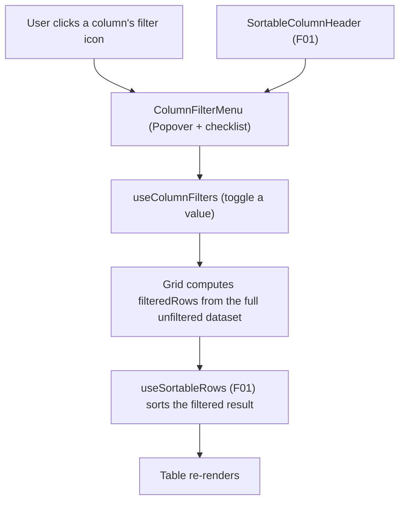

## 1. Technical Overview

**What:** Add a per-column checklist filter (Excel-style: click a filter icon in the header, check/uncheck distinct values) to the Bank, Credit Card, and Category columns of every CashFlow grid that has them, sharing the same header cell F01's `SortableColumnHeader` already renders the sort control in.

**Why:** F01 built `SortableColumnHeader` with a `children` slot specifically so a filter control could compose into the same header cell later (`docs/prd/.../features/P37-F01-sortable-columns-web/spec.md` §4). F03 is that consumer: a generic `useColumnFilters` hook (mirroring `useSortableRows`'s shape) plus a `ColumnFilterMenu` component (a Fluent `Popover` + checklist) get wired into the same 7 grids/tabs the PRD identifies, and `BankOperationsSection`'s existing single-select `<select>` Bank filter is retired in favor of the new multi-select header menu.

**Scope:**
- **Included:** `useColumnFilters` + `ColumnFilterMenu`; wiring into `BanksGrid` (Bank), `IncomeSection` (Bank), `BankOperationsSection` (Bank(s) — replaces its `<select>`), `ExpensesSection` (Category, Card), `CardsGrid` (Card), `CategoryTotalsGrid` (Category), and `AnnualSummaryPage`'s Category Totals and Historic Summary Average tabs (Category) — its Investments tab has no Bank/Card/Category column and is out of scope.
- **Excluded (per PRD Section 7):** filtering on any column other than Bank/Card/Category; filtering outside the CashFlow domain; range filters; filter-state persistence; server-side filtering.

## 2. Architecture Impact

**Affected components:**

- `Financial.Web/src/hooks/useColumnFilters.ts` — new generic filter-state hook
- `Financial.Web/src/components/grid/ColumnFilterMenu.tsx` — new filter-icon + checklist popover, rendered inside `SortableColumnHeader`'s `children` slot
- `Financial.Web/src/components/grid/ColumnFilterMenu.css` — new styles
- `Financial.Web/src/components/TotalsGrid.tsx` — modified (adds an optional per-column `filterSlot` render slot, so `BanksGrid`/`CategoryTotalsGrid` can inject a `ColumnFilterMenu` without `TotalsGrid` knowing about filtering itself)
- `Financial.Web/src/components/BanksGrid.tsx`, `CategoryTotalsGrid.tsx`, `IncomeSection.tsx`, `ExpensesSection.tsx`, `CardsGrid.tsx` — modified (wire `useColumnFilters` + `ColumnFilterMenu` for their in-scope columns)
- `Financial.Web/src/components/BankOperationsSection.tsx` — modified (replace the `<select>` filter with `ColumnFilterMenu` on the Bank(s) column; drop `bankFilter`/`onBankFilterChange` props)
- `Financial.Web/src/hooks/useBankOperations.ts` — modified (stop filtering internally — return every fetched operation; drop `bankFilter`/`setBankFilter`/`ALL_BANKS_FILTER`/`matchesBankFilter`, all now dead code once the component owns filtering itself)
- `Financial.Web/src/pages/MonthlyPage.tsx` — modified (drop the two now-nonexistent props at its `<BankOperationsSection>` call site)
- `Financial.Web/src/pages/AnnualSummaryPage.tsx` — modified (Category filter on the Category Totals and Historic Summary Average tabs' `SortableColumnHeader`)

## 3. Technical Decisions

| Decision | Chosen Approach | Alternative Considered | Trade-off |
|----------|------------------|-------------------------|-----------|
| Filter component library | Fluent UI `Popover` (trigger = filter icon `Button`) with a `SearchBox` + `Checkbox` list inside, all from the already-adopted `@fluentui/react-components` (ADR-004) | A custom dropdown | No existing Menu/Popover pattern exists yet in this codebase (confirmed by search) — `Popover` is the first use, but it's the ADR-approved library and avoids hand-rolling focus-trap/dismiss/keyboard behavior a filter menu needs anyway |
| Filter value representation | Each filterable column's accessor returns `string \| string[] \| null` (an array for a row that logically has more than one value for that column, e.g. Bank Operations' transfer rows which touch a source AND destination bank) | Always a single string, forcing Bank Operations to keep a bespoke filter | One hook covers every grid, including the one row shape (transfers) that genuinely has two bank values; a row is visible if ANY of its values is checked |
| Where filter state lives per grid | `useColumnFilters(rows, accessors)` returns `filteredRows`, mirroring `useSortableRows`'s shape; the caller feeds `filteredRows` into `useSortableRows` next (filter then sort) | Combine filtering and sorting into one hook | Keeps F01's hook untouched and composable — every grid already calls `useSortableRows`; adding a second, independently-testable hook in front of it is a smaller diff than merging their state machines |
| Available-values source | Always computed from the full, currently-unfiltered `rows` array passed into the hook (not from `filteredRows`) | Recompute per-column options from whatever the OTHER active filters currently allow (mutual narrowing) | Matches PRD Capabilities exactly ("a value doesn't disappear from the menu just because another filter currently hides its rows") and is simpler — no cross-column dependency to track |
| `BankOperationsSection`'s Bank(s) filter values | Distinct bank names found in the unfiltered `operations` data itself (via the new array-accessor), not the separate `banks: BankDto[]` prop it used for its old dropdown | Keep using the `banks` prop (every bank in the system, including ones with zero operations this month) | Consistent with every other grid's "distinct values present in the data" rule; a bank with no operations this month simply won't appear as a filterable option, which is more useful than an always-empty checkbox |
| Instant vs. explicit-apply filtering | Each checkbox toggle re-filters immediately (no separate "Apply" button) | A confirm/apply step before filtering takes effect | Matches F01's sort interaction (immediate, no confirmation step) and PRD Experience's "Clicking the filter icon opens a checklist... " framing, which describes toggling as the action itself |
| Empty-filtered-result display | Each grid renders one inline message row (`colSpan` = its own column count) reading "No rows match the current filters" when `filteredRows.length === 0`, replacing its normal `<tbody>` rows | A page-level banner | Per-grid keeps the message scoped to the table that's actually empty, consistent with how `data-table` styling already scopes everything else per grid |

## 4. Component Overview

**Frontend:**

| File Path | New/Modified | Purpose | Key Responsibilities |
|-----------|--------------|---------|------------------------|
| `src/hooks/useColumnFilters.ts` | New | Generic filter state | `filteredRows`; `availableValues: Record<columnKey, string[]>` (sorted, deduped, from the full dataset); `selectedValues: Record<columnKey, Set<string> \| undefined>` (`undefined` = unfiltered/all-checked); `toggleValue(columnKey, value)`; `toggleAll(columnKey)`; `isColumnFiltered(columnKey)` |
| `src/components/grid/ColumnFilterMenu.tsx` | New | Filter icon + checklist popover | Filter icon button (visually indicates active state); `Popover` content: a `SearchBox` shown only when `availableValues.length > 10`, an "(All)" checkbox, one checkbox per (search-narrowed) available value; calls back into `onToggleValue`/`onToggleAll` |
| `src/components/grid/ColumnFilterMenu.css` | New | Popover/checklist styling | Scroll region for long lists, active-icon state, spacing |
| `src/components/TotalsGrid.tsx` | Modified | Shared table renderer | `TotalsGridColumn<T>` gains an optional `filterSlot?: ReactNode`, passed straight through as `SortableColumnHeader`'s `children` |
| `src/components/BanksGrid.tsx` | Modified | Banks grid | `useColumnFilters` for Bank; `ColumnFilterMenu` passed as `filterSlot` on the Bank column |
| `src/components/CategoryTotalsGrid.tsx` | Modified | Category totals grid | Same pattern, Category column |
| `src/components/IncomeSection.tsx` | Modified | Income grid | `useColumnFilters` for Bank; `ColumnFilterMenu` inside the Bank `SortableColumnHeader`'s children |
| `src/components/ExpensesSection.tsx` | Modified | Expenses grid | `useColumnFilters` for Category and Card (two independent columns, AND-combined) |
| `src/components/CardsGrid.tsx` | Modified | Cards grid | `useColumnFilters` for Card |
| `src/components/BankOperationsSection.tsx` | Modified | Bank operations grid | Drops `bankFilter`/`onBankFilterChange` props and the `<select>`; adds `useColumnFilters` with an array-accessor for the Bank(s) column (`[sourceBank, destinationBank]` for transfers, `[bank]` for adjustments) |
| `src/hooks/useBankOperations.ts` | Modified | Bank operations data hook | Removes `bankFilter` state, `setBankFilter`, `ALL_BANKS_FILTER`, `matchesBankFilter`; returns every fetched operation unfiltered |
| `src/pages/MonthlyPage.tsx` | Modified | Monthly page | Drops the two removed props at its `<BankOperationsSection>` call site |
| `src/pages/AnnualSummaryPage.tsx` | Modified | Annual summary page | `useColumnFilters` for Category on the Category Totals and Historic Summary Average tabs (their existing F01 sort hooks stay; filtering composes in front of each) |

**Backend:** None — client-side only, no API/DTO changes.

**Database:** None.

## 5. API Contracts

Not applicable — filtering operates entirely on data already loaded via each grid's existing data hook. No new endpoints or request/response shape changes.

## 6. Data Model

Not applicable — no persistence changes. Filter state lives in each grid's component/hook memory only and resets to unfiltered on reload, per PRD Section 6 Capabilities ("session-only").

## 7. Testing Strategy

**Test File Structure:**

| Test File | Test Type | Target | Coverage Goal |
|-----------|-----------|--------|------------------|
| `src/hooks/__tests__/useColumnFilters.test.ts` | Unit | `useColumnFilters` | Toggle single value, toggle "(All)", multi-column AND, array-accessor (multi-value row), available-values computed from unfiltered data, empty-result set |
| `src/components/grid/__tests__/ColumnFilterMenu.test.tsx` | Unit | `ColumnFilterMenu` | Renders one checkbox per available value; search box shown only above the 10-value threshold and narrows the list; active-icon state when filtered |
| `src/components/__tests__/BanksGrid.test.tsx` | Unit | Filter integration | Extend existing file |
| `src/components/__tests__/CategoryTotalsGrid.test.tsx` | Unit | Filter integration | Extend existing file |
| `src/components/__tests__/IncomeSection.test.tsx` | Unit | Filter integration | Extend existing file |
| `src/components/__tests__/ExpensesSection.test.tsx` | Unit | Filter integration, two columns combined | Extend existing file |
| `src/components/__tests__/CardsGrid.test.tsx` | Unit | Filter integration | Extend existing file |
| `src/components/__tests__/BankOperationsSection.test.tsx` | Unit | New filter replaces old `<select>` | Rewrite the filter-specific tests; keep the rest |
| `src/hooks/__tests__/useBankOperations.test.ts` | Unit | Hook no longer filters | Remove the `bankFilter`/`matchesBankFilter`-specific tests; add one proving every fetched operation is now returned regardless of bank |
| `src/pages/__tests__/MonthlyPage.test.tsx` | Unit | No behavior change expected | Confirm existing tests still pass with the two dropped props |
| `src/pages/__tests__/AnnualSummaryPage.test.tsx` | Unit | Filter integration on 2 tabs | Extend existing file |

**Representative test functions:**

| Test Function | Description | Assertions |
|----------------|--------------|-------------|
| `filteredRows_defaultsToAllRows_whenNoColumnIsFiltered` | Baseline | `filteredRows` equals input `rows` |
| `toggleValue_uncheckingOneValue_hidesOnlyMatchingRows` | Single toggle | Rows with that value excluded, others remain |
| `toggleValue_uncheckingEveryValue_resultsInEmptyFilteredRows` | Full uncheck | `filteredRows` is `[]`, no auto-reset |
| `toggleAll_onFilteredColumn_revertsToUnfiltered` | "(All)" toggle | `isColumnFiltered` becomes `false`; all rows return |
| `availableValues_unaffectedByAnotherColumnsActiveFilter` | Cross-column independence | Filtering Category doesn't shrink Card's `availableValues` |
| `twoColumnsFiltered_combinesWithAnd` | Multi-column | Only rows matching both active filters remain |
| `arrayAccessor_transferRow_visibleIfEitherBankChecked` | Bank Operations shape | A transfer row stays visible if source OR destination bank is checked |
| `ColumnFilterMenu_rendersSearchBox_onlyAboveTenValues` | Threshold | No search box at ≤10 values, present at 11+ |
| `ExpensesSection_categoryAndCardFilters_narrowTogether` | Two independent columns | Rows shown match both the checked categories and checked cards |
| `BankOperationsSection_noLongerRendersSelectDropdown` | Old UI removed | `<select>` absent; filter icon present on the Bank(s) header instead |
| `useBankOperations_returnsEveryOperation_regardlessOfBank` | Hook no longer filters | Result includes operations for every bank in the fixture |

**PRD acceptance-criteria traceability:** F03's Section 9 criteria (filter icon only on in-scope columns, checklist default-all-checked, multi-column AND, >10-value search box, empty-result message, one-action clear, reload resets) map to the hook/component tests above plus the per-grid integration tests.

**Cross-Feature Integration (PRD Section 9):** "On a Web grid in scope for both F01 and F03 (e.g. Expenses), the Category/Card filter icon renders inside the same header cell as the sort control from F01, and clicking the sort area still sorts while clicking the filter icon still opens the filter menu, without either interaction interfering with the other" — covered by an `ExpensesSection` (or `BanksGrid`) test that clicks the sort button, then the filter icon in the same header cell, and asserts both actions took effect independently.
