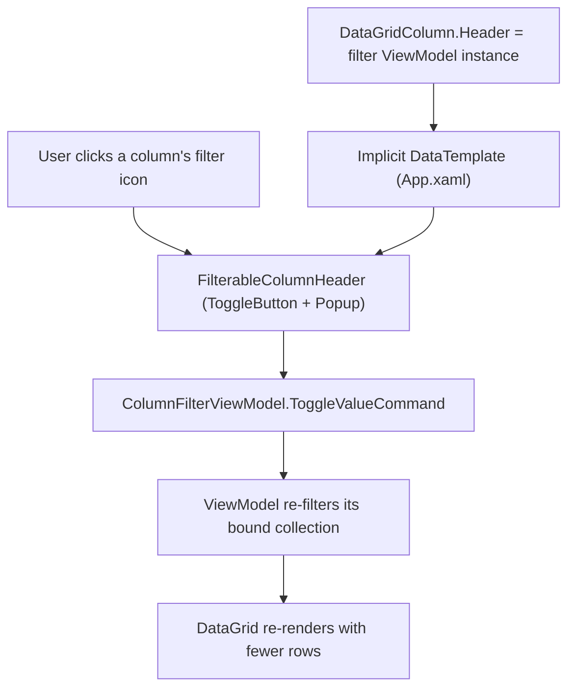

## 1. Technical Overview

**What:** Add a per-column checklist filter (checkbox list, multi-select) to the Bank, Credit Card, and Category columns of every CashFlow `DataGrid` that has them in `Financial.App`, hosted inside the same column header cell F02's sort behavior already occupies — matching F03's Web design and the PRD's explicit Cross-Feature Integration criterion for this pairing.

**Why:** WPF has no built-in per-column filter UI, and `DataGridColumn` is not part of the visual tree (it doesn't inherit `DataContext`), so a column's header can't bind to the page's ViewModel the way an ordinary control can. The design below sidesteps that by assigning each filterable column's `Header` directly to a small filter ViewModel instance (in code-behind, once the page's `DataContext` is available) and rendering it through one shared, implicit `DataTemplate` — the same trick this codebase's `BindingProxy` helper exists to work around for other DataGridColumn binding gaps, applied here without needing the proxy itself since the filter ViewModel *is* the header's content.

**Scope:**
- **Included:** a reusable `ColumnFilterViewModel<T>` (pure, unit-tested filter state — available values, checked set, matches) and a reusable `FilterableColumnHeader` control (label + filter icon + popup checklist, with a search box past 10 values); wiring into `BanksGridView` (Bank), `IncomeSectionView` (Bank), `BankSectionView` (Bank(s) — replaces its `ComboBox`-based single-select filter), `ExpenseSectionView` (Category, Card), `CreditCardExpensesView` (Category, Card), `CardsGridView` (Card), the Category Totals grid embedded in `MonthlySummaryView` (Category), and `AnnualSummaryView`'s Category Totals and Historic Summary Average tabs (Category).
- **Excluded (per PRD Section 7, shared with F03):** filtering on any column other than Bank/Card/Category; filtering outside the CashFlow domain; range filters; filter-state persistence; server-side filtering.

## 2. Architecture Impact

**Affected files:**

- `Financial.App/ViewModels/ColumnFilterViewModel.cs` — new, pure filter state (`FilterValueOption`, `ColumnFilterViewModel<T>`)
- `Financial.App/Controls/FilterableColumnHeader.xaml`/`.xaml.cs` — new, reusable header content control
- `Financial.App/App.xaml` — modified (implicit `DataTemplate` keyed by `ColumnFilterViewModelBase`, so any `DataGridColumn.Header` set to a filter ViewModel renders through `FilterableColumnHeader` automatically)
- `Financial.App/Views/CashFlow/BanksGridView.xaml`/`.xaml.cs`, `CardsGridView.xaml`/`.xaml.cs`, `IncomeSectionView.xaml`/`.xaml.cs`, `ExpenseSectionView.xaml`/`.xaml.cs`, `CreditCardExpensesView.xaml`/`.xaml.cs`, `MonthlySummaryView.xaml`/`.xaml.cs`, `AnnualSummaryView.xaml`/`.xaml.cs` — modified (assign the relevant column's `Header` to its filter ViewModel in code-behind once `DataContext` is available)
- `Financial.App/Views/CashFlow/BankSectionView.xaml` — modified (remove the `ComboBox` filter; assign the Bank(s) column's `Header`)
- `Financial.App/ViewModels/CashFlow/BankOperationsWorkflowViewModel.cs` — modified (drop `SelectedBankFilter`/`BankFilterOptions`/`FilteredBankOperations`/`BuildBankFilterOptions`/`ApplyBankFilter`; expose a `ColumnFilterViewModel<BankOperationRow>` and a filtered view built from it)
- ViewModels backing the other 7 grids — modified minimally: each gains one (or two, for Expense/CreditCardExpenses) `ColumnFilterViewModel<TRow>` instance and re-filters its bound `ObservableCollection<TRow>` (or exposes a `ListCollectionView` with `.Filter` set) when the filter's checked set changes

## 3. Technical Decisions

| Decision | Chosen Approach | Alternative Considered | Trade-off |
|----------|------------------|-------------------------|-----------|
| Hosting the filter control inside the header cell | Assign `DataGridColumn.Header` directly to a `ColumnFilterViewModelBase` instance in the View's code-behind (once `DataContext` resolves), rendered through one implicit `DataTemplate` in `App.xaml` keyed by that base type | The `BindingProxy` pattern already in this codebase (used in `CardsGridView.xaml` for reaching outside a `DataTemplate`'s DataContext) | `Header`'s content itself becomes the DataContext for its template — no ambient binding needed, so `BindingProxy` isn't required for this specific case; setting it in code-behind (not XAML) sidesteps `DataGridColumn` not being a `FrameworkElement` (it can't itself host a `{Binding}` that inherits DataContext) |
| Shared filter state shape | `ColumnFilterViewModel<T>`, a generic pure ViewModel (no `DataGrid`/XAML dependency) exposing `Options: ObservableCollection<FilterValueOption>`, `IsAllChecked`, `IsFiltered`, `ToggleValueCommand`, `ToggleAllCommand`, and `Matches(T row)` | A non-generic filter keyed by `Func<object, string>` | Matches this project's typed-ViewModel convention; `Matches(T row)` lets each hosting ViewModel filter its own strongly-typed collection without casting |
| Applying the filter to a grid's rows | Each hosting ViewModel re-filters its own bound `ObservableCollection<TRow>` (rebuild a `Filtered*` collection, mirroring the existing `FilteredBankOperations` pattern already in `BankOperationsWorkflowViewModel`) whenever the filter's checked set changes, rather than a shared `ListCollectionView.Filter` | `ListCollectionView.Filter` (native WPF collection filtering) | Every grid here already uses either a plain `ObservableCollection` bound directly or (Annual Summary) a flat collection with non-data rows mixed in; a per-VM rebuild composes cleanly with F02's `SortableColumnsBehavior` (which manages its own `ListCollectionView.CustomSort` and would conflict with a second component also mutating `.Filter` on the same view) |
| Annual Summary's Category Totals / Historic Summary Average tabs | Included in scope (matches F03's Web scope) — the filter treats `IsSpacer`/`IsEmphasized` rows as always-visible, filtering only applies to plain category data rows | Excluding these tabs from filtering too, mirroring F02's sorting exclusion | Unlike sorting, filtering never reorders rows — it only hides some, so spacer/emphasized rows can stay in their original relative position without the row-scrambling problem that made F02 exclude these tabs from sorting. Documented explicitly since F02 excluded the same tabs for a different reason and a reader might otherwise assume F04 would too. |
| `BankSectionView`'s existing single-select filter | Retired: `SelectedBankFilter`/`BankFilterOptions`/`ApplyBankFilter`/`BuildBankFilterOptions` removed from `BankOperationsWorkflowViewModel`; replaced by a `ColumnFilterViewModel<BankOperationRow>` with a `[sourceBank, destinationBank]`/`[bank]` multi-value accessor, matching F03's equivalent Web refactor of `useBankOperations` | Keep both filters side by side | The PRD explicitly calls for retiring the old dropdown in favor of the new header-based mechanism (mirrors F03's `BankOperationsSection` change) |
| Search box threshold | Same as F03: a search `TextBox` appears in the popup only when a column has more than 10 distinct values | Always show it | Matches the PRD Capability shared with F03 exactly |

## 4. Component Overview

**Frontend (WPF):**

| File Path | New/Modified | Purpose | Key Responsibilities |
|-----------|--------------|---------|------------------------|
| `Financial.App/ViewModels/ColumnFilterViewModel.cs` | New | Pure filter state | `FilterValueOption` (value + `IsChecked`, raises change notifications the owning VM subscribes to); `ColumnFilterViewModelBase` (non-generic base carrying `Label`, `Options`, `IsAllChecked`, `IsFiltered`, `ToggleValueCommand`, `ToggleAllCommand` — the type the shared header template keys on); `ColumnFilterViewModel<T>` (adds `Refresh(IEnumerable<T> rows, Func<T, IEnumerable<string>> accessor)` to recompute `Options` from the full unfiltered set, preserving existing checked state per value, and `Matches(T row)`) |
| `Financial.App/Controls/FilterableColumnHeader.xaml` + `.xaml.cs` | New | Header cell content | Label text; a filter icon `ToggleButton` (Segoe MDL2 Assets glyph, visually indicates `IsFiltered`); a `Popup` (`IsOpen` bound to the toggle) containing a search `TextBox` (visible only when `Options.Count > 10`, filters the visible list client-side without touching `IsChecked`), an "(All)" `CheckBox` bound to `IsAllChecked`/`ToggleAllCommand`, and an `ItemsControl` of `CheckBox`es bound to `Options` |
| `Financial.App/App.xaml` | Modified | Global template registration | `<DataTemplate DataType="{x:Type vm:ColumnFilterViewModelBase}">` wrapping `FilterableColumnHeader`, so any `DataGridColumn.Header` set to a `ColumnFilterViewModelBase` renders through it automatically — no per-column XAML needed beyond the code-behind assignment |
| `Financial.App/Views/CashFlow/BanksGridView.xaml.cs` | Modified | Wire Bank filter | On `DataContextChanged`/`Loaded`, set the Bank column's `Header` to the ViewModel's `ColumnFilterViewModel<BankTotalRow>` instance |
| `Financial.App/Views/CashFlow/CardsGridView.xaml.cs` | Modified | Wire Card filter | Same pattern for the Card column |
| `Financial.App/Views/CashFlow/IncomeSectionView.xaml.cs` | Modified | Wire Bank filter | Same pattern for the Bank column |
| `Financial.App/Views/CashFlow/ExpenseSectionView.xaml.cs` | Modified | Wire Category + Card filters | Same pattern, two columns |
| `Financial.App/Views/CashFlow/CreditCardExpensesView.xaml.cs` | Modified | Wire Category + Card filters | Same pattern, two columns |
| `Financial.App/Views/CashFlow/BankSectionView.xaml` + `.xaml.cs` | Modified | Replace old filter | Remove the `ComboBox`/`BankFilterOptions` binding; wire the Bank(s) column's `Header` to the new filter ViewModel |
| `Financial.App/Views/CashFlow/MonthlySummaryView.xaml.cs` | Modified | Wire Category filter | Same pattern for the embedded Category Totals grid |
| `Financial.App/Views/CashFlow/AnnualSummaryView.xaml.cs` | Modified | Wire Category filter, 2 tabs | Same pattern for the Category Totals and Historic Summary Average tabs' Category column |
| `Financial.App/ViewModels/CashFlow/BankOperationsWorkflowViewModel.cs` | Modified | Bank(s) filter integration | Owns a `ColumnFilterViewModel<BankOperationRow>`; replaces the removed single-select members |
| ViewModels for `BanksGridView`, `CardsGridView`, `IncomeSectionView`, `ExpenseSectionView`, `CreditCardExpensesView`, `MonthlySummaryView`'s category totals, `AnnualSummaryView`'s two tabs | Modified | Own one filter VM each | Instantiate the relevant `ColumnFilterViewModel<TRow>`, call `Refresh` when source data loads, expose a filtered collection the `DataGrid` binds to |

**Backend:** None — presentation-only change.

**Database:** None.

## 5. API Contracts

Not applicable — no API changes.

## 6. Data Model

Not applicable — no persistence changes. Filter state is held per-view-model in memory and discarded on view reload or app restart, per PRD Section 6 Capabilities ("session-only").

## 7. Testing Strategy

**Test File Structure:**

| Test File | Test Type | Target | Coverage Goal |
|-----------|-----------|--------|------------------|
| `Tests/Financial.Presentation.Tests/ViewModels/ColumnFilterViewModelTests.cs` | Unit | `ColumnFilterViewModel<T>` | `Refresh` computes distinct available values from the full unfiltered set; `ToggleValueCommand`/`ToggleAllCommand` state transitions (mirroring F03's `useColumnFilters` test matrix); `Matches` for single- and multi-value accessors; preserving checked state across a `Refresh` when the same value still exists |
| `Tests/Financial.Presentation.Tests/ViewModels/CashFlow/BankOperationsWorkflowViewModelTests.cs` | Unit | Bank(s) filter integration | Extend existing file: the multi-value accessor matches a transfer by either bank; the old `SelectedBankFilter`-specific tests are removed/rewritten for the new shape |

**Representative test functions:**

| Test Function | Description | Assertions |
|----------------|--------------|-------------|
| `Refresh_ComputesDistinctSortedValues_ExcludingNull` | Baseline | `Options` values sorted, deduped, no null-derived entries |
| `ToggleValueCommand_UncheckingOneValue_ExcludesMatchingRows` | Single toggle | `Matches` returns false only for rows whose value was unchecked |
| `ToggleAllCommand_OnPartiallyChecked_ChecksEverything` | "(All)" from partial | All `Options` become checked; `IsFiltered` becomes false |
| `ToggleAllCommand_OnFullyChecked_UnchecksEverything` | "(All)" from full | All `Options` become unchecked; every row excluded |
| `Matches_MultiValueAccessor_TrueIfAnyCheckedValuePresent` | Bank Operations shape | A transfer row matches if either bank is checked |
| `Refresh_PreservesCheckedState_ForValuesStillPresent` | Data reload | A previously-unchecked value stays unchecked after `Refresh` if it's still in the new data |

**PRD acceptance-criteria traceability:** F04's Section 9 criteria mirror F03's exactly (filter icon only on in-scope columns, checklist default-all-checked, multi-column AND per grid, >10-value search box, empty-result message, one-action clear, restart resets) — verified through the unit tests above plus a manual pass through the running app during implementation (no WPF UI automation harness exists in this codebase, matching F02's precedent).

**Cross-Feature Integration (PRD Section 9):** "On a WPF grid in scope for both F02 and F04 (e.g. Expense Section), the filter menu from F04 is hosted in the sortable header cell provided by F02, and both interactions work independently" — verified by inspecting that the filterable columns' `Header` (rendered via `FilterableColumnHeader`) and their sort behavior (via `SortableColumnsBehavior`, unaffected by the `Header` content change) are wired on the same `DataGridColumn` without one disabling the other.
