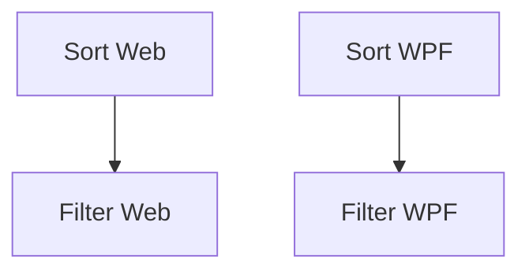

# Data Grid Sorting and CashFlow Column Filtering

## 1. Executive Summary

This feature brings two long-missing table interactions to Financial, the household's self-hosted investment and cash-flow tracker: click-to-sort column headers on every data grid in both front ends, and column-level checklist filtering on the Bank, Credit Card, and Category columns wherever they appear inside the CashFlow domain. Today neither `Financial.Web` (React) nor `Financial.App` (WPF) offers deliberate sorting — WPF has an accidental, inconsistent version that silently fails on computed columns, and Web has none at all — and the only filter in the entire application is a single ad-hoc Bank dropdown on one CashFlow screen.

The feature is for the tool's single user, who works across roughly 19 tabular views per platform spanning both bounded contexts: Investment (transactions, credits, price history, portfolio summary, dividends) and CashFlow (expenses, income, bank operations, cards, category totals, annual/monthly summaries, bills, reserve buckets). At its core, every grid gains a click-to-sort header (ascending → descending → back to original order, one column at a time, with a visible direction indicator), and every CashFlow grid carrying a Bank, Credit Card, or Category column gains a per-column filter menu — a checklist of the distinct values present in that column — living in the same header cell as the sort control. Both capabilities operate entirely on data already loaded into the grid; nothing is persisted, so every grid returns to its natural, unsorted, unfiltered state on the next page load or app restart.

## 2. Problem and Opportunity

**The Problem**

- **No way to reorder data on ~37 grids.** Every list of transactions, prices, credits, or summary rows renders in whatever order the API returns it (typically insertion or date order), with no way to, for example, sort Expenses by Value to find the largest purchase, or sort Portfolio Summary by Profit % to find the best performer.
- **WPF's "sorting" is an accident, not a feature.** The global `App.xaml` `DataGrid` style enables `CanUserSortColumns`, so plain text columns happen to sort — but roughly half the columns in the app's largest grids (Portfolio Summary, Cards, Price History) are `DataGridTemplateColumn`s that silently ignore header clicks because no `SortMemberPath` was ever set. A user clicking "Profit %" today gets no feedback and no result.
- **Web has zero sorting infrastructure.** No hook, no shared header component, no comparator logic exists anywhere in `Financial.Web` — every one of its ~19 grids is a bespoke `<table>`, so today there is genuinely nothing to click.
- **Finding CashFlow entries for one bank, card, or category means manual scanning.** With Bank appearing on Income, Bank Operations, and Banks-totals; Credit Card on Expenses and Card totals; and Category on Expenses, Category Totals, and both Annual Summary tabs, isolating "just my Nubank spending" or "just Groceries this year" currently requires reading every row by eye — the one exception, `BankOperationsSection`'s Bank dropdown, only covers a single screen.
- **Frontend parity gap.** Per the project's UI invariant that Web and WPF must offer equivalent user outcomes, the current state — WPF's partial accidental sort vs. Web's total absence, and one lone filter on one screen — is itself a parity violation that will only widen as more grids are added.

**The Opportunity**

Adding deliberate, type-aware sorting once, consistently, across all grids on each platform turns the accidental WPF behavior into a designed one and gives Web its first sort capability at all — closing the parity gap directly. Layering a shared checklist-filter control for the three CashFlow columns that recur most (Bank, Credit Card, Category) onto that same sortable header gives the user, in one interaction surface, both "put it in the order I want" and "show me only what I care about" — the two most common ways people interrogate a spreadsheet-like view, delivered without introducing pagination, a query language, or any new backend contract.

## 3. Target Audience

### Primary Users

**The Household Financial Administrator**
- The tool's single user, who personally enters and reviews every investment transaction (Brazil + UK brokers) and every household cash-flow entry (income, expenses, bills, bank/card balances, savings reserve).
- Frequently scans large, dense tables — Portfolio Summary, Expenses, Annual Summary — looking for a specific outlier (highest expense, worst-performing asset, most recent bank operation) or a specific subset (one category, one card, one bank) rather than reading top-to-bottom.
- Switches between the Web app and the WPF desktop app depending on context, and expects the same task to work the same way in both — inconsistent behavior between them (or within WPF's own grids) reads as a bug, not a platform quirk.

## 4. Objectives

**Product Objectives**
- **Eliminate manual scanning for ordering.** Every data grid supports click-to-sort on every column, including computed/formatted ones.
- **Close the Web/WPF sorting parity gap.** WPF's accidental, partial sort behavior and Web's total absence of sorting are replaced with one designed, consistent behavior on both platforms.
- **Enable targeted CashFlow review.** A user can isolate rows for one or more banks, credit cards, or categories on every CashFlow grid where that column exists, not just the one screen that supports it today.
- **Keep the change additive and low-risk.** No existing data, DTO, or API contract changes; sorting and filtering operate purely over data already loaded into each grid.

**Success Metrics**
- 100% of the ~19 in-scope grids per platform (37 total, excluding the one grid called out in Section 7) support click-to-sort ascending/descending on every visible column, verified by manual pass over the grid inventory below.
- 0 `DataGridTemplateColumn`s in WPF remain unsortable due to a missing `SortMemberPath` (down from roughly half of the largest grids' columns today).
- Every CashFlow grid identified in Section 6 as carrying a Bank, Credit Card, or Category column exposes a working filter menu for that column — verified against the same grid-by-grid list used for the sorting metric.
- 0 sort/filter state persisted to disk or browser storage after this feature ships — confirmed by inspecting that no new `localStorage` key or WPF settings entry is introduced for this feature.

## 5. User Stories

### F01. Sortable Columns — Web
- As a user, I want to click a column header to sort the grid by that column ascending so that I can quickly find the highest, lowest, first, or last value.
- As a user, I want to click an already-ascending-sorted column header again to reverse it to descending so that I can look from the other end.
- As a user, I want to click a descending-sorted column header a third time to return the grid to its original, unsorted order.
- As a user, I want a visual arrow indicator on the currently sorted column's header so that I always know which column and direction is active.
- As a user, I want numeric, currency, and date columns to sort by their underlying value, not their formatted text, so that "R$ 1,234.56" doesn't sort before "R$ 99.00".
- As a user, I want a grid's totals or footer row to stay pinned at the bottom no matter how the data rows above it are sorted.

### F02. Sortable Columns — WPF
- As a user, I want the same click-to-sort behavior in the desktop app as in the web app, including on columns that don't sort today (Profit %, XIRR, Outstanding, Status, Source, and similar computed columns).
- As a user, I want a visual arrow indicator on the sorted column's header, matching the web app's behavior.
- As a user, I want numeric, currency, and date columns to sort by their underlying value rather than their displayed text.
- As a user, I want a grid's totals or footer row, and Annual Summary's spacer/emphasis rows, to stay pinned in place regardless of how the data rows are sorted.

### F03. CashFlow Column Filtering — Web
- As a user, I want to open a filter menu from the Bank column header and select one or more banks so that I only see rows for those banks.
- As a user, I want to open a filter menu from the Category column header and select one or more categories so that I can focus on specific spending categories.
- As a user, I want to open a filter menu from the Credit Card column header and select one or more cards so that I can review a single card's activity.
- As a user, I want to apply Bank, Card, and Category filters at the same time on a grid that has more than one of these columns so that I can narrow results precisely.
- As a user, I want the header's filter icon to visibly indicate when a filter is active on that column so I don't forget I've filtered the view.
- As a user, I want a one-click way to clear a column's filter and see all rows again.
- As a user, I want a search box inside a filter menu with many distinct values (e.g. Category) so I can find the value I want without scrolling a long checklist.

### F04. CashFlow Column Filtering — WPF
- As a user, I want the same filter-menu behavior in the desktop app's Bank, Category, and Credit Card column headers as in the web app.
- As a user, I want to combine multiple column filters on the same grid, matching the web app's behavior.
- As a user, I want the existing Bank filter dropdown on the Bank Operations screen to be replaced by the new header-based filter menu, so the app has one consistent filtering pattern instead of two.
- As a user, I want a search box inside a filter menu with many distinct values, matching the web app's behavior.

## 6. Functionalities

### F01. Sortable Columns — Web

**Provides:**
- A reusable sortable-column-header interaction (click-to-sort state, ascending/descending indicator, shared header cell) for `Financial.Web` grids (used by F03)

**Capabilities:**
- Applies to every grid/table listed in the Web column of the grid inventory below, except `ReservaPage`'s Movements grid (see Section 7).
- Click cycle per column: unsorted → ascending → descending → unsorted. Clicking a different column's header resets the previously sorted column and starts its own cycle at ascending.
- Only one column sorts at a time (no multi-column/secondary sort).
- Sort comparison is type-aware: numeric and currency columns compare by numeric value; date columns compare chronologically; text columns compare case-insensitively. A column rendered from a formatted string (e.g. "R$ 1.234,56", "12/03/2026") sorts by the underlying value the formatting was derived from, not the rendered string.
- Grids with a totals/footer row (`ControleMaePage`, `InvestmentSnapshotsPage`, `ReservaPage` Balances grid, `MensaisPage` bill tables) keep that row pinned at the bottom; only the data rows above it participate in sorting.
- `AnnualSummaryPage`'s three tabs keep any spacer/total rows pinned in place; category/account data rows above them sort normally.
- Sort state is held in the component's in-memory state only. It resets to the unsorted default whenever the grid's data is reloaded/refetched or the containing page is reloaded — nothing is written to `localStorage`.

**Experience:**
- Every column header becomes clickable, with a pointer cursor and a subtle hover state to signal it's interactive.
- The currently sorted column shows a small arrow glyph (▲ ascending / ▼ descending) directly in its header; unsorted columns show no glyph (or a faint neutral glyph on hover only).
- Clicking anywhere in a header cell (not just the text) triggers the sort — the whole cell is the click target, consistent with Fluent 2 hit-target sizing guidance.
- The action is synchronous and immediate: no loading spinner, since sorting operates on data already in memory.
- `TotalsGrid.tsx` (shared by `BanksGrid`, `CategoryTotalsGrid`, `IncomingGrid`) gains sorting once at the shared-component level; every other grid gets the same header component wired individually since each is a bespoke `<table>`.

### F02. Sortable Columns — WPF

**Provides:**
- A reusable sortable-column-header behavior (click-to-sort state, ascending/descending indicator) for `Financial.App` `DataGrid` views (used by F04)

**Capabilities:**
- Applies to every `DataGrid` listed in the WPF column of the grid inventory below, except `ReservaView`'s Movements grid (see Section 7).
- Same click cycle, single-column-only, and type-aware comparison rules as F01, so WPF and Web behave identically.
- Every `DataGridTemplateColumn` gains an explicit `SortMemberPath` (or an equivalent custom `IComparer`) pointing at its underlying bound value, closing the gap where computed/derived columns (Profit %, XIRR, Current Value, Outstanding, Status, Source) currently ignore header clicks.
- Replaces reliance on WPF's default `ICollectionView` sort-by-property-value behavior with an explicit, consistent sort mechanism (e.g. `SortDescription`s applied through a shared attached behavior on the app's `DataGrid` style) so behavior no longer differs silently between plain-text and template columns.
- Grids with a totals/footer row, and `AnnualSummaryView`'s spacer/emphasis rows (currently implemented via `DataGridRowStyle` triggers), stay pinned; only data rows sort.
- Sort state lives in the view/view-model only and resets to unsorted on view reload or application restart.

**Experience:**
- Matches F01's experience: whole-header-cell click target, ascending/descending arrow glyph in the sorted column's header, immediate synchronous response, no loading indicator.
- Grids that already sort by accident today (plain-text columns under the global `App.xaml` style) keep working, now backed by the same explicit mechanism as every other column instead of the framework default.

### F03. CashFlow Column Filtering — Web

**Consumes:**
- F01: the sortable column header component, to host the filter control inside the same header cell

**Capabilities:**
- Applies to every CashFlow grid where a Bank, Credit Card ("Card"), or Category column is present: `BanksGrid` (Bank), `IncomeSection` (Bank), `BankOperationsSection` (Bank(s) — replaces its existing `<select>`-based filter), `ExpensesSection` (Category, Card), `CardsGrid` (Card), `CategoryTotalsGrid` (Category), `AnnualSummaryPage`'s Category Totals and Historic Summary Average tabs (Category).
- A filter icon appears in the header of each in-scope column only (not on every column — sorting is universal, filtering is column-specific).
- Clicking the filter icon opens a checklist of every distinct, non-null value present in that column's currently loaded dataset, sorted alphabetically, each with a checkbox. An "(All)" checkbox at the top toggles every item at once.
- The checklist is always built from the grid's full unfiltered dataset for that column — a value doesn't disappear from the menu just because another active filter currently hides its rows.
- When a column has more than 10 distinct values, the menu includes a text search box above the checklist that narrows the visible checklist items as the user types (does not affect the applied filter until an item is checked).
- Multiple columns on the same grid (e.g. Category and Card on `ExpensesSection`) can be filtered simultaneously; results are the intersection (AND) of all active column filters.
- Default state: no filter applied (every item checked / all rows visible).
- Filter state is held in the component's in-memory state only and resets to unfiltered on page reload — nothing is written to `localStorage`.

**Experience:**
- The filter icon sits beside the sort arrow in the header cell; it visually changes (e.g. filled/highlighted icon) when that column has an active filter (fewer than all values checked).
- Unchecking all items is prevented from producing a confusing "0 rows, no explanation" state — the grid instead shows an inline empty-state message ("No rows match the current filters") when a combination of filters excludes every row.
- A "Clear filter" action inside the menu (or unchecking "(All)" then re-checking it) resets that column to unfiltered in one action.
- Filtering and sorting compose normally: a filtered result set can still be sorted by any column, and vice versa.

### F04. CashFlow Column Filtering — WPF

**Consumes:**
- F02: the sortable column header behavior, to host the filter control inside the same header cell

**Capabilities:**
- Applies to the WPF equivalents of every grid listed under F03: `BanksGridView` (Bank), `IncomeSectionView` (Bank), `BankSectionView` (Bank(s) — replaces its existing `ComboBox`-based `BankFilterOptions`/`SelectedBankFilter` filter), `ExpenseSectionView` (Category, Card), `CreditCardExpensesView` (Category, Card), `CardsGridView` (Card), the Category Totals grid embedded in `MonthlySummaryView`, and `AnnualSummaryView`'s Category Totals and Historic Summary Average tabs (Category).
- Same checklist-of-distinct-values behavior, "(All)" toggle, >10-item search box, multi-column AND-combination, and unfiltered default as F03.
- Filter state lives in the view-model only and resets to unfiltered on view reload or application restart.

**Experience:**
- Matches F03: filter icon beside the sort glyph in the header, visibly indicates an active filter, empty-state message when a filter combination excludes every row, one-action clear.
- `BankSectionView`'s current `ComboBox` filter and `BankOperationsWorkflowViewModel`'s `FilteredBankOperations`/`BuildBankFilterOptions`/`MatchesBank` logic are retired in favor of the new header-based mechanism, so the desktop app has one filtering pattern instead of two.

## 7. Out of Scope

**Explicitly excluded grids**
- `ReservaPage` / `ReservaView`'s **Movements** grid (both platforms) is excluded from sorting entirely. Its rows are grouped with dependent split-group subtotal rows (Web: inline subtotal rows; WPF: `RowDetailsTemplate`); reordering would separate a transaction from its subtotal and corrupt the view. It has no Bank/Card/Category column, so filtering does not apply to it regardless.

**Explicitly excluded capabilities**
- Multi-column ("secondary") sort — only one column sorts at a time.
- Persisting sort or filter selections to `localStorage`, browser cookies, or a WPF settings file — every grid resets to unsorted/unfiltered on reload/restart.
- Server-side sorting, filtering, or pagination — all sorting and filtering operates on data already loaded into the grid; no new API parameters, query strings, or backend changes.
- Free-text search across a whole grid (as opposed to the per-column filter checklist) — not part of this feature.
- Filtering on any column other than Bank, Credit Card, and Category — no filter is added to Date, Value, Description, or any other column type in this release.
- Column filtering outside the CashFlow domain — Investment-domain grids (Transactions, Credits, Price History, Portfolio Summary, Current Values, Dividends) receive sorting only, no filtering, per the request's explicit CashFlow-only filtering scope.
- Range filters (e.g. "amount between X and Y", "date after X") — the checklist filter only supports discrete value selection.
- Any change to underlying DTOs, API contracts, or the OpenAPI snapshot — this is a purely client-side presentation feature.

## 8. Dependency Graph

| # | Feature | Priority | Dependencies |
|---|---------|----------|--------------|
| F01 | Sortable Columns — Web | 1 | None |
| F02 | Sortable Columns — WPF | 1 | None |
| F03 | CashFlow Column Filtering — Web | 2 | F01 |
| F04 | CashFlow Column Filtering — WPF | 2 | F02 |

### Execution Waves
Features within the same wave can be built in parallel. A wave starts only after every feature in earlier waves is complete.

- **Wave 1**: F01, F02
- **Wave 2**: F03, F04

### Priority levels
- **1** = Essential — product does not work without it
- **2** = Important — significant value addition
- **3** = Desirable — incremental improvement

## 9. Acceptance Criteria

### F01. Sortable Columns — Web
- [ ] Clicking an unsorted column header sorts the grid ascending by that column and shows an ascending arrow indicator
- [ ] Clicking the same header again sorts descending and updates the indicator
- [ ] Clicking the same header a third time returns the grid to its original, unsorted order and removes the indicator
- [ ] Clicking a different column's header resets the previously sorted column and starts a fresh ascending sort on the new column
- [ ] A currency column (e.g. Expenses' Value) sorts by numeric value, not by the formatted string
- [ ] A date column (e.g. Transactions' Date) sorts chronologically, not alphabetically by displayed string
- [ ] Every grid listed in Section 6 under F01, except the excluded Reserva Movements grid, supports this click-to-sort behavior on every visible column
- [ ] A grid with a totals/footer row keeps that row fixed at the bottom regardless of the active sort

### F02. Sortable Columns — WPF
- [ ] Clicking an unsorted column header sorts the grid ascending and shows an ascending arrow indicator, matching Web's behavior
- [ ] A `DataGridTemplateColumn` that did not sort before this feature (e.g. Portfolio Summary's Profit %, Cards' Outstanding/Status) now sorts correctly by its underlying value
- [ ] Every grid listed in Section 6 under F02, except the excluded Reserva Movements grid, supports click-to-sort on every visible column, including previously-unsortable template columns
- [ ] Annual Summary's spacer/emphasis rows and every grid's totals/footer row stay pinned in place regardless of the active sort

### F03. CashFlow Column Filtering — Web
- [ ] A filter icon appears only in the header of Bank, Category, and Card columns on the grids listed in Section 6 under F03
- [ ] Opening the filter menu shows every distinct value present in that column's data, each with a checkbox, all checked by default
- [ ] Unchecking one or more values hides the corresponding rows and visibly marks the column's filter icon as active
- [ ] Applying filters on two different columns of the same grid (e.g. Category and Card on Expenses) shows only rows matching both
- [ ] A filter menu for a column with more than 10 distinct values includes a working search box that narrows the checklist
- [ ] A filter combination that excludes every row shows an inline "no rows match" message instead of a blank grid
- [ ] Clearing a column's filter (via "(All)" or a clear action) restores every row for that column
- [ ] Reloading the page resets every filter to its default (all values checked)

### F04. CashFlow Column Filtering — WPF
- [ ] All F03 acceptance criteria hold true for the WPF equivalents of each grid listed in Section 6 under F04
- [ ] `BankSectionView`'s Bank filter no longer uses the old `ComboBox`-based `SelectedBankFilter` control — the header-based filter menu is the only Bank filter on that screen
- [ ] Restarting the application resets every filter to its default (all values checked)

### Cross-Feature Integration
- [ ] On a Web grid in scope for both F01 and F03 (e.g. Expenses), the Category/Card filter icon renders inside the same header cell as the sort control from F01, and clicking the sort area still sorts while clicking the filter icon still opens the filter menu, without either interaction interfering with the other
- [ ] On a WPF grid in scope for both F02 and F04 (e.g. Expense Section), the same coexistence holds: the filter menu from F04 is hosted in the sortable header cell provided by F02, and both interactions work independently
