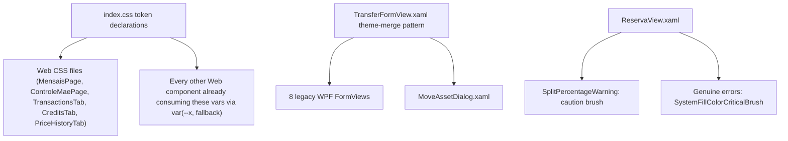

## 1. Technical Overview

**What:** Declares every CSS custom property `Financial.Web` components already reference but
`index.css` never defines, replaces hardcoded hex color literals with those tokens (or the
existing `--accent` brand token) across a fixed list of Web files, and merges the WPF-UI theme
into the 8 legacy WPF forms plus `MoveAssetDialog.xaml` that currently render with none.

**Why:** Every later F02–F09 feature either reuses these tokens directly (F02's primitives, F04's
Expense migration, F08's Tree) or touches a legacy WPF form that must already be themed before its
own fix lands. Fixing tokens once here means no later feature re-audits colors from scratch, and no
component silently falls back to a hardcoded value the moment dark mode is toggled.

**Scope:**
- Included: declaring undeclared CSS custom properties in `index.css` (light + dark values);
  replacing `#007acc`/`#005fa3` with the `--accent` token on the specific Web files/selectors the
  PRD names; replacing 3 untokenized Dividend/Rent/JCP colors in `CreditsTab.css` with named local
  custom properties; giving Reserva's non-blocking split-percentage warning (WPF) a color distinct
  from the blocking-error red; merging the WPF-UI theme into the 8 legacy WPF forms and
  `MoveAssetDialog.xaml`, replacing their hardcoded `#CCCCCC`/`#FAFAFA`/`Foreground="Red"` literals
  with theme brushes.
- Excluded: any layout change (single-column WPF `Grid` → 4-column responsive grid stays for a
  later feature slice, per the audit's own scoping — F01's WPF fix is theme/color only); any
  Web hardcoded-`#007acc` occurrence outside the PRD's named files (e.g. `AnnualSummaryPage.css`,
  `MonthlyPage.css`'s active-tab color, `InvestmentTree.css`, `TickerCombobox.css` — these are
  already tracked as debt to close inside F04/F08/F09's own slices per `ADR-005`'s consequence
  note: "replaced ... as each page is migrated — not by a single global find/replace done outside a
  page's own refactor slice"); any accessibility fix (`AutomationProperties.Name`, focus trap) —
  those are F02/F07's scope, not F01's.

**Complexity:** Simple (no API, no DB, no external integration — a fixed, mechanical set of CSS
token declarations and color-literal replacements across ~20 known Web and WPF files).

## 2. Architecture Impact

Presentation-layer only, both front ends. No Domain/Application/Infrastructure/API changes (per
PRD §7 Out of Scope).

**Affected components:**
- `Financial.Web/src/index.css` — token declarations (light + dark)
- `Financial.Web/src/pages/MensaisPage.css`, `ControleMaePage.css` — hardcoded accent replacement
- `Financial.Web/src/components/TransactionsTab.css`, `CreditsTab.css`, `PriceHistoryTab.css` —
  New/Save button accent replacement; `CreditsTab.css` also gets the 3 named type-color tokens
- `Financial.App/Views/CashFlow/{WithdrawalFormView,IncomeSplitFormView,EditReserveMovementFormView,
  AddBillFormView,EditBillFormView,CreateEntryFormView,EditEntryFormView,EditSnapshotValueFormView}.xaml`
  — WPF-UI theme merge + color-literal replacement
- `Financial.App/Views/Investment/MoveAssetDialog.xaml` — WPF-UI theme merge + color-literal
  replacement
- `Financial.App/Views/CashFlow/ReservaView.xaml` — split-percentage warning gets a distinct color
  from the two genuine-error `TextBlock`s in the same file

## 3. Technical Decisions

| Decision | Chosen Approach | Alternative Considered | Trade-off |
|---|---|---|---|
| Which undeclared CSS custom properties to declare | All 11 found by grepping every `var(--x, fallback)` in `Financial.Web/src` against `index.css`'s declared set — `--bg-subtle`, `--text-muted`, `--danger`, `--error` (named in the PRD) plus `--bg-hover`, `--surface`, `--error-bg`, `--error-border`, `--warning-text`, `--warning-bg`, `--warning-border`, `--drop-target` (found but not individually named) | Declare only the 4 named in the AC bullet | The AC bullet's own second clause — "no component relies on an undeclared custom property's fallback" — is general, and F01's Capabilities text says "no more undeclared custom properties relying only on hardcoded fallbacks." Leaving the other 7 phantom means F02–F09 inherit the exact bug F01 exists to close. |
| Light-mode token values | Reuse each property's current fallback literal unchanged (e.g. `--bg-subtle: #f9f9f9`) | Pick new "more correct" values | F01's own Experience section requires "no end-user-visible flow changes... a like-for-like visual correction" — light mode must render pixel-identical to today. |
| Dark-mode token values | New values chosen to read correctly against the existing dark palette (`--bg: #16171d`, `--text: #9ca3af`, `--border: #2e303a`) — see §4 for the literal table | Reuse light values in dark mode too (no real fix) | This is the actual bug being fixed — a same-value fallback is what silently defeats dark mode today. |
| `--error-border` value conflict (`#f5c2bd` in `MonthlyPage.css` vs `#f5c6cb` in `SyncStatusBanner.css`) | Declare one canonical value, `#f5c2bd` (both are the same red-tint hue within a few units; converging both consumers onto the declared token is the point of F01) | Keep two separate tokens | A single declared `--error-border` is what "no undeclared fallback" means — both call sites already intended the same concept (error container border). |
| Dividend/Rent/JCP colors in `CreditsTab.css` | Declare 3 new custom properties **local to `CreditsTab.css`** (`--credit-type-dividend: #1565c0`, `--credit-type-rent: #0277bd`, `--credit-type-jcp: #00838f`, values unchanged from today) rather than adding them to the global token set | Add them to `index.css` as global tokens | `design-tokens.md`'s semantic contract only covers text/background/status/action colors — these are single-component categorical colors, not a reusable semantic concept, so they don't belong in the global contract. Declaring them as named local custom properties satisfies the audit's "reference named tokens" finding without expanding the global contract for a one-file concern. |
| WPF theme-merge pattern for the 8 legacy forms + `MoveAssetDialog.xaml` | Copy `TransferFormView.xaml`'s exact `UserControl.Resources` block (`ui:ThemesDictionary`/`ui:ControlsDictionary` merge + the 3 pinned `AccentButtonBackground*` brushes) into each form's own scoped `.Resources`; `MoveAssetDialog.xaml` is a `Window`, so the same block goes in `Window.Resources` | Merge the theme once in `App.xaml` (application-wide) | `docs/ui/wpf.md` explicitly documents why scoping stays per-view during migration (implicit-style collision risk with un-migrated views) — this project's own established pattern, not a new decision. |
| `WithdrawalFormView.xaml`'s `Foreground="Red"` → theme brush | `{DynamicResource SystemFillColorCriticalBrush}` — the exact key already used identically in `ExpenseFormView.xaml`, `IncomeFormView.xaml`, `TransferFormView.xaml`, `BalanceAdjustmentFormView.xaml`, and 4 Investment forms | A custom pinned `SolidColorBrush` per ADR-005's pattern | This key is already proven working across 8 compliant forms in this exact codebase — reuse over reinvention. |
| `ReservaView.xaml`'s `SplitPercentageWarning` color | `{DynamicResource SystemFillColorCautionBrush}` (the standard Fluent System-fill sibling of the already-proven `...CriticalBrush` key) | A custom pinned amber `SolidColorBrush`, mirroring Web's `--warning-text: #8a6d00` fallback | Matches the "reuse the theme, don't hand-pick a color" approach used everywhere else in this feature. **Risk, to verify during implementation:** unlike `CriticalBrush`, this key is not yet used anywhere in this codebase — confirm it resolves at runtime (open the Reserva page); if it does not, fall back to a pinned literal brush the same way ADR-005 pins the accent brushes. |
| `ReservaView.xaml`'s two genuine-error `TextBlock`s (lines 16, 55) | Also normalize to `{DynamicResource SystemFillColorCriticalBrush}`, alongside the AC-required warning-color fix | Leave them as `Foreground="Red"` since the AC bullet only names the warning line | Same file, same mechanical fix, already required reading/editing this file for the AC item — leaving two hardcoded `Red` literals two lines away while claiming "color compliance foundation" is inconsistent with F01's own stated goal. Documented here since it is a deliberate scope decision beyond the AC's literal wording, not an oversight. |

## 4. Component Overview

**Web — token declarations (`index.css`):**

| Token | Light (unchanged from current fallback) | Dark (new) |
|---|---|---|
| `--bg-subtle` | `#f9f9f9` | `#1f2028` |
| `--text-muted` | `#888` | `#6b7280` |
| `--danger` | `#c0392b` | `#ff7b72` |
| `--error` | `#c0392b` | `#ff7b72` |
| `--bg-hover` | `#f0f0f0` | `#262832` |
| `--surface` | `#ffffff` | `#16171d` (same as `--bg`) |
| `--error-bg` | `#fdecea` | `#3b1e1e` |
| `--error-border` | `#f5c2bd` | `#5a2a2a` |
| `--warning-text` | `#8a6d00` | `#e0b400` |
| `--warning-bg` | `#fff8e1` | `#3a2f0a` |
| `--warning-border` | `#f0d878` | `#6b5a1f` |
| `--drop-target` | `#cce8ff` | `#1c3a52` |

**Web — hardcoded-color replacement (Frontend):**

| File Path | New/Modified | Purpose | Key Responsibilities |
|---|---|---|---|
| `Financial.Web/src/index.css` | Modified | Token source of truth | Declare the 12-row table above in `:root` and the existing `@media (prefers-color-scheme: dark)` block |
| `Financial.Web/src/pages/MensaisPage.css` | Modified | Bill page accent colors | Replace `#007acc`/`#005fa3` (lines 34, 41, 81, 88) with `var(--accent)` / accent-hover equivalent |
| `Financial.Web/src/pages/ControleMaePage.css` | Modified | Entry page accent colors | Replace `#007acc`/`#005fa3` (lines 29, 36, 130, 137) with `var(--accent)` |
| `Financial.Web/src/components/TransactionsTab.css` | Modified | New/Save button accent | Replace `#007acc`/`#005fa3` in `.transactions-tab__new-btn`/`.transactions-tab__new-btn:hover`/`.transactions-tab__save-btn` (lines 116, 123, 179) with `var(--accent)` |
| `Financial.Web/src/components/CreditsTab.css` | Modified | New/Save button accent + type colors | Replace `#007acc`/`#005fa3` in `.credits-tab__new-btn`/`:hover`/`.credits-tab__save-btn` (lines 113, 120, 176) with `var(--accent)`; declare and use the 3 `--credit-type-*` local custom properties for `.credits-tab__type--dividend/--rent/--jcp` (lines 228-238) |
| `Financial.Web/src/components/PriceHistoryTab.css` | Modified | New/Save button accent | Replace `#007acc`/`#005fa3` in `.price-history-tab__new-btn`/`:hover`/`.price-history-tab__save-btn` (lines 80, 87, 142) with `var(--accent)` |

**WPF — theme merge (App):**

| File Path | New/Modified | Purpose | Key Responsibilities |
|---|---|---|---|
| `Financial.App/Views/CashFlow/WithdrawalFormView.xaml` | Modified | Theme + color fix | Add `UserControl.Resources` theme-merge block (copy `TransferFormView.xaml`'s); replace `BorderBrush="#CCCCCC"`/`Background="#FAFAFA"` on the `Border` with `{DynamicResource ControlElevationBorderBrush}`/`{DynamicResource ControlFillColorDefaultBrush}`; replace `Foreground="Red"` on `WithdrawalSaveError` with `{DynamicResource SystemFillColorCriticalBrush}` |
| `Financial.App/Views/CashFlow/IncomeSplitFormView.xaml` | Modified | Same pattern | Same 3 replacements |
| `Financial.App/Views/CashFlow/EditReserveMovementFormView.xaml` | Modified | Same pattern | Same 3 replacements |
| `Financial.App/Views/CashFlow/AddBillFormView.xaml` | Modified | Same pattern | Same 3 replacements |
| `Financial.App/Views/CashFlow/EditBillFormView.xaml` | Modified | Same pattern | Same 3 replacements |
| `Financial.App/Views/CashFlow/CreateEntryFormView.xaml` | Modified | Same pattern | Same 3 replacements |
| `Financial.App/Views/CashFlow/EditEntryFormView.xaml` | Modified | Same pattern | Same 3 replacements |
| `Financial.App/Views/CashFlow/EditSnapshotValueFormView.xaml` | Modified | Same pattern | Same 3 replacements |
| `Financial.App/Views/Investment/MoveAssetDialog.xaml` | Modified | Theme + color fix (Window) | Add the same theme-merge block to `Window.Resources`; replace `Foreground="Red"` (line 71, `ValidationMessage`) with `{DynamicResource SystemFillColorCriticalBrush}` — no `#CCCCCC`/`#FAFAFA` present in this file, so only the theme merge and the one color swap apply |
| `Financial.App/Views/CashFlow/ReservaView.xaml` | Modified | Warning/error color distinction | Line 33 (`SplitPercentageWarning`): `Foreground="Red"` → `{DynamicResource SystemFillColorCautionBrush}`. Lines 16 (`Error`) and 55 (`DeleteMovementError`): `Foreground="Red"` → `{DynamicResource SystemFillColorCriticalBrush}` |

No Database section — this feature has no persistence-layer surface (PRD §7 confirms no backend/API changes anywhere in this PRD).

## 5. API Contracts

Not applicable — presentation-layer-only change, no API surface touched.

## 6. Data Model

Not applicable — no persistence-layer surface.

## 7. Testing Strategy

This feature is a color/token substitution with no logic change, so it is verified primarily by
direct visual inspection (per `docs/ui/review-checklist.md` and F01's own Experience section: "open
each affected page/form in both light and dark mode... confirm colors render from the token instead
of a hardcoded fallback"), not new unit tests. Existing test suites must continue to pass unchanged,
since no component behavior, markup structure, or class name changes.

| Test File | Test Type | Target | Coverage Goal |
|---|---|---|---|
| `Financial.Web` existing suite (`npm test`) | Regression | All touched components | No new failures — confirms no markup/class-name change broke an existing assertion |
| Manual: each touched Web page/tab in light + dark mode | Visual verification | `MensaisPage`, `ControleMaePage`, `TransactionsTab`, `CreditsTab`, `PriceHistoryTab` | Colors render from the declared token, not a hardcoded fallback, in both themes |
| Manual: each of the 8 WPF forms + `MoveAssetDialog` + `ReservaView` | Visual verification | Listed in §4 | Form renders with WPF-UI theme applied (matches `TransferFormView`'s look); no `#CCCCCC`/`#FAFAFA`/hardcoded `Red` remains; `SplitPercentageWarning` is visibly distinct from the two genuine-error lines in the same view |
| `dotnet build` (`Financial.App`) | Regression | All 9 modified XAML files | Confirms `{DynamicResource SystemFillColorCautionBrush}` actually resolves at runtime (XAML `DynamicResource` failures are silent, not compile errors — this must be caught by opening `ReservaView` while running, not by build success alone) |

No new automated test files are added — there is no new business logic, service, or component
behavior to unit-test; the AC checklist itself (declared tokens, no hardcoded literals, theme
merged) is verified by grep/inspection per bullet, which the acceptance-criteria commit step
performs.
