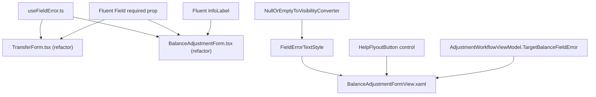

## 1. Technical Overview

**What:** Establishes three reusable form-UX primitives — per-field validation, required-field
indication, and contextual help — for both Web and WPF, and applies each one to at least one real
form so the primitive is proven, not disconnected infrastructure. Full Scope additions (price-source
`Badge`, filter/chart-mode `TabList`/`RadioButton`, semibold-text convention, post-submit itemized
result view) are explicitly out of scope for this run.

**Why:** F04 (the CashFlow Monthly Expense proof-of-concept) and every later rollout feature
(F05–F07, F09) consume these primitives rather than hand-rolling per-field validation UI on every
form. Building them once, against a real form, means F04 applies an already-working pattern instead
of inventing one under its own scope pressure.

**Scope:**
- Included (Core Scope only, per PRD §6 "Core Scope" block): per-field validation state/message
  (Web `Field validationState`/`validationMessage`; WPF per-field error text additive to the
  existing bottom-of-form message), required-field indicator (Web `Field required`; WPF themed
  asterisk + `AutomationProperties.HelpText="Required"`), contextual help affordance (Web
  `InfoLabel`; WPF `SymbolIcon Info16` + `Flyout`).
- Excluded (PRD §6 "Full Scope additions", deferred): the price-source `Badge`, the
  `TabList`/`RadioButton` filter-chip replacement, the `<Text weight="semibold">` inline-value
  convention, and the post-submit itemized result view. None of these are in F04's `Consumes` list
  (F04 only consumes the three Core Scope primitives), so deferring them does not block F04.
- Also excluded: WPF/Web terminology parity for `BalanceAdjustmentFormView.xaml`/
  `TransferFormView.xaml` (WPF still reads "Correct Balance"/"Move Money"-era text — F03 only
  touched Web for these two forms, by that feature's own explicit scope decision). Noticed while
  reading these files for this feature; out of scope here and left for F05 or a dedicated fix.

**Complexity:** Medium (new shared Web hook + component usage, new WPF converter + styles + a
reusable control, applied to 2 real forms across both platforms — no API/DB surface).

## 2. Architecture Impact

Presentation-layer only, both front ends. No Domain/Application/Infrastructure/API changes.

**Affected components:**
- `Financial.Web/src/hooks/useFieldError.ts` — new shared hook
- `Financial.Web/src/components/TransferForm.tsx`, `BalanceAdjustmentForm.tsx` — refactored to the
  shared hook; `required` added to their genuinely-required fields
- `Financial.Web/src/components/BalanceAdjustmentForm.tsx` — first real `InfoLabel` usage (Target
  Balance)
- `Financial.App/Converters/NullOrEmptyToVisibilityConverter.cs` — new converter
- `Financial.App/App.xaml` — new named style `FieldErrorTextStyle`
- `Financial.App/Controls/HelpFlyoutButton.xaml`(+`.xaml.cs`) — new reusable control
- `Financial.App/Views/CashFlow/BalanceAdjustmentFormView.xaml` — per-field error text, required
  asterisks, `HelpFlyoutButton` usage
- `Financial.App/ViewModels/CashFlow/AdjustmentWorkflowViewModel.cs` — new derived
  `TargetBalanceFieldError` property

## 3. Technical Decisions

| Decision | Chosen Approach | Alternative Considered | Trade-off |
|---|---|---|---|
| Scope: Core only vs. Core + Full | Core Scope only | Build the Full Scope additions too | F04's `Consumes` list names only the three Core primitives; `Badge`/`TabList` aren't needed until F07/F04's own tab work respectively. Matches spec-writer's own Auto-Accept default for this exact fork. |
| Web validation primitive shape | A generic hook, `useFieldError<TField extends string>(saveError, saveErrorField): (field: TField) => string \| null`, extracted from the identical inline `fieldError` function already hand-written in `TransferForm.tsx` and `BalanceAdjustmentForm.tsx` | A new wrapper component around Fluent `Field` | Fluent's `Field` already accepts `validationState`/`validationMessage` directly — there is nothing to wrap. The actual duplication being removed is the *lookup* logic, not the rendering, so a hook is the right shape. Pure extraction: behavior is unchanged, existing tests keep passing. |
| Web required-field primitive | Fluent `Field`'s built-in `required` boolean prop | A custom asterisk/label wrapper | Already a first-class Fluent prop (confirmed against the real v9 API in `docs/ui/fluent-ui-react-v9-pages/field.md` during the 2026-08-29 audit's Part C) — nothing to build, only a convention to apply. |
| Web contextual-help primitive | Fluent `InfoLabel` from `@fluentui/react-components`, wrapping the "Target Balance" field's label | A custom tooltip component | Same reasoning as `required` — `InfoLabel` is a real, existing Fluent v9 export built for exactly this. |
| First real contextual-help placement | `BalanceAdjustmentForm.tsx`'s "Target Balance" field: *"Enter the balance you want this bank to show after the adjustment — the app calculates and records the difference."* | Leave contextual help unapplied (primitive-only, no live consumer) | The architecture invariant "never scaffolding, placeholders, or disconnected infrastructure" (CLAUDE.md) rules out building `InfoLabel` usage with no real consumer. Target Balance is a genuine case: the field's mental model (state a target, not a delta) isn't obvious from the label alone, unlike Transfer's fields, which are all self-explanatory. |
| WPF per-field validation primitive: how to derive field-level text without refactoring the shared multi-error `*FormValidation.BuildValidationMessage` contract | Add one narrowly-scoped derived property, `AdjustmentWorkflowViewModel.TargetBalanceFieldError`, that pattern-matches `AdjustmentSaveError` the same way Web's `mapBalanceAdjustmentErrorToField.ts` already does (`Contains("cannot be negative")`) | Refactor `BalanceAdjustmentFormValidation`/`TransferFormValidation` to return structured per-field results | `BalanceAdjustmentFormValidation.BuildValidationMessage`'s joined-string return type is shared by every CashFlow WPF form's validator (`TransferFormValidation`, `ExpenseFormValidation`, etc.) — changing its contract is a repo-wide refactor far outside a "primitives" feature's blast radius. Balance Adjustment happens to have exactly one field a server error can ever target (per Web's own mapper and the same client-side "Bank chosen" gating that already exists on both platforms), so a single derived property is sufficient and safe — it does not touch the validator at all. |
| WPF proof-of-concept form | `BalanceAdjustmentFormView.xaml` for all three primitives (not `TransferFormView.xaml`) | `TransferFormView.xaml` | Transfer's error surface has 3 possible per-field targets (`sourceBank`/`destinationBank`/`amount`) sharing one joined-string validator with no existing 1:1 mapping — proving the primitive there would require exactly the validator refactor ruled out above. Balance Adjustment's single-target shape lets all three primitives land on one small, low-risk, already-partially-token-compliant form (see F01). |
| WPF required-field marker | Append a themed `<Run Text=" *">` (color `{DynamicResource SystemFillColorCriticalBrush}`) to the field's existing `FieldLabelStyle`-styled `TextBlock`, plus `AutomationProperties.HelpText="Required"` on the input control | A new named `Style` for the asterisk `Run` | A `Run` isn't a substantial enough element to warrant a shared named style — the pattern (label `TextBlock` → two `Run`s) is what's reusable, documented here for the next form (F05) to copy, the same way `FieldLabelStyle`/theme-merge blocks are copied today rather than centralized. |
| WPF contextual-help primitive | New reusable `Financial.App/Controls/HelpFlyoutButton.xaml` `UserControl` (a `HelpText` dependency property, rendering `ui:Button appearance="Transparent" icon="Info16"` that opens a `ui:Flyout` showing the text) | Hand-write the `SymbolIcon`+`Flyout` pair inline per form | Matches the existing `Controls/FilterableColumnHeader.xaml` convention for a small, parameterized, reusable WPF control — genuinely shared across forms the way F02's PRD text asks for, not copy-pasted per form. |
| Which WPF fields get the required asterisk | Bank (create mode only, matching Web's create-mode-only Bank field) and Target Balance | All fields including Date | Date already defaults to today via the `DatePicker`, and Note is explicitly optional per the PRD's own field list — marking only the fields a user can actually leave unset/invalid keeps the indicator meaningful, mirroring exactly the `required` props added to the Web form. |

## 4. Component Overview

**Web (Frontend):**

| File Path | New/Modified | Purpose | Key Responsibilities |
|---|---|---|---|
| `Financial.Web/src/hooks/useFieldError.ts` | New | Shared per-field validation lookup | `useFieldError<TField>(saveError: string \| null, saveErrorField: TField \| null): (field: TField) => string \| null` — returns `saveError` when `field === saveErrorField`, else `null` |
| `Financial.Web/src/components/TransferForm.tsx` | Modified | Adopt shared hook + required | Replace the inline `fieldError` function with `useFieldError`; add `required` to Date/From/To/Amount `Field`s (Note stays optional) |
| `Financial.Web/src/components/BalanceAdjustmentForm.tsx` | Modified | Adopt shared hook + required + help | Replace the inline `fieldError` function with `useFieldError`; add `required` to Bank and Target Balance `Field`s; wrap Target Balance's label with `InfoLabel` |

**WPF (App):**

| File Path | New/Modified | Purpose | Key Responsibilities |
|---|---|---|---|
| `Financial.App/Converters/NullOrEmptyToVisibilityConverter.cs` | New | Collapse empty per-field error text | `IValueConverter`: `null`/`""` → `Collapsed`, any other string → `Visible` — mirrors this project's one-converter-per-file convention |
| `Financial.App/App.xaml` | Modified | Shared per-field error style | Add named `Style x:Key="FieldErrorTextStyle" TargetType="TextBlock"` (small font, `TextWrapping="Wrap"`, `Foreground="{DynamicResource SystemFillColorCriticalBrush}"`) alongside the existing `NumericColumnTextStyle`/`PlainColumnTextStyle` named styles |
| `Financial.App/Controls/HelpFlyoutButton.xaml` + `.xaml.cs` | New | Reusable contextual-help control | `UserControl` with a `HelpText` `DependencyProperty`; renders an `Info16` icon button that opens a `ui:Flyout` showing `HelpText`, following `Controls/FilterableColumnHeader.xaml`'s existing pattern |
| `Financial.App/ViewModels/CashFlow/AdjustmentWorkflowViewModel.cs` | Modified | Per-field error derivation | New `TargetBalanceFieldError` property (`AdjustmentSaveError` when it matches the "cannot be negative" pattern, else `null`); raise its `PropertyChanged` at every site `AdjustmentSaveError` is already set |
| `Financial.App/Views/CashFlow/BalanceAdjustmentFormView.xaml` | Modified | Apply all three primitives | Bank + Target Balance labels gain the required-asterisk `Run` pattern; Bank/Target Balance `ComboBox`/`TextBox` gain `AutomationProperties.HelpText="Required"`; a `FieldErrorTextStyle` `TextBlock` bound to `TargetBalanceFieldError` (with the visibility converter) sits under the Target Balance field; a `HelpFlyoutButton` sits next to its label |

No Database section — presentation-layer only, no persistence surface.

## 5. API Contracts

Not applicable — no API surface touched.

## 6. Data Model

Not applicable — no persistence-layer surface.

## 7. Testing Strategy

Per `testing-guide-Financial`: React component tests via RTL (render + variant props + states), WPF
`ViewModel`/`Converter` unit tests with hand-written stubs — no XAML-markup tests (established
project convention, confirmed again during F01/F03).

| Test File | Test Type | Target | What's Added/Changed |
|---|---|---|---|
| `Financial.Web/src/hooks/__tests__/useFieldError.test.ts` | Unit | `useFieldError` | New: returns the error when field matches, `null` when it doesn't or `saveErrorField` is `null` |
| `Financial.Web/src/components/__tests__/TransferForm.test.tsx` | Component (RTL) | `TransferForm` | Existing `fieldError`-behavior tests keep passing unmodified (pure refactor); add one assertion that the required fields expose `aria-required`/Fluent's required indicator |
| `Financial.Web/src/components/__tests__/BalanceAdjustmentForm.test.tsx` | Component (RTL) | `BalanceAdjustmentForm` | Existing tests keep passing unmodified; add assertions for the required-field indicator and for the `InfoLabel` help text being reachable (e.g. via its button's accessible name) on Target Balance |
| `Tests/Financial.Presentation.Tests/Converters/NullOrEmptyToVisibilityConverterTests.cs` | Unit | `NullOrEmptyToVisibilityConverter` | New: `[Theory]` covering `null`, `""`, and a non-empty string |
| `Tests/Financial.Presentation.Tests/ViewModels/CashFlow/AdjustmentWorkflowViewModelTests.cs` | Unit | `AdjustmentWorkflowViewModel` | New `[Fact]`(s): `TargetBalanceFieldError` is `null` initially, becomes the message when `AdjustmentSaveError` matches the negative-balance pattern, and is `null` again once a successful save clears `AdjustmentSaveError` |

No WPF XAML/markup test is added for `HelpFlyoutButton` or the applied styles, consistent with this
project's established testing boundary — its `HelpText` dependency-property plumbing has no branching
logic worth a unit test; correctness is verified by build + manual inspection per
`docs/ui/review-checklist.md`.

**Acceptance criteria → test mapping (PRD §9, F02, Core Scope items only):**
- "A shared per-field validation primitive exists on Web... and WPF... and is documented for reuse"
  → covered by `useFieldError.test.ts` + the two refactored form tests (Web); by
  `AdjustmentWorkflowViewModelTests.cs` (WPF); "documented for reuse" is this spec's §3/§4 plus the
  in-code convention demonstrated on both platforms.
- "A shared required-field indicator exists on Web... and WPF..." → covered by the new required-prop
  assertions (Web) and manual/build verification (WPF, per the established no-XAML-test convention).
- "A shared contextual-help affordance exists on Web... and WPF..." → covered by the `InfoLabel`
  assertion (Web) and manual/build verification (`HelpFlyoutButton`, WPF).
- The Full-Scope-only AC bullets (`Badge`, `TabList`/`RadioButton`) are **not** addressed by this run
  — deferred per §1's Scope decision; left unchecked in the PRD until a feature that needs them
  builds them.
