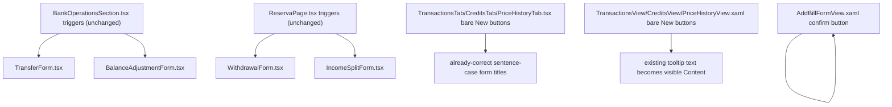

## 1. Technical Overview

**What:** Fixes 7 confirmed trigger→form→confirm-button entity-naming mismatches across Web and
WPF, per the "Trigger-to-form naming consistency" rule already added to
`docs/ui/forms-data-and-visualisations.md` (lines 140–154): a trigger's noun must carry through
unchanged into the form title and the confirm button, in every mode (create and edit) — the
`ExpenseForm.tsx` reference pattern (`New Expense` → `New Expense`/`Edit Expense` →
`Add Expense`/`Save`).

**Why:** Every one of these 7 mismatches makes the user re-verify they opened what they meant to
before trusting the form. This is a pure text-label fix — no new components, no layout change, no
new state — so it can land as one focused, low-risk sweep against the rule the project has already
adopted, rather than being rediscovered and re-litigated once per form later.

**Scope:**
- Included: the 7 items the PRD's Section 6/9 name for F03 — Transfer, Balance Correction,
  Withdrawal, and Income Split (Web, trigger/form/confirm text only) plus Investment
  Transaction/Credit/Price "New" triggers (Web + WPF) and the Add Bill WPF confirm button.
- Excluded: any layout, sizing, icon, or component-type change (Fluent `TabList`/`DataGrid`
  migrations are F04/F09's scope); WPF Transaction/Credit/Price forms' own Title-Case-vs-sentence-case
  normalization (explicitly F07's scope per PRD AC: "WPF Transaction/Credit/Price forms use
  sentence-case titles/verbs matching Web"); the Bill/Entry row-position continuity work (F06); the
  `MoveAssetDialog` accessibility/naming items beyond what's already named here (F07).

**Complexity:** Simple (no API/DB/integration surface; a fixed set of JSX/XAML text-literal edits
across 10 known files, verified against 2 existing behaviors: entity noun and mode — create vs.
edit).

## 2. Architecture Impact

Presentation-layer only, both front ends. No Domain/Application/Infrastructure/API changes.

**Affected components:**
- `Financial.Web/src/components/TransferForm.tsx` — create-mode header/confirm text
- `Financial.Web/src/components/BalanceAdjustmentForm.tsx` — create- and edit-mode header text,
  create-mode confirm text
- `Financial.Web/src/components/WithdrawalForm.tsx` — header/confirm text
- `Financial.Web/src/components/IncomeSplitForm.tsx` — header/confirm text
- `Financial.Web/src/components/TransactionsTab.tsx`, `CreditsTab.tsx`, `PriceHistoryTab.tsx` —
  bare "New" trigger button text
- `Financial.App/Views/Investment/TransactionsView.xaml`, `CreditsView.xaml`,
  `PriceHistoryView.xaml` — bare "New" trigger `Content` text
- `Financial.App/Views/CashFlow/AddBillFormView.xaml` — confirm button text + width
- Existing test files asserting the old text (see §7)

## 3. Technical Decisions

| Decision | Chosen Approach | Alternative Considered | Trade-off |
|---|---|---|---|
| Target wording for Transfer/Balance Correction/Withdrawal/Income Split | Match each trigger's exact noun using the established `New <Entity>` / `Edit <Entity>` / `Add <Entity>` / `Save` convention (the `ExpenseForm.tsx`/`IncomeForm.tsx` pattern), not just "contains the same noun somewhere" | Keep the existing domain wording (`Record a Withdrawal`, `Post Monthly Income Split`) since it already contains the entity noun | The rule's own text is explicit: "Do not let the form re-title itself into different wording once open" — the audit flagged Withdrawal as a violation ("different verb entirely") even though `Withdrawal` appears in all three strings, so noun-presence alone isn't the bar; exact-noun-carry-through is. |
| Balance Correction's edit-mode header (`Edit Balance Adjustment`) | Rename to `Edit Balance Correction` — the trigger's noun (`Balance Correction`) must carry through "in every mode (create and edit)" per the rule text, and this is a text-only change; the component/file/hook names (`BalanceAdjustmentForm.tsx`, `useBalanceAdjustmentForm.ts`, `AdjustmentWorkflowViewModel.cs`) are untouched — only the rendered JSX string changes | Leave edit-mode text alone since the PRD's Part D table lists Balance Correction as one row without explicitly separating create/edit | The rule's own "every mode" clause is unambiguous, and leaving one mode inconsistent while claiming the sweep is done would misrepresent the AC's "end-to-end" wording. |
| Confirm-button verb for Transfer/Balance Correction create mode | `Add <Entity>` (matching the `Add Expense`/`Add Income` convention) rather than reusing the trigger's `New <Entity>` verbatim | Use the same "New X" text on the confirm button too | Matches the one documented reference pattern verbatim — `New Expense` trigger/title, `Add Expense` confirm — rather than inventing a new convention. |
| Investment Transaction/Credit/Price Web trigger casing | Sentence case (`New transaction`, `New credit`, `New price`), matching each tab's own already-correct, already-sentence-case form title exactly | Title Case, matching the `ExpenseForm` reference pattern | The rule requires the trigger's noun to carry through into the (already-existing, untouched) form title unchanged — the form title here is already sentence case, so the trigger must match it, not the unrelated Expense reference. |
| Investment Transaction/Credit/Price WPF trigger casing | Title Case (`New Transaction`, `New Credit`, `New Price`), matching every other current WPF button/dialog title in the app (`New Withdrawal`, `New Income Split`, `Add Bill`) | Sentence case, pre-empting F07's normalization | F07 (not F03) owns changing the WPF forms' own Title-Case text to sentence case to match Web; doing it piecemeal here would leave the WPF trigger and its own form's title mismatched *within* this feature's own PR, which is exactly the defect being fixed. Title Case keeps the whole current chain internally consistent until F07 changes all three pieces together. |
| WPF Investment "New" buttons: `Content` vs `ToolTip` | Set the entity name as the visible `Content` (keep `ToolTip` as-is, now redundant but harmless) | Remove the `ToolTip` since `Content` now duplicates it | PRD Capabilities text is explicit: "WPF's is tooltip-only, which doesn't satisfy a visible-label fix" — the fix is making the label visible, not removing the (harmless) tooltip. Minimal diff. |
| Add Bill WPF confirm button width | Widen `90` → `100` alongside the text change (`Add`→`Add Bill`, `Adding...`→`Adding Bill...`) | Leave `Width="90"` unchanged | `90` was sized for the 3-character/9-character words `Add`/`Adding...`; `Add Bill`/`Adding Bill...` need more room. `100` matches `CreateEntryFormView.xaml`'s existing `Add Entry`/`Saving...` button, an already-established width for a same-shape two-word confirm button — not introducing a new value. |

## 4. Component Overview

**Web (Frontend):**

| File Path | New/Modified | Purpose | Key Responsibilities |
|---|---|---|---|
| `Financial.Web/src/components/TransferForm.tsx` | Modified | Entity-naming fix | Line 55: `'Move Money'` → `'New Transfer'` (create-mode header, `isEditing` branch unchanged). Line 107: `'Move Money'` → `'Add Transfer'` (create-mode confirm, `isEditing`/`isSaving` branches unchanged). |
| `Financial.Web/src/components/BalanceAdjustmentForm.tsx` | Modified | Entity-naming fix | Line 74: `'Edit Balance Adjustment' : 'Correct Balance'` → `'Edit Balance Correction' : 'New Balance Correction'`. Line 132: `isEditing ? 'Save' : 'Correct Balance'` → `isEditing ? 'Save' : 'Add Balance Correction'`. |
| `Financial.Web/src/components/WithdrawalForm.tsx` | Modified | Entity-naming fix | Line 36: `'Record a Withdrawal'` → `'New Withdrawal'`. Line 71: `'Record Withdrawal'` → `'Add Withdrawal'` (the `isSubmitting ? 'Saving...'` branch is unchanged). |
| `Financial.Web/src/components/IncomeSplitForm.tsx` | Modified | Entity-naming fix | Line 70: `'Post Monthly Income Split'` → `'New Income Split'`. Line 94: `'Post Income Split'` → `'Add Income Split'` (`isSubmitting ? 'Posting...'` unchanged). |
| `Financial.Web/src/components/TransactionsTab.tsx` | Modified | Visible trigger entity name | Line 351: bare `New` → `New transaction`, matching the form's own existing `title` (line 112). |
| `Financial.Web/src/components/CreditsTab.tsx` | Modified | Visible trigger entity name | Line 374: bare `New` → `New credit`, matching the form's own existing `title` (line 127). |
| `Financial.Web/src/components/PriceHistoryTab.tsx` | Modified | Visible trigger entity name | Line 254: bare `New` → `New price`, matching the form's own existing `title` (line 99). |
| `Financial.Web/src/pages/__tests__/MonthlyPage.test.tsx` | Modified | Test update | Update all `'Move Money'`/`'Correct Balance'` name/text assertions to the new strings (lines ~1316, 1324, 1340, 1350, 1408 and any others matching). |
| `Financial.Web/src/components/__tests__/TransferForm.test.tsx` | Modified | Test update | Update `'Move Money'` heading/button assertions (lines 33, 60, 74) to `'New Transfer'`/`'Add Transfer'`. |
| `Financial.Web/src/components/__tests__/BalanceAdjustmentForm.test.tsx` | Modified | Test update | Update `'Correct Balance'`/`'Edit Balance Adjustment'` assertions (lines 40, 46, 80, 127) to the new strings. |
| `Financial.Web/src/pages/__tests__/ReservaPage.test.tsx` | Modified | Test update | Update `'Record a Withdrawal'`/`'Record Withdrawal'`/`'Post Monthly Income Split'`/`'Post Income Split'` assertions (lines ~166, 170, 173, 216, 239, 281, 125, 129, 131, 151, 315) to the new strings. |
| `Financial.Web/src/components/__tests__/TransactionsTab.test.tsx` | Modified | Test update | Line 223: `name: 'New'` → `name: 'New transaction'`. |
| `Financial.Web/src/components/__tests__/CreditsTab.test.tsx` | Modified | Test update | Lines 140, 195, 201, 206: `name: 'New'` → `name: 'New credit'`. |
| `Financial.Web/src/components/__tests__/PriceHistoryTab.test.tsx` | Modified | Test update | Line 166: `name: 'New'` → `name: 'New price'`. |

**WPF (App):**

| File Path | New/Modified | Purpose | Key Responsibilities |
|---|---|---|---|
| `Financial.App/Views/Investment/TransactionsView.xaml` | Modified | Visible trigger entity name | Line 122: `Content="New"` → `Content="New Transaction"` (`ToolTip="New transaction"` on line 123 left as-is). |
| `Financial.App/Views/Investment/CreditsView.xaml` | Modified | Visible trigger entity name | Line 47: `Content="New"` → `Content="New Credit"` (`ToolTip="New credit"` on line 48 left as-is). |
| `Financial.App/Views/Investment/PriceHistoryView.xaml` | Modified | Visible trigger entity name | Line 83: `Content="New"` → `Content="New Price"` (`ToolTip="New price"` on line 84 left as-is). |
| `Financial.App/Views/CashFlow/AddBillFormView.xaml` | Modified | Entity-naming fix | `Content Value="Add"` → `"Add Bill"`; `Content Value="Adding..."` → `"Adding Bill..."`; `Button Width="90"` → `"100"`. |

No Database section — presentation-layer text changes only.

## 5. API Contracts

Not applicable — no API surface touched.

## 6. Data Model

Not applicable — no persistence-layer surface.

## 7. Testing Strategy

Text-label changes are exercised entirely by the existing React Testing Library suite, which
already queries these forms `byRole`/`byText` with the exact strings being changed — per
`testing-guide-Financial`, this is exactly the kind of user-visible-behavior assertion RTL is meant
to cover, so no *new* test files are needed; the existing ones must be **updated** to the new
strings (not deleted — the underlying behavior they verify, e.g. "trigger only opens after click,"
is unchanged and still worth covering).

| Test File | Test Type | Target | What Changes |
|---|---|---|---|
| `Financial.Web/src/pages/__tests__/MonthlyPage.test.tsx` | Component (RTL) | Transfer/Balance Correction flows via `MonthlyPage` | String updates only — same assertions, new text |
| `Financial.Web/src/components/__tests__/TransferForm.test.tsx` | Component (RTL) | `TransferForm` | String updates only |
| `Financial.Web/src/components/__tests__/BalanceAdjustmentForm.test.tsx` | Component (RTL) | `BalanceAdjustmentForm` | String updates only |
| `Financial.Web/src/pages/__tests__/ReservaPage.test.tsx` | Component (RTL) | Withdrawal/Income Split flows via `ReservaPage` | String updates only |
| `Financial.Web/src/components/__tests__/TransactionsTab.test.tsx` | Component (RTL) | `TransactionsTab` | String update for the trigger button's accessible name |
| `Financial.Web/src/components/__tests__/CreditsTab.test.tsx` | Component (RTL) | `CreditsTab` | String update for the trigger button's accessible name |
| `Financial.Web/src/components/__tests__/PriceHistoryTab.test.tsx` | Component (RTL) | `PriceHistoryTab` | String update for the trigger button's accessible name |

WPF: no `ViewModel`/`Converter`/`Helper` logic changes (per `testing-guide-Financial`, WPF Presentation
tests target those, not XAML markup/`Content` strings), so no WPF test file needs updating —
confirmed by searching `Tests/Financial.Presentation.Tests` for any assertion on the changed
`Content`/`ToolTip` strings and finding none.

**Acceptance criteria → test mapping (PRD §9, F03):**
- "Transfer, Balance Correction, Withdrawal, and Income Split triggers/forms/confirm buttons on Web
  name the same entity end-to-end" → covered by the 4 updated Web test files above.
- "Investment Transaction/Credit/Price 'New' triggers show a visible entity name on both Web and
  WPF" → Web covered by the 3 updated tab test files; WPF has no automated coverage for XAML
  `Content` text (consistent with this project's testing conventions) — verified by manual/build
  inspection instead (grep sweep + `dotnet build`).
- "The Add Bill WPF confirm button reads 'Add Bill'/'Adding Bill...'" → no existing automated test
  asserts this WPF button's `Content`; verified the same way (grep sweep + `dotnet build`).
