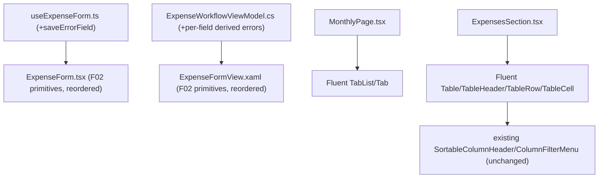

## 1. Technical Overview

**What:** Proves F01+F02+F03's primitives together on one representative form, per the PRD's explicit
"prove the pattern before scaling it" gate: reorders `ExpenseForm.tsx`/`ExpenseFormView.xaml`'s fields
(Payment Source/Card before Value), applies F02's per-field validation/required-field primitives to
both platforms' Expense forms, migrates `MonthlyPage.tsx`'s custom tab buttons to Fluent `TabList`,
and migrates `ExpensesSection.tsx`'s native `<table>` to Fluent `Table`.

**Why:** F05–F07 and F09 all consume "the proven Fluent TabList/DataGrid/validation pattern for
CashFlow Monthly forms" this feature provides — they must not each independently re-derive how to
wire F02's primitives into a real form or how to migrate a grid/tab-set. Per the PRD's Objectives:
F04 must pass 100% of its own AC before any rollout feature begins.

**Scope:**
- Included: `ExpenseForm.tsx`/`ExpenseFormView.xaml` field reorder and F02-primitive application (both
  platforms); `MonthlyPage.tsx`'s tab buttons → Fluent `TabList`/`Tab` (Web only — WPF's
  `MonthlyView.xaml` already uses native `TabControl`/`TabItem`, already keyboard-accessible, per the
  audit finding no violation there); `ExpensesSection.tsx`'s `<table>` → Fluent `Table` primitives (Web
  only — WPF's `ExpenseSectionView.xaml` already uses native `DataGrid`).
- Excluded: any other CashFlow Monthly form (Income, Transfer, Withdrawal, Balance Correction, Income
  Split, Edit Reserve Movement — F05's scope); Bill/Mãe Entry forms (F06); Investment forms (F07);
  the remaining hand-rolled Web grids (F09); session-persisted defaults (F10).

**Complexity:** Complex (field-order change + F02-primitive wiring across two platforms, plus two
independent Fluent-component migrations on Web — no API/DB surface, but the proof-of-concept gate
every rollout feature depends on getting right).

## 2. Architecture Impact

Presentation-layer only, both front ends. No Domain/Application/Infrastructure/API changes (PRD §7).

**Affected components:**
- `Financial.Web/src/components/ExpenseForm.tsx` — field reorder, F02 primitives
- `Financial.Web/src/hooks/useExpenseForm.ts` — add `saveErrorField` alongside the existing
  sequential-validation `saveError`
- `Financial.Web/src/pages/MonthlyPage.tsx` — `TabList`/`Tab` migration
- `Financial.Web/src/pages/MonthlyPage.css` — remove the now-dead custom tab-button rules (including
  the hardcoded `#007acc` active-tab color left for this feature, per F01's own scope note)
- `Financial.Web/src/components/ExpensesSection.tsx` — `Table` primitive migration
- `Financial.App/Views/CashFlow/ExpenseFormView.xaml` — field reorder, F02 primitives
- `Financial.App/ViewModels/CashFlow/ExpenseWorkflowViewModel.cs` — per-field derived error
  properties (same pattern F02 established for `AdjustmentWorkflowViewModel.TargetBalanceFieldError`)

## 3. Technical Decisions

| Decision | Chosen Approach | Alternative Considered | Trade-off |
|---|---|---|---|
| Resolving the PRD's contradictory field-order text | AC bullet 1 ("Payment Source/Card selection appears before Value") and the audit's Part A #1 finding ("Field order: Payment Source/Card placed after Value instead of before it") both say Payment Source precedes Value; the Capabilities section's own parenthetical ("Payment Source moves before Value (currently after it)") agrees — only the enumerated list order in that same sentence contradicts itself. Treated the AC + audit finding + parenthetical as authoritative over the enumeration's literal word order. | Follow the enumeration literally (Value before Payment Source) | The AC is the binding acceptance criterion; a PRD sentence that lists items in one order then explicitly says the opposite in its own clarifying clause is an authoring slip, not a deliberate instruction. |
| Target field order (both platforms) | Date → Description → Payment Source/Card (mode-dependent; replaced by the settled-state notice when locked) → Value → Category → conditional fields (Round-Up when bank mode + round-up-enabled bank; Invoice Month when card mode; Counts-toward-tithe when the selected category is a tithe category) | Interleave Round-Up/Invoice Month immediately after Payment Source/Card, as the current layout does | The PRD's Capabilities text explicitly groups "conditional fields" after the primary sequence ("Date, Description, [...], Category, then conditional fields") — trailing them keeps the primary 5-field sequence uninterrupted and matches that structure literally, not just in spirit. |
| Web per-field validation source | Add `saveErrorField: ExpenseFormField \| null` to `useExpenseForm.ts`'s reducer state, tagged alongside each existing `SAVE_ERROR` dispatch (Date/Description/Value/Card each become their own field tag); reuse F02's `useFieldError` hook in `ExpenseForm.tsx` exactly as `TransferForm.tsx`/`BalanceAdjustmentForm.tsx` already do | Restructure validation to report every violation at once | AC only requires that *the* reported error surfaces under its field, not that every blocking issue show simultaneously — keeping the existing one-error-at-a-time sequential validation flow is the minimal change that satisfies the AC without altering established save-flow behavior. |
| WPF per-field validation source | Add narrowly-scoped derived properties on `ExpenseWorkflowViewModel` (`DateFieldError`, `DescriptionFieldError`, `CategoryFieldError`, `ValueFieldError`, `PaymentModeFieldError`, `RoundUpAmountFieldError`), each pattern-matching `ExpenseSaveError` against `ExpenseFormValidation`'s known per-violation substrings ("Date is required.", "Description is required.", etc.) | Refactor `ExpenseFormValidation.BuildValidationMessage`'s joined-string return into a structured per-field result | Same reasoning F02 already established for `BalanceAdjustmentFormValidation`: the joined-string contract is shared by every CashFlow WPF form's validator, and changing it is a repo-wide refactor outside this feature's blast radius. Unlike Web, WPF's validator reports *every* violation at once (joined by newline), so these substring-matched properties can legitimately show multiple fields invalid simultaneously — a strictly better field-level UX than Web's one-at-a-time flow, not a regression, and requires no behavior change to get. |
| `MonthlyPage.tsx` tab migration | Fluent `TabList`/`Tab`, `selectedValue={activeTab}` / `onTabSelect` replacing the custom `
` button row | Leave as custom buttons (already functionally clickable) | This is the literal AC requirement (arrow-key navigation is not available on a manually-built button row without hand-rolling roving tabindex, which `TabList` already provides). |
| `ExpensesSection.tsx` grid migration | Fluent `Table`/`TableHeader`/`TableRow`/`TableHeaderCell`/`TableBody`/`TableCell` — the **lower-level composable primitives**, not the higher-level data-model-driven `DataGrid` (`columns`+`items` API) | Full `DataGrid` with a `columns` array | The AC's own wording accepts either ("implemented with Fluent `DataGrid`/`Table`"). `ExpensesSection.tsx` already owns fully custom, working sort/filter behavior via `useSortableRows`/`useColumnFilters` + the `SortableColumnHeader`/`ColumnFilterMenu` components (which the AC requires to keep working unchanged) — `Table`'s primitives are simple, arbitrary-children composables (confirmed against `docs/ui/fluent-ui-react-v9-pages/table.md`'s own "Default" example) that swap in as direct `<table>`/`<thead>`/`<tr>`/`<th>`/`<tbody>`/`<td>` replacements without requiring a rewrite of the existing sort/filter data flow into `DataGrid`'s own column-descriptor model. |
| `.investment-tree__node--selected`-style hardcoded-color cleanup scope | Also fix `MonthlyPage.css`'s active-tab `#007acc` while migrating its markup (the class is being deleted entirely as part of the `TabList` swap, not left half-fixed) | Leave the color as a separate future cleanup | The rule is being deleted outright (Fluent `TabList` provides its own active-tab styling), so there is no "hardcoded color" left to separately fix — this is a natural consequence of the migration, not scope creep. |

## 4. Component Overview

**Web (Frontend):**

| File Path | New/Modified | Purpose | Key Responsibilities |
|---|---|---|---|
| `Financial.Web/src/hooks/useExpenseForm.ts` | Modified | Per-field error tagging | `SAVE_ERROR` action payload becomes `{ message: string; field: ExpenseFormField \| null }`; each existing validation branch (date/description/value/card) tags its own field; round-up-amount error tags `'roundUpAmount'`; hook returns the new `saveErrorField` |
| `Financial.Web/src/components/ExpenseForm.tsx` | Modified | Field reorder + F02 primitives | JSX field order changed to Date → Description → Payment Source/Card (or settled notice) → Value → Category → Round-Up/Invoice Month → Counts-toward-tithe; `useFieldError(saveError, saveErrorField)` wired into each `Field`'s `validationState`/`validationMessage`; `required` added to Date/Description/Value/Category and the active Payment Source or Card field |
| `Financial.Web/src/pages/MonthlyPage.tsx` | Modified | Tab migration | `
` + custom buttons replaced with `TabList`/`Tab`, `selectedValue`/`onTabSelect` driving the existing `handleTabClick` logic unchanged |
| `Financial.Web/src/pages/MonthlyPage.css` | Modified | Dead-rule cleanup | Remove `.monthly-page__tabs`/`.monthly-page__tab`/`.monthly-page__tab--active` (including the hardcoded `#007acc`) — markup they styled no longer exists |
| `Financial.Web/src/components/ExpensesSection.tsx` | Modified | Table primitive migration | `<table>`/`<thead>`/`<tr>`/`<th>`/`<tbody>`/`<td>` → `Table`/`TableHeader`/`TableRow`/`TableHeaderCell`/`TableBody`/`TableCell`; `SortableColumnHeader`/`ColumnFilterMenu` render inside `TableHeaderCell` unchanged; sort/filter hooks and row data untouched |
| `Financial.Web/src/components/ExpensesSection.css` | Modified | Dead-rule cleanup | Remove rules scoped to the raw `<table>`/`<th>`/`<td>` structure that `Table`'s own styling now covers, confirmed file-by-file during implementation |

**WPF (App):**

| File Path | New/Modified | Purpose | Key Responsibilities |
|---|---|---|---|
| `Financial.App/ViewModels/CashFlow/ExpenseWorkflowViewModel.cs` | Modified | Per-field derived errors | New `DateFieldError`/`DescriptionFieldError`/`CategoryFieldError`/`ValueFieldError`/`PaymentModeFieldError`/`RoundUpAmountFieldError` properties, each substring-matching `ExpenseSaveError`; `ExpenseSaveError`'s setter raises `PropertyChanged` for all six alongside its own (same pattern as `AdjustmentWorkflowViewModel.TargetBalanceFieldError`) |
| `Financial.App/Views/CashFlow/ExpenseFormView.xaml` | Modified | Field reorder + F02 primitives | `Grid.Row`/`Grid.Column` positions changed to the target order; `FieldErrorTextStyle` `TextBlock`s bound to the new per-field error properties added under each field; required-asterisk `Run` pattern (from F02) added to Date/Description/Value/Category/Payment-Source-or-Card labels; `AutomationProperties.HelpText="Required"` added to their input controls |

No Database section — presentation-layer only, no persistence surface.

## 5. API Contracts

Not applicable — no API surface touched; `apiClient.createExpense`/`updateExpense` and their payload
shape are unchanged.

## 6. Data Model

Not applicable — no persistence-layer surface.

## 7. Testing Strategy

Per `testing-guide-Financial`: React component tests via RTL, WPF `ViewModel` unit tests with
hand-written assertions — no XAML-markup tests (established convention).

| Test File | Test Type | What Changes |
|---|---|---|
| `Financial.Web/src/components/__tests__/ExpenseForm.test.tsx` | Component (RTL) | Field-order assertions updated; new assertions for `required` on Date/Description/Value/Category/active-payment-field and for field-level validation messages appearing under the correct field |
| `Financial.Web/src/hooks/__tests__/useExpenseForm.test.ts` | Hook (`renderHook`) | New assertions that each validation branch sets the expected `saveErrorField` alongside its existing `saveError` message |
| `Financial.Web/src/pages/__tests__/MonthlyPage.test.tsx` | Component (RTL) | Tab-click assertions updated for `TabList`/`Tab`'s `role="tab"` semantics in place of plain buttons; existing tab-switch-clears-open-form assertions kept, re-queried |
| `Financial.Web/src/components/__tests__/ExpensesSection.test.tsx` | Component (RTL) | Sort/filter/row-rendering assertions kept as-is in intent; any query relying on raw `<table>`/`<th>`/`<td>` element types updated for `Table`'s rendered roles (`role="table"`/`"columnheader"`/`"cell"` etc., confirmed against actual output during implementation) |
| `Tests/Financial.Presentation.Tests/ViewModels/CashFlow/ExpenseWorkflowViewModelTests.cs` | Unit | New `[Fact]`s for each per-field derived error property: null when no error, set when its specific validation message is present (including the WPF-only case where two fields are simultaneously invalid), null again after a field is corrected |

**Acceptance criteria → test mapping (PRD §9, F04):**
- "Payment Source/Card selection appears before Value in both `ExpenseForm.tsx` and
  `ExpenseFormView.xaml`" → covered by updated field-order assertions (Web) and manual/build
  inspection (WPF, per the established no-XAML-test convention).
- "The Monthly page's tabs are implemented with Fluent `TabList`/`Tab` and are operable via
  arrow-key navigation" → covered by updated `MonthlyPage.test.tsx` tab-role assertions; arrow-key
  navigation itself is `TabList`'s own library-internal behavior, verified manually.
- "`ExpensesSection.tsx`'s grid is implemented with Fluent `DataGrid`/`Table`, preserving existing
  sort/filter behavior" → covered by `ExpensesSection.test.tsx`'s existing sort/filter tests
  continuing to pass against the new element roles.
- "An invalid or missing required field on the Expense form shows a field-level error state and
  message, in addition to existing save-blocked behavior" → covered by the new `ExpenseForm.test.tsx`
  and `ExpenseWorkflowViewModelTests.cs` cases.
- "Settled-expense payment-field locking behavior is unchanged after the migration" → covered by
  existing `ExpenseForm.test.tsx`/`ExpenseWorkflowViewModelTests.cs` settled-state tests continuing
  to pass unmodified (a regression check, not new coverage, per the PRD's own Error Handling note).

**Cross-Feature Integration criteria referencing F04 (PRD §9):**
- "F04's Expense form and Monthly page chrome use both F01's tokens (no hardcoded colors) and F02's
  validation/required-field primitives (not a bespoke reimplementation), and reflect F03's naming
  fixes where applicable" → covered by the `MonthlyPage.css` hardcoded-color removal, the `useFieldError`
  reuse (not a new bespoke lookup), and confirming (grep sweep) that F03's Expense-adjacent naming
  fixes (none applied directly to Expense, but the Monthly tab labels are already correct) remain
  intact.
