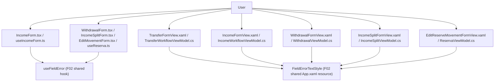

## 1. Technical Overview

**What:** Apply F04's proven per-field validation pattern (Fluent `Field` validationState/validationMessage
+ `useFieldError` on Web; derived substring-matched `*FieldError` properties + `FieldErrorTextStyle` on
WPF) to six remaining CashFlow Monthly/Reserve entry forms — Income, Transfer, Withdrawal, Balance
Correction, Income Split, and Edit Reserve Movement — on both platforms. Fix three specific field-order
violations (Income, Withdrawal, Edit Movement), reposition WPF Income's "split to reserve" checkbox to
match Web, and add the missing £ symbol to WPF's Balance Correction confirmation text.

**Why:** F04 proved the validation/tokens/TabList/Table pattern on one form (Expense) as a deliberate
proof-of-concept gate (PRD §4 Objectives: "Prove the pattern before scaling it"). F05 is the scale-out —
propagating that same primitive combination to the rest of the CashFlow Monthly page and the Reserve
page's three forms, closing the remaining field-order/validation-surface gaps the 2026-08-29 audit found.

**Scope — Included:**
- Per-field validation UI for all 6 forms, both platforms, wherever validation doesn't already exist.
- Field-order fixes for Income (Bank/Description move before the financial fields) and for Withdrawal +
  Edit Reserve Movement (Date-first, replacing the current Bucket→Amount→Date→Description order).
- WPF Income: move the "split to reserve" checkbox to sit immediately after Net Value, matching Web.
- WPF Balance Correction: add the `£` symbol to the confirmation text (Web already has it).
- WPF Withdrawal, Income Split, and Edit Reserve Movement views: migrate from the pre-F01/F02 single-column
  label-left `Grid` + plain controls to the established 4-column label-above-control layout with WPF-UI
  themed controls (`ui:Button`) and `AutomationProperties.Name`, matching every other CashFlow form. This
  isn't a separate ask in the PRD — it's a precondition for adding `FieldErrorTextStyle`/required-asterisk
  markers, which assume that layout (see Decision D5).

**Scope — Excluded (already done, verified during spec research, not touched by this feature):**
- Web Transfer (`TransferForm.tsx`) and Web Balance Correction (`BalanceAdjustmentForm.tsx`) already have
  full F02 per-field validation — confirmed by reading both files; no changes needed.
- WPF Balance Correction (`BalanceAdjustmentFormView.xaml` / `AdjustmentWorkflowViewModel.cs`) already has
  full F02 per-field validation (`TargetBalanceFieldError`) — only the `£` symbol fix applies here.
- Income Split's own field-order finding from the audit (Amount before Description) — not named in the
  PRD's AC or Capabilities list for F05 (only Income/Withdrawal/Edit Movement are), so left as-is.
- WPF Transfer's/Withdrawal's "Move Money"/verb-mismatch naming issues — audit flagged these as
  pre-existing, non-mismatch (internally consistent) naming issues out of F03's mismatch-only scope, and
  F05's PRD Capabilities don't name them either. Out of scope here too.

## 2. Architecture Impact

Presentation-layer only (Financial.Web components/hooks, Financial.App views/viewmodels). No Domain,
Application, Infrastructure, or API changes — validation logic already exists in every case (Web reducers,
WPF `*FormValidation.cs` static classes); this feature only surfaces it per-field instead of only in the
form-level error banner.

## 3. Technical Decisions

| Decision | Chosen Approach | Alternative Considered | Trade-off |
|---|---|---|---|
| D1. PR split | Split F05 into 3 sequential PRs — (a) Income + Transfer, (b) Withdrawal + Edit Reserve Movement, (c) Income Split — each branched from `main` after the previous merges | One PR for all 6 forms | 16 non-test code files across 6 forms far exceeds the ~8-file PR guideline and isn't one mechanical repeated change (each form's fields/validation differ) — the documented exception in `docs/rules/design.md` doesn't apply, so splitting is required. Grouping (b) matches the PRD's own "Withdrawal and Edit Movement" pairing for the field-order fix |
| D2. Income target field order | Date → Source → Bank → Description → Gross Value (conditional) → Net Value → Split checkbox (conditional) | Keep Bank/Description where they are, only add validation | The audit explicitly flags "Bank/Description after financial fields" as the violation; `docs/ui/forms-data-and-visualisations.md`'s Default field order (Date → related entities → description → financial values → optional metadata) resolves the exact target position — Source and Bank are both "related entities," both belong before Description |
| D3. Withdrawal / Edit Movement target field order | Date → Bucket → Description → Amount | Bucket → Date → Amount → Description (partial reorder) | Same convention doc: Date first, then the related entity (Bucket), then Description, then the financial value (Amount) last — a full reorder, not just moving Date to the front, since the doc's convention places Description before financial values too |
| D4. WPF Income checkbox position | Move to immediately follow Net Value (the last financial field) in the new field order | Keep at its current "last cell" position, just visually relabel | The PRD explicitly asks to match Web's *relative* position (right after Net Value) — Bank/Description moving earlier per D2 doesn't change that relationship, since Net Value is still the last field before the checkbox in the new order |
| D5. WPF Withdrawal/Income Split/Edit Movement layout modernization | Migrate all three from the single-column label-left `Grid` + plain `Button`/`TextBlock` to the 4-column label-above-control `ui:Button`-based layout already used by every other CashFlow form (Expense, Income, Transfer, Balance Correction) | Bolt `FieldErrorTextStyle` onto the existing single-column layout without changing structure | `FieldErrorTextStyle`/the required-asterisk `Run` pattern/`AutomationProperties.HelpText` are designed for the label-above-control `StackPanel` cell shape used everywhere else; retrofitting them onto the old layout would produce a third, inconsistent layout style. The audit already flagged these three views' layout as a separate High-severity violation, so modernizing now (while touching the file anyway to add validation) avoids a second pass later |
| D6. Field-error property pattern (WPF) | Reuse F02/F04's exact pattern: derived `string? XFieldError => SaveError is {} e && e.Contains("known text") ? e : null` properties, `OnPropertyChanged` fired from the `SaveError` setter | Extract a shared base class/mixin for this pattern | F04 already deliberately kept this pattern per-ViewModel rather than centralizing it (avoids refactoring the shared `*FormValidation.BuildValidationMessage` joined-string contract); F05 continues that precedent for consistency across all 5 ViewModels touched |
| D7. Web `saveErrorField` tagging (`useReserva.ts`) | Add one `field: X \| null` to each of the three existing action payloads (`SPLIT_ERROR`, `WITHDRAWAL_ERROR`, `SAVE_MOVEMENT_ERROR`) independently, mirroring `useExpenseForm.ts`'s `SAVE_ERROR` shape | Consolidate all three forms' error state into one shared shape | The three forms already have fully separate state slices (`splitError`/`withdrawalError`/`saveMovementError`) in this reducer — tagging each independently matches the existing structure and needs no restructuring |

## 4. Component Overview

**Web — Stage (a): Income + Transfer**

| File Path | New/Modified | Purpose | Key Responsibilities |
|---|---|---|---|
| `Financial.Web/src/components/IncomeForm.tsx` | Modified | Income form UI | Reorder fields (D2); wire `useFieldError` for Date/Source/NetValue/GrossValue |
| `Financial.Web/src/hooks/useIncomeForm.ts` | Modified | Income form state | Tag each `SAVE_ERROR` dispatch with its field (D7-equivalent for Income) |
| `Financial.Web/src/components/__tests__/IncomeForm.test.tsx` | Modified | Test coverage | Update for new field order; add per-field validation assertions |
| `Financial.Web/src/hooks/__tests__/useIncomeForm.test.ts` | Modified | Test coverage | Assert `saveErrorField` tagging per validation branch |
| `Financial.Web/src/pages/__tests__/MonthlyPage.test.tsx` | Modified (if needed) | Test coverage | Update any Income-form field-order-dependent assertions |

Transfer needs no Web changes (already compliant — Decision, Scope Excluded).

**WPF — Stage (a): Income + Transfer**

| File Path | New/Modified | Purpose | Key Responsibilities |
|---|---|---|---|
| `Financial.App/Views/CashFlow/IncomeFormView.xaml` | Modified | Income form layout | Reorder fields + checkbox (D2, D4); add `FieldErrorTextStyle`/required markers |
| `Financial.App/ViewModels/CashFlow/IncomeWorkflowViewModel.cs` | Modified | Income form state | Add `DateFieldError`/`SourceFieldError`/`NetValueFieldError` derived properties (D6) |
| `Financial.App/Views/CashFlow/TransferFormView.xaml` | Modified | Transfer form layout | Add `FieldErrorTextStyle`/required markers (no reorder needed) |
| `Financial.App/ViewModels/CashFlow/TransferWorkflowViewModel.cs` | Modified | Transfer form state | Add `DateFieldError`/`SourceBankFieldError`/`DestinationBankFieldError`/`AmountFieldError` derived properties (D6) |
| `Tests/Financial.Presentation.Tests/ViewModels/CashFlow/IncomeWorkflowViewModelTests.cs` | Modified | Test coverage | One test per new derived property, matching F04's `ExpenseWorkflowViewModelTests.cs` shape |
| `Tests/Financial.Presentation.Tests/ViewModels/CashFlow/TransferWorkflowViewModelTests.cs` | Modified | Test coverage | Same, for Transfer's 4 new properties |

**Web — Stage (b): Withdrawal + Edit Reserve Movement**

| File Path | New/Modified | Purpose | Key Responsibilities |
|---|---|---|---|
| `Financial.Web/src/components/WithdrawalForm.tsx` | Modified | Withdrawal form UI | Reorder fields (D3); wire `useFieldError` |
| `Financial.Web/src/components/EditMovementForm.tsx` | Modified | Edit Movement form UI | Reorder fields (D3); wire `useFieldError` |
| `Financial.Web/src/hooks/useReserva.ts` | Modified | Shared Reserve state | Tag `WITHDRAWAL_ERROR` and `SAVE_MOVEMENT_ERROR` dispatches with their field (D7) |
| `Financial.Web/src/components/__tests__/WithdrawalForm.test.tsx` | Modified | Test coverage | Field order + validation |
| `Financial.Web/src/components/__tests__/EditMovementForm.test.tsx` | Modified | Test coverage | Field order + validation |
| `Financial.Web/src/hooks/__tests__/useReserva.test.ts` | Modified | Test coverage | `saveErrorField` tagging for withdrawal/edit-movement branches |
| `Financial.Web/src/pages/__tests__/ReservaPage.test.tsx` | Modified (if needed) | Test coverage | Update any field-order-dependent assertions |

**WPF — Stage (b): Withdrawal + Edit Reserve Movement**

| File Path | New/Modified | Purpose | Key Responsibilities |
|---|---|---|---|
| `Financial.App/Views/CashFlow/WithdrawalFormView.xaml` | Modified | Withdrawal form layout | Full modernization (D5) + reorder (D3) + validation markers |
| `Financial.App/ViewModels/CashFlow/WithdrawalViewModel.cs` | Modified | Withdrawal form state | Add `BucketFieldError`/`AmountFieldError`/`DateFieldError`/`DescriptionFieldError` (D6) |
| `Financial.App/Views/CashFlow/EditReserveMovementFormView.xaml` | Modified | Edit Movement form layout | Full modernization (D5) + reorder (D3) + validation markers |
| `Financial.App/ViewModels/CashFlow/ReservaViewModel.cs` | Modified | Reserve page state incl. Edit Movement | Add `EditBucketFieldError`/`EditAmountFieldError`/`EditDateFieldError`/`EditDescriptionFieldError` (D6) |
| `Tests/Financial.Presentation.Tests/ViewModels/CashFlow/WithdrawalViewModelTests.cs` | Modified/New | Test coverage | Per-field-error tests |
| `Tests/Financial.Presentation.Tests/ViewModels/CashFlow/ReservaViewModelTests.cs` | Modified | Test coverage | Per-field-error tests for Edit Movement |

**Web — Stage (c): Income Split**

| File Path | New/Modified | Purpose | Key Responsibilities |
|---|---|---|---|
| `Financial.Web/src/components/IncomeSplitForm.tsx` | Modified | Income Split form UI | Wire `useFieldError` (no reorder) |
| `Financial.Web/src/hooks/useReserva.ts` | Modified | Shared Reserve state | Tag `SPLIT_ERROR` dispatch with its field (D7) |
| `Financial.Web/src/components/__tests__/IncomeSplitForm.test.tsx` | Modified | Test coverage | Per-field validation |
| `Financial.Web/src/hooks/__tests__/useReserva.test.ts` | Modified | Test coverage | `saveErrorField` tagging for the split branch |

**WPF — Stage (c): Income Split**

| File Path | New/Modified | Purpose | Key Responsibilities |
|---|---|---|---|
| `Financial.App/Views/CashFlow/IncomeSplitFormView.xaml` | Modified | Income Split form layout | Full modernization (D5) + validation markers (no reorder) |
| `Financial.App/ViewModels/CashFlow/IncomeSplitViewModel.cs` | Modified | Income Split form state | Add `DateFieldError`/`AmountFieldError`/`DescriptionFieldError` (D6) |
| `Tests/Financial.Presentation.Tests/ViewModels/CashFlow/IncomeSplitViewModelTests.cs` | Modified/New | Test coverage | Per-field-error tests |

**WPF — Balance Correction £ symbol fix (Stage (a), smallest possible change)**

| File Path | New/Modified | Purpose | Key Responsibilities |
|---|---|---|---|
| `Financial.App/Views/CashFlow/BalanceAdjustmentFormView.xaml` | Modified | Confirmation text | Add `£` to the `StringFormat` in the "Balance Corrected" confirmation `TextBlock` |

## 5. API Contracts

N/A — no API changes. All six forms already call existing endpoints; validation logic is unchanged,
only its presentation (field-level vs. form-level only) changes.

## 6. Data Model

N/A — no schema changes.

## 7. Testing Strategy

Per `testing-guide-Financial`: React hooks/components get RTL coverage (`artifacts/react-hooks.md`,
`artifacts/react-components.md`); WPF ViewModels get hand-written-stub `[Fact]` coverage
(`artifacts/wpf-presentation.md`) — no mocking framework anywhere in this solution.

| Test File | Test Type | Target | Coverage Goal |
|---|---|---|---|
| `IncomeForm.test.tsx` | Component (RTL) | Field order, per-field `validationState`/`validationMessage` | Every required field's error path |
| `useIncomeForm.test.ts` | Hook (`renderHook`) | `saveErrorField` tagging | Every `SAVE_ERROR` dispatch branch |
| `WithdrawalForm.test.tsx`, `EditMovementForm.test.tsx`, `IncomeSplitForm.test.tsx` | Component (RTL) | Field order (Withdrawal/EditMovement only), per-field validation | Every required field's error path |
| `useReserva.test.ts` | Hook (`renderHook`) | `saveErrorField` tagging across 3 independent flows | Every `WITHDRAWAL_ERROR`/`SPLIT_ERROR`/`SAVE_MOVEMENT_ERROR` branch |
| `IncomeWorkflowViewModelTests.cs`, `TransferWorkflowViewModelTests.cs`, `WithdrawalViewModelTests.cs`, `IncomeSplitViewModelTests.cs`, `ReservaViewModelTests.cs` | Unit (`[Fact]`) | Each derived `*FieldError` property | One test per property matching its validation branch, one "clears after successful save" test per ViewModel (matches F04's `ExpenseWorkflowViewModelTests.cs` shape) |

**Acceptance tests (PRD §9 F05, mapped to the above):**
- "Income, Transfer, Withdrawal, Balance Correction, Income Split, and Edit Reserve Movement all show
  field-level validation..." → every component test file above plus the already-passing
  `TransferForm.test.tsx`/`BalanceAdjustmentForm.test.tsx`/WPF equivalents (re-verified, not re-written).
- "Income, Withdrawal, and Edit Movement field order matches..." → `IncomeForm.test.tsx`'s field-order
  assertions, `WithdrawalForm.test.tsx`'s, `EditMovementForm.test.tsx`'s, plus WPF manual verification
  (no automated WPF XAML-layout tests per `testing-guide-Financial`'s WPF exclusion).
- "WPF Income's split checkbox position matches Web's" → manual WPF verification only (layout, not
  ViewModel-testable).
- "WPF Balance Correction confirmation text includes £" → manual WPF verification only (a literal string
  in a `StringFormat`, not meaningfully unit-testable in isolation).
