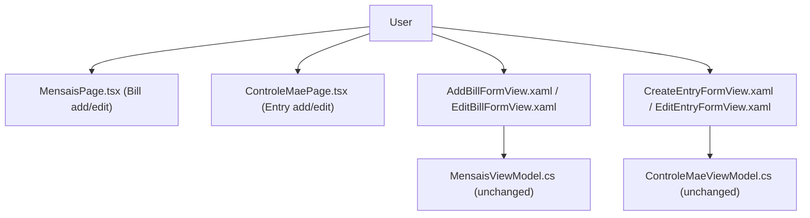

## 1. Technical Overview

**What:** Fix three specific, PRD-named violations across the CashFlow Bill (Mensais) and Mãe Entry
(ControleMae) forms: (1) WPF's `EditBillFormView.xaml`/`EditEntryFormView.xaml` don't keep a field they
share with their Add/Create counterpart pinned to the same grid row, so the value someone is editing
visually jumps position when switching between Add and Edit; (2) `CreateEntryFormView.xaml`'s primary
button is 10px wider than every other Save/Add button in this form family; (3) Area (Bill) and Currency
(Entry) sit after the financial fields instead of before them, on both platforms.

**Why:** This is the audit's already-designed, user-approved "Add/Edit variant layout continuity" follow-up
(`docs/ui/standard-compliance-audit-2026-08-29-forms.md`, "Documented follow-up" section) plus two smaller
confirmed violations from the same audit's Part A/B. F04/F05 proved the per-field-validation pattern on
CashFlow Monthly/Reserve forms; F06 is a narrower, validation-free feature — the Bill/Entry forms have no
per-field-validation AC at all — so this stays a layout/naming-only pass.

**Scope — Included:**
- WPF: restructure `EditBillFormView.xaml` and `EditEntryFormView.xaml` so each field shared with its
  Add/Create counterpart occupies the same absolute `Grid.Row`, per the audit's documented plan.
- WPF: `CreateEntryFormView.xaml`'s primary button `Width="100"` → `Width="90"`.
- Both platforms: move Area (Bill) and Currency (Entry) to sit immediately after the form's first field,
  ahead of every financial-value field — the one field explicitly named in the PRD Capabilities, not a
  full re-application of `docs/ui/forms-data-and-visualisations.md`'s general field-order convention to
  every field (see Decision D2).
- New standards documentation: add the audit's already-drafted "Add/Edit variant layout continuity" rule
  to `docs/ui/forms-data-and-visualisations.md` (the audit calls for this explicitly, and it's the
  documentation this feature's WPF work will point back to).
- Web: fix `MensaisPage.tsx`'s Add Bill confirm button, which still reads "Add"/"Adding..." — see
  Decision D1 (PRD text is stale here; the real gap is on Web, not WPF).

**Scope — Excluded (confirmed already compliant or explicitly out of PRD scope):**
- WPF `AddBillFormView.xaml`'s confirm button already reads "Add Bill"/"Adding Bill..." — the PRD's
  Capabilities text describing this as a WPF bug is stale (see Decision D1). No WPF button-text change.
- WPF `CreateEntryFormView.xaml`'s and Web `ControleMaePage.tsx`'s confirm buttons already read "Add
  Entry"/"Saving..." — compliant, no change.
- Migrating `MensaisPage.tsx`/`ControleMaePage.tsx` off hand-rolled HTML onto Fluent UI v9 components —
  a real, audit-documented gap (Part A items #8/#9: hardcoded colors, `flex-wrap` layout, icon mismatch,
  right-aligned trigger button), but not named in F06's PRD Capabilities or AC. Out of scope; a future
  feature's territory, not this one's.
- Per-field validation / required-field indicators for any of these four forms — F06's PRD AC has no
  validation item, unlike F04/F05. Not added here.
- Reordering any field other than Area/Currency (e.g. Note's position) — not named in the PRD Capabilities
  or the audit's specific violation callouts; reordering it would be undirected scope expansion.

## 2. Architecture Impact

Presentation-layer only (`Financial.Web` pages, `Financial.App` views). No Domain, Application,
Infrastructure, or API changes — every field, binding, and command already exists; this feature only
repositions existing markup and fixes two literal strings.

## 3. Technical Decisions

| Decision | Chosen Approach | Alternative Considered | Trade-off |
|---|---|---|---|
| D1. Add Bill confirm-button fix location | Fix Web's `MensaisPage.tsx` (`'Add'` → `'Add Bill'`, `'Adding...'` → `'Adding Bill...'`); leave WPF's `AddBillFormView.xaml` untouched | Follow the PRD literally and look for a WPF fix | Read both files: WPF's `AddBillFormView.xaml` already sets `Content="Add Bill"`/`"Adding Bill..."` (rows 61-72) — already compliant, most likely fixed incidentally by F03's naming sweep after this PRD's Capabilities text was written. Web's `MensaisPage.tsx:282` still reads bare `'Add'`/`'Adding...'` while its own trigger (`:210`) and form title (`:228`) both read "Add Bill" — the actual chain-break the PRD is describing, just on the other platform. Fixing the real gap instead of the stale-text-implied one |
| D2. Area/Currency reorder scope | Move only the one named field (Area or Currency) to immediately follow the form's first field, ahead of every financial-value field; leave every other field's relative order (Description, Note, Due Day) unchanged | Fully re-apply `docs/ui/forms-data-and-visualisations.md`'s general "Date → related entities → description → financial values → metadata" convention, reordering Description/Note too | PRD Capabilities names only "Area and Currency fields... ahead of the financial fields" — no other field is named. The audit's own violation description ("Currency placed after Description/Note") does imply Currency should sit ahead of Description too, so the field moves past both Description and Note to the front — but Description and Note's relative order to each other, and Value/Due Day's position as the trailing financial cluster, stay exactly as-is. Matches F04's precedent of moving only the PRD-named field, not re-deriving a whole new order from the general convention |
| D3. Target field order — Bill (Web + WPF) | Area → Description → Due Day → Value → Note | Area → Due Day → Description → Value → Note (financial-value-adjacent only) | Applying D2: Area moves to the very front (past Description, matching the audit's "after Description" framing), Due Day/Value/Note keep their existing relative order as the trailing cluster. Same target order on both platforms — this PRD item isn't platform-scoped, and leaving Web and WPF with different relative field orders after this feature would be a new divergence, contrary to the whole PRD's purpose |
| D4. Target field order — Entry (Web + WPF) | Date → Currency → Description → Note → Value | Date → Currency → Description → Value → Note | Same D2 logic: Currency moves to right after Date (the only field ahead of it that isn't itself being reordered), Description/Note/Value keep their existing relative order. Applied identically on both platforms for the same cross-platform-parity reason as D3 |
| D5. Row-continuity scope | WPF-only — `EditBillFormView.xaml`/`EditEntryFormView.xaml` vs. their Add/Create counterparts | Also apply to Web's conditional Add/Edit block in `MensaisPage.tsx`/`ControleMaePage.tsx` | PRD AC item 1 names only the two `.xaml` files. Web's form panel uses natural flex/CSS-Grid reflow (confirmed: no `grid-template-areas` pinning in `MensaisPage.css`), not WPF's fixed `Grid.Row` indices — switching Add↔Edit doesn't produce the same "value visually jumps to a different absolute screen row" effect Web users would perceive, since the panel isn't the same physically-fixed grid instance being shown/hidden. The audit's own "Add/Edit variant layout continuity" rule text is framed in terms of `Grid.Row`, confirming it's a WPF-specific concern |
| D6. Row-continuity plan recompute | Recompute `EditBillFormView.xaml`'s exact row assignments against the *new*, Area-first `AddBillFormView.xaml` row order (D3), rather than the audit's original row-by-row numbers (which assumed Area stayed at row 4) | Implement the audit's original row numbers, then separately reorder Add's fields, producing two conflicting row-position passes | The audit's row-continuity plan (`docs/ui/standard-compliance-audit-2026-08-29-forms.md` lines 404-421) was written assuming `AddBillFormView.xaml`'s current field order; D3 changes that order in this same feature. Value — the one field `EditBillFormView.xaml` shares with Add — still ends up needing 3 preceding reserved rows either way (Description/Area/Due Day, regardless of their relative order among themselves), so Value lands at row 4 either way; the audit's *count* of reserved rows is unaffected, only which field-name occupies which specific reserved row (informational only, since those rows are empty in Edit) |
| D7. New standard doc placement | Add the audit's already-drafted "Add/Edit variant layout continuity" subsection verbatim to `docs/ui/forms-data-and-visualisations.md`, under "## Forms", after the existing "### Layout" subsection — exactly where the audit's own "Decision" text says to place it | Skip the doc update since the audit already contains the text | The audit explicitly frames this as a "new rule, to be added to `docs/ui/forms-data-and-visualisations.md`" — it was deliberately written as ready-to-paste rule text, not just an analysis note. This feature is the first (and PRD-scoped) consumer of that rule, so this is the right moment to land it as a citable standard rather than leaving it buried in a dated audit file |

## 4. Component Overview

| File Path | New/Modified | Purpose | Key Responsibilities |
|---|---|---|---|
| `Financial.App/Views/CashFlow/EditBillFormView.xaml` | Modified | Edit Bill form layout | Restructure from 5 to 8 rows; pin Value to the same row as `AddBillFormView.xaml`'s new Area-first layout (D3, D6) |
| `Financial.App/Views/CashFlow/AddBillFormView.xaml` | Modified | Add Bill form layout | Move Area to the front of the field sequence (D3) |
| `Financial.App/Views/CashFlow/EditEntryFormView.xaml` | Modified | Edit Entry form layout | Restructure from 5 to 8 rows so its trailing Error/Buttons rows match `CreateEntryFormView.xaml`'s (row-continuity applies to the trailing rows only — Edit shares no field with Create) |
| `Financial.App/Views/CashFlow/CreateEntryFormView.xaml` | Modified | Create Entry form layout | Move Currency to right after Date (D4); fix primary button `Width="100"` → `"90"` |
| `Financial.Web/src/pages/MensaisPage.tsx` | Modified | Bill add/edit page | Reorder Add form's fields (D3); fix Add Bill confirm-button text (D1) |
| `Financial.Web/src/pages/ControleMaePage.tsx` | Modified | Entry add/edit page | Reorder Create-mode field block (D4) |
| `docs/ui/forms-data-and-visualisations.md` | Modified | UI standards doc | Add "Add/Edit variant layout continuity" subsection (D7) |

## 5. API Contracts

N/A — no API changes. Every field/binding/command already exists; this feature only repositions existing
markup and fixes two literal strings.

## 6. Data Model

N/A — no schema changes.

## 7. Testing Strategy

Per `testing-guide-Financial`: React pages get RTL coverage (`artifacts/react-pages.md`) for the field
order and button text; WPF has no automated XAML-layout tests (`testing-guide-Financial`'s WPF exclusion —
`Grid.Row` position isn't unit-testable without rendering the real visual tree), so the row-continuity and
field-order changes there are verified by build success plus manual verification per
`docs/ui/review-checklist.md`.

| Test File | Test Type | Target | Coverage Goal |
|---|---|---|---|
| `MensaisPage.test.tsx` | Component (RTL) | Add Bill field order (Area before Due Day/Value); confirm-button text reads "Add Bill"/"Adding Bill..." | Field-order assertion + button-text assertion, both currently absent or asserting the old order/text |
| `ControleMaePage.test.tsx` | Component (RTL) | Create Entry field order (Currency directly after Date, before Description) | Field-order assertion, currently absent or asserting the old order |

**Acceptance tests (PRD §9 F06, mapped to the above):**
- "`EditBillFormView.xaml` and `EditEntryFormView.xaml` place each field in the same row position as
  their corresponding Create form" → WPF-only (D5); verified by build success + manual verification per
  `docs/ui/review-checklist.md`, no automated test (matches `testing-guide-Financial`'s WPF exclusion).
- "`CreateEntryFormView.xaml`'s field width matches the corrected value" → build success (compile-time
  literal check); manual verification confirms the visual result.
- "The Add Bill WPF confirm button reads 'Add Bill'" → already true on WPF (D1); `MensaisPage.test.tsx`
  covers the real (Web) gap instead, since the AC's intent (the whole chain reads "Add Bill") is what
  matters, not which platform the PRD happened to name.
- "Area and Currency fields appear before the financial fields in Bill/Entry forms" →
  `MensaisPage.test.tsx`/`ControleMaePage.test.tsx` field-order assertions (Web); WPF verified manually
  (no automated WPF layout test, per the WPF exclusion above).
