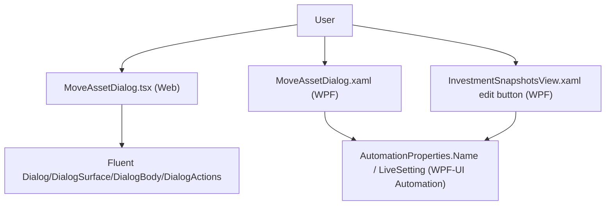

## 1. Technical Overview

**What:** Close the three PRD acceptance criteria still open for F07 (two of the five are already
satisfied — completed incidentally by F03's naming sweep, per the PRD's own annotations): (1) Web's
`MoveAssetDialog.tsx` gains a real focus trap, Escape-to-close, and focus-restore-on-close by migrating
to Fluent `Dialog`/`DialogSurface`/`DialogBody`/`DialogActions`; (2) WPF's `MoveAssetDialog.xaml` gains
`AutomationProperties.Name` on its destination combo/textbox and a live-region equivalent for its error
text; (3) WPF's Investment Snapshot edit button gains `AutomationProperties.Name` (currently
tooltip-only).

**Why:** `MoveAssetDialog` is the one Investment form/dialog the 2026-08-29 audit calls a genuine
accessibility gap ("High — real accessibility gap for a genuine modal") rather than a styling/tokens
debt item, and the Snapshot edit button is a confirmed, unresolved accessibility gap from the *prior*
(2026-08-23) audit that this PRD's F07 explicitly folds in.

**Scope — Included:**
- Web `MoveAssetDialog.tsx`: migrate the hand-rolled backdrop/dialog markup to Fluent `Dialog` primitives
  — focus trap, Escape-to-close, and focus-restore all come from the library, not custom code (Decision
  D1). Every existing conditional-content branch (main form, "Moving…" auto-submit, emptied-source
  follow-up) is preserved inside `DialogContent`/`DialogActions`.
- WPF `MoveAssetDialog.xaml`: add `AutomationProperties.Name` to the destination-portfolio `ComboBox` and
  new-portfolio-name `TextBox`; add a live-region equivalent (`AutomationProperties.LiveSetting="Polite"`)
  to the validation-error `TextBlock` (Decision D2).
- WPF `InvestmentSnapshotsView.xaml`: add `AutomationProperties.Name="Edit snapshot"` to the edit button,
  which today only has a `ToolTip` (Decision D3).

**Scope — Excluded (already compliant or explicitly out of PRD scope):**
- WPF's `MoveAssetDialog` is a real `Window` shown modally (`WindowStartupLocation="CenterOwner"`,
  `IsCancel="True"` on Cancel) — native WPF/OS behavior already provides focus trap, Escape-to-close (via
  `IsCancel`), and focus-restore-to-owner on close. No dialog-behavior code change needed on WPF (Decision
  D1's "out of the box" benefit is Web-specific; WPF already had it for free as a native `Window`).
- Investment Transaction/Credit/Price "New" trigger visible-name fix — PRD marks this AC `[x]`, completed
  in F03 (PR #648). Not touched here.
- WPF Transaction/Credit/Price sentence-case title/verb normalization — PRD marks this AC `[x]`, also
  completed in F03 (PR #648). Not touched here.
- Migrating `MoveAssetDialog.xaml`/`MoveAssetDialog.tsx`'s remaining styling debt (WPF: no WPF-UI theme
  merge; Web: hardcoded backdrop-adjacent colors like `--danger`/`--text-muted` that are never declared
  in `index.css`) — the audit explicitly notes WPF's missing theme as "Low, shared debt" here (unlike the
  High-severity theme gap on other legacy forms) and the phantom-CSS-variable issue as a cross-cutting,
  fix-once-at-`index.css` item, not this feature's. Not named in F07's PRD Capabilities/AC.
- The "should Move Asset be a dialog or a drawer" architectural question the audit explicitly re-opened
  and left to the user/product owner — out of scope for an audit-driven compliance feature; a Dialog
  migration answers "how do we fix the current dialog," not "should it be a dialog."

## 2. Architecture Impact

Presentation-layer only. No Domain, Application, Infrastructure, or API changes — every field, binding,
callback, and validation rule already exists; this feature only changes how the dialog/button markup is
built and labeled.

## 3. Technical Decisions

| Decision | Chosen Approach | Alternative Considered | Trade-off |
|---|---|---|---|
| D1. Web dialog behavior fix | Migrate to Fluent `Dialog` (controlled, always `open`, `onOpenChange` calling `onCancel` when closed) | Hand-roll a focus trap + `keydown` Escape listener + focus-restore ref, keeping the existing backdrop markup | The PRD's own Capabilities text names the exact reason: Fluent's `Dialog` provides all three "out of the box." `MoveAssetDialog` is already conditionally mounted/unmounted by its two callers (`DetailPanel.tsx`, `InvestmentTree.tsx` both do `{isMoving && <MoveAssetDialog .../>}`), so a controlled `Dialog` with `open` always `true` while mounted needs no caller-side changes — `onOpenChange` firing `onCancel` on any close (backdrop click, Escape, or an explicit Cancel/Delete/Keep action) covers every exit path the existing component already had |
| D2. WPF fix scope | Add only `AutomationProperties.Name`/`LiveSetting` — no `ui:Button`/WPF-UI theme merge, no layout restructuring | Also migrate to the 4-column label-above-control layout and WPF-UI theme, matching F04-F06's other WPF forms | The audit explicitly downgrades WPF `MoveAssetDialog.xaml`'s missing theme to "Low, shared debt" here — a materially different severity than the "High" WPF-UI-theme gap that justified layout modernization in F05's Withdrawal/Income Split work. Neither the PRD's Capabilities nor its AC names a WPF layout or theme change for this dialog, only the automation-name/live-region gap. Matches this session's established discipline of implementing what's named, not the audit's full wishlist |
| D3. Snapshot edit button fix | Add `AutomationProperties.Name="Edit snapshot"` to the existing `Button Content="✏"`, no other change | Also replace the raw `✏` glyph with a `ui:SymbolIcon`, matching the icon-library gap the audit separately flags | The PRD's AC names only `AutomationProperties.Name` ("not tooltip-only") — the icon-glyph swap is a different, Medium-severity finding from the *older* 2026-08-23 audit's row-action-icon-convention item, not named in F07's Capabilities or AC. Out of scope here |
| D4. Web dialog title/label wiring | Let Fluent's `DialogSurface`/`DialogTitle` auto-derive the dialog's accessible name (removing the old manual `aria-label="Move asset"`) | Keep an explicit `aria-label="Move asset"` on `DialogSurface` alongside `DialogTitle` | Fluent's own docs say to add `aria-label`/`aria-labelledby` only "if there is no `DialogTitle`" — this dialog has one ("Move Asset"), and `DialogSurface` auto-wires `aria-labelledby` to it, so an explicit `aria-label` would be redundant, not additive |

## 4. Component Overview

| File Path | New/Modified | Purpose | Key Responsibilities |
|---|---|---|---|
| `Financial.Web/src/components/MoveAssetDialog.tsx` | Modified | Move Asset dialog | Replace hand-rolled backdrop/div markup with Fluent `Dialog`/`DialogSurface`/`DialogBody`/`DialogTitle`/`DialogContent`/`DialogActions`, preserving all three conditional content branches and every existing callback (D1, D4) |
| `Financial.Web/src/components/MoveAssetDialog.css` | Modified | Move Asset dialog styling | Remove now-dead backdrop/wrapper/title/actions rules superseded by `DialogSurface`/`DialogTitle`/`DialogActions`/`Button`; keep the inner-content rules (`__context`, `__option`, `__input`, `__prompt`, `__error`) |
| `Financial.Web/src/components/__tests__/MoveAssetDialog.test.tsx` | Modified | Test coverage | Add a test confirming Escape closes the dialog (calls `onCancel`) and that it renders with `role="dialog"`; all 18 existing behavior tests are expected to pass unmodified since accessible names/roles are unchanged |
| `Financial.App/Views/Investment/MoveAssetDialog.xaml` | Modified | Move Asset dialog (WPF) | Add `AutomationProperties.Name` to the destination `ComboBox` and new-portfolio `TextBox`; add `AutomationProperties.LiveSetting="Polite"` to the validation-error `TextBlock` (D2) |
| `Financial.App/Views/CashFlow/InvestmentSnapshotsView.xaml` | Modified | Snapshot grid edit button | Add `AutomationProperties.Name="Edit snapshot"` to the tooltip-only edit `Button` (D3) |

## 5. API Contracts

N/A — no API changes.

## 6. Data Model

N/A — no schema changes.

## 7. Testing Strategy

Per `testing-guide-Financial`: React components get RTL coverage (`artifacts/react-components.md`); WPF
has no automated XAML-layout/automation-property tests (`testing-guide-Financial`'s WPF exclusion), so
the WPF changes are verified by build success plus manual verification per
`docs/ui/review-checklist.md`.

| Test File | Test Type | Target | Coverage Goal |
|---|---|---|---|
| `MoveAssetDialog.test.tsx` | Component (RTL) | `role="dialog"` present; Escape calls `onCancel` | New test proving the migrated dialog actually gained Escape-to-close, the one behavior change this feature makes that the existing 18 tests don't already cover |

**Acceptance tests (PRD §9 F07, mapped to the above):**
- "`MoveAssetDialog` traps focus, closes on Escape, and restores focus to the triggering element on
  close" → `MoveAssetDialog.test.tsx`'s new Escape test covers close-on-Escape directly; focus-trap and
  focus-restore-to-trigger are Fluent `Dialog`'s own library-level guarantees (not independently
  re-tested — this project doesn't re-test third-party library internals), confirmed by manual
  verification per `docs/ui/review-checklist.md`.
- "`MoveAssetDialog`'s combo/textbox inputs have `AutomationProperties.Name`; its error text is in a live
  region" → WPF-only; build success + manual verification (no automated WPF test, per the WPF exclusion
  above).
- "Investment Snapshot's edit button has `AutomationProperties.Name`" → WPF-only; build success + manual
  verification.
