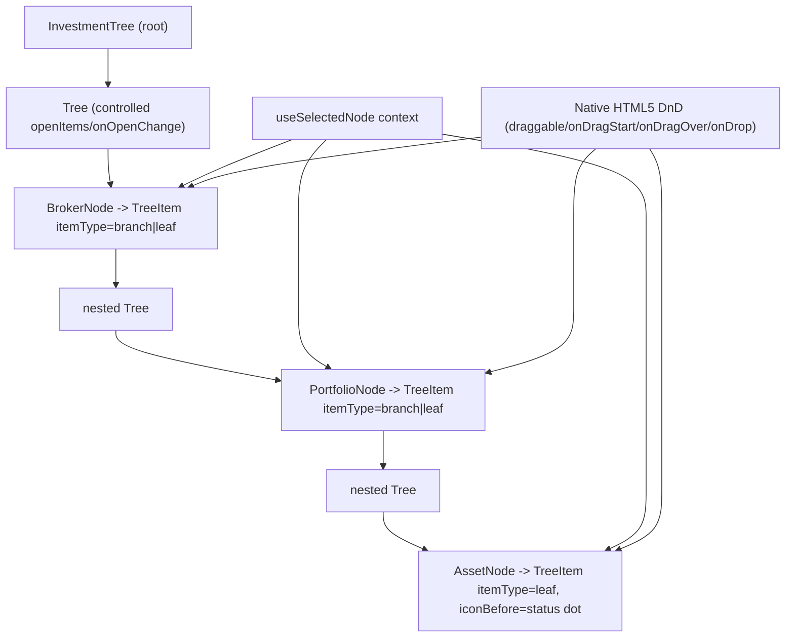

## 1. Technical Overview

**What:** Replaces `InvestmentTree.tsx`'s hand-built `<ul>/<li>` structure (custom chevron buttons,
manual `role`-less nodes) with Fluent UI v9 `Tree`/`TreeItem`/`TreeItemLayout`, gaining `role="tree"`,
`aria-expanded`, and keyboard roving tabindex from the library instead of hand-rolling them. Also
tokenizes the one hardcoded color F01 deliberately left for this feature to fix in its own slice
(`InvestmentTree.css`'s `.investment-tree__node--selected { background: #007acc !important; }`).

**Why:** This is the last remaining hand-built tree/list-role gap the 2026-08-23 audit flagged as a
High-severity accessibility issue — WPF's native `TreeView` already provides this for free; Web has
never had it. It is also independently scoped from F02–F07 (Consumes only F01), so it can land
without waiting on the CashFlow rollout wave.

**Scope:**
- Included: full `Tree`/`TreeItem`/`TreeItemLayout` migration of `InvestmentTree.tsx`'s three node
  levels (Broker/Portfolio/Asset); preserving click-to-select (`useSelectedNode` context), the
  asset-class filter, the Long/Flat/Short status-color indicator, and native HTML5 drag-and-drop
  asset-move behavior; tokenizing the one hardcoded color in `InvestmentTree.css`.
- Excluded: `MoveAssetDialog` itself (F07's scope); any change to the tree's data source or the
  `/navigation-tree` API shape (PRD §7: presentation-layer only); adopting `@dnd-kit` or any other
  third-party drag library (see §3 — Fluent Tree's own docs recommend it for *same-level reordering*,
  which is not this component's drag use case at all).

**Complexity:** Complex (a full structural rewrite of a 3-level custom tree with drag-and-drop,
filtering, and context-driven selection, onto a new library's interaction model — no API/DB surface,
but a large, interaction-sensitive Web-only component plus its 33-case existing test suite).

## 2. Architecture Impact

Presentation-layer only (Web). No Domain/Application/Infrastructure/API changes. No WPF changes —
`Financial.App`'s investment tree already uses native `TreeView`, which is already compliant (PRD
Capabilities: "WPF is already compliant... no WPF changes required for this feature").

**Affected components:**
- `Financial.Web/src/components/InvestmentTree.tsx` — full rewrite of `AssetNode`, `PortfolioNode`,
  `BrokerNode`, and the root `InvestmentTree` component
- `Financial.Web/src/components/InvestmentTree.css` — remove the hardcoded `#007acc`; drop the rules
  that only existed for the old hand-built chevron/row/list markup that no longer exists
- `Financial.Web/src/components/__tests__/InvestmentTree.test.tsx` — every interaction-querying test
  updated for the new DOM shape (`role="treeitem"` instead of `role="button"`, no more dedicated
  `aria-label="Expand"/"Collapse"` buttons)

## 3. Technical Decisions

| Decision | Chosen Approach | Alternative Considered | Trade-off |
|---|---|---|---|
| Structure | Nested nested `Tree`/`TreeItem`/`TreeItemLayout` (`itemType="branch"` when a node has visible children after filtering, `"leaf"` otherwise), matching the reference doc's own nested example (`docs/ui/fluent-ui-react-v9-pages/tree.md`, "Default"/"Default Open") | `FlatTree` + `useHeadlessFlatTree_unstable` | The audit's own recommendation (Part E) and the doc's guidance ("on simple scenarios it is advised to simply use a nested structure") both point to nested `Tree`; the data is already naturally nested (`TreeNodeDto.children`), so flattening it would be pure overhead. |
| Expand/collapse state | One controlled `openItems: Set<string>` + `onOpenChange` on the **root** `Tree` only — nested `Tree`s automatically participate via Fluent's internal context (`openItems`/`onOpenChange` are explicitly "ignored for subtrees" per the props table) | Per-node local `useState`, matching the old code | Only the root can be controlled at all in Fluent's model; centralizing also means expand state survives a post-drop `reload()` without a remount-reset gap the old per-node local state could theoretically hit. |
| Default-open items | Seed `openItems` with every broker's `value` the moment tree data loads, matching the old `useState(true)` default on `BrokerNode`; portfolios start absent from the set, matching the old `useState(false)` default | `defaultOpenItems` (uncontrolled) | The broker list isn't known until the async fetch resolves, so an uncontrolled default (evaluated at first render, before data exists) can't express it — must be seeded imperatively once data arrives. |
| Click behavior on branch nodes (Broker/Portfolio) | **Merged**: clicking a branch's `TreeItemLayout` both toggles its expand state (Fluent's own default — "every expandable TreeItem responds to clicks on... content") and calls `setSelectedNode` (a plain `onClick` alongside it) | Keep expand and select fully decoupled, as the old dedicated-chevron-button design did | The reference doc's `Tree.onOpenChange` `data.type` branching (`"Click"` vs `"Keyboard"` vs icon) can suppress content-click-driven expand, but doing so *and* keeping icon-only clicks from also firing the content `onClick` (they're DOM descendants of the same element) fights the library rather than working with it. Click-to-expand-and-select together is a common, well-understood tree pattern (e.g. most file-tree explorers); documented here as a deliberate interaction simplification, not an oversight — the PRD's Experience section only requires expand/collapse and hierarchy to be correctly *announced*, not that select and expand stay decoupled. |
| Status-color indicator (Long/Flat/Short dot) | `TreeItemLayout`'s `iconBefore` slot, given a `` containing the same visible `●` character and status-color class the old code used (not `aria-hidden`) | An `aria-hidden` icon + a separate visually-hidden status label | Keeps the accessible name computation and existing visual behavior byte-for-byte identical to today (the dot's color already isn't the only status signal — the asset's own display name and position type are also visible elsewhere in the app), and avoids widening this migration's scope into an unrelated accessible-labeling redesign. |
| Drag-and-drop | Keep the existing native HTML5 `draggable`/`onDragStart`/`onDragEnd`/`onDragOver`/`onDragLeave`/`onDrop` handlers, moved onto the new `TreeItem`/`TreeItemLayout` elements (Fluent slots forward unrecognized native props to their root DOM element) | Adopt `@dnd-kit`, per the reference doc's own "Drag And Drop" example | That example integrates `@dnd-kit` for *same-level sortable reordering* within a flat tree — a different problem from this component's *cross-branch move* (drag an asset onto a different broker/portfolio to relocate it), which native HTML5 DnD already handles correctly today. Fluent's own doc opens by stating "the tree component does not offer built-in drag-and-drop functionality... designed with adaptability in mind" — native DnD external to Tree's own state is exactly that adaptability, and it needs no new dependency. |
| Selection visual | Keep `selectionMode` unset (`undefined`) — per PRD's explicit "do not use `selectionMode='single'`" — and continue setting a manual `aria-selected` attribute plus a (now-tokenized) CSS class on the selected `TreeItem`, exactly as the old code's `investment-tree__node--selected` class did manually | `selectionMode="multiselect"` with `checkedItems` | Neither built-in mode matches this app's single-selection-drives-a-detail-panel model (`useSelectedNode`); `multiselect` would render checkboxes that don't belong here, and `single` is explicitly forbidden by the PRD. |
| `InvestmentTree.css` hardcoded color | Replace `background: #007acc !important;` with `background: var(--accent) !important;` (the `!important` itself is pre-existing and unrelated to this fix — left as-is) | Also remove the `!important` | Out of scope: F01 intentionally left this file's color untouched for this feature to fix in its own slice; removing an unrelated `!important` here is a separate, unrequested cleanup this feature doesn't need to make. |

## 4. Component Overview

| File Path | New/Modified | Purpose | Key Responsibilities |
|---|---|---|---|
| `Financial.Web/src/components/InvestmentTree.tsx` | Modified | Fluent Tree migration | `AssetNode` → `TreeItem itemType="leaf"` with `iconBefore` status dot; `PortfolioNode`/`BrokerNode` → `TreeItem itemType="branch"\|"leaf"` wrapping a nested `Tree` of visible children, each keeping its existing `onDragOver`/`onDragLeave`/`onDrop` handlers; root component adds controlled `openItems`/`onOpenChange` state seeded with broker keys on load, and renders the root `<Tree aria-label="Investments">` in place of the old top-level `<ul>` |
| `Financial.Web/src/components/InvestmentTree.css` | Modified | Token compliance + dead-rule cleanup | `.investment-tree__node--selected`'s hardcoded `#007acc` → `var(--accent)`; remove rules scoped to markup that no longer exists (`.investment-tree__chevron`, `.investment-tree__list*`, `.investment-tree__row` if Fluent's own row structure replaces its purpose) — confirmed file-by-file during implementation as the new markup takes shape, not pre-enumerated here since the exact surviving class list depends on how much of `TreeItemLayout`'s own styling covers what these rules did |
| `Financial.Web/src/components/__tests__/InvestmentTree.test.tsx` | Modified | Test suite alignment | Every test querying the old `role="button"`/`aria-label="Expand"`/`"Collapse"` DOM shape updated to the new `role="treeitem"` shape and the merged expand+select click behavior; drag-and-drop tests (11 of the 33) keep their same assertions since the DnD event contract on the row/item element is unchanged — only the element they're queried from changes |

No Database section — presentation-layer only.

## 5. API Contracts

Not applicable — no API surface touched; `apiClient.getNavigationTree` and its response shape are
unchanged.

## 6. Data Model

Not applicable — no persistence-layer surface.

## 7. Testing Strategy

Per `testing-guide-Financial`: React component tests via RTL, asserting on `screen` queries and
user-visible behavior — the existing 33-case `InvestmentTree.test.tsx` already does exactly this and
is the right place to keep this feature's coverage; no new test *file* is needed, but the bulk of the
existing cases need their queries rewritten for the new DOM shape.

| Test group (existing file) | What changes |
|---|---|
| Loading/error/retry (3 tests) | Unaffected — no tree markup involved |
| Broker/portfolio render + expand-by-default (4 tests) | Query via `getByRole('treeitem', { name: ... })` instead of plain text/button queries where the old test relied on button semantics |
| Status-icon color (1 test) | Adjust the query used to reach the icon `` for the new `iconBefore` slot structure; keep asserting the same status-color class |
| Chevron-driven collapse/expand (2 tests: "clicking broker chevron collapses/expands") | Replaced — no dedicated chevron button exists anymore; becomes "clicking the broker item toggles its expanded state," asserting via `aria-expanded` on the `treeitem` and/or child visibility |
| Click-to-select for Broker/Portfolio/Asset (6 tests) | Query updated to `treeitem` role; Broker/Portfolio selection tests also gain an assertion (or a documented note) that the same click also toggled expand, per the merged-interaction decision in §3 |
| Drag-and-drop (11 tests) | Assertions unchanged (`accepts`/`rowOf` helpers, `fireEvent.dragStart/dragOver/dragLeave/drop`) — only the CSS selector `rowOf` uses to find "the row" may need to change if the drop-target class moves from a custom `.investment-tree__row` div onto `TreeItemLayout`/`TreeItem` itself |
| Asset-class filter (6 tests) | Unaffected in intent; queries for the filtered assets updated to `treeitem` role like the render tests |

**Acceptance criteria → test mapping (PRD §9, F08):**
- "`InvestmentTree.tsx` is implemented with Fluent `Tree`, exposing `role="tree"` and
  `aria-expanded` via the browser accessibility tree" → covered by the updated render tests
  (`getByRole('tree')`, `getByRole('treeitem')` with `aria-expanded` assertions) plus manual
  inspection per `docs/ui/review-checklist.md`.
- "Keyboard navigation (arrow keys, roving tabindex) works across the tree" → provided by Fluent
  `Tree` itself (library-internal behavior, not re-tested here); verified manually — this is
  precisely the capability the migration exists to gain "for free."
- "Drag-and-drop reordering behaves identically to pre-migration behavior, manually verified" →
  covered by the 11 existing DnD tests continuing to pass unmodified in assertion shape, **plus** a
  manual run-through per the PRD's own Error Handling note ("this is the single highest-risk
  regression in this feature and must be explicitly tested, not assumed to carry over").
- "`selectionMode="single"` is not used" → verified by code review (grep sweep) — not the kind of
  negative-assertion an RTL test meaningfully covers.
