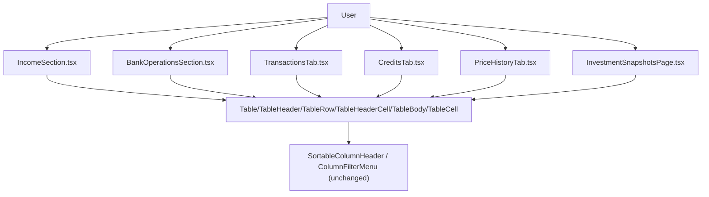

## 1. Technical Overview

**What:** Apply F04's proven Fluent `Table` primitive migration (`Table`/`TableHeader`/`TableRow`/
`TableHeaderCell`/`TableBody`/`TableCell`, keeping `SortableColumnHeader`/`ColumnFilterMenu`/
`useSortableRows`/`useColumnFilters` unchanged) to every remaining hand-rolled `<table>` grid on Web:
`IncomeSection.tsx`, `BankOperationsSection.tsx`, `TransactionsTab.tsx`, `CreditsTab.tsx`,
`PriceHistoryTab.tsx`, and `InvestmentSnapshotsPage.tsx` (two tables: the value grid and its totals row
table). Also normalizes every remaining raw `✏` emoji edit-action button to the Fluent
`EditRegular`/`DeleteRegular` icon-button pattern `ExpensesSection.tsx` already established.

**Why:** F04 proved the Table migration on one grid (Expense) as this PRD's proof-of-concept; F09 is the
PRD's explicit scale-out step, closing the remaining native-`<table>` population the audit's headline
finding calls out ("Legacy (heavy violations)... still hand-rolled HTML/CSS").

**Scope — Included:**
- Table-primitive migration for all six grids listed above (D1 covers the PR split).
- `EditRegular` icon-button normalization for every affected grid's edit action — not just
  `IncomeSection.tsx` (the one file the PRD Capabilities names as its example), but every grid this
  feature touches that shares the identical violation, per the audit's own "Row-level Edit/Delete action
  icon convention" finding, which explicitly lists `IncomeSection`/`BankOperationsSection` (raw
  emoji/SVG) and `TransactionsTab`/`CreditsTab`/`PriceHistoryTab`/`InvestmentSnapshotsPage` (raw `✏`) as
  the same class of gap (Decision D2).
- Existing sort/filter/data behavior preserved unchanged on every converted grid (PRD Experience/AC).

**Scope — Excluded:**
- `TransactionsTab.tsx`/`CreditsTab.tsx`/`PriceHistoryTab.tsx`'s own embedded inline create/edit forms
  (raw `<button>`s, hardcoded colors, `flex-wrap` layout) — the audit flags these too, but F09's PRD
  Capabilities names only the *grid* portion ("DataGrid/Table pattern"), not a form migration. Out of
  scope, matching this session's established discipline of implementing what's named.
- `CardsGrid.tsx`/`TotalsGrid.tsx` (Monthly Bank tab's read-only summary grids, no row actions) — not
  named in F09's Capabilities/AC ("Income and Transfer lists, Investment grids, and the Investment
  Snapshot grid"); a different category (summary, not an entity list with edit/delete actions).
- Fluent `DataGrid` (the higher-level, feature-managed component) — F04 already established `Table`
  primitives as this project's chosen pattern specifically to keep the existing
  `useSortableRows`/`useColumnFilters` hooks unchanged; F09 continues that precedent, not `DataGrid`.

## 2. Architecture Impact

Presentation-layer only (`Financial.Web` components/pages). No Domain, Application, Infrastructure, or
API changes — every data source, sort accessor, and filter accessor already exists; this feature only
changes the DOM primitives the grid renders through.

## 3. Technical Decisions

| Decision | Chosen Approach | Alternative Considered | Trade-off |
|---|---|---|---|
| D1. PR split | Split F09 into 3 sequential PRs — (a) `IncomeSection.tsx` + `BankOperationsSection.tsx`, (b) `TransactionsTab.tsx` + `CreditsTab.tsx`, (c) `PriceHistoryTab.tsx` + `InvestmentSnapshotsPage.tsx` — each branched from `main` after the previous merges | One PR for all six grids | Six files across two domains, each requiring its own careful sort/filter-hook-preservation review, is a large heterogeneous diff even though it stays within the raw 8-file guideline. `TransactionsTab.tsx`/`CreditsTab.tsx` alone are 435/455 lines (each also embeds its own untouched inline form, so the reviewable "what actually changed" surface per file is still meaningful). Grouping by size/domain — two small CashFlow grids first, then the two largest Investment grids, then the two remaining smaller ones — mirrors F05's precedent of splitting a large PRD feature into reviewable stages |
| D2. Icon-normalization scope | Fix every grid this feature touches, not just `IncomeSection.tsx` | Fix only the one file the PRD Capabilities names as its example | The audit's "Row-level Edit/Delete action icon convention" finding explicitly lists all six target files under the identical violation (raw emoji/glyph instead of `EditRegular`). PRD Capabilities phrases `IncomeSection.tsx` as an example ("closing the parity gap noted in the audit"), not an exclusive scope boundary — leaving five of six grids with the "fixed" pattern in one file and the old pattern everywhere else would be a worse, newly-inconsistent outcome than not touching any of them |
| D3. Migration pattern | Reuse F04's exact `ExpensesSection.tsx` pattern verbatim: swap `table`/`thead`/`tr`/`th`/`tbody`/`td` for `Table`/`TableHeader`/`TableRow`/`TableHeaderCell`/`TableBody`/`TableCell`; swap each `✏` button for `<Button appearance="subtle" size="small" icon={<EditRegular />} aria-label="..." onClick={...} />` | Design a new pattern per grid | F04 already established and proved this exact pattern; repeating it verbatim across five more grids is the "one mechanical repeated change" the PR-size guideline explicitly exempts from stricter file-count limits — the risk here is diff *volume* (D1), not pattern *novelty* |

## 4. Component Overview

**Stage (a): Income + Transfer lists**

| File Path | New/Modified | Purpose | Key Responsibilities |
|---|---|---|---|
| `Financial.Web/src/components/IncomeSection.tsx` | Modified | Income grid | Table-primitive migration (D3); `EditRegular` icon swap (D2) |
| `Financial.Web/src/components/BankOperationsSection.tsx` | Modified | Transfer/Balance-Correction grid | Table-primitive migration (D3); `EditRegular` icon swap (D2) |
| `Financial.Web/src/components/__tests__/IncomeSection.test.tsx` | Modified (if exists) | Test coverage | Confirm sort/filter/action behavior unchanged after migration |
| `Financial.Web/src/pages/__tests__/MonthlyPage.test.tsx` | Modified (if needed) | Test coverage | Update any DOM-shape-dependent assertions for the two migrated grids |

**Stage (b): Investment Transactions + Credits grids**

| File Path | New/Modified | Purpose | Key Responsibilities |
|---|---|---|---|
| `Financial.Web/src/components/TransactionsTab.tsx` | Modified | Investment transactions grid | Table-primitive migration (D3) for the grid portion only; embedded form untouched; `EditRegular` icon swap (D2) |
| `Financial.Web/src/components/CreditsTab.tsx` | Modified | Investment credits grid | Same treatment as `TransactionsTab.tsx` |
| Corresponding test files | Modified (if exist) | Test coverage | Confirm sort/filter/action behavior unchanged |

**Stage (c): Price History grid + Investment Snapshot grid**

| File Path | New/Modified | Purpose | Key Responsibilities |
|---|---|---|---|
| `Financial.Web/src/components/PriceHistoryTab.tsx` | Modified | Investment price-history grid | Table-primitive migration (D3) for the grid portion only; embedded form untouched; `EditRegular` icon swap (D2) |
| `Financial.Web/src/pages/InvestmentSnapshotsPage.tsx` | Modified | Investment Snapshot grid | Table-primitive migration (D3) for both tables (value grid + totals row table); `EditRegular` icon swap (D2) |
| Corresponding test files | Modified (if exist) | Test coverage | Confirm sort/filter/action behavior unchanged |

## 5. API Contracts

N/A — no API changes.

## 6. Data Model

N/A — no schema changes.

## 7. Testing Strategy

Per `testing-guide-Financial`: React components get RTL coverage (`artifacts/react-components.md`,
`artifacts/react-pages.md`). Existing sort/filter/action tests for each grid are expected to keep passing
largely unmodified, since `Table` primitives render the same semantic HTML roles (`table`/`row`/
`columnheader`/`cell`) `SortableColumnHeader`/`ColumnFilterMenu` already target.

| Test File | Test Type | Target | Coverage Goal |
|---|---|---|---|
| Existing grid test suites (per file above) | Component (RTL) | Sort, filter, row-action click-through, edit/delete callbacks | Confirm every pre-existing assertion still passes after the primitive swap; fix only what the migration's DOM-shape change actually breaks (matches F04's precedent — no wholesale test rewrite) |

**Acceptance tests (PRD §9 F09, mapped to the above):**
- "Income, Transfer, Investment, and Investment Snapshot grids are implemented with Fluent
  `DataGrid`/`Table`" → each stage's own test suite passing post-migration, confirmed per stage.
- "`IncomeSection.tsx`'s edit affordance uses the Fluent `EditRegular`/`DeleteRegular` icon-button
  pattern, matching `ExpensesSection.tsx`" → `IncomeSection.test.tsx` (Stage a); the AC's intent (icon
  parity) is verified across all six grids per Decision D2, not just the one PRD-named file.
- "Existing sort/filter behavior is preserved on every converted grid" → each stage's existing
  sort/filter tests, unmodified assertions still green.
