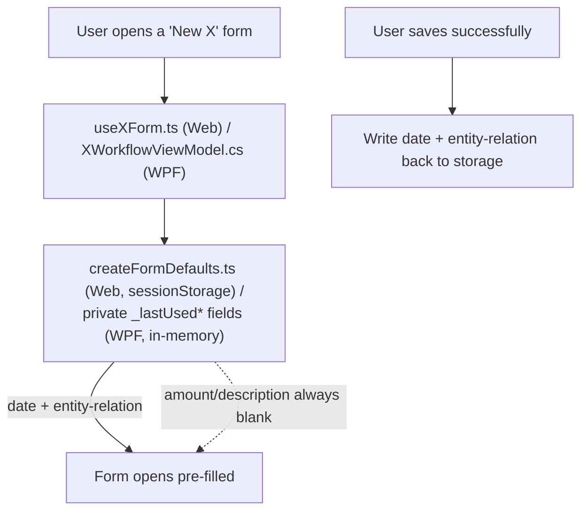

## 1. Technical Overview

**What:** For every record-creation form finalized by F04-F07 (11 forms — see Decision D5 for the count
discrepancy with the PRD's "12"), persist the date and entity-relation field(s) for the rest of the
browser tab's/app's session once set, while amount/value and free-text description/note fields always
reset to blank on every new "New X" open. On Web, a new `sessionStorage`-backed module modeled on
`domainStorage.ts`. On WPF, private fields on the already-singleton-lifetime workflow ViewModels — no
new persistence mechanism.

**Why:** This is the audit's already-designed, user-requested "persistent create-form defaults" follow-up
(`docs/ui/standard-compliance-audit-2026-08-29-forms.md`, "Documented follow-up" section) — a quality-of-
life enhancement the audit explicitly queued as "a concrete, per-form starting point" for exactly this
kind of implementation pass.

**Scope — Included:**
- New Web module `Financial.Web/src/utils/createFormDefaults.ts`, following `domainStorage.ts`'s exact
  try/catch-guarded `sessionStorage` getter/setter shape, generalized to arbitrary string keys (Decision
  D1).
- Per-form wiring on both platforms per the field mapping in Decision D2 — 11 forms across 4 sequential
  PRs (Decision D3).
- Balance Correction's bank field **is** persisted, reversing `useBalanceAdjustmentForm.ts`'s existing
  "Create opens with no bank pre-selected" comment/behavior — confirmed with the user (Decision D4; the
  audit had explicitly flagged this as unresolved and worth confirming before implementation).
- AC item 3 (identifying the 4 Web forms whose date field changes from always-blank to
  defaults-to-today-then-persists): Expense, Income, Withdrawal, Income Split — see Decision D6. This
  spec documents the identification; PR review is the "confirmed intentional" checkpoint.

**Scope — Excluded:**
- Edit Reserve Movement, Edit Investment Snapshot value, Move Asset dialog — all edit-only or one-off
  contextual actions, not repeated create workflows. The audit explicitly marks these N/A and the PRD's
  Capabilities describes only "create forms."
- Persisting amount/value/description/note fields — the PRD's Capabilities is explicit these "always
  start blank on every new entry, regardless of session state."
- A settings/preferences UI, a "clear remembered values" action, or any persistence surviving a full
  browser/app restart (`sessionStorage`, not `localStorage`, matching the audit's explicit "until tab
  closes" scope call).

## 2. Architecture Impact

Presentation-layer only. No Domain, Application, Infrastructure, or API changes — every field and save
flow already exists; this feature only changes what a create form's initial state reads from.

## 3. Technical Decisions

| Decision | Chosen Approach | Alternative Considered | Trade-off |
|---|---|---|---|
| D1. Web storage module shape | One generic `createFormDefaults.ts` with `getStoredDefault(key)`/`setStoredDefault(key, value)` (arbitrary string keys, e.g. `'expense.date'`, `'expense.paymentSource'`), rather than one dedicated module per form | A dedicated typed module per form, matching `domainStorage.ts`'s single-purpose shape exactly | 11 forms × 1-3 persisted fields each is 20+ keys; a dedicated module per form would mean 11 near-identical files. One generic key-value module (still `sessionStorage`, still try/catch-guarded, same failure-mode behavior as `domainStorage.ts`) avoids that repetition while keeping the exact same persistence contract |
| D2. Per-form field mapping | Reuse the audit's already-researched table verbatim (reproduced below) | Re-derive field mappings from scratch | The audit's "Documented follow-up" section already did this research per-form, citing exact file/line locations; re-deriving would duplicate already-verified work |
| D3. PR split | Four sequential PRs, each branched from `main` after the previous merges: (a) storage module + Expense + Income + Transfer, (b) Balance Correction + Withdrawal + Income Split, (c) Add Bill + Create Entry + Investment Transaction, (d) Investment Credit + Price History | One PR for all 11 forms | 11 forms × 2 platforms is by far the largest single feature in this PRD. Each form's own change is small (a few lines per file), but the sheer count of touched files across a heterogeneous set of forms argues for staged review, matching F05's and F09's precedent of splitting a large PRD feature by natural grouping. Grouping (a) establishes the pattern on the 3 simplest, most-referenced CashFlow forms first |
| D4. Balance Correction bank persistence | Persist it, matching every other form — confirmed with the user via AskUserQuestion mid-spec (see PR history) | Keep Balance Correction as a documented exception, preserving `useBalanceAdjustmentForm.ts`'s existing "no bank pre-selected" comment | The audit flagged this as a genuine open question rather than deciding it, since persisting reverses an existing deliberate design choice. Asked the user directly rather than guessing; they chose consistency across all 11 forms over preserving the one-off exception |
| D5. Form count: 11, not 12 | Implement the 11 forms with real (non-N/A) mappings in the audit's table: Expense, Income, Transfer, Balance Correction, Withdrawal, Income Split, Add Bill, Create Entry, Investment Transaction, Investment Credit, Price History | Search for a 12th form not yet identified | The PRD's Capabilities says "12 forms per the audit's mapping," but the audit's own table lists exactly 11 rows with real mappings (2 more rows are explicitly marked N/A — Edit Snapshot, Move Asset — and are excluded per Decision scope). Flagging this discrepancy rather than guessing at an unnamed 12th form or forcing one of the N/A rows in, consistent with this session's established practice of correcting stale/imprecise PRD numbers against the source material it cites |
| D6. The "4 Web forms" for AC item 3 | Expense, Income, Withdrawal, Income Split | Re-derive from scratch | The audit explicitly names these four as "currently open with a blank date" on Web (WPF already defaults to `DateTime.Today` for all of them) — Transfer and Balance Correction already default to today on both platforms today, so they see no *new* date-default behavior, only newly-added persistence after the first save |
| D7. WPF persistence field naming | One private field per persisted value per ViewModel (e.g. `_lastUsedDate`, `_lastUsedBankId`), read inside the existing `ShowCreate...Form()`/`ShowXxxForm()` method instead of unconditionally assigning `DateTime.Today`/`null` | A shared "last-used defaults" service/class injected into every workflow ViewModel | The audit's own mechanism section already specifies this exact approach and confirms the precondition (workflow ViewModels are constructed once and live for the app's lifetime, confirmed via `MainWindow.xaml.cs`) — no new service needed, matches this session's established preference for the smallest mechanism that satisfies the requirement (see F02/F04's precedent of per-ViewModel derived properties over a shared base class) |

### Per-form field mapping (from the audit, Decision D2)

| Form | First-open date default | Entity-relation field(s) persisted | Always-blank fields |
|---|---|---|---|
| Expense | Today (new; was blank on Web) | Payment source (bank), credit card, category |  Amount, description |
| Income | Today (new; was blank on Web) | Bank, income source | Gross/Net value, description |
| Transfer | Today (unchanged — already defaulted) | Source bank, destination bank | Amount, note |
| Balance Correction | Today (unchanged — already defaulted) | Bank (D4: now persisted, reversing prior no-preselect behavior) | Target balance, note |
| Withdrawal | Today (new; was blank on Web) | Bucket | Amount, description |
| Income Split | Today (new; was blank on Web) | — (no entity-relation field exists) | Amount, description |
| Add Bill | N/A (no date field — `Due Day` is an integer, not a date) | Area | Description, Value, Note |
| Create Entry | Today (unchanged) | Currency | Description, Note, Value |
| Investment Transaction | Today (unchanged) | Type (Buy/Sell) | Quantity, Unit Price, Fees |
| Investment Credit | Today (unchanged) | Type (Dividend/Rent/JCP) | Value |
| Price History | Today (unchanged) | — (no entity-relation field exists) | Price |

## 4. Component Overview

**Stage (a): Storage module + Expense + Income + Transfer**

| File Path | New/Modified | Purpose | Key Responsibilities |
|---|---|---|---|
| `Financial.Web/src/utils/createFormDefaults.ts` | New | Generic session-scoped key-value store | `getStoredDefault`/`setStoredDefault`, try/catch-guarded, matching `domainStorage.ts`'s failure-mode behavior (D1) |
| `Financial.Web/src/hooks/useExpenseForm.ts` | Modified | Expense create defaults | Read date/paymentSource/creditCardId/categoryId from storage on `showCreateForm`; write back on successful save |
| `Financial.App/ViewModels/CashFlow/ExpenseWorkflowViewModel.cs` | Modified | Expense create defaults (WPF) | `_lastUsedDate`/`_lastUsedPaymentSource`/etc. private fields, read in `ShowCreateExpenseForm`, written on save success |
| `Financial.Web/src/hooks/useIncomeForm.ts` | Modified | Income create defaults | Same treatment for date/bank/incomeSource |
| `Financial.App/ViewModels/CashFlow/IncomeWorkflowViewModel.cs` | Modified | Income create defaults (WPF) | Same treatment |
| `Financial.Web/src/hooks/useTransferForm.ts` | Modified | Transfer create defaults | Same treatment for sourceBank/destinationBank (date already defaults to today) |
| `Financial.App/ViewModels/CashFlow/TransferWorkflowViewModel.cs` | Modified | Transfer create defaults (WPF) | Same treatment |

**Stage (b): Balance Correction + Withdrawal + Income Split**

| File Path | New/Modified | Purpose |
|---|---|---|
| `Financial.Web/src/hooks/useBalanceAdjustmentForm.ts` | Modified | Persist bank (D4) |
| `Financial.App/ViewModels/CashFlow/AdjustmentWorkflowViewModel.cs` | Modified | Persist bank (D4) |
| `Financial.Web/src/hooks/useReserva.ts` | Modified | Persist Withdrawal's date/bucket and Income Split's date |
| `Financial.App/ViewModels/CashFlow/WithdrawalViewModel.cs` | Modified | Persist date/bucket |
| `Financial.App/ViewModels/CashFlow/IncomeSplitViewModel.cs` | Modified | Persist date |

**Stage (c): Add Bill + Create Entry + Investment Transaction**

| File Path | New/Modified | Purpose |
|---|---|---|
| `Financial.Web/src/pages/MensaisPage.tsx` (or its state hook, whichever owns `showAddForm`) | Modified | Persist Area |
| `Financial.App/ViewModels/CashFlow/MensaisViewModel.cs` | Modified | Persist Area |
| `Financial.Web/src/pages/ControleMaePage.tsx` (or its state hook) | Modified | Persist date/Currency |
| `Financial.App/ViewModels/CashFlow/ControleMaeViewModel.cs` | Modified | Persist date/Currency |
| `Financial.Web/src/hooks/useTransactions.ts` | Modified | Persist date/Type |
| WPF Transaction dialog/ViewModel (exact file confirmed during implementation) | Modified | Persist date/Type |

**Stage (d): Investment Credit + Price History**

| File Path | New/Modified | Purpose |
|---|---|---|
| `Financial.Web/src/hooks/useCredits.ts` | Modified | Persist date/Type |
| WPF Credit dialog/ViewModel | Modified | Persist date/Type |
| `Financial.Web/src/hooks/usePriceHistory.ts` | Modified | Persist date |
| WPF Price dialog/ViewModel | Modified | Persist date |

Exact WPF Investment dialog file names are confirmed at the start of Stage (c)/(d)'s implementation
(this spec was written primarily from the CashFlow-side files already read this session; Investment
dialog ViewModel names are inferred from the audit's citations — `TransactionDialogViewModel.cs`,
`CreditDialogViewModel.cs`, `PriceDialogViewModel.cs` — and verified before editing).

## 5. API Contracts

N/A — no API changes.

## 6. Data Model

N/A — no schema changes. `sessionStorage` keys are implementation detail, not a persisted data model.

## 7. Testing Strategy

Per `testing-guide-Financial`: `createFormDefaults.ts` gets a pure-function unit test
(`artifacts/api-client.md`'s utility-module pattern, same shape as `domainStorage.ts` if it has one).
Each form's hook/ViewModel gets `[Fact]`/`renderHook` coverage confirming: first-ever open still defaults
to today (or blank, for Add Bill); after one save, a second create-form open reads the persisted value;
amount/description remain blank across both opens.

| Test File | Test Type | Target | Coverage Goal |
|---|---|---|---|
| `createFormDefaults.test.ts` | Unit | get/set round-trip, storage-unavailable fallback | Matches `domainStorage.ts`'s own test shape if present |
| Per-form hook/ViewModel test files | Hook (`renderHook`) / `[Fact]` | Persist-after-save, always-blank amount/description, first-open default | One test per persisted field per form, plus one confirming amount/description stay blank |

**Acceptance tests (PRD §9 F10, mapped to the above):**
- "Date and entity-relation fields on the 12 [11, per D5] mapped forms retain their last-used value for
  the rest of the session after being set once" → per-form persist-after-save tests, one per stage.
- "Amount and description fields always start blank on a new create-form open, regardless of session
  state" → per-form always-blank tests.
- "The 4 Web forms affected by the blank-date-to-today's-date behavior change are identified and the
  change is confirmed intentional" → Decision D6 identifies them in this spec; the PR bodies flag this
  explicitly for the user's review-time confirmation.
