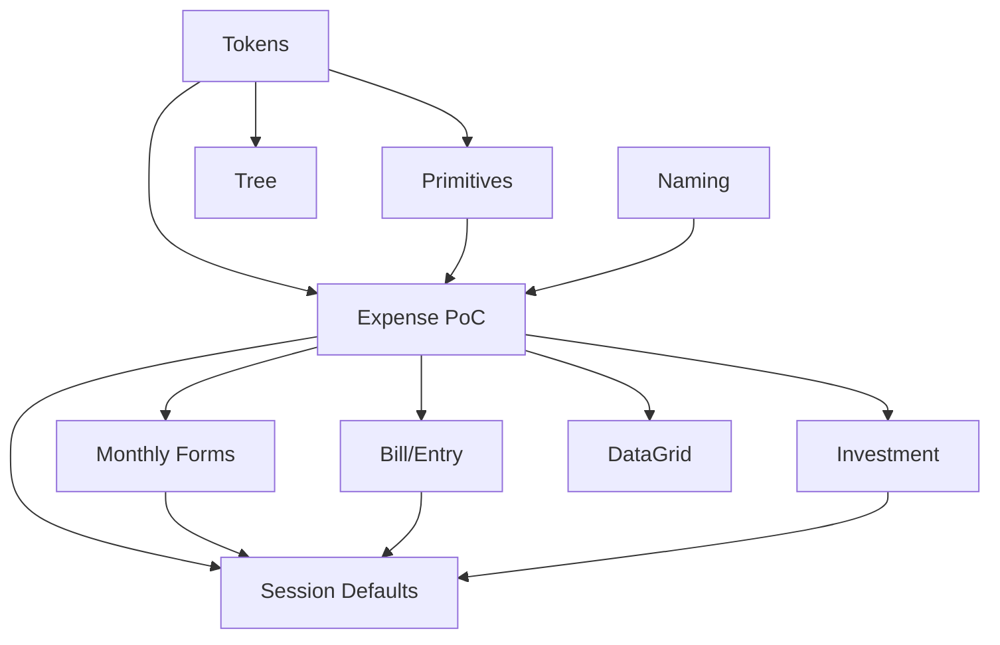

# UI Standards Compliance

## 1. Executive Summary

Financial's two front ends — the `Financial.Web` React SPA and the `Financial.App` WPF desktop
client — currently drift from the project's own UI standards (Fluent 2, Fluent UI React v9, WCAG 2.2
AA, and the ADRs in `docs/ui/decisions/`). A completed compliance audit
(`docs/ui/standard-compliance-audit-2026-08-29-forms.md`) inventoried 15 forms and dialogs across the
CashFlow and Investment bounded contexts and confirmed roughly 30 violations — hardcoded colors that
silently defeat dark mode, validation errors that surface only as a single bottom-of-form message,
inaccessible dialogs and trees, and buttons whose labels disagree with the form they open — plus 10
places where no standard existed yet to check against. Two of those missing standards were already
resolved into rules and appended to `docs/ui/forms-data-and-visualisations.md`; none of the findings
have been fixed in code.

This PRD turns that audit into an implementation plan for the single person who uses Financial
day-to-day, switching between the Web and WPF clients depending on device and context. It establishes
two shared foundations — a design-token/color fix and a set of reusable form primitives (per-field
validation, required-field marking, contextual help) — then proves the whole pattern end-to-end on one
representative form, **CashFlow → Monthly → Expense**, on both Web and WPF, before rolling it out to
the remaining 14 forms. Two larger, independently-scoped migrations (replacing the hand-built
investment tree with Fluent `Tree`, and adopting Fluent `DataGrid`/`Table` across the remaining
hand-rolled grids) and a quality-of-life enhancement (remembering last-used field values within a
session) round out the full set of ten features.

The result is a codebase where every form on both platforms uses the same tokens, the same validation
and accessibility primitives, and the same naming conventions — so the two clients stay genuinely
equivalent, not just superficially similar, and every fix made once is never redone by hand on the
next form.

## 2. Problem and Opportunity

**The Problem**

- **Inconsistent visual language erodes trust in the data.** Hardcoded hex colors (`#007acc`,
  `#005fa3`, `#CCCCCC`, `#FAFAFA`) appear instead of design tokens across at least 10 files on Web and
  WPF, and four CSS custom properties referenced throughout the Web app (`--bg-subtle`, `--text-muted`,
  `--danger`, `--error`) are never actually declared in `index.css` — only their hardcoded fallback
  values render, which silently defeats dark-mode theming everywhere they're used.
- **Users can't tell which field is wrong.** Every CashFlow form except Expense/Income surfaces
  validation as a single generic error string at the bottom of the form (Web `MessageBar`, WPF one
  `TextBlock`), forcing the user to re-scan every field to find the problem instead of seeing it next
  to the field itself.
- **Keyboard and screen-reader users hit dead ends.** `MoveAssetDialog` has no focus trap, no Escape
  handler, and doesn't restore focus on close; none of the 8 legacy WPF forms set
  `AutomationProperties.Name` on their inputs; `InvestmentTree.tsx` is a hand-built `<ul>/<li>` with no
  `role="tree"`, no `aria-expanded`, and no keyboard roving tabindex.
- **The button you click doesn't match what opens.** At least 7 confirmed mismatches exist between a
  trigger button's label, the form/dialog title it opens, and its confirm button — e.g. a "New
  Transfer" trigger opening a "Move Money" form, or "New" buttons that drop the entity name entirely
  (Investment Transaction/Credit/Price, both platforms) — so the user has to double-check they clicked
  the right thing.
- **WPF quietly drifts from Web.** The 8 legacy WPF forms never received the WPF-UI theme merge at
  all; field order for the same logical workflow differs between platforms (e.g. Income's "split to
  reserve" checkbox position, several forms' date-first vs. date-last ordering) — undermining the
  "equivalent outcomes across platforms" requirement in `docs/rules/ui.md`.

**The Opportunity**

Each problem above maps to a fix that, once built as a shared primitive, is inherited by every form
that reuses it rather than hand-copied 15 times:

- Fixing tokens and phantom CSS variables once (F01) makes every subsequent visual fix automatically
  dark-mode-correct and consistent, instead of re-auditing colors form by form.
- Building the per-field validation / required-field / contextual-help primitives once (F02) means
  every later form gets accessible, field-level error messaging for free instead of a bespoke
  implementation each time.
- Fixing the naming-consistency violations as one focused sweep (F03) closes all 7 confirmed
  mismatches under the single rule the audit already wrote into the standards doc, rather than
  discovering and re-litigating each one per form.
- Proving F01+F02+F03 together on one form first (F04, the Expense proof-of-concept, on both
  platforms) means the rollout features (F05–F07, F09) apply an already-working pattern instead of
  debugging Fluent `TabList`/`DataGrid` integration from scratch on every form.
- The two larger migrations (F08 Investment Tree, F09 DataGrid rollout) and the session-defaults QoL
  feature (F10) are scoped as their own independent slices so they don't block — or get blocked by —
  the core compliance work.

## 3. Target Audience

### Primary Users

**The Financial account owner**
- Is the single, self-hosted user of the application — manages their own investment portfolio (Brazil
  + UK brokers) and household cash flow (income, expenses, bills, savings reserve) with no other
  tenants or teams involved.
- Switches between `Financial.Web` (quick entry, any device with a browser) and `Financial.App` (WPF
  desktop, richer session) depending on context, and expects the same field order, terminology,
  validation behavior, and visual language regardless of which one they opened that day.
- Is also, in effect, the only person who will ever notice a visual or accessibility inconsistency —
  there's no separate QA or support function catching these issues, so the UI has to be right the
  first time or it stays wrong indefinitely.

Since there is exactly one user profile with a single, undifferentiated usage pattern across both
platforms, no separate Behavioral Profile subsection is needed — the persona above already covers it.

## 4. Objectives

- **Eliminate every confirmed standards violation** — reduce the audit's ~30 confirmed violations to
  zero, verified by re-checking each affected file against the specific finding that named it.
- **Establish reusable compliant primitives, not one-off fixes** — 100% of forms touched by F04–F07
  and F09 use the shared Web `Field`/`InfoLabel`/`Badge`/`TabList` and WPF asterisk/`Flyout` primitives
  from F02 rather than a bespoke per-form implementation, verified by code review at each feature's
  completion.
- **Prove the pattern before scaling it** — F04 (Expense, Web + WPF) passes 100% of its own acceptance
  criteria before any of F05, F06, F07, or F09 begins, so the rollout features apply a working pattern
  instead of re-discovering issues per form.
- **Close the confirmed accessibility gaps** — `MoveAssetDialog` and all 8 legacy WPF forms pass a
  keyboard-only walkthrough (focus trap, Escape, visible focus, `AutomationProperties.Name` on every
  input) per `docs/ui/review-checklist.md`.
- **Keep Web and WPF genuinely at parity** — zero unresolved field-order or terminology mismatches
  between the two clients across all 15 audited forms once F04–F07 are complete.

## 5. User Stories

### F01. Design Token & Color Compliance Foundation
- As the system, I want every color reference in Web forms to resolve to a declared design token so
  that dark mode and future theme changes apply consistently everywhere.
- As a user, I want the Reserva page's non-blocking split-percentage warning to look visually distinct
  from a blocking validation error so that I don't mistake a heads-up notice for something I must fix
  before saving.
- As a user, I want the 8 legacy WPF forms to inherit the WPF-UI theme so they look and feel consistent
  with the rest of the desktop app instead of standing out as unstyled.

### F02. Shared Form UX Primitives
- As a user, I want to see which specific field is invalid, right next to that field, so I don't have
  to guess which of several fields caused a save to fail.
- As a user, I want required fields marked clearly so I know what I must fill in before I can save.
- As a user, I want a small help affordance next to fields whose meaning isn't obvious so I can get
  guidance without leaving the form.
- As a user, I want the manual-vs-automatic price source shown as a clear, consistent badge so I can
  tell at a glance where a price came from.
- As a user, I want filter and chart-mode toggle controls to behave like real tab/radio controls so I
  can operate them with the keyboard, not just a mouse click on a styled `<button>`.

### F03. Trigger-to-Form Naming Consistency Sweep
- As a user, I want the button I clicked, the form or dialog title it opens, and its confirm button to
  all name the same entity, so I never wonder whether I opened the action I meant to.

### F04. CashFlow Monthly Expense Form Compliance (Web + WPF)
- As a user, I want the Expense form's fields ordered the same logical way on Web and WPF, with
  Payment Source before Value, so I can fill it in top-to-bottom without backtracking.
- As a user, I want the Monthly page's Summary/Expense/Credit Card/Income/Bank tabs to behave like real
  Fluent tabs — arrow-key navigation, proper focus — instead of styled buttons.
- As a user, I want the Expense grid to be a real accessible data grid so I can sort, filter, and
  navigate it with a screen reader or keyboard alone.
- As a user, I want inline, per-field validation on the Expense form so I immediately see what's wrong
  when I try to save, instead of a single message at the bottom.

### F05. Remaining CashFlow Monthly Entry Forms
- As a user, I want Income, Transfer, Withdrawal, Balance Correction, Income Split, and Edit Reserve
  Movement to use the same tokenized, validated, correctly-ordered fields the Expense form now uses,
  on both Web and WPF.
- As a user, I want the Balance Correction confirmation text to show the £ symbol on WPF the same way
  it already does on Web.
- As a user, I want the Income form's "split to reserve" checkbox in the same position on WPF as it
  appears on Web.

### F06. CashFlow Bill & Mãe Entry Forms
- As a user, I want a field to stay in the same row position whether I'm creating or editing a Bill or
  a Mãe Entry, so my muscle memory transfers between the two modes.
- As a user, I want the Add Bill confirm button to say "Add Bill" instead of just "Add" so I know
  exactly what I'm confirming.
- As a user, I want Area and Currency to appear earlier in the Bill/Entry forms instead of after the
  financial fields, matching the field-order convention used elsewhere.

### F07. Investment Forms & Dialogs Compliance
- As a user, I want the Move Asset dialog to trap focus, close on Escape, and restore focus to what I
  was doing before, like every other dialog in the app.
- As a user, I want the Investment Transaction/Credit/Price "New" buttons to name the entity they
  create, on both Web and WPF, instead of a bare "New".
- As a user, I want the Investment Snapshot edit button to have a real accessible name, not just a
  tooltip.

### F08. InvestmentTree → Fluent Tree Migration
- As a user, I want the investment tree to expose real expand/collapse state and keyboard navigation
  to assistive technology so I can navigate my portfolio hierarchy without a mouse.
- As a user, I want drag-and-drop reordering in the tree to keep working exactly as it does today after
  the underlying component changes.

### F09. Repo-wide Fluent DataGrid/Table Adoption
- As a user, I want the remaining hand-rolled Web grids (Income, Transfer, Investment, Snapshots) to
  behave like the compliant grid already proven on the Expense form, with the same sort/filter/keyboard
  behavior.

### F10. Persistent Create-Form Defaults Within a Session
- As a user, I want the date and entity-relation fields I last used in a form to be remembered for the
  rest of my session, so I don't have to re-pick them for every consecutive entry of the same type.
- As a user, I want amount and description fields to always start blank on a new entry, so I never
  accidentally reuse a value that shouldn't carry over.

## 6. Functionalities

### F01. Design Token & Color Compliance Foundation

**Provides:**
- A complete, dark-mode-correct design token set (declared CSS custom properties replacing the four
  phantom ones) and WPF-UI theme-merged resource dictionaries for the 8 legacy forms (used by F02,
  F04, F08)

**Capabilities:**
- Declare `--bg-subtle`, `--text-muted`, `--danger`, `--error` in `index.css` with real light/dark
  values (no more undeclared custom properties relying only on hardcoded fallbacks).
- Replace hardcoded `#007acc`/`#005fa3` with the existing brand-blue token in `MensaisPage.tsx`,
  `ControleMaePage.tsx`, and the New/Save buttons in `TransactionsTab.tsx`/`CreditsTab.tsx`/
  `PriceHistoryTab.tsx`.
- Replace the 3 untokenized Dividend/Rent/JCP colors in `CreditsTab.tsx` with named tokens.
- Give the Reserva page's non-blocking split-percentage warning a distinct color from the blocking
  error red it currently shares.
- Merge the WPF-UI theme resource dictionary into all 8 legacy WPF forms that currently have none, and
  replace their hardcoded `#CCCCCC`/`#FAFAFA`/`Foreground="Red"` literals with theme brushes; same fix
  for `MoveAssetDialog.xaml`'s backdrop/shadow colors.

**Experience:**
- No end-user-visible flow changes — this is a like-for-like visual correction. Verification is: open
  each affected page/form in both light and dark mode (Web) and confirm colors render from the token
  instead of a hardcoded fallback; open each affected WPF form and confirm it now matches the WPF-UI
  theme applied elsewhere in the app.

### F02. Shared Form UX Primitives

**Consumes:**
- F01: design token set

**Provides:**
- Per-field validation, required-field, and contextual-help primitives for Web and WPF (used by F04)

**Core Scope:**
- Per-field validation state and message (Web `Field validationState`/`validationMessage`; WPF
  per-field error text replacing the single bottom `TextBlock`)
- Required-field indicator (Web `Field required`; WPF themed asterisk + `AutomationProperties.HelpText
  = "Required"`)
- Contextual help affordance (Web `InfoLabel`; WPF `SymbolIcon Info16` + `Flyout`)

**Full Scope additions:**
- Canonical manual-vs-automatic price-source `Badge` (Web)
- Filter/chart-mode chip toggle replaced with Fluent `TabList`/`Tab` (Web) and a `RadioButton` group
  (WPF)
- `<Text weight="semibold">` convention for the numeric portion of inline computed-value sentences
- Post-submit itemized result view (Income Split) using `MessageBar intent="success"` + Fluent `Table`
  instead of a raw HTML table

**Capabilities:**
- Every new validation message must appear directly adjacent to the field it describes, not only in a
  form-level summary.
- Required-field indication must be programmatically determinable (not color-only), satisfying WCAG
  2.2 AA's non-text-content and info-and-relationships criteria.
- Contextual help content is short (1-2 sentences) and dismissible without leaving the form.

**Experience:**
- User types an invalid value into a field and tabs away or attempts to save: the field itself shows
  an error state (red outline/icon on Web, red text on WPF) with a specific message directly below it,
  in addition to (not instead of) the existing save-blocked behavior.
- User hovers/focuses a field with a contextual-help icon: a short explanation appears in a flyout/
  tooltip without navigating away or losing form state.
- User opens the manual-vs-automatic price display: sees a single consistent `Badge` component instead
  of ad hoc text/color conventions that vary by page.

### F03. Trigger-to-Form Naming Consistency Sweep

**Capabilities:**
- A trigger button's visible label, the form/dialog title it opens, and its confirm button text must
  all name the same entity, per the "Trigger-to-form naming consistency" rule already added to
  `docs/ui/forms-data-and-visualisations.md`.
- Fixes: Transfer ("New Transfer" trigger vs. "Move Money" form/button, Web), Balance Correction (Web),
  Withdrawal ("Record a Withdrawal"/"Record Withdrawal" vs. "New Withdrawal" trigger, Web), Income
  Split ("Post Monthly Income Split", Web), Investment Transaction/Credit/Price bare "New" triggers
  (Web + WPF, entity name currently dropped entirely — WPF's is tooltip-only, which doesn't satisfy a
  visible-label fix), Add Bill WPF confirm button (drops "Bill", shows only "Add"/"Adding...").

**Experience:**
- User clicks any of the above triggers: the form/dialog that opens, and its confirm button, now name
  the same entity as the trigger did — no re-labeling required elsewhere in the flow.

### F04. CashFlow Monthly Expense Form Compliance (Web + WPF)

**Consumes:**
- F01: design token set
- F02: per-field validation, required-field, and contextual-help primitives

**Provides:**
- A proven Fluent `TabList` (Monthly page tabs) + Fluent `DataGrid`/`Table` (expense grid) +
  per-field-validation pattern for CashFlow Monthly forms (used by F05, F06, F07, F09)

**Capabilities:**
- Field order on both platforms: Date, Description, Value, Payment Source/Card, Category, then
  conditional fields (round-up amount, counts-as-tithe) — Payment Source moves before Value (currently
  after it).
- `MonthlyPage.tsx`'s custom tab buttons are replaced with Fluent `TabList`/`Tab`; `ExpensesSection.tsx`'s
  native `<table>` is replaced with Fluent `DataGrid`/`Table`, preserving existing sort/filter behavior
  (`SortableColumnHeader`, `ColumnFilterMenu`).
- `ExpenseForm.tsx`/`ExpenseFormView.xaml` gain per-field validation state, a required-field indicator,
  and (where applicable) contextual help, using the F02 primitives — replacing the current
  single-message error surfacing in `useExpenseForm.ts`/`ExpenseFormValidation.cs`.

**Experience:**
- User opens the Monthly page: tabs behave as real Fluent tabs (arrow-key navigation between
  Summary/Expense/Credit Card/Income/Bank).
- User opens "New Expense": form fields appear in the corrected order; Payment Source/Card selection
  precedes Value entry.
- User leaves a required field blank and attempts to save: that field shows its own error state and
  message; the save is blocked exactly as before, but the user now sees which field is the problem
  without scanning the whole form.
- User views the expense list: it renders as a Fluent `DataGrid`/`Table`, remains sortable/filterable
  as before, and is operable via keyboard and screen reader.
- Settled (card-statement) expenses continue to lock their payment-mode fields exactly as they do
  today; this behavior is preserved, not changed, by the migration.

**Error Handling:**
- Save fails due to a network/server error: existing bottom-of-form error messaging is preserved in
  addition to the new per-field indicators, so a system-level failure is never mistaken for a
  field-level validation issue.
- Required field left blank on create: field-level error shown; save blocked; message specifies which
  field ("Payment Source is required" rather than a generic "Please complete the form").
- User attempts to edit a settled (already-invoiced) expense's payment fields: the existing
  locked-state message is shown; no silent no-op.

### F05. Remaining CashFlow Monthly Entry Forms

**Consumes:**
- F04: proven Fluent TabList/DataGrid/validation pattern for CashFlow Monthly forms

**Capabilities:**
- Apply the F04 pattern (tokens, per-field validation, required-field indicator) to Income, Transfer,
  Withdrawal, Balance Correction, Income Split, and Edit Reserve Movement, on both Web and WPF.
- Field-order fixes: Income (Bank/Description currently after financial fields), Withdrawal and Edit
  Movement (Bucket→Amount→Date→Description reordered to Date-first).
- WPF `IncomeFormView.xaml`: reorder the "split to reserve" checkbox to match Web's position.
- WPF Balance Correction confirmation text: add the missing `£` symbol already present on Web.

**Experience:**
- Each of the six forms gains the same per-field validation and required-field behavior proven on
  Expense; field order matches the corrected convention on both platforms; no change to what data is
  captured or how the underlying save operation behaves.

**Error Handling:**
- Same shape as F04: field-level validation errors are additive to existing save-blocked behavior;
  network/server failures continue to surface via the existing form-level error message.

### F06. CashFlow Bill & Mãe Entry Forms

**Consumes:**
- F04: proven Fluent TabList/DataGrid/validation pattern for CashFlow Monthly forms

**Capabilities:**
- Execute the audit's already-designed Add/Edit row-position continuity plan: restructure
  `EditBillFormView.xaml` and `EditEntryFormView.xaml` from 5 to 8 rows so a field occupies the same
  row whether creating or editing; fix `CreateEntryFormView.xaml`'s field width (100→90) to match.
- Fix the Add Bill WPF confirm button to read "Add Bill"/"Adding Bill..." instead of "Add"/"Adding...".
- Move Area and Currency fields earlier in the Bill/Entry forms, ahead of the financial fields.

**Experience:**
- User switches from creating to editing a Bill or Mãe Entry: the field they were just looking at
  stays in the same row position instead of the form re-laying-out around it.
- User confirms adding a Bill: the button reads "Add Bill", not a bare "Add".

**Error Handling:**
- Row-position restructuring is a layout-only change; existing save/validation error behavior for
  these forms is unchanged and must continue to surface correctly after the restructure (regression
  check, not a new failure mode).

### F07. Investment Forms & Dialogs Compliance

**Consumes:**
- F04: proven Fluent TabList/DataGrid/validation pattern for CashFlow Monthly forms

**Capabilities:**
- `MoveAssetDialog` migrates to Fluent `Dialog`/`DialogSurface`/`DialogBody`/`DialogActions`, which
  provides focus trap, Escape-to-close, and focus restore on close out of the box; its combo/textbox
  inputs gain `AutomationProperties.Name`; its error text gains a live region so screen readers
  announce it.
- Investment Transaction/Credit/Price "New" buttons gain a visible entity name on both Web and WPF
  (not tooltip-only).
- Investment Snapshot edit button gains `AutomationProperties.Name` (currently tooltip-only).
- WPF Transaction/Credit/Price forms: normalize Title Case + verb inconsistency ("Add
  Transaction"/"Update Transaction") to match Web's sentence case ("New transaction"/"Edit
  transaction").

**Experience:**
- User opens Move Asset: focus is trapped inside the dialog, Escape closes it, and focus returns to
  the triggering element — matching every other dialog in the app.
- User opens any Investment Transaction/Credit/Price creation flow: the trigger, form, and confirm
  button all name the entity being created.

**Error Handling:**
- Move Asset save fails (e.g. invalid destination): existing error messaging is preserved and now
  additionally announced via the live region for screen-reader users.

### F08. InvestmentTree → Fluent Tree Migration

**Consumes:**
- F01: design token set

**Capabilities:**
- Replace `InvestmentTree.tsx`'s hand-built `<ul>/<li>` structure with Fluent `Tree`, providing
  `role="tree"`, `aria-expanded`, and keyboard roving tabindex out of the box.
- WPF is already compliant via native `TreeView` — no WPF changes required for this feature.
- Do not use `selectionMode="single"` (renders radio buttons instead of tree selection).
- Existing drag-and-drop reordering behavior must be manually verified after migration, since Fluent
  `Tree` does not natively document drag-and-drop support.

**Experience:**
- User navigates the investment tree via keyboard or screen reader: expand/collapse state and node
  hierarchy are correctly announced, matching what WPF's native `TreeView` already provides.
- User drags an asset to a new parent node: behavior is unchanged from before the migration.

**Error Handling:**
- Drag-and-drop of an asset fails or drops in an unintended location: the existing move-asset
  confirmation/undo behavior (if any) must continue to function identically post-migration; this is
  the single highest-risk regression in this feature and must be explicitly tested, not assumed to
  carry over.

### F09. Repo-wide Fluent DataGrid/Table Adoption

**Consumes:**
- F04: proven Fluent TabList/DataGrid/validation pattern for CashFlow Monthly forms

**Capabilities:**
- Apply the DataGrid/Table pattern proven in F04 to the remaining hand-rolled Web grids: Income and
  Transfer lists, Investment grids, and the Investment Snapshot grid. (`IncomeSection.tsx`'s
  emoji-icon edit buttons are normalized to the Fluent `EditRegular`/`DeleteRegular` icon-button
  pattern already used in `ExpensesSection.tsx`, closing the parity gap noted in the audit.)

**Experience:**
- Each converted grid keeps its existing sort/filter/data behavior, now rendered through Fluent
  `DataGrid`/`Table` with consistent keyboard and screen-reader support.

### F10. Persistent Create-Form Defaults Within a Session

**Consumes:**
- F04, F05, F06, F07: finalized field structure of the forms whose defaults will be persisted

**Capabilities:**
- Per the audit's already-designed field mapping: date and entity-relation fields (bank, category,
  bucket, counterparty) persist for the remainder of the browser/app session once set on a create
  form; amount and description fields always start blank on every new entry, regardless of session
  state.
- Web: a new `sessionStorage`-backed module modeled on the existing `domainStorage.ts` pattern.
- WPF: private fields on the already-singleton-lifetime workflow ViewModels (no new persistence
  mechanism needed).
- Applies across the CashFlow Monthly and Investment create forms covered by F04–F07 (12 forms per the
  audit's mapping).

**Experience:**
- User creates a second Expense entry in the same session: the date and payment-source fields default
  to what was last used, while amount and description start blank.
- Known, explicitly accepted behavior change: 4 Web forms that currently open with a blank date field
  will now default to today's date once a date has been set once in the session.

## 7. Out of Scope

**Not part of this PRD:**
- `docs/ui/standard-compliance-audit-2026-08-23.md`, a separate, broader navigation-area audit —
  tracked independently, not folded into this PRD.
- Any new visual redesign beyond what the 2026-08-29 audit specifies — this PRD is compliance
  remediation, not a restyling initiative.
- Backend/API changes — every fix here is presentation-layer only; no OpenAPI contract or DTO changes
  are anticipated.

## 8. Dependency Graph

| # | Feature | Priority | Dependencies |
|---|---------|----------|--------------|
| F01 | Design Token & Color Compliance Foundation | 1 | None |
| F03 | Trigger-to-Form Naming Consistency Sweep | 2 | None |
| F02 | Shared Form UX Primitives | 1 | F01 |
| F08 | InvestmentTree → Fluent Tree Migration | 3 | F01 |
| F04 | CashFlow Monthly Expense Form Compliance (Web + WPF) | 1 | F01, F02, F03 |
| F05 | Remaining CashFlow Monthly Entry Forms | 2 | F04 |
| F06 | CashFlow Bill & Mãe Entry Forms | 2 | F04 |
| F07 | Investment Forms & Dialogs Compliance | 2 | F04 |
| F09 | Repo-wide Fluent DataGrid/Table Adoption | 3 | F04 |
| F10 | Persistent Create-Form Defaults Within a Session | 3 | F04, F05, F06, F07 |

### Foundation Features
These features set up shared project infrastructure. In a greenfield project they must be implemented
sequentially before or alongside any feature that depends on them:
- **F01 Design Token & Color Compliance Foundation** — declares the missing design tokens/CSS custom
  properties and merges the WPF-UI theme into forms that lack it; every visual fix in every later
  feature depends on this base being correct.
- **F02 Shared Form UX Primitives** — builds the reusable per-field validation, required-field, and
  contextual-help components every form-facing feature (F04–F07) applies rather than reimplementing.

### Execution Waves
Features within the same wave can be built in parallel. A wave starts only after every feature in
earlier waves is complete.

**Note:** Foundation features (see "Foundation Features" above) cannot run in parallel with each other
in a greenfield project even if they appear together in a wave — they share scaffolding files and must
be implemented sequentially until the base is in place.

- **Wave 1**: F01, F03
- **Wave 2**: F02, F08
- **Wave 3**: F04
- **Wave 4**: F05, F06, F07, F09
- **Wave 5**: F10

### Priority levels
- **1** = Essential — product does not work without it
- **2** = Important — significant value addition
- **3** = Desirable — incremental improvement

## 9. Acceptance Criteria

### F01. Design Token & Color Compliance Foundation
- [x] `--bg-subtle`, `--text-muted`, `--danger`, `--error` are declared in `index.css` with correct
      light and dark values; no component relies on an undeclared custom property's fallback.
- [x] `MensaisPage.tsx`, `ControleMaePage.tsx`, and the New/Save buttons in
      `TransactionsTab.tsx`/`CreditsTab.tsx`/`PriceHistoryTab.tsx` contain no hardcoded `#007acc`/
      `#005fa3` hex values.
- [x] The 3 Dividend/Rent/JCP colors in `CreditsTab.tsx` reference named tokens.
- [x] Reserva's non-blocking split-percentage warning renders in a color visually distinct from the
      blocking-error red.
- [x] All 8 legacy WPF forms and `MoveAssetDialog.xaml` have the WPF-UI theme merged and contain no
      hardcoded `#CCCCCC`/`#FAFAFA`/`Foreground="Red"` literals.

### F02. Shared Form UX Primitives
- [x] A shared per-field validation primitive exists on Web (`Field validationState`/
      `validationMessage`) and WPF (per-field error text) and is documented for reuse.
- [x] A shared required-field indicator exists on Web (`Field required`) and WPF (themed asterisk +
      `AutomationProperties.HelpText`).
- [x] A shared contextual-help affordance exists on Web (`InfoLabel`) and WPF (`SymbolIcon` +
      `Flyout`).
- [ ] A canonical manual/automatic price-source `Badge` component exists and renders consistently
      wherever price source is shown.
- [ ] Filter/chart-mode toggles are operable via keyboard as `TabList`/`Tab` (Web) or `RadioButton`
      group (WPF).

### F03. Trigger-to-Form Naming Consistency Sweep
- [x] Transfer, Balance Correction, Withdrawal, and Income Split triggers/forms/confirm buttons on Web
      name the same entity end-to-end.
- [x] Investment Transaction/Credit/Price "New" triggers show a visible entity name on both Web and
      WPF (not tooltip-only on WPF).
- [x] The Add Bill WPF confirm button reads "Add Bill"/"Adding Bill..." instead of "Add"/"Adding...".

### F04. CashFlow Monthly Expense Form Compliance (Web + WPF)
- [x] Payment Source/Card selection appears before Value in both `ExpenseForm.tsx` and
      `ExpenseFormView.xaml`.
- [x] The Monthly page's tabs are implemented with Fluent `TabList`/`Tab` and are operable via
      arrow-key navigation.
- [x] `ExpensesSection.tsx`'s grid is implemented with Fluent `DataGrid`/`Table`, preserving existing
      sort/filter behavior.
- [x] An invalid or missing required field on the Expense form shows a field-level error state and
      message, in addition to existing save-blocked behavior.
- [x] Settled-expense payment-field locking behavior is unchanged after the migration.

### F05. Remaining CashFlow Monthly Entry Forms
- [ ] Income, Transfer, Withdrawal, Balance Correction, Income Split, and Edit Reserve Movement all
      show field-level validation and required-field indicators on both Web and WPF.
- [ ] Income, Withdrawal, and Edit Movement field order matches the corrected convention on both
      platforms.
- [ ] WPF Income's "split to reserve" checkbox position matches Web's.
- [ ] WPF Balance Correction confirmation text includes the `£` symbol.

### F06. CashFlow Bill & Mãe Entry Forms
- [ ] `EditBillFormView.xaml` and `EditEntryFormView.xaml` place each field in the same row position as
      their corresponding Create form.
- [ ] `CreateEntryFormView.xaml`'s field width matches the corrected value.
- [ ] The Add Bill WPF confirm button reads "Add Bill" (verified again here in context of the full
      row-continuity change, not just the label fix from F03).
- [ ] Area and Currency fields appear before the financial fields in Bill/Entry forms.

### F07. Investment Forms & Dialogs Compliance
- [ ] `MoveAssetDialog` traps focus, closes on Escape, and restores focus to the triggering element on
      close.
- [ ] `MoveAssetDialog`'s combo/textbox inputs have `AutomationProperties.Name`; its error text is in a
      live region.
- [x] Investment Transaction/Credit/Price "New" triggers show a visible entity name on both platforms.
      (Completed in F03, PR #648 — duplicate of F03's own AC bullet.)
- [ ] Investment Snapshot's edit button has `AutomationProperties.Name` (not tooltip-only).
- [x] WPF Transaction/Credit/Price forms use sentence-case titles/verbs matching Web.
      (Completed in F03, PR #648, while closing the trigger-to-form naming chain the trigger fix
      alone would have left mismatched — see `docs/ui/forms-data-and-visualisations.md`'s
      "Fix the whole chain together" note.)

### F08. InvestmentTree → Fluent Tree Migration
- [x] `InvestmentTree.tsx` is implemented with Fluent `Tree`, exposing `role="tree"` and
      `aria-expanded` via the browser accessibility tree.
- [x] Keyboard navigation (arrow keys, roving tabindex) works across the tree.
- [ ] Drag-and-drop reordering behaves identically to pre-migration behavior, manually verified.
      (Automated DnD tests pass unchanged; the manual browser verification this bullet explicitly
      requires was not performed — the WPF app's pre-existing local launch issue doesn't apply here,
      but no browser-driving tool was available in this run. Left unchecked deliberately.)
- [x] `selectionMode="single"` is not used.

### F09. Repo-wide Fluent DataGrid/Table Adoption
- [ ] Income, Transfer, Investment, and Investment Snapshot grids are implemented with Fluent
      `DataGrid`/`Table`.
- [ ] `IncomeSection.tsx`'s edit affordance uses the Fluent `EditRegular`/`DeleteRegular` icon-button
      pattern, matching `ExpensesSection.tsx`.
- [ ] Existing sort/filter behavior is preserved on every converted grid.

### F10. Persistent Create-Form Defaults Within a Session
- [ ] Date and entity-relation fields on the 12 mapped forms retain their last-used value for the rest
      of the session after being set once.
- [ ] Amount and description fields always start blank on a new create-form open, regardless of
      session state.
- [ ] The 4 Web forms affected by the blank-date-to-today's-date behavior change are identified and
      the change is confirmed intentional.

### Cross-Feature Integration
- [x] F02's shared primitives render using F01's design tokens — no hardcoded color is introduced in
      the new validation/required/help components.
- [x] F04's Expense form and Monthly page chrome use both F01's tokens (no hardcoded colors) and F02's
      validation/required-field primitives (not a bespoke reimplementation), and reflect F03's naming
      fixes where applicable.
- [ ] F05, F06, F07, and F09 each reuse F04's proven Fluent `TabList`/`DataGrid`/validation pattern
      rather than independently reimplementing tab, grid, or validation behavior.
- [x] F08's Fluent `Tree` migration uses F01's design tokens for its icons/indicators.
- [ ] F10's persisted defaults apply only to fields on forms already finalized by F04, F05, F06, and
      F07 — no field mapping references a form structure that predates those features' changes.
