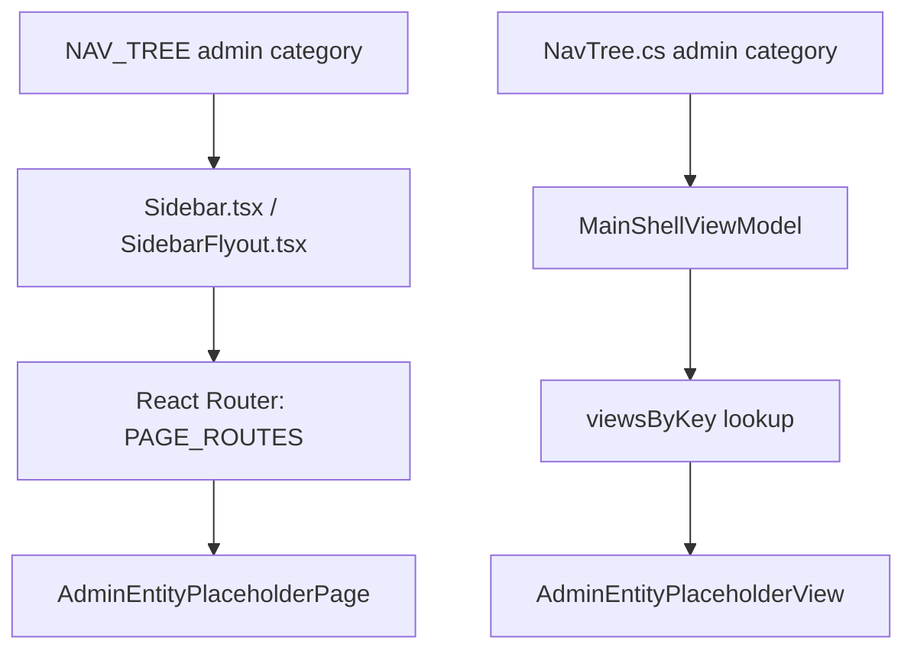

## 1. Technical Overview

**What:** Restructure the sidebar's navigation data model on both front ends from a flat 2-level tree
(category → children) to a model that supports an optional 3rd level (category → group → children),
used only by a new `admin` top-level category. Add ten new route/page pairs — one per Admin entity —
all initially rendering a shared placeholder, wired through the existing `PAGE_ROUTES`/`NAV_TREE`
sync-test convention. `Financial.App` gets the equivalent 3-level shell navigation and ten placeholder
views registered the same way its existing views are.

**Why:** Every other feature in this PRD (F02-F11) needs an Admin sidebar entry and a routable page to
attach its list/create/edit/delete screen to. Building that once, as a shared foundation, avoids each
of the ten entity features re-deriving its own nav/routing wiring and keeps `NAV_TREE`/`PAGE_ROUTES`
(and their WPF equivalents) consistent for every entity from the start.

**Scope:**
- Included: `NavCategory`/`NavGroup` type changes, the `admin` category with its `investment` and
  `cashflow` groups and 10 leaves, sidebar/flyout rendering of the group level (Web), 3-level shell
  rendering + `BreadcrumbText` (WPF), 10 new routes + 1 shared placeholder page/view, extension of the
  existing nav/route sync test to cover Admin leaves.
- Excluded: any entity-specific list/create/edit/delete UI or API work (F02-F11 own this — each later
  feature replaces its entity's placeholder route element/view registration with its real screen, and
  touches no other file introduced here); persisting sidebar expand/collapse state (PRD Section 7,
  already out of scope); auth/role gating (none exists, none introduced).

## 2. Architecture Impact

**Affected components:**
- `Financial.Web/src/navigation/navTree.ts` — type + data changes
- `Financial.Web/src/navigation/routes.tsx` — 10 new `PAGE_ROUTES` entries
- `Financial.Web/src/navigation/lazyPages.tsx` — 1 new lazy import, reused 10×
- `Financial.Web/src/navigation/__tests__/routes.test.ts` — extend flattening to include groups
- `Financial.Web/src/components/Sidebar.tsx` — render `groups` when present
- `Financial.Web/src/components/SidebarFlyout.tsx` — render `groups` when present (collapsed sidebar)
- `Financial.Web/src/components/Sidebar.css` / `SidebarFlyout.css` — group-row styling
- `Financial.Web/src/pages/AdminEntityPlaceholderPage.tsx` — new shared placeholder page
- `Financial.App/Navigation/NavTree.cs` — type + data changes
- `Financial.App/ViewModels/MainShellViewModel.cs` — 3-level selection + breadcrumb
- `Financial.App/Views/Admin/AdminEntityPlaceholderView.xaml(.cs)` — new shared placeholder view
- `Financial.App/ViewModels/AdminEntityPlaceholderViewModel.cs` — new, holds the entity label to display
- `Financial.App/MainWindow.xaml.cs` — register 10 placeholder view instances in `viewsByKey`
- `Financial.App/MainWindow.xaml` (or shell template) — render the group level under a category

## 3. Technical Decisions

| Decision | Chosen Approach | Alternative Considered | Trade-off |
|----------|----------------|----------------------|-----------|
| 3-level nav data shape | Add optional `groups?: NavGroup[]` to the existing `NavCategory` (Web) / optional `Groups` list on the existing `NavCategory` record (WPF); a category has either `children` (2-level) or `groups` (3-level), never both | Discriminated union of two category types | Fewer call-site changes in `Sidebar.tsx`/`SidebarFlyout.tsx`/`MainShellViewModel`; existing `investments`/`cashflow` categories are untouched data and untouched rendering paths, satisfying "unchanged in behavior and appearance" |
| Entity page content before F02-F11 | One shared `AdminEntityPlaceholderPage`/`AdminEntityPlaceholderView`, parameterized by entity label, reused across all 10 routes/registrations | 10 near-identical empty page files | Avoids 10 throwaway files; each later feature's diff is "replace this one route's element" / "replace this one dictionary value", not "create a file from scratch" |
| Route path convention | `admin/<group-id>/<entity-kebab>` (e.g. `admin/investment/brokers`, `admin/cashflow/credit-cards`) | Flat `admin/<entity-kebab>` | Mirrors the 3-level nav shape in the URL, keeps entity slugs stable for F02-F11 to reuse verbatim |
| Group row rendering (Web) | Groups render as an inline, disclosure-triangle expandable row directly under the category (no icon), same interaction model as the existing category→children expand; collapsed-sidebar flyout renders groups as a second-level nested list under the category flyout | Route groups through a second `SidebarFlyout`-style popover | Simpler: one flyout component already handles nested `<ul>`; no new popover/portal machinery needed |
| WPF breadcrumb for 3-level selection | `BreadcrumbText` becomes `"{Category} › {Group} › {Child}"` when the selected child is under a group, `"{Category} › {Child}"` unchanged otherwise | Always show 3 segments, category duplicated when ungrouped | Keeps existing `investments`/`cashflow` breadcrumbs pixel-identical to today |

## 4. Component Overview

**Frontend (`Financial.Web`):**

| File Path | New/Modified | Purpose | Key Responsibilities |
|-----------|--------------|---------|---------------------|
| `src/navigation/navTree.ts` | Modified | Nav data model + data | Add `NavGroup` interface, optional `groups` on `NavCategory`, define `admin` category with `investment`/`cashflow` groups and 10 leaves |
| `src/navigation/routes.tsx` | Modified | Route table | Add 10 `PAGE_ROUTES` entries under `admin/investment/*` and `admin/cashflow/*`, all pointing at `AdminEntityPlaceholderPage` with a per-route `entityLabel` prop |
| `src/navigation/lazyPages.tsx` | Modified | Lazy page imports | Add `AdminEntityPlaceholderPage` lazy import |
| `src/navigation/__tests__/routes.test.ts` | Modified | Nav/route sync test | Flatten `groups[].children` alongside `children` when building `navRoutes`, so all 10 Admin leaves are checked |
| `src/components/Sidebar.tsx` | Modified | Expanded-sidebar rendering | Render a category's `groups` (each independently expand/collapsible, disclosure-triangle affordance) instead of `children` when `groups` is present; preserve existing `hasActiveChild`/active-highlight logic extended to groups and their children |
| `src/components/SidebarFlyout.tsx` | Modified | Collapsed-sidebar flyout | Render nested group sections (group label + its children) instead of a flat child list when `category.groups` is present |
| `src/components/Sidebar.css` | Modified | Divider + group styling | Visual divider above the `admin` category (bottom of the list); indentation/typography for group rows and their children |
| `src/components/SidebarFlyout.css` | Modified | Flyout group styling | Nested group section styling inside the flyout popover |
| `src/pages/AdminEntityPlaceholderPage.tsx` | New | Shared placeholder for all 10 Admin entity routes | Renders the entity's display name and a "Coming soon" notice inside the app's standard page-title/breadcrumb wrapper |
| `src/pages/__tests__/AdminEntityPlaceholderPage.test.tsx` | New | Unit test | Renders with a given label, shows that label |

**WPF (`Financial.App`):**

| File Path | New/Modified | Purpose | Key Responsibilities |
|-----------|--------------|---------|---------------------|
| `Navigation/NavTree.cs` | Modified | Nav data model + data | Add `NavGroup` record, optional `Groups` on `NavCategory`, define `admin` category mirroring the Web data (same ids, labels, order) |
| `ViewModels/MainShellViewModel.cs` | Modified | Shell selection state | `Categories` unchanged; `BreadcrumbText` walks `Groups` when present; `SelectItem` unchanged (still keyed by leaf `ViewKey`, flat across groups) |
| `ViewModels/AdminEntityPlaceholderViewModel.cs` | New | Placeholder view's binding source | Exposes the entity's display label |
| `Views/Admin/AdminEntityPlaceholderView.xaml` + `.xaml.cs` | New | Shared placeholder view for all 10 Admin entities | Fluent-styled page shell bound to `AdminEntityPlaceholderViewModel.Label` |
| `MainWindow.xaml.cs` | Modified | Composition root | Construct 10 `AdminEntityPlaceholderView` instances (one per entity `ViewKey`, each with its own `AdminEntityPlaceholderViewModel`), add to `viewsByKey` |
| `MainWindow.xaml` (or the shell's nav template, wherever `Categories`/children are currently templated) | Modified | Shell nav rendering | Extend the existing category→children `ItemsControl`/`TreeView`-equivalent template with a group level when `Groups` is non-empty |

**Database:** Not applicable — this feature has no persisted data, no API, no DB schema impact.

## 5. API Contracts

Not applicable. F01 is a client-side navigation/routing change on both front ends; it introduces no new
API endpoints and calls none.

## 6. Data Model

Not applicable — no database or persisted-entity changes. The only "schema" introduced is the in-memory
`NavGroup`/`NavCategory.groups` TypeScript interface and its WPF record equivalent, both documented in
Section 4.

## 7. Testing Strategy

**Test File Structure:**

| Test File | Test Type | Target | Coverage Goal |
|-----------|-----------|--------|---------------|
| `Financial.Web/src/navigation/__tests__/routes.test.ts` | Unit | `NAV_TREE`/`PAGE_ROUTES` agreement | Every Admin leaf (10) plus existing leaves round-trip |
| `Financial.Web/src/components/__tests__/Sidebar.test.tsx` | Unit | `Sidebar` | Admin category renders with a divider before it; expanding Admin shows its 2 groups; expanding a group shows its entity leaves; existing Investments/CashFlow behavior unchanged |
| `Financial.Web/src/components/__tests__/SidebarFlyout.test.tsx` | Unit | `SidebarFlyout` | Collapsed-sidebar flyout for `admin` renders 2 group sections with their leaves nested; existing flat-category flyout behavior unchanged |
| `Financial.Web/src/pages/__tests__/AdminEntityPlaceholderPage.test.tsx` | Unit | `AdminEntityPlaceholderPage` | Renders the passed entity label |
| `Tests/Financial.App.Tests/.../NavTreeTests.cs` (or equivalent existing location) | Unit | `NavTree` | `admin` category has exactly 2 groups (`investment` with 3 children, `cashflow` with 7 children); ids/order match the Web `NAV_TREE` |
| `Tests/Financial.App.Tests/.../MainShellViewModelTests.cs` | Unit | `MainShellViewModel` | `BreadcrumbText` returns `"Admin › Investment › Brokers"`-shaped text for a grouped selection and is unchanged for an ungrouped one; `SelectItem` still resolves a grouped leaf's view via `viewsByKey` |

**For each test file, key functions:**

| Test Function | Description | Assertions |
|---------------|-------------|------------|
| `it('every sidebar destination has a route declared for it')` (extended) | Flattens groups too | All 10 Admin leaf routes present in `PAGE_ROUTES` |
| `it('renders Admin divider and two sub-groups')` | Sidebar expanded state | Divider element present; "Investment" and "CashFlow" group labels rendered under Admin |
| `it('expands a group to reveal its entity leaves')` | Sidebar interaction | Clicking "Investment" group reveals Assets/Brokers/Portfolios links; only one branch open at a time per PRD Experience |
| `it('highlights category, group, and leaf together on an active Admin route')` | Active-state | All 3 ancestor levels get the active/highlight class when a leaf route matches `location.pathname` |
| `NavTree_AdminCategory_HasExpectedGroupsAndChildren` | WPF data | `NavTree.Categories` admin entry group ids/labels/child ids/order match the PRD |
| `BreadcrumbText_GroupedSelection_ReturnsThreeSegmentPath` | WPF breadcrumb | Selecting a grouped leaf's `ViewKey` yields `"Admin › Investment › Brokers"` |
