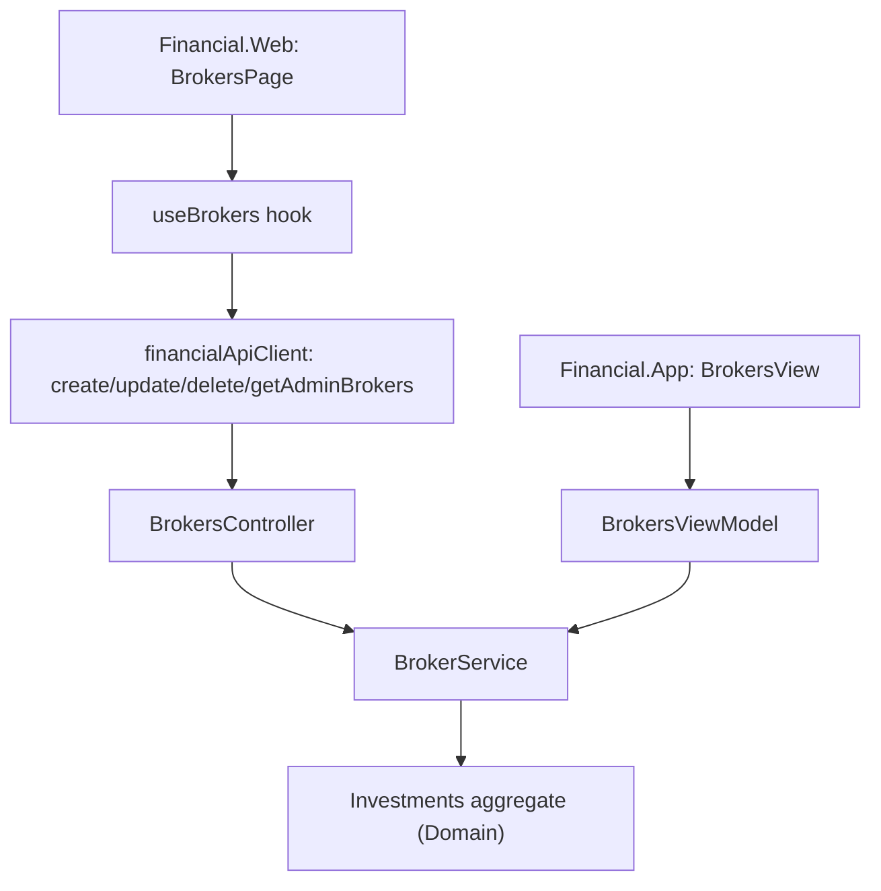

## 1. Technical Overview

**What:** Add full Create/Read/Update/Delete for Broker to the Investment bounded context — new domain
mutation methods on `Investments`/`Broker`, a new `IBrokerService`/`BrokerService` Application service,
a new `BrokersController` REST resource, and the first real Admin CRUD screen on both `Financial.Web`
(replacing its F01 placeholder route) and `Financial.App` (replacing its F01 placeholder view). Brokers
today have no API or UI at all — they only come into existence implicitly via transaction entry.

**Why:** Closes the PRD's pain #1 (no dedicated place to manage reference data) for the first of ten
entities, and — because F03/F04 depend on it — establishes the list+create+edit+delete-dialog pattern
(component structure, hook/service naming, error-banner/validation shape) that Portfolio and Asset CRUD
will follow, and that F05-F11 will also largely mirror for their own simpler entities.

**Scope:**
- Included: `Broker.Update`, `Investments.CreateActiveBroker/RenameBroker/DeleteBroker` domain methods;
  `IBrokerService`/`BrokerService`; `BrokerDTO`/`BrokerCreateDTO`/`BrokerUpdateDTO`; `BrokersController`
  (`GET/POST /brokers`, `PUT/DELETE /brokers/{name}`); DI registration; OpenAPI snapshot + frontend
  type regeneration; `Financial.Web` `BrokersPage` (Fluent `Table` + create/edit `Dialog` + delete-confirm
  `Dialog`) wired into the existing `admin/investment/brokers` route; `Financial.App` `BrokersView` +
  `BrokersViewModel` + `BrokerFormDialog` wired into the existing `admin-brokers` viewsByKey slot.
- Excluded: Portfolio/Asset CRUD (F03/F04); any change to how Brokers are created implicitly via
  transaction entry (unchanged, separate code path); moving a Portfolio between Brokers (existing Move
  workflow, out of scope per PRD Section 7).

## 2. Architecture Impact

**Affected components:**
- `Financial.Investment.Domain/Entities/Broker.cs` — add `Update`
- `Financial.Investment.Domain/Entities/Investments.cs` — add `CreateActiveBroker`, `RenameBroker`, `DeleteBroker`
- `Financial.Investment.Application/DTOs/BrokerDTO.cs`, `BrokerCreateDTO.cs`, `BrokerUpdateDTO.cs` — new
- `Financial.Investment.Application/Interfaces/IBrokerService.cs` — new
- `Financial.Investment.Application/Services/BrokerService.cs` — new
- `Financial.Investment.Application/DependencyInjection/InvestmentApplicationServiceCollectionExtensions.cs` — register `IBrokerService`
- `Financial.Api/Controllers/BrokersController.cs` — new
- `Tests/Financial.Api.Tests/Contract/openapi-v1.snapshot.json` — regenerated
- `Financial.Web/src/api/generated/openapi.ts`, `src/api/types.ts` — regenerated/extended
- `Financial.Web/src/api/financialApiClient.ts` — add `getAdminBrokers`/`createBroker`/`updateBroker`/`deleteBroker`
- `Financial.Web/src/hooks/useBrokers.ts` — new
- `Financial.Web/src/pages/BrokersPage.tsx`, `src/components/BrokerFormDialog.tsx` — new
- `Financial.Web/src/navigation/routes.tsx` — repoint the `admin/investment/brokers` route element
- `Financial.App/ViewModels/Admin/BrokersViewModel.cs`, `BrokerFormDialogViewModel.cs` — new
- `Financial.App/Views/Admin/BrokersView.xaml(.cs)`, `BrokerFormDialog.xaml(.cs)` — new
- `Financial.App/Services/IDialogService.cs`, `DialogService.cs` — add `ShowBrokerFormDialog`
- `Financial.App/MainWindow.xaml.cs` — replace the `admin-brokers` placeholder registration with `BrokersView`



## 3. Technical Decisions

| Decision | Chosen Approach | Alternative Considered | Trade-off |
|----------|----------------|----------------------|-----------|
| Where uniqueness/rename/archive logic lives | On `Investments` (the aggregate root), mirroring the existing `ArchiveAsset` precedent, not on `Broker` itself | Put a `Rename`/`Delete` method on `Broker` that reaches back into `Investments` | Uniqueness spans both `ActiveBrokers`/`HistoricBrokers` collections, which only the root can see; keeps `Broker` free of a back-reference to its container, matching `ArchiveAsset`'s existing shape |
| Archiving an empty Active broker whose name already exists in Historic (via the pre-existing per-asset `ArchiveAsset` path) | `DeleteBroker` removes it from Active and does **not** duplicate it into Historic when a Historic record of the same name already exists — its "history" already lives in that existing record | Throw a conflict; or always add a second Historic entry | The PRD's Broker-uniqueness rule governs Admin-created records; the pre-existing per-asset archive path already legitimately produces an Active+Historic pair sharing a name, and duplicating a second Historic entry would itself be a worse integrity problem than silently not adding a redundant one. Documented here since it is not explicitly called out by the PRD |
| Delete's HTTP success status | `204 No Content`, matching `PortfoliosController.DeleteEmptyPortfolio` (same bounded context) | `200 OK` (the `MensaisController`/CashFlow convention) | Consistency within the Investment context outweighs cross-context consistency; CashFlow's own new delete endpoints (F05-F09) should follow their own context's `MensaisController` precedent instead |
| Currency validation | Free-form string, validated against a small Investment-local allow-list `["BRL", "GBP", "USD"]` (values already observed in this codebase's fixtures/tests) rather than an enum | Reuse `Financial.CashFlow.Domain.Enums.Currency` (`BRL`/`GBP` only) | Investment must not reference CashFlow (bounded-context isolation, CLAUDE.md); the CashFlow enum is also missing `USD`, which real Broker data uses. Documented as an assumption — the exact list is not specified by the PRD's "existing supported-currency set" wording |
| React list/dialog structure (first Admin CRUD screen) | A single `BrokersPage.tsx` (Fluent `Table`, "Create Broker" primary action, per-row `TableCellActions`) plus one reusable `BrokerFormDialog.tsx` for both create and edit; delete confirmation is a small inline `Dialog` in `BrokersPage.tsx` itself (its content is nearly all per-entity conditional text, not worth a shared component yet) | A generic `EntityCrudPage<T>` abstraction from the start | No second entity exists yet to prove out a shared abstraction; F03/F05-F11 copy this shape file-by-file and a shared generic can be extracted later only if the duplication actually hurts (YAGNI, per CLAUDE.md's "right-sized, not over-engineered") |
| WPF form dialog | New `ShowBrokerFormDialog(BrokerFormDialogViewModel) : bool` on the existing `IDialogService`/`DialogService`, following the exact shape of `ShowMoveAssetDialog` (a modal `Window`, `ConfirmCommand`/`CancelCommand`, `CloseRequested` event, inline `ValidationMessage`) | A generic WPF dialog-result service | Matches an established, tested pattern in this exact file rather than inventing a new one |
| WPF delete confirmation | Reuse the existing `IDialogService.Confirm(message, caption)` (already used elsewhere for Yes/No confirms) | A dedicated confirm-dialog ViewModel | Delete-confirm here has no dynamic form state beyond the message text itself, so the existing generic confirm is sufficient and avoids a needless new type |

## 4. Component Overview

**Backend (Investment bounded context):**

| File Path | New/Modified | Purpose | Key Responsibilities |
|-----------|--------------|---------|---------------------|
| `Financial.Investment.Domain/Entities/Broker.cs` | Modified | Domain entity | `Update(name, currency)` mutates both fields in place |
| `Financial.Investment.Domain/Entities/Investments.cs` | Modified | Aggregate root | `CreateActiveBroker` (uniqueness check + create + add to Active); `RenameBroker` (find in either scope, uniqueness check excluding self, delegate to `Broker.Update`); `DeleteBroker` (find in either scope, empty-portfolio guard, Active→Historic archive or Historic hard-delete) |
| `Financial.Investment.Application/DTOs/BrokerDTO.cs` | New | Wire shape for list/create/update responses | `Name`, `Currency`, `Status` ("Active"/"Historic"), `PortfolioCount` |
| `Financial.Investment.Application/DTOs/BrokerCreateDTO.cs` | New | Create request | `Name`, `Currency` |
| `Financial.Investment.Application/DTOs/BrokerUpdateDTO.cs` | New | Update request | `Name`, `Currency` (new values) |
| `Financial.Investment.Application/Interfaces/IBrokerService.cs` | New | Contract | `GetBrokers`, `CreateBrokerAsync`, `UpdateBrokerAsync`, `DeleteBrokerAsync` |
| `Financial.Investment.Application/Services/BrokerService.cs` | New | Use-case orchestration | Guards required fields, calls `Investments` mutations inside `ApplyAndSaveAsync`, maps to `BrokerDTO`, `StartServiceSpan`/`MarkSuccess`/`MarkFailed` tracing per existing convention |
| `Financial.Investment.Application/DependencyInjection/InvestmentApplicationServiceCollectionExtensions.cs` | Modified | DI | `services.AddSingleton<IBrokerService, BrokerService>();` |
| `Financial.Api/Controllers/BrokersController.cs` | New | REST endpoints | `GET /brokers`, `POST /brokers`, `PUT /brokers/{name}`, `DELETE /brokers/{name}` |

**Frontend (`Financial.Web`):**

| File Path | New/Modified | Purpose | Key Responsibilities |
|-----------|--------------|---------|---------------------|
| `src/api/financialApiClient.ts` | Modified | API client | `getAdminBrokers`, `createBroker`, `updateBroker`, `deleteBroker` |
| `src/hooks/useBrokers.ts` | New | Data + mutation hook | Loads brokers, exposes create/update/delete with loading/error/saving state per ADR-driven state matrix |
| `src/components/BrokerFormDialog.tsx` | New | Create/Edit dialog | Name + Currency fields, inline validation, disabled Save while invalid/saving |
| `src/pages/BrokersPage.tsx` | New | Admin > Investment > Brokers screen | Fluent `Table` (Name, Currency, Status, Portfolio count), row actions, "Create Broker", delete-confirm `Dialog` with the Active→Historic/permanent-removal distinction and disabled-when-non-empty state |
| `src/navigation/routes.tsx` | Modified | Routing | `admin/investment/brokers` now renders `BrokersPage` instead of `AdminEntityPlaceholderPage` |

**WPF (`Financial.App`):**

| File Path | New/Modified | Purpose | Key Responsibilities |
|-----------|--------------|---------|---------------------|
| `ViewModels/Admin/BrokersViewModel.cs` | New | List + commands | Loads brokers via `IBrokerService`, `CreateCommand`/`EditCommand`/`DeleteCommand`, delegates form collection to the dialog, delete-confirm via `IDialogService.Confirm` |
| `ViewModels/Admin/BrokerFormDialogViewModel.cs` | New | Create/Edit form state | Name/Currency fields, `ValidationMessage`, `ConfirmCommand`/`CancelCommand`, `CloseRequested`, mirrors `MoveAssetDialogViewModel`'s shape |
| `Views/Admin/BrokersView.xaml(.cs)` | New | List view | Fluent-styled list bound to `BrokersViewModel` |
| `Views/Admin/BrokerFormDialog.xaml(.cs)` | New | Modal form | Bound to `BrokerFormDialogViewModel`, shown via `IDialogService` |
| `Services/IDialogService.cs`, `DialogService.cs` | Modified | Dialog abstraction | Add `ShowBrokerFormDialog(BrokerFormDialogViewModel) : bool` |
| `MainWindow.xaml.cs` | Modified | Composition root | Replace the `admin-brokers` `AdminEntityPlaceholderView` registration with a real `BrokersView` + `BrokersViewModel` |

**Database:** Not applicable — same single JSON-document persistence model; no schema/migration, `Investments` is serialized as part of the existing `data-investment.json` document.

## 5. API Contracts

**Endpoint: List Brokers**
- **Method:** GET
- **Path:** `/brokers`

**Response (200):**

| Field | Type | Description |
|-------|------|-------------|
| `name` | `string` | Broker name |
| `currency` | `string` | Broker currency |
| `status` | `string` | `"Active"` or `"Historic"` |
| `portfolioCount` | `integer` | Number of portfolios under this broker |

```json
[{ "name": "XPI", "currency": "BRL", "status": "Active", "portfolioCount": 2 }]
```

**Endpoint: Create Broker**
- **Method:** POST
- **Path:** `/brokers`

**Request:**

| Field | Type | Required | Validation | Description |
|-------|------|----------|------------|--------------|
| `name` | `string` | Yes | non-blank, unique across Active+Historic | Broker name |
| `currency` | `string` | Yes | non-blank | Broker currency |

```json
{ "name": "XPI", "currency": "BRL" }
```

**Response (200):** `BrokerDTO` as above, `status` always `"Active"`.

**Error Codes:**

| Code | HTTP Status | Description |
|------|-------------|--------------|
| — | 400 | `name`/`currency` missing or blank |
| — | 409 | `A broker named "{name}" already exists.` |

**Endpoint: Update Broker**
- **Method:** PUT
- **Path:** `/brokers/{name}`

**Request:** same shape as Create (`name`, `currency` — the new values; `{name}` in the path is the current name).

**Response (200):** `BrokerDTO`.

**Error Codes:**

| Code | HTTP Status | Description |
|------|-------------|--------------|
| — | 400 | `name`/`currency` missing or blank |
| — | 404 | Broker `{name}` not found |
| — | 409 | New name collides with a different existing broker |

**Endpoint: Delete Broker**
- **Method:** DELETE
- **Path:** `/brokers/{name}`

**Response:** `204 No Content` on success (Active→Historic archive or Historic hard-delete, per current status).

**Error Codes:**

| Code | HTTP Status | Description |
|------|-------------|--------------|
| — | 404 | Broker `{name}` not found |
| — | 409 | `Cannot delete a broker that still has portfolios.` |

## 6. Data Model

Not applicable — no relational schema. `Broker`/`Investments` are serialized as part of the existing
single-document `data-investment.json` via the established `Financial.Investment.Infrastructure`
JSON persistence (`InvestmentSerializerAdapter`); no new fields are added to the wire format beyond
what `Broker` already has (`Name`, `Currency`, `Portfolios`).

## 7. Testing Strategy

**Test File Structure:**

| Test File | Test Type | Target | Coverage Goal |
|-----------|-----------|--------|---------------|
| `Tests/Financial.Investment.Domain.Tests/Domain/BrokerTests.cs` | Unit | `Broker.Update` | Extended with new `[Fact]`s |
| `Tests/Financial.Investment.Domain.Tests/Domain/InvestmentsTests.cs` | Unit | `CreateActiveBroker`/`RenameBroker`/`DeleteBroker` | Extended with new `[Fact]`s per branch |
| `Tests/Financial.Investment.Application.Tests/Services/BrokerServiceTests.cs` | Unit | `BrokerService` (via `StubInvestmentRepository`) | New — every branch, using the shared stub's `Investments` property |
| `Tests/Financial.Api.Tests/BrokersEndpointsTests.cs` | E2E (`ApiTestFactory`) | `BrokersController` | New — status codes, validation, JSON contract |
| `Tests/Financial.Api.Tests/Controllers/ControllerGuardClauseTests.cs` | Unit | `BrokersController` constructor | Extended — null-guard only |
| `Financial.Web/src/hooks/__tests__/useBrokers.test.ts` | Hook | `useBrokers` | New — load/create/update/delete, loading/error states |
| `Financial.Web/src/pages/__tests__/BrokersPage.test.tsx` | Component | `BrokersPage` | New — list render, create/edit/delete flows, disabled-delete-when-non-empty, all documented UI states |
| `Financial.Web/src/components/__tests__/BrokerFormDialog.test.tsx` | Component | `BrokerFormDialog` | New — validation, disabled Save while invalid/saving |
| `Financial.Web/src/navigation/__tests__/routes.test.ts` | Unit | Route sync | No change expected — still passes since the route path is unchanged, only its element |
| `Tests/Financial.Presentation.Tests/ViewModels/Admin/BrokersViewModelTests.cs` | Unit | `BrokersViewModel` (hand-written stub `IBrokerService`) | New |
| `Tests/Financial.Presentation.Tests/ViewModels/Admin/BrokerFormDialogViewModelTests.cs` | Unit | `BrokerFormDialogViewModel` | New — validation branches, `ConfirmCommand` gating |

**For each test file, key functions:**

| Test Function | Description | Assertions |
|---------------|--------------|------------|
| `CreateActiveBroker_DuplicateNameInHistoric_Throws` | Uniqueness spans both scopes | `InvestmentRuleViolationException`, no broker added |
| `DeleteBroker_ActiveEmpty_MovesToHistoric` | Archive-on-delete | Removed from `ActiveBrokers`, present in `HistoricBrokers` (same instance) |
| `DeleteBroker_ActiveEmptyWithExistingHistoricNamesake_RemovesFromActiveOnly` | The documented edge case | No duplicate Historic entry created |
| `DeleteBroker_HistoricEmpty_RemovesPermanently` | Historic hard-delete | Not present in either collection |
| `DeleteBroker_WithPortfolios_ThrowsAndWritesNothing` | Guard | `InvestmentRuleViolationException`, `WriteCallCount` unchanged |
| `CreateBrokerAsync_Duplicate_Returns409ViaMiddleware` (E2E) | HTTP contract | 409, `ProblemDetails.Detail` matches PRD wording |
| `it('disables the delete action when portfolio count is non-zero')` | React | Delete button `disabled`, inline explanation text shown |
| `it('shows Active→Historic vs. permanent-removal wording based on current status')` | React | Delete dialog text branches correctly |
