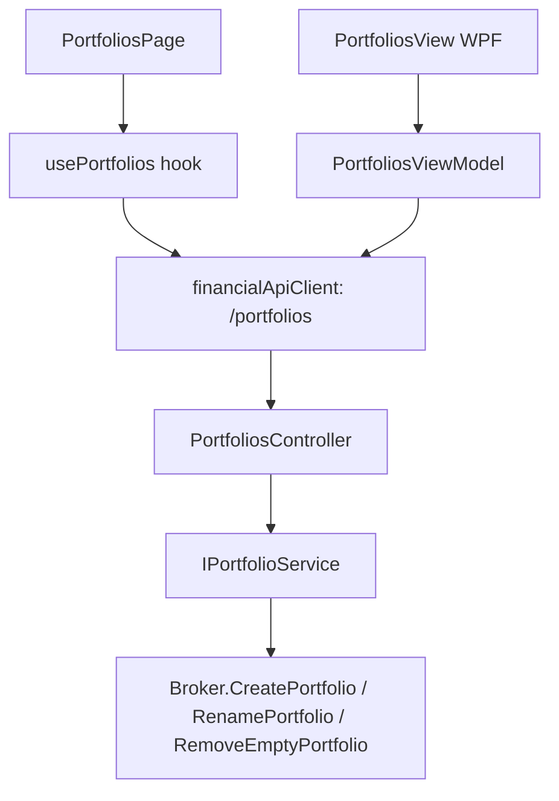

## 1. Technical Overview

**What:** Full create/edit/delete for Portfolios, layered onto the existing read/delete-only
`IPortfolioService`/`PortfoliosController`, plus a new Admin list+dialog screen on both front ends
following the template F02 (Broker CRUD) established.

**Why:** Today a Portfolio can only be created implicitly (via the existing Move-asset workflow's
find-or-create `Broker.AddPortfolio`) or deleted when empty (`IPortfolioService.DeleteEmptyPortfolioAsync`,
already wired to `PortfoliosController`). There is no explicit create-with-duplicate-rejection, no
rename, and no dedicated Admin screen. This closes that gap using the same domain/Application/API/UI
layering F02 already validated.

**Scope:**
- Included: `Broker.CreatePortfolio`/`Broker.RenamePortfolio` domain methods (new, additive — do not
  touch `AddPortfolio`'s existing find-or-create behavior, which the Move workflow still depends on),
  `IPortfolioService` extended with `GetPortfolios`/`CreatePortfolioAsync`/`UpdatePortfolioAsync`
  (`DeleteEmptyPortfolioAsync` unchanged), `PortfoliosController` extended with GET/POST/PUT, Web
  `PortfoliosPage`/`PortfolioFormDialog`/`usePortfolios`, WPF `PortfoliosView`/`PortfolioFormDialog`
  under `Views/Admin`, replacing the `admin/investment/portfolios` placeholder route/view registration
  F01 created.
- Excluded: moving a Portfolio between Brokers (existing dedicated Move workflow, PRD Section 7);
  navTree/routes structural changes (F01 already registered the leaf, this feature only swaps its
  element/view).

## 2. Architecture Impact

**Affected components:**
- `Financial.Investment.Domain/Entities/Broker.cs` — add `CreatePortfolio`, `RenamePortfolio`
- `Financial.Investment.Application/Interfaces/IPortfolioService.cs` / `Services/PortfolioService.cs` — add list/create/update
- `Financial.Investment.Application/DTOs/PortfolioDTO.cs`, `PortfolioCreateDTO.cs`, `PortfolioUpdateDTO.cs` — new
- `Financial.Api/Controllers/PortfoliosController.cs` — add GET/POST/PUT actions
- `Financial.Web/src/pages/PortfoliosPage.tsx(+css,__tests__)`, `src/components/PortfolioFormDialog.tsx(+__tests__)`, `src/hooks/usePortfolios.ts(+__tests__)` — new, mirroring `BrokersPage`/`BrokerFormDialog`/`useBrokers`
- `Financial.Web/src/navigation/routes.tsx` — swap the `admin/investment/portfolios` route element from the placeholder to `PortfoliosPage`
- `Financial.App/ViewModels/Admin/PortfoliosViewModel.cs`, `PortfolioFormDialogViewModel.cs`, `Views/Admin/PortfoliosView.xaml(.cs)`, `PortfolioFormDialog.xaml(.cs)` — new, mirroring the Broker equivalents
- `Financial.App/MainWindow.xaml.cs` — swap the `admin-portfolios` `viewsByKey` registration from the placeholder to `PortfoliosView`

## 3. Technical Decisions

| Decision | Chosen Approach | Alternative Considered | Trade-off |
|----------|----------------|----------------------|-----------|
| Create must reject duplicates, but `AddPortfolio` is a shared find-or-create used by Move | Add a distinct `Broker.CreatePortfolio(name)` that throws `InvestmentRuleViolationException` on a name collision, leaving `AddPortfolio` untouched | Change `AddPortfolio` to take a "strict" flag | Keeps the existing Move workflow's silent-reuse semantics exactly as-is (zero risk of regressing it), at the cost of two similarly-shaped methods on `Broker` |
| Portfolio list scope | `GetPortfolios()` returns portfolios across both Active and Historic brokers (each row carries its Broker's name + status), mirroring `BrokerService.GetBrokers()`'s Active+Historic concat | List Active-broker portfolios only | PRD's Experience says "all Portfolios grouped by parent Broker" with no Active-only qualifier (unlike Create, which the PRD explicitly restricts to Active); matches F02's own precedent for "list everything, restrict only the create-picker" |
| Create's parent-Broker picker | Sources from `GET /brokers` filtered client-side (Web) / server-exposed active list (WPF) to `Status == "Active"`, reusing F02's existing `BrokerDTO.Status` field — no new endpoint | Add a dedicated `/brokers/active` endpoint | `BrokerDTO` already carries `Status`; filtering the existing list avoids a redundant endpoint for a small (single-user) dataset |
| Rename validation | `Broker.RenamePortfolio(currentName, newName)` re-checks per-broker uniqueness the same way `CreatePortfolio` does, throwing `InvestmentRuleViolationException` on collision (including "renaming to its own current name" as a no-op success, not a collision) | Route rename through `RemoveEmptyPortfolio` + `CreatePortfolio` | A rename must work on a non-empty portfolio (only delete requires emptiness); a genuine in-place rename preserves `Assets` without a remove/re-add roundtrip |

## 4. Component Overview

**Backend:**

| File Path | New/Modified | Purpose | Key Responsibilities |
|-----------|--------------|---------|---------------------|
| `Financial.Investment.Domain/Entities/Broker.cs` | Modified | Portfolio lifecycle rules | `CreatePortfolio(name)` — throws on duplicate name under this broker; `RenamePortfolio(currentName, newName)` — throws `KeyNotFoundException` if missing, `InvestmentRuleViolationException` on a name collision with another portfolio |
| `Financial.Investment.Application/DTOs/PortfolioDTO.cs` | New | Read shape | `Name`, `BrokerName`, `BrokerStatus` ("Active"/"Historic"), `AssetCount` |
| `Financial.Investment.Application/DTOs/PortfolioCreateDTO.cs` | New | Create request | `BrokerName`, `Name` |
| `Financial.Investment.Application/DTOs/PortfolioUpdateDTO.cs` | New | Update request | `Name` (new name only — Broker is fixed post-creation per PRD) |
| `Financial.Investment.Application/Interfaces/IPortfolioService.cs` | Modified | Portfolio lifecycle | Add `GetPortfolios()`, `CreatePortfolioAsync(PortfolioCreateDTO)`, `UpdatePortfolioAsync(brokerName, currentName, PortfolioUpdateDTO)`; keep `DeleteEmptyPortfolioAsync` signature unchanged |
| `Financial.Investment.Application/Services/PortfolioService.cs` | Modified | Implementation | Same `ApplyAndSaveAsync`/span/logging pattern as `BrokerService`; `CreatePortfolioAsync` resolves the Broker via `GetBrokerList(InvestmentScope.Active)` (Active-only, per PRD) before calling `CreatePortfolio` |
| `Financial.Api/Controllers/PortfoliosController.cs` | Modified | HTTP surface | `GET /portfolios` (200, list), `POST /portfolios` (200/400/404 unknown broker/409 duplicate), `PUT /portfolios/{brokerName}/{portfolioName}` (200/400/404/409); existing `DELETE` untouched |

**Frontend (`Financial.Web`):**

| File Path | New/Modified | Purpose | Key Responsibilities |
|-----------|--------------|---------|---------------------|
| `src/hooks/usePortfolios.ts` | New | Data + mutations | List/create/update/delete against `/portfolios`, loading/error/saving state — mirrors `useBrokers.ts` structure |
| `src/components/PortfolioFormDialog.tsx` | New | Create/Edit dialog | Broker picker (Active only, disabled/fixed on edit) + Name field, inline duplicate-name error, unsaved-changes guard — mirrors `BrokerFormDialog.tsx` |
| `src/pages/PortfoliosPage.tsx` (+`.css`) | New | List screen | Fluent `Table` grouped/filterable by Broker, Asset count column, per-row Edit/Delete, "Create Portfolio" action, delete-confirm dialog stating Asset count — mirrors `BrokersPage.tsx` |
| `src/navigation/routes.tsx` | Modified | Routing | `admin/investment/portfolios` now renders `PortfoliosPage` instead of the placeholder |

**WPF (`Financial.App`):**

| File Path | New/Modified | Purpose | Key Responsibilities |
|-----------|--------------|---------|---------------------|
| `ViewModels/Admin/PortfoliosViewModel.cs` | New | List state | Mirrors `BrokersViewModel` |
| `ViewModels/Admin/PortfolioFormDialogViewModel.cs` | New | Dialog state | Mirrors `BrokerFormDialogViewModel`, Broker picker sourced from Active brokers |
| `Views/Admin/PortfoliosView.xaml(.cs)` | New | List view | Mirrors `BrokersView.xaml` |
| `Views/Admin/PortfolioFormDialog.xaml(.cs)` | New | Dialog view | Mirrors `BrokerFormDialog.xaml` |
| `MainWindow.xaml.cs` | Modified | Composition root | `admin-portfolios` `viewsByKey` entry now points at `PortfoliosView` instead of the placeholder |

## 5. API Contracts

**Endpoint: List Portfolios**
- **Method:** GET
- **Path:** `/portfolios`

**Response (200):**

| Field | Type | Description |
|-------|------|--------------|
| `name` | `string` | Portfolio name |
| `brokerName` | `string` | Parent broker's name |
| `brokerStatus` | `string` | `"Active"` or `"Historic"` |
| `assetCount` | `integer` | Number of assets currently held |

**Endpoint: Create Portfolio**
- **Method:** POST
- **Path:** `/portfolios`

**Request:**

| Field | Type | Required | Validation | Description |
|-------|------|----------|------------|--------------|
| `brokerName` | `string` | Yes | Must name an Active broker | Parent broker |
| `name` | `string` | Yes | Non-blank, unique within the broker | Portfolio name |

**Response (200):** `PortfolioDTO` (as above). **Errors:** 400 missing field, 404 broker not found or not Active, 409 duplicate name.

**Endpoint: Update Portfolio**
- **Method:** PUT
- **Path:** `/portfolios/{brokerName}/{portfolioName}`

**Request:** `{ "name": "string" }` (new name). **Response (200):** `PortfolioDTO`. **Errors:** 400 missing field, 404 broker/portfolio not found, 409 duplicate name.

**Endpoint: Delete Portfolio** (existing, unchanged)
- **Method:** DELETE
- **Path:** `/portfolios/{brokerName}/{portfolioName}?scope={scope}`
- **Response:** 204 / 404 / 409 (still holds assets) — behavior and message unchanged from today.

## 6. Data Model

Not applicable — Portfolio is a nested child of `Broker` inside `Investments`, persisted with the
existing JSON document via `Financial.Shared.Infrastructure`; no new file/table/collection is
introduced.

## 7. Testing Strategy

| Test File | Test Type | Target | Coverage Goal |
|-----------|-----------|--------|---------------|
| `Tests/Financial.Investment.Domain.Tests/Entities/BrokerTests.cs` | Unit | `CreatePortfolio`/`RenamePortfolio` | Success, duplicate-name throw, rename-to-self no-op, rename collision |
| `Tests/Financial.Investment.Application.Tests/Services/PortfolioServiceTests.cs` | Unit (stub repo) | `PortfolioService` | Create against Active-only broker resolution, update, list shape (Active+Historic), existing delete tests untouched |
| `Tests/Financial.Api.Tests/Controllers/PortfoliosEndpointsTests.cs` | E2E (`ApiTestFactory`) | New GET/POST/PUT | 200/400/404/409 per AC, existing DELETE tests untouched |
| `Financial.Web/src/hooks/__tests__/usePortfolios.test.ts` | Unit | Hook | List/create/update/delete against mocked API client, error states |
| `Financial.Web/src/components/__tests__/PortfolioFormDialog.test.tsx` | Component | Dialog | Broker picker Active-only, duplicate-name inline error, unsaved-changes guard |
| `Financial.Web/src/pages/__tests__/PortfoliosPage.test.tsx` | Component | Page | List render, create/edit/delete flows, delete-disabled-when-non-empty |
| `Tests/Financial.App.Tests/.../PortfoliosViewModelTests.cs`, `PortfolioFormDialogViewModelTests.cs` | Unit (stub services) | WPF ViewModels | Mirrors Web coverage |

**Acceptance-criteria traceability (PRD Section 9, F03):** all 6 F03 boxes plus the two Cross-Feature
Integration boxes naming F02+F03 map to the E2E/component tests above (Active-broker-only picker,
duplicate-within-broker rejection, same name across different brokers succeeding, rename persistence,
empty-delete success, non-empty-delete 409).
