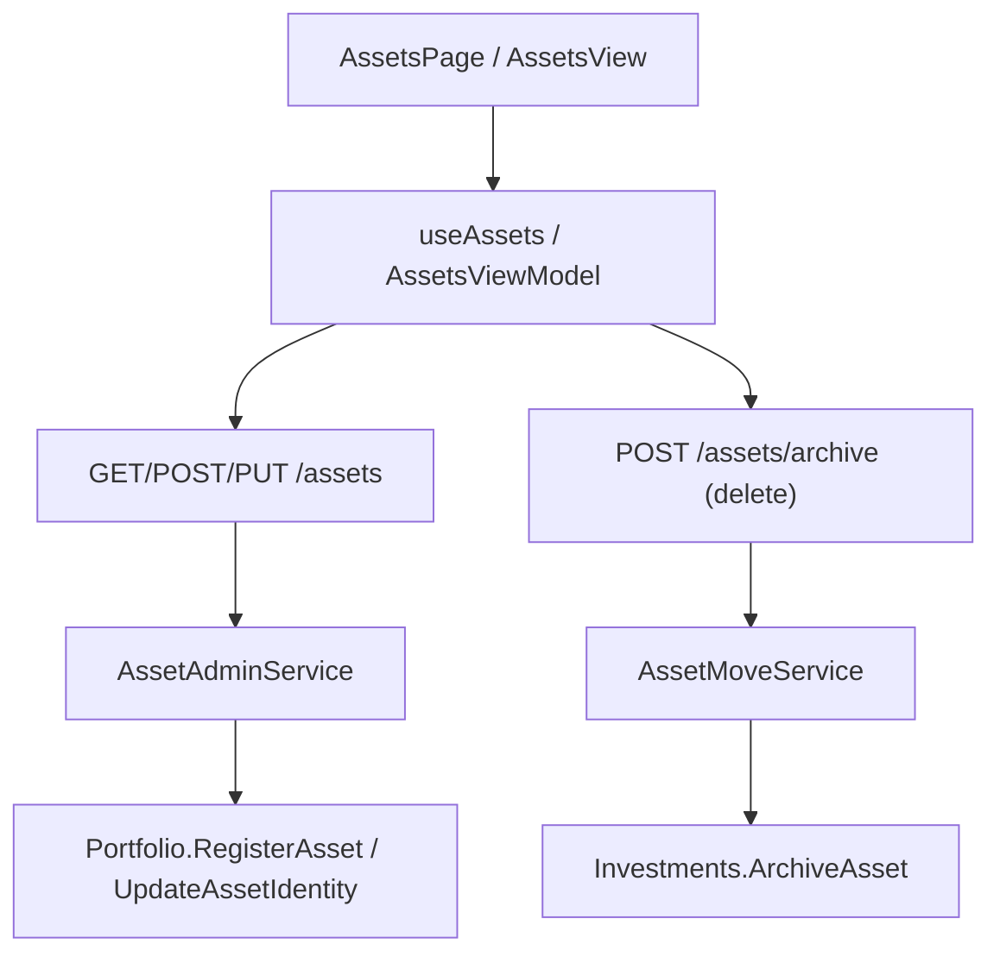

## 1. Technical Overview

**What:** Adds full Asset create/read/edit/delete(archive) to the Admin area — the last feature in the
Broker→Portfolio→Asset chain. Today an Asset's identity can only be set at first-transaction time via
existing flows; there is no way to pre-register an Asset ahead of a trade or to edit its identity fields
afterward.

**Why:** Closes the PRD's "Asset lifecycle is entry-only" gap (Section 2) with the same list+dialog
Admin CRUD template F02/F03 established, reusing the existing Archive rule for delete rather than
inventing a second removal concept.

**Scope:**
- Included: `Portfolio.RegisterAsset`/`Portfolio.UpdateAssetIdentity` domain rules, `Asset.UpdateIdentity`,
  a new `IAssetAdminService`/`AssetAdminService` (Create/Update/List; Delete reuses the existing
  `IAssetMoveService.ArchiveAssetAsync`), new `AssetsController` endpoints (`GET`/`POST`/`PUT`), an ISIN
  format validator, and new Web/WPF list+create/edit+delete-confirm screens mirroring F02/F03.
- Excluded: moving an Asset between Portfolios/Brokers (existing dedicated Move workflow, out of scope
  per PRD Section 7); anything about Transactions/Credits/PriceHistory themselves.

## 2. Architecture Impact

- `Financial.Investment.Domain/Entities/Asset.cs` — `UpdateIdentity` (done)
- `Financial.Investment.Domain/Entities/Portfolio.cs` — `RegisterAsset`, `UpdateAssetIdentity` (done)
- `Financial.Investment.Application/DTOs/AssetAdminDTO.cs`, `AssetAdminCreateDTO.cs`, `AssetAdminUpdateDTO.cs` — new
- `Financial.Investment.Application/Interfaces/IAssetAdminService.cs` — new
- `Financial.Investment.Application/Services/AssetAdminService.cs` — new
- `Financial.Investment.Application/Validation/IsinValidator.cs` — new
- `Financial.Investment.Application/DependencyInjection/InvestmentApplicationServiceCollectionExtensions.cs` — register `IAssetAdminService`
- `Financial.Api/Controllers/AssetsController.cs` — extend with `GetAssets`, `CreateAsset`, `UpdateAsset` (Delete reuses existing `POST /assets/archive`, called with `destinationPortfolioName` = source portfolio name, from the new Admin delete-confirm dialog)
- `Financial.Web/src/pages/AssetsPage.tsx(+css,__tests__)`, `Financial.Web/src/components/AssetFormDialog.tsx(+__tests__)`, `Financial.Web/src/hooks/useAssets.ts(+__tests__)` — new, mirroring F03's `PortfoliosPage`/`PortfolioFormDialog`/`usePortfolios` with an added Broker→Portfolio cascading picker
- `Financial.App/ViewModels/Admin/AssetsViewModel.cs`, `AssetFormDialogViewModel.cs`, `Financial.App/Views/Admin/AssetsView.xaml(.cs)`, `AssetFormDialog.xaml(.cs)` — new, mirroring F03's WPF equivalents

## 3. Technical Decisions

| Decision | Chosen Approach | Alternative | Trade-off |
|---|---|---|---|
| Duplicate-name guard on create | `Portfolio.RegisterAsset` throws `InvestmentRuleViolationException` on a same-name asset in the portfolio, even though the PRD doesn't explicitly call out Asset-name uniqueness | Allow duplicates (PRD-silent) | Other code (`Broker.ResolveDestination`) already assumes at most one asset per name per portfolio; allowing duplicates would be a landmine. Documented as an auto-accept assumption. |
| Delete/Archive destination | Admin delete confirm calls the existing `POST /assets/archive` with `destinationPortfolioName` = the asset's own source portfolio name (archive-in-place) | Ask the user to pick a Historic destination portfolio, like `MoveAssetDialog` does | PRD's F04 delete-confirm only states "explains the action archives"; no destination picker is described. Archive-in-place is the simplest reading and reuses `Investments.ArchiveAsset`'s existing "create the Historic portfolio if it doesn't exist yet" behavior. |
| ISIN format | Standard: 2-letter ISO country code + 9 alphanumeric + 1 check digit (12 chars), regex-validated only when non-blank (ISIN is optional) | No format check beyond non-blank | PRD requires inline rejection of "invalid ISIN format" before save; no format was specified so the ISO 6166 shape is the industry-standard default. |
| Admin service name | New `IAssetAdminService`/`AssetAdminService`, separate from the existing `IAssetMoveService` | Add Create/Update to `IAssetMoveService` | Mirrors the existing documented split ("a consumer that only tidies up should not have to know about archiving") — Admin CRUD and Move/Archive stay separate concerns; Delete still calls into `IAssetMoveService.ArchiveAssetAsync` directly since that rule must not be duplicated. |

## 4. Component Overview

**Backend:**

| File | New/Modified | Purpose |
|---|---|---|
| `Financial.Investment.Domain/Entities/Asset.cs` | Modified | `UpdateIdentity` |
| `Financial.Investment.Domain/Entities/Portfolio.cs` | Modified | `RegisterAsset`, `UpdateAssetIdentity` |
| `Financial.Investment.Application/DTOs/AssetAdminDTO.cs` | New | List/create/update response shape (Name, ISIN, Exchange, Ticker, Country, LocalTypeCode, Class, BrokerName, PortfolioName, BrokerStatus, Quantity) |
| `Financial.Investment.Application/DTOs/AssetAdminCreateDTO.cs` | New | BrokerName, PortfolioName, Name, ISIN?, Exchange?, Ticker?, Country, LocalTypeCode?, Class? |
| `Financial.Investment.Application/DTOs/AssetAdminUpdateDTO.cs` | New | Name, ISIN?, Exchange?, Ticker?, Country, LocalTypeCode?, Class |
| `Financial.Investment.Application/Interfaces/IAssetAdminService.cs` | New | `GetAssets`, `CreateAssetAsync`, `UpdateAssetAsync` |
| `Financial.Investment.Application/Services/AssetAdminService.cs` | New | Implements the above; Create resolves Class via `GlobalAssetClassMapping.Resolve` when not explicitly supplied |
| `Financial.Investment.Application/Validation/IsinValidator.cs` | New | `IsValid(string?)`; blank is valid (optional field), non-blank must match ISO 6166 shape |
| `Financial.Api/Controllers/AssetsController.cs` | Modified | `GET /assets` (list), `POST /assets` (create), `PUT /assets/{brokerName}/{portfolioName}/{assetName}` (update) |
| `Financial.Investment.Application/DependencyInjection/InvestmentApplicationServiceCollectionExtensions.cs` | Modified | Register `IAssetAdminService` |

**Frontend (Web):** `AssetsPage.tsx/css`, `AssetFormDialog.tsx` (Broker→Portfolio cascading picker on create, identity fields, ISIN inline validation), `useAssets.ts` (list/create/update/delete-via-archive), plus `__tests__` for each, mirroring F03.

**WPF:** `AssetsViewModel.cs`, `AssetFormDialogViewModel.cs`, `AssetsView.xaml(.cs)`, `AssetFormDialog.xaml(.cs)` under `ViewModels/Admin`/`Views/Admin`, mirroring F03.

## 5. API Contracts

**GET `/assets`** → 200 `AssetAdminDTO[]` (all Assets, Active + Historic brokers).

**POST `/assets`** — Request `AssetAdminCreateDTO` (BrokerName, PortfolioName required; PortfolioName must belong to an Active Broker). → 200 `AssetAdminDTO`, 400 blank required field, 404 Broker/Portfolio not found or Broker not Active, 409 duplicate name in portfolio.

**PUT `/assets/{brokerName}/{portfolioName}/{assetName}`** — Request `AssetAdminUpdateDTO`. → 200 `AssetAdminDTO`, 400 blank required field or invalid ISIN format, 404 not found, 409 new name already in use in that portfolio.

**Delete** reuses existing `POST /assets/archive` (`ArchiveAssetRequestDTO`), called by the Admin UI with `destinationPortfolioName` = the asset's current portfolio name.

## 6. Data Model

Not applicable — no schema change; Assets already persist inside their parent Portfolio in the existing JSON document.

## 7. Testing Strategy

| Test File | Type | Target |
|---|---|---|
| `Tests/Financial.Investment.Domain.Tests/Domain/PortfolioTests.cs` | Unit | `RegisterAsset`, `UpdateAssetIdentity` (done) |
| `Tests/Financial.Investment.Domain.Tests/Domain/AssetTests.cs` | Unit | `UpdateIdentity` (done) |
| `Tests/Financial.Investment.Application.Tests/Services/AssetAdminServiceTests.cs` | Unit (stub repo) | Create/Update, duplicate-name 409-mapped exception, Active-Broker-only create |
| `Tests/Financial.Investment.Application.Tests/Validation/IsinValidatorTests.cs` | Unit `[Theory]` | Valid ISIN, blank (valid), too short, bad checksum-shape, non-alphanumeric |
| `Tests/Financial.Api.Tests/Controllers/AssetsEndpointsTests.cs` (extend) | E2E via `ApiTestFactory` | Create/list/update status codes + JSON contract, 404/409 mappings, delete-via-archive with zero/non-zero quantity |
| `Financial.Web/src/pages/__tests__/AssetsPage.test.tsx`, `components/__tests__/AssetFormDialog.test.tsx`, `hooks/__tests__/useAssets.test.ts` | Component/Hook | List render, cascading picker, create/edit/delete flows, ISIN inline validation error |
| WPF `AssetsViewModel`/`AssetFormDialogViewModel` tests | Unit (stub services) | Same coverage as Web, mirroring F03's WPF test shape |

## Assumptions / Decisions (auto-accept, undocumented in PRD)

- Same-portfolio Asset-name uniqueness is enforced (Technical Decisions table).
- Delete archives in-place (same portfolio name in Historic) rather than prompting for a destination.
- ISIN format follows ISO 6166 (12 chars: 2-letter country + 9 alphanumeric + 1 check digit), validated only when non-blank.
- Class auto-resolution on create reuses `GlobalAssetClassMapping.Resolve(country, localTypeCode)` exactly as the existing transaction-entry flow's `Asset.Create` overload does, applied only when Class is left unset by the caller.
